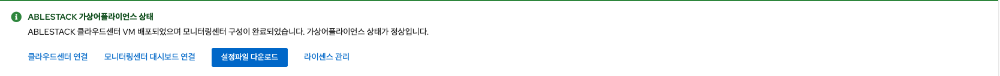
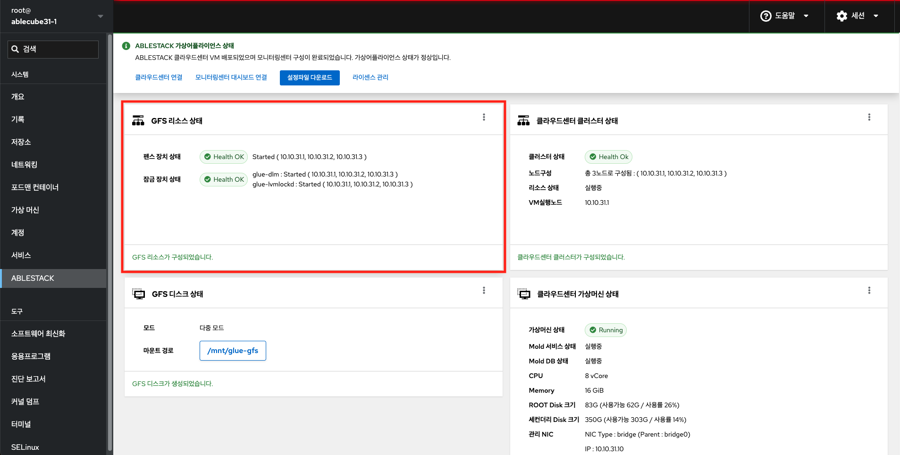
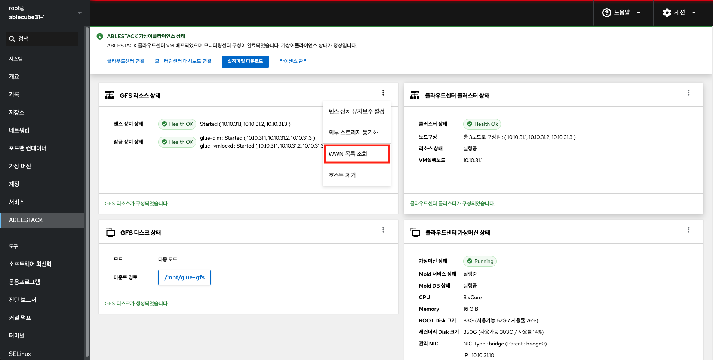

# ABLESTACK - VM

Cube 웹 콘솔의 ABLESTACK 메뉴에서는 가상화로 구성시 클라우스센터 가상머신 배포와 클러스터를 구성하고 ABLESTACK 가상어플라이언스 관리 및 상태 모니터링을 제공합니다.

## 메뉴 인터페이스 구성

* ABLESTACK 요약 리본
* GFS 리소스 상태
* 클라우드센터 클러스터 상태
* GFS 디스크 상태
* 클라우드센터 가상머신 상태

## ABLESTACK 요약 리본
클라우스센터 가상머신의 배포 및 클러스터 구성 여부에 따라 현 상태를 메시지로 표현합니다. 각 단계별 수행해야 되는 필수 구성 정보를 확인하여 설치 마법사 및 대시보드 링크를 제공하며 ABLESTACK 가상 어플라이언스 구성에 편의를 제공합니다.

**라이센스 관리**

라이센스를 관리하는 기능을 제공합니다.

* 라이센스를 등록
* 라이센스 등록 및 시작일, 만료일 확인

**클러스터 구성 준비**

클러스터 구성 준비를 위한 마법사를 제공합니다.

* 모든 호스트, 가상머신 IP 세팅을 위한 Hosts 파일 생성
* SSH Key 생성
* 시간서버 등록  

**클라우드센터 VM 배포**

클라우드센터 가상머신(CCVM) 배포를 위한 마법사를 제공합니다.

* 자원 설정(컴퓨트, 디스크, 네트워크, NIC)
* Hosts 파일 세팅
* SSH Key 설정

**클라우드센터 연결**

클라우드센터VM의 가상화 관리 플랫폼(Mold)으로 이동하는 URL 링크를 제공합니다.

**모니링센터 구성**

모니터링센터 관리 대시보드 Wall 구성을 위한 마법사를 제공합니다.

**모터링센터 대시보드 연결**

모니터링센터 관리 대시보드(Wall)로 이동하는 URL 링크를 제공합니다.

## GFS 리소스 상태 조회
GFS 리소스의 현재 상태와 GFS 자원의 정보를 확인할 수 있습니다.

### 펜스 장치 유지보수 설정

GFS 펜스 장치를 유지보수모드로 설정을 할 수 있도록 실행하는 버튼입니다.

!!! info    
    * 펜스 장치가 Started 상태일 경우에 활성화 됩니다.

- **펜스 장치 유지보수 설정** 을 클릭합니다.
- **펜스 장치 유지보수 설정** 팝업을 호출합니다.

- **실행** 버튼을 클릭하여 펜스 장치 유지보수 설정합니다.

### 펜스 장치 유지보수 해제

GFS 펜스 장치를 유지보수모드를 해제할 수 있도록 실행하는 버튼입니다.

!!! info    
    * 펜스 장치가 Stopped 상태일 경우에 활성화 됩니다.

- **펜스 장치 유지보수 해제** 을 클릭합니다.
- **펜스 장치 유지보수 해제** 팝업을 호출합니다.

- **실행** 버튼을 클릭하여 펜스 장치 유지보수 해제합니다.

### 외부 스토리지 동기화

외부 스토리지와 동기화 할 경우 실행하는 버튼입니다.

!!! warning
    * 해당 장치는 반드시 이중화되어 있어야 합니다. 만약 싱글 패스로 구성되어 있다면 실행하지 마세요.

- **외부 스토리지 동기화** 를 클릭합니다.
- **외부 스토리지 동기화** 팝업을 호출합니다.

- **외부 스토리지 설정 확인** 을 활성화 체크하여 실행 버튼을 활성화합니다. (싱글패스 구성 여부 확인 해야함)
- **실행** 버튼을 클릭하여 외부 스토리지 동기화합니다.

### WWN 목록 조회

WWN 목록 정보를 확인할 수 있습니다.

- **WWN 목록 조회** 를 클릭합니다.
- **WWN 목록** 팝업을 호출합니다.

- **확인** 버튼을 클릭하여 WWN 목록 팝업을 닫습니다.

### 호스트 제거

해당 호스트 설정정보를 모든 구성요소에서 제거합니다.

!!! warning
    * 호스트를 제거하면 해당 호스트는 클러스터에서 제외되며, 더 이상 자원을 사용할 수 없습니다.

- **호스트 제거** 를 클릭합니다.
- **호스트 제거** 팝업을 호출합니다.

- **실행** 버튼을 클릭하여 해당 호스트의 정보를 제거합니다.

## 클라우드센터 클러스터 상태 조회
Mold(클라우드 관리) 제품의 클러스터 현재 상태와 Cloud Center VM이 실행중인 호스트를 확인 할 수 있습니다.

### 클라우드센터VM 시작

클라우드센터VM을 시작 상태로 변경하기 위한 버튼입니다.

!!! info
    * 클라우드센터VM이 시작 중인 경우 버튼이 비활성화됩니다.

- **클라우드센터VM 시작** 을 클릭합니다.
- **클라우드센터VM 시작** 팝업을 호출합니다.

- **실행** 버튼을 클릭하여 해당 클라우드센터VM을 시작합니다.

### 클라우드센터VM 정지

클라우드센터VM을 정지 상태로 변경하기 위한 버튼입니다.

!!! info
    * 클라우드센터VM이 정지 중인 경우 버튼이 비활성화 됩니다.

- **클라우드센터VM 정지** 를 클릭합니다.
- **클라우드센터VM 정지** 팝업을 호출합니다.

- **실행** 버튼을 클릭하여 해당 클라우드센터VM을 정지합니다.

### 클라우드센터 클러스터 클린업

클라우드센터 클러스터 리소스 모니터링을 재시작하기 위한 버튼입니다.

- **클라우드센터 클러스터 클린업** 을 클릭합니다.
- **클라우드센터 클러스터 클린업** 팝업을 호출합니다.

- **실행** 버튼을 클릭하여 해당 클라우드센터 클러스터 클린업합니다.

### 클라우드센터VM 마이그레이션

클라우드센터 가상머신(CCVM)을 특정 호스트로 마이그레이션 하기 위한 버튼입니다.

- **클라우드센터VM 마이그레이션** 을 클릭합니다.
- **클라우드센터VM 마이그레이션** 팝업을 호출합니다.

- 마이그레이션할 호스트를 선택합니다.
- **실행** 버튼을 클릭하여 클라우드센터VM을 마이그레이션합니다.

### 클라우드센터 연결

클라우드센터 가상머신(CCVM)의 가상화 관리 플랫폼(Mold)로 연결되는 링크를 제공하는 버튼입니다.

- **클라우드센터 연결** 버튼을 클릭하여 새창으로 클라우드센터 포탈을 연결합니다.

### Bootstrap 실행

클라우드센터 가상머신(CCVM)이 설치되고 난 뒤, 클라우드센터 클러스터 자동구성을 위해 실행하는 버튼입니다.

!!! info
    * 호스트 한 곳에서만 실행하면 됩니다.
    * Bootstrap 실행 버튼 클릭 후 정상적으로 종료될 때까지 약 5분이 소요됩니다.
    * Bootstrap 실행 버튼은 초기 활성화 되어있지만 CCVM에 cloudinit 세팅이 완전히 끝나지 않은 경우 실행되지 않습니다.

### 모니터링센터 대시보드 연결

모니터링센터 관리 대시보드(Wall)로 이동하는 URL 링크를 제공합니다.

- **모니터링센터 대시보드 연결** 버튼을 클릭하여 새창으로 모니터링센터 포탈을 연결합니다.

### 모니터링센터 수집 정보 업데이트

모니터링센터 수집 정보를 업데이트하기 위한 기능입니다.

!!! info
    * 호스트가 추가 되거나 업데이트 필요시 cluster 구성정보 기준으로 모니터링센터 수집정보를 재구성 합니다.

- **모니터링센터 수집 정보 업데이트** 를 클릭합니다.
- **모니터링센터 수집 정보 업데이트** 팝업을 호출합니다.

- **실행** 버튼을 클릭하여 해당 모니터링센터 수집 정보 업데이트합니다.

## GFS 디스크 상태 조회
GFS 디스크의 현재 상태와 마운트 정보를 확인할 수 있습니다. GFS 및 CLVM 디스크를 관리할 수 있습니다.

### GFS 디스크 추가
!!! info
    GFS 디스크를 추가하려면, 사용되는 디스크를 연결이 선행되어야 합니다.
    wwn으로 해당 디스크를 찾아 선택하시면 됩니다.
!!! warning
    선택한 항목과 관계없이 한 번에 하나의 GFS 디스크만 생성됩니다. 여러 개를 선택하더라도 하나의 디스크만 만들어지니, 이 점을 확인하신 후 선택해 주세요.
!!! tip
    디스크 이름, 디스크 상태, 디스크 종류, 용량, 디스크 정보, 디스크 wwn 으로 구분 되어 있습니다.

- **GFS 디스크 추가** 를 클릭합니다.
- **GFS 디스크 추가** 팝업을 호출합니다.

- **GFS 디스크 구성 대상 장치** 를 선택합니다.
- **추가** 버튼을 클릭하여 GFS 디스크를 추가합니다.

### GFS 디스크 삭제

!!! check
    GFS 디스크를 삭제하려면, Mold에서 사용중인 기본 스토리지, 컴퓨트 오퍼링, 디스크 오퍼링 삭제가 선행되어야 합니다.

!!! warning
    Mold에서 사용중인 기본 스토리지, 컴퓨트 오퍼링, 디스크 오퍼링을 삭제하기 전, 해당 장치들을 사용중인 가상머신의 데이터를 백업 및 복구한 후, 삭제하시길 바랍니다.

- **GFS 디스크 삭제** 를 클릭합니다.
- **GFS 디스크 삭제** 팝업을 호출합니다.

- **GFS 디스크 삭제 대상 장치** 를 선택합니다.
- **삭제** 버튼을 클릭하여 GFS 디스크를 삭제합니다.

### CLVM 디스크 추가

CLVM 디스크를 추가할 경우 실행하는 버튼입니다.

!!! warning
    * iSCSI 또는 HBA 디스크를 선택해주세요.
    * 여러 디스크를 선택하면, 각 디스크에 대해 순차적으로 볼륨 그룹이 자동 생성됩니다.

- **CLVM 디스크 추가** 를 클릭합니다.
- **CLVM 디스크 추가** 팝업을 호출합니다.

- **CLVM 디스크 구성 대상 장치** 를 선택합니다.
- **추가** 버튼을 클릭하여 CLVM 디스크를 추가합니다.

### CLVM 디스크 삭제

CLVM 디스크를 삭제할 경우 실행하는 버튼입니다.

!!! warning
    * 목록에서 삭제할 장치를 확인후 선택하세요.

- **CLVM 디스크 삭제** 를 클릭합니다.
- **CLVM 디스크 삭제** 팝업을 호출합니다.

- **목록** 에서 삭제할 장치를 선택합니다.
- **확인** 버튼을 클릭하여 CLVM 디스크를 삭제합니다.

### CLVM 디스크 정보

CLVM 디스크 정보를 확인할 수 있습니다.

- **CLVM 디스크 정보** 를 클릭합니다.
- **CLVM 디스크 정보** 팝업을 호출합니다.

- **목록** 에 CLVM 디스크 목록을 확인할 수 있습니다.
- **확인** 버튼을 클릭하여 CLVM 디스크 정보 팝업을 닫습니다.

## 클라우드센터 가상머신 상태 조회

클라우드센터 가상머신(Cloud Center VM)의 현재 상태와 자원, 네트워크 정보를 확인 할 수 있습니다.

### 클라우드센터VM 자원변경

클라우드센터 가상머신(CCVM)의 자원변경(CPU, Memory)을 하기 위한 버튼입니다.

!!! info
    * CCVM이 Running 상태일 때 버튼이 활성화됩니다.
    * CCVM 재시작시 반영됩니다.

- **클라우드센터VM 자원변경** 을 클릭합니다.
- **클라우드센터 VM 자원변경** 팝업을 호출합니다.

- **CPU** 및 **Memory** 를 변경합니다.
- **변경** 버튼을 클릭하여 클라우드센터 가상머신의 자원을 변경합니다.
- 가상머신 시작후 반영 됩니다.

### Mold 서비스 제어

클라우드센터VM의 Mold 서비스를 제어하기 위한 버튼입니다.

!!! info
    * CCVM이 시작 상태일 때 버튼이 활성화됩니다.

- **Mold 서비스 제어** 을 클릭합니다.
- **Mold 서비스 제어** 팝업을 호출합니다.

- 제어할 **명령** 을 선택합니다.
- **실행** 버튼을 클릭하여 Mold 서비스를 제어합니다.

### Mold 서비스 제어

클라우드센터VM의 Mold DB를 제어하기 위한 버튼입니다.

!!! info
    * CCVM이 시작 상태일 때 버튼이 활성화됩니다.

- **Mold DB 제어** 을 클릭합니다.
- **Mold DB 제어** 팝업을 호출합니다.

- 제어할 **명령** 을 선택합니다.
- **실행** 버튼을 클릭하여 Mold DB를 제어합니다.

### Mold 세컨더리 용량 추가

클라우드센터VM의 세컨더리 용량을 추가합니다.

!!! info
    * CCVM이 시작 상태일 때 버튼이 활성화됩니다.

!!! waning
    용량 추가 작업시 클라우드센터 가상머신 스냅샷이 모두 삭제되고, 클라우드센터 가상머신을 재시작합니다

- **Mold 세컨더리 용량 추가** 을 클릭합니다.
- **Mold 세컨더리 용량 추가** 팝업을 호출합니다.

- 추가 용량을 입력합니다.
- 경고 안내 확인을 체크 합니다.
- **실행** 버튼을 클릭하여 세컨더리 용량을 추가합니다.

### 클라우드센터VM 스냅샷 백업

!!! info
    GFS에서는 지원하지 않습니다.

### 클라우드센터VM 스냅샷 복구

!!! info
    GFS에서는 지원하지 않습니다.

### 클라우드센터VM DB 백업

클라우드센터VM Mold DB를 로컬로 다운로드 받는 기능입니다.

!!! info
    * CCVM이 시작 상태일 때 버튼이 활성화됩니다.

- **클라우드센터VM DB 백업** 을 클릭합니다.
- **클라우드센터VM DB 백업** 팝업을 호출합니다.

- **위치** 에 백업 받을 경로를 입력합니다.
- **백업 작업 선택** 에 즉시 백업을 선택합니다.
- **실행** 버튼을 클릭하여 클라우드센터 가상머신 스냅샷을 생성합니다.

- **파일을 다운로드 하려면 클릭하십시오** 를 클릭하여 db sql 파일을 다운로드 받습니다.

- **위치** 에 백업 받을 경로를 입력합니다.
- **백업 작업 선택** 에 정기 백업을 선택합니다.
- **정기 백업 활성화** 를 선택합니다.
- **반복** 주기를 선택합니다.
- **다음에서 실행** 에서 시간을 선택합니다.
- **실행** 버튼을 클릭하여 백업 주기를 설정합니다.

- **위치** 에 백업 받을 경로를 입력합니다.
- **백업 작업 선택** 에 백업파일 삭제관리를 선택합니다.
- **백업 삭제 활성화** 를 선택합니다.
- **반복** 주기를 선택합니다.
- **다음에서 실행** 에서 시간을 선택합니다.
- **다음보다 오래된 파일 삭제** 에서 삭제할 파일의 일자를 선택합니다.
- **실행** 버튼을 클릭하여 백업 파일 삭제 주기를 설정합니다.
