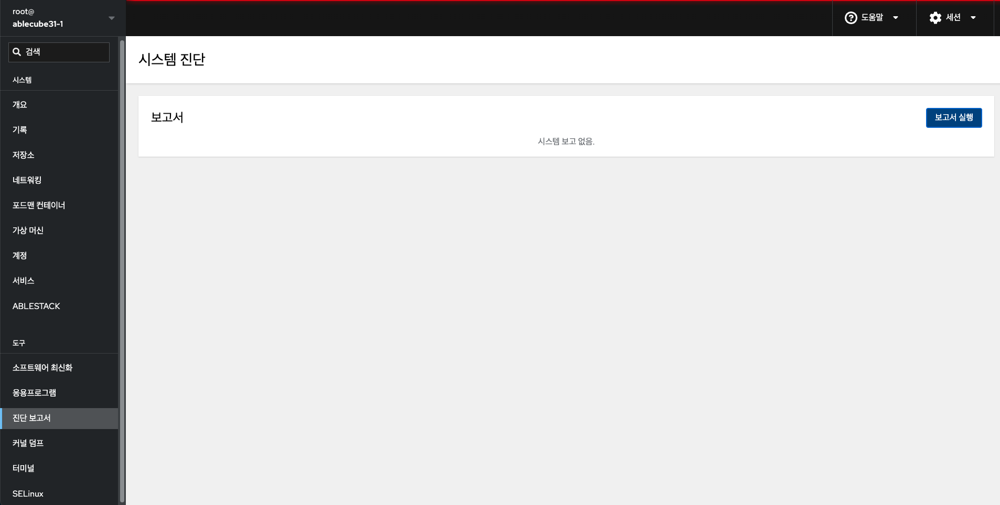
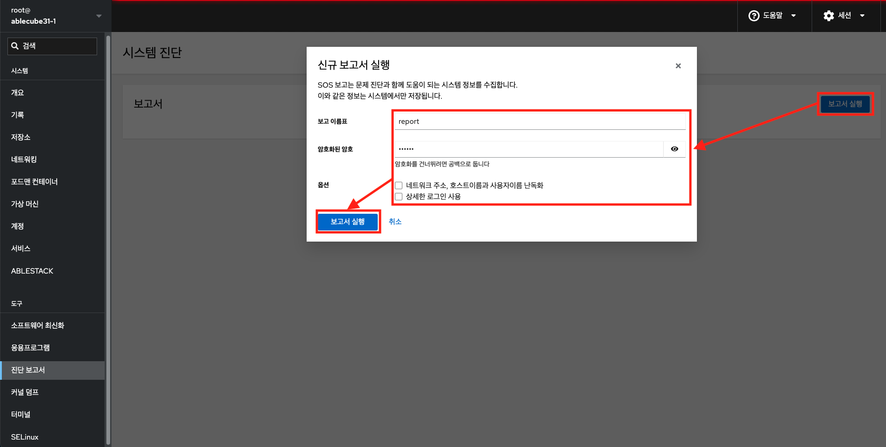
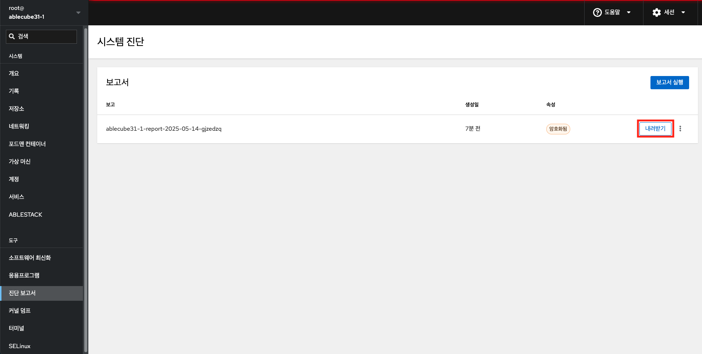
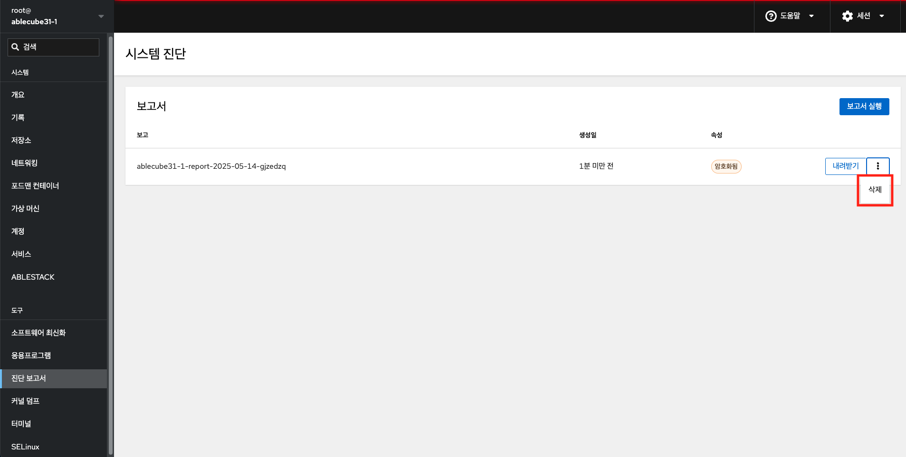

# 진단 보고서

Cube 웹 콘솔에서 호스트의 시스템 구성 및 진단 정보를 수집하고 .xz 압축 형식으로 보고서를 로컬로 다운로드 할 수 있습니다.

## 진단 보고서 다운로드

진단 정보를 다운로드하려면 :

1. 진단 보고서 메뉴를 클릭합니다.
2. 보고 이름표를 입력합니다.
3. 암호화된 암호를 선택적으로 입력합니다.
4. 필요시 옵션을 입력합니다.
5. **보고서 실행** 버튼을 클릭하여 보고서를 생성합니다.

# 보고서 내려받기

1. 내려받기 버튼을 클릭하여 시스템 진단 보고서를 다운로드합니다.

# 보고서 삭제

1. 삭제 버튼을 클릭하여 보고서를 삭제합니다.
