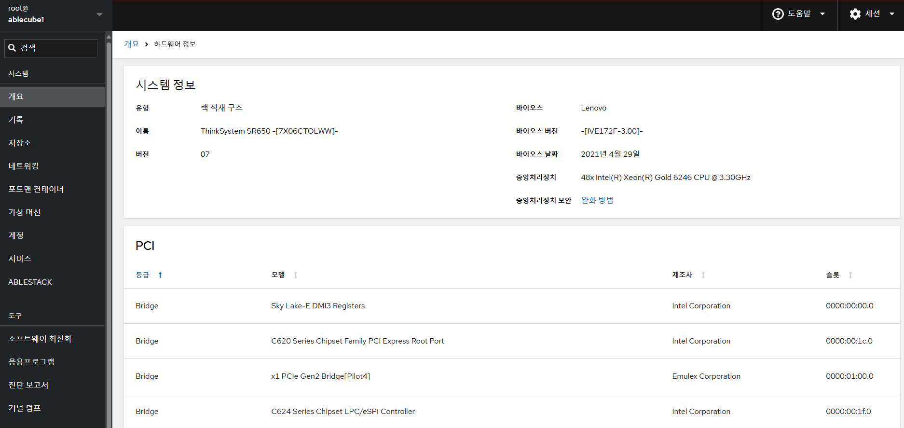
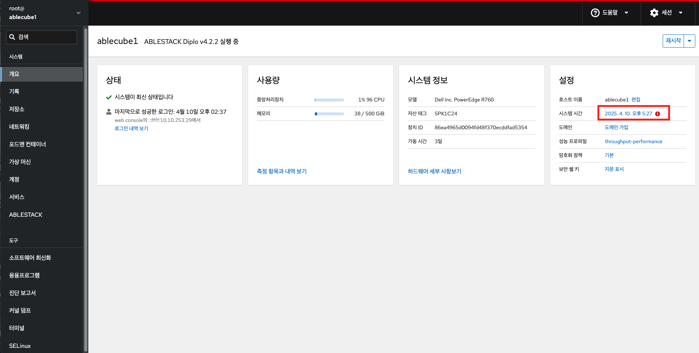

# 개요

## 개요
Cube 웹 콘솔은 로컬 시스템과 네트워크 환경에서 ABLESTACK 스토리지센터 및 클라우드센터 가상머신의 배포와 클러스터 관리를 위한 웹 기반 인터페이스입니다. 이를 통해 사용자는 시스템, 네트워크, 저장소 관리와 ABLESTACK 설치 마법사 및 제품 구성 요소 관리를 효율적으로 수행할 수 있습니다.


## 로그인

1. 로그인을 위해 Cube 웹 콘솔에 접속합니다.
    ```
    https://<Host IP>:9090
    ```

    { align=center }

2. 사용자 이름, 암호에 값을 입력합니다.
3. 기타옵션(선택)
    * 연결대상 : (Host IP or Host Name)
4. 로그인을 클릭합니다.
5. 로그인이 완료된 화면을 확인합니다.

## 개요 조회

1. Cube 대시보드는 관리자가 호스트의 정보를 한눈에 확인할 수 있도록 서비스의 상태, 자원 사용량, 시스템 정보, 설정 정보 등의 다양한 정보를의 제공하는 대시보드입니다. 이를 통해 운영자는 호스트의 전반적인 상태를 확인할 수 있습니다.
    { align=center }

이 대시보드는 관리자에게 호스트의 현황을 직관적으로 제공하여 호스트의 전반적인 상태를 한눈에 확인할 수 있습니다.

## 시스템 재시작

Cube 웹 콘솔을 사용하여 연결된 시스템을 다시 시작할 수 있습니다.

!!! warning
    시스템 재시작 및 시스템 종료가 필요한 경우 사전에 해당 호스트의 운영중인 가상머신이 존재하는지 확인하여 다른 호스트로 마이그레이션 조치 후 진행하시기 바랍니다.
    확인이 어려우실 경우 기술지원 엔지니어를 통한 작업을 권고합니다.

시스템 재시작 하려면 :

1. 재시작 버튼을 클릭 합니다.
{ align=center }
2. 시스템에 로그인 한 사용자가 있으면 다시 시작 대화 상자에 다시 시작하는 이유를 작성하세요.
3. 선택 사항 : 지연 드롭 다운 목록에서 시간 간격을 선택합니다.
{ align=center }
4. 재시작 버튼을 클릭 합니다.


## 시스템 종료

Cube 웹 콘솔을 사용하여 연결된 시스템을 종료 할 수 있습니다.

시스템 종료 하려면 :

1. 드롭다운 목록에서 종료를 선택합니다.
{ align=center }
2. **로그인한 사용자에게 보내는 메세지:** 시스템에 로그인 한 사용자가 있는 경우 시스템 종료 대화 상자에 종료 이유를 작성하세요.
3. **선택 사항 :** 지연 드롭 다운 목록에서 시간 간격을 선택합니다.
{ align=center }
4. 종료를 클릭합니다.


## 측정 항목과 내역보기

1. 해당 호스트의 메트릭 정보를 확인합니다.

    { align=center }

    * **측정 항목과 내역 보기** 버튼을 클릭하여 측정 항목과 내역 보기화면을 호출합니다.

    { align=center }

    * **CPU , 메모리, 디스크, 네트워크** 카드의 메트릭 정보를 확인합니다.

## 하드웨어 세부 사항보기

1. 해당 호스트의 하드웨어 정보를 확인합니다.

    { align=center }

    * **하드웨어 세부 사항보기** 버튼을 클릭하여 하드웨어 정보 화면을 호출합니다.

    { align=center }

    * **시스템 정보 와 PCI 장치** 정보를 확인합니다.

## 호스트 이름 편집

Cube 웹 콘솔에서 실제 호스트 이름 또는 모양새를 갖춘 호스트 이름을 설정할 수 있습니다.

1. 시스템 호스트 이름 변경하려면 호스트 이름의 **편집** 을 클릭합니다
{ align=center }
* **실헤 호스트 이름** 실제 호스트 이름을 입력합니다.

{ align=center }
* **변경** 버튼을 클릭 합니다.

## 시스템 시간 설정

시간대를 설정하고 시스템 시간을 NTP(Network Time Protocol) 서버와 동기화 할 수 있습니다.

1. 시스템 시간 설정 하려면 **시스템 시간**의 현재 정보를 클릭합니다.

{ align=center }

!!! info
    * 시간 동기화가 정상적이지 않을 경우 , 정상일 경우  아이콘이 표시됩니다.
    * NTP설정이 변경될 경우 모든 호스트 및 SCVM, CCVM에서도 동일한 설정이 필요합니다.

2. 시스템 시간 변경이 필요한 경우 대화 상자에서 시간대를 변경합니다.
{ align=center }
3. 설정 시간 드롭다운 메뉴에서 다음 중 하나를 선택합니다.
    * 수동 : NTP 서버없이 수동으로 시간을 설정해야하는 경우 이 옵션을 사용합니다.
    * 자동으로 NTP 사용 : 미리 설정된 NTP 서버와 자동으로 동기화 하는 기본 옵션입니다.
    * 추가 NTP 서버를 자동으로 사용 : 시스템을 특정 NTP 서버와 동기화해야 하는 경우에만 이 옵션을 사용합니다. 서버의 DNS 이름 또는 IP 주소를 지정합니다.
{ align=center }
4. **변경** 버튼을 클릭 합니다.

## 시스템 성능 최적화

Cube 웹 콘솔을 사용하여 선택한 작업에 대한 시스템 성능을 최적화합니다.

1. 시스템 성능 최적화 하려면 **성능 프로파일**의 현재 정보를 클릭합니다.

{ align=center }

2. 성능 프로파일 변경 대화상자에서 필요한 경우 프로파일을 변경합니다.

{ align=center }

* **프로파일 변경** 을 클릭 합니다.
