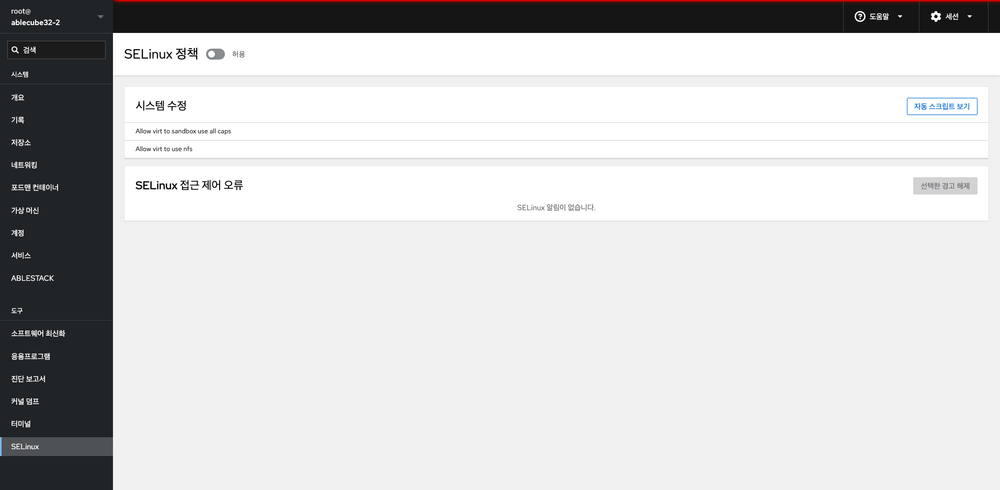
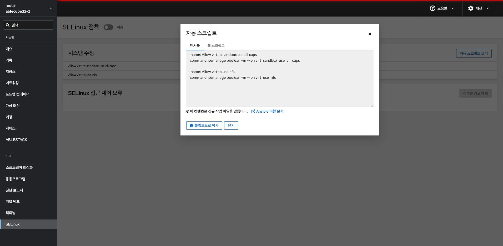

# SELinux

## 개요
SELinux 메뉴는 시스템의 SELinux(Security-Enhanced Linux) 정책을 확인하고, 관련 오류나 경고를 처리하는 기능을 제공합니다. 이 메뉴를 통해 SELinux 설정 상태를 확인하고, 접근 제어 오류에 대한 정보를 파악할 수 있습니다.

## 화면 구성
{ .imgCenter .imgBorder }

### SELinux 정책 허용/강제
* SELinux 정책 스위치를 통해 SELinux 상태를 전환할 수 있습니다.
    * 허용(Permissive): SELinux는 정책 위반을 기록만 하며 차단하지는 않음.
    * 강제(Enforcing): SELinux가 정책을 실제로 적용하여 차단함.

!!! info "INFO"
    "설정은 구성된 상태가 다르기 때문에 다음 부팅 시 원래 상태로 돌아갑니다." 이는 일시적으로 SELinux 모드를 변경한 경우, 재부팅 시 원래 설정으로 복원된다는 의미입니다.

### 시스템 수정
* SELinux 정책 예외 규칙을 추가할 수 있는 항목입니다.
* 각 항목은 특정 서비스나 기능이 SELinux 제약을 넘어서 작동할 수 있도록 예외를 부여합니다.
* 자동 스크립트 보기: 
     { .imgCenter .imgBorder }
     * 우측 상단의 자동 스크립트 보기 버튼을 클릭하면, 해당 규칙들을 적용하기 위한 명령어 또는 스크립트를 확인할 수 있습니다. 자동 스크립트 기능은 사용자가 설정한 SELinux 정책 예외 항목을 기반으로 자동으로 적용 가능한 스크립트를 생성해줍니다. 시스템 관리자나 DevOps 담당자가 CLI 또는 자동화 도구를 통해 빠르게 동일 설정을 반영할 수 있도록 도와줍니다.
          * 연서블 탭: Ansible 플레이북 형식으로 출력됩니다.
          * 쉘 스크립트 탭: Shell 명령어 형식으로 출력되며, 터미널에서 직접 실행할 수 있습니다.

### SELinux 접근 제어 오류
* SELinux 정책 위반으로 인해 발생한 접근 제어 오류(AVC Denials) 를 확인할 수 있는 영역입니다.
* 오류가 발생한 경우에는 해당 내역이 리스트로 표시되며, 우측 상단의 선택한 경고 해제 버튼을 통해 오류 메시지를 해제(무시)할 수 있습니다.
