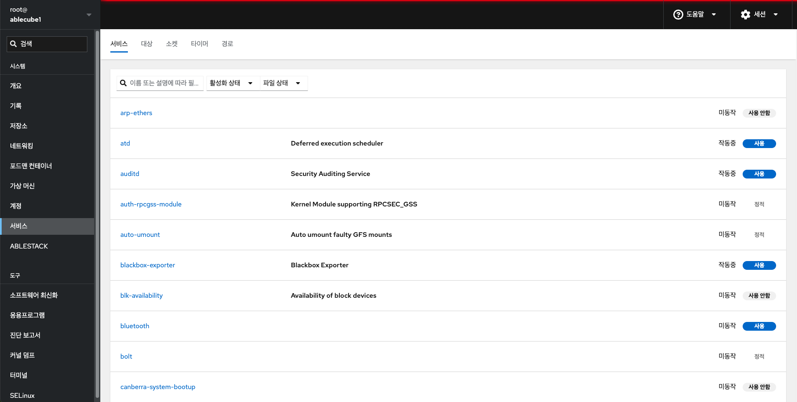
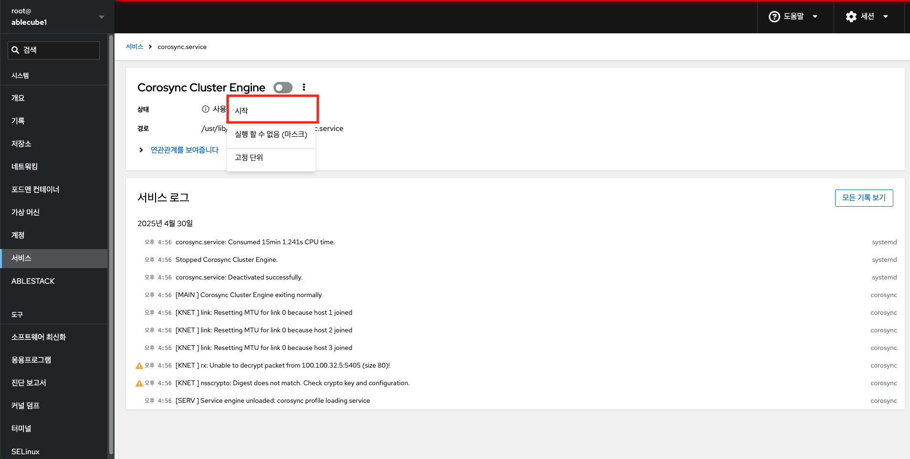
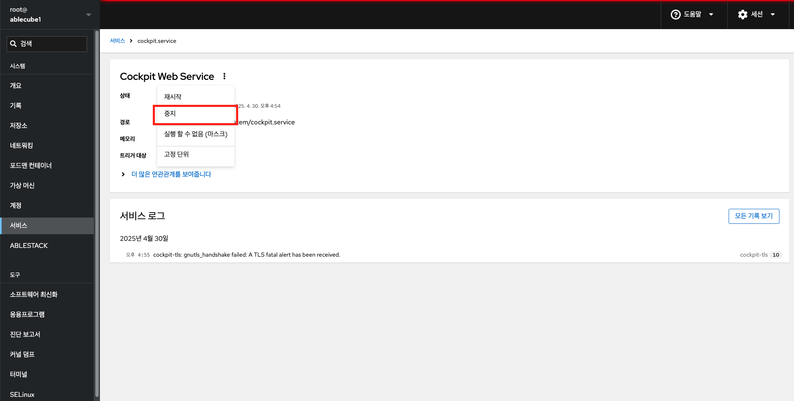
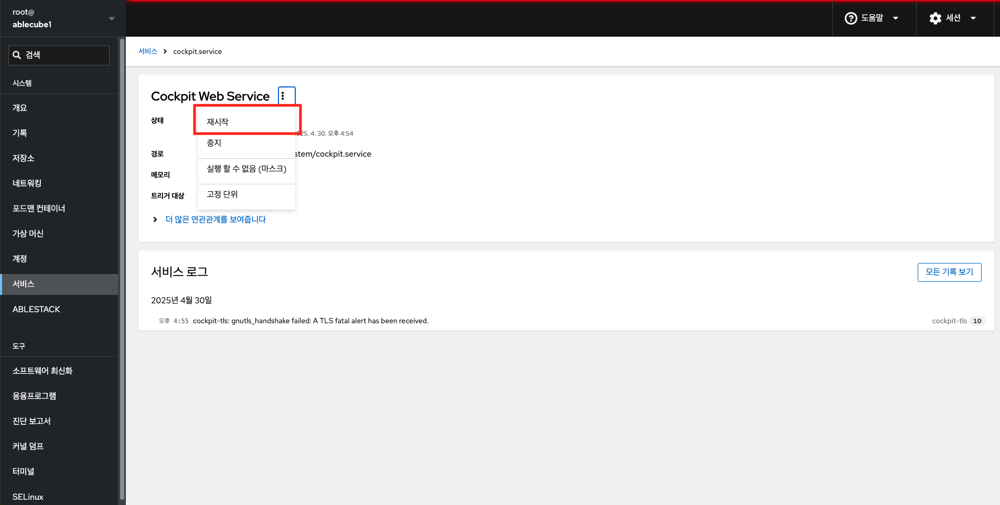

# 서비스

## 개요
Cube의 웹 콘솔에서 시스템 서비스를 관리하는 기능을 제공합니다. 서비스를 활성화 또는 비활성화하고 다시 시작하거나 다시 로드하거나 자동 시작을 관리할 수 있습니다. 

서비스의 현재 상태를 보여주며, 이름이나 설명 및 사용, 사용 안함 또는 정적 자동 시작으로 서비스를 필터링할 수 있습니다. 대상, 소켓, 타이머 또는 경로를 관리하려면 상단 메뉴에서 해당 탭으로 전환하면 됩니다. 

!!! info 
    관리 권한이 없는 사용자 계정의 경우 읽기 전용으로 접근되므로, 서비스 관리 기능을 사용하려면 관리자 권한으로 변경해야합니다.

## 시스템 서비스 활성화 또는 비활성화

Cube의 웹 콘솔을 사용하여 시스템 서비스를 활성화하거나 비활성화 할 수 있습니다.

시스템 서비스를 활성화 또는 비활성화 하려면 : 

1. 관리자 권한으로 Cube의 웹 콘솔에 로그인합니다.
2. 서비스 메뉴를 클릭합니다.
3. 서비스 설정을 열려면 목록에서 선택한 서비스를 선택합니다.
4. 서비스 활성화 또는 비활성화 
    - 비활성 서비스를 활성화하려면 **시작** 버튼을 클릭합니다.

        

    - 활성 서비스를 비활성화하려면 **중지** 버튼을 클릭합니다.

        

## 시스템 서비스 재시작

Cube의 웹 콘솔을 사용하여 시스템 서비스를 재시작 할 수 있습니다.

시스템 서비스를 재시작 하려면 : 

1. 관리자 권한으로 Cube의 웹 콘솔에 로그인합니다.
2. 서비스 메뉴를 클릭합니다.
3. 서비스 설정을 열려면 목록에서 선택한 서비스를 선택합니다.
4. 서비스를 다시 시작하려면 **재시작** 버튼을 클릭합니다.

    

