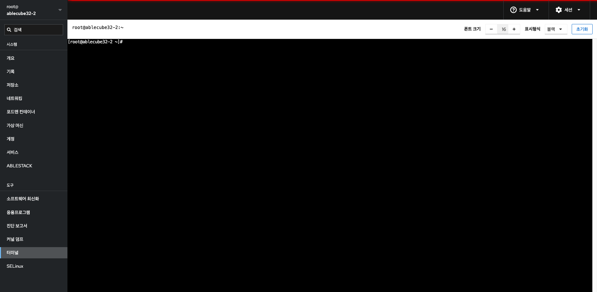

# 터미널

## 개요
터미널(Terminal) 메뉴는 웹 브라우저 상에서 직접 서버의 셸(Shell)에 접속하여 명령어를 실행할 수 있는 기능입니다. CLI 명령어가 필요한 고급 작업을 GUI 환경에서도 수행할 수 있도록 돕습니다.

## 화면 구성
{ .imgCenter .imgBorder }

### 접속 쉘
* 현재 로그인된 사용자로 기본 셸이 열립니다.
* 로그인 후 위치는 홈 디렉터리 (~)입니다.
* 시스템에서 직접 명령어를 입력하고 실행할 수 있습니다.

!!! warning "WARN"
    * root 권한으로 조작할 수 있으므로, 실수로 시스템을 손상시킬 수 있습니다.

### 설정 옵션 (우측 상단)
* 폰트 크기 조절: - 및 + 버튼을 통해 터미널 글자 크기를 변경할 수 있습니다.
* 표시 형식: 배경색 테마 변경이 가능합니다. (예: 블랙, 화이트 등)
* 초기화 버튼: 터미널 세션을 초기화하여 새로 시작할 수 있습니다.
