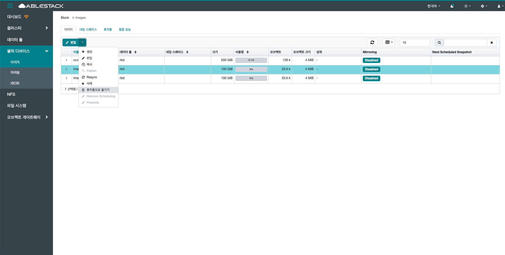
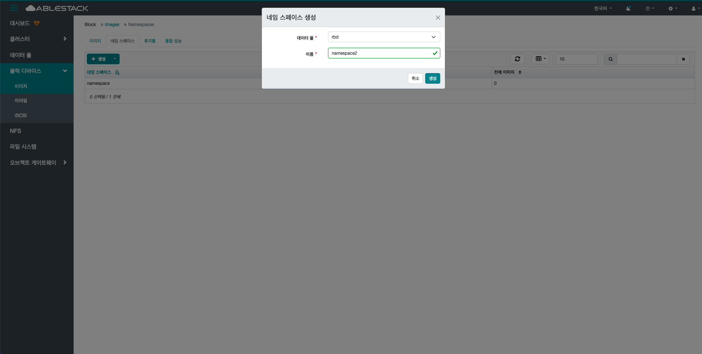

# 이미지

## 개요
이미지는 RBD(RADOS Block Device) 이미지들을 관리하는 메뉴입니다. 각 이미지 파일은 가상 디스크처럼 사용되며, 크기, 상태, 사용 중인 풀(pool), 스냅샷 여부 등의 정보를 제공합니다. 이미지 생성, 삭제, 수정 등의 작업도 이 화면에서 수행할 수 있습니다.

## 이미지 목록 조회

1. 블록 이미지 목록을 확인하는 화면입니다.
    생성된 블록 이미지 목록을 확인하거나 이미지 생성 버튼을 클릭하여 이미지를 생성할 수 있습니다.
    { .imgCenter .imgBorder }

## 세부 설명 조회

1. 블록 이미지의 세부 설명 정보를 확인할 수 있습니다.
    { .imgCenter .imgBorder }

## 스냅샷

### 조회

1. 블록 이미지의 스냅샷 목록을 조회할 수 있습니다.
    { .imgCenter .imgBorder }

### 스냅샷 생성

1. 생성 버튼을 클릭 하여 생성 RBD 스냅샷 팝업을 호출합니다.

    { .imgCenter .imgBorder }

2. 블록 이미지 생성을 위한 항목을 입력합니다.

    { .imgCenter .imgBorder }

    * **이름:** 이름을 입력합니다.
    * **생성 RBD 스냅샷** 버튼을 클릭하여 생성 RBD 스냅샷을 생성합니다.

### 스냅샷 이름 변경

1. 선택한 스냅샷의 이름을 변경합니다.

    { .imgCenter .imgBorder }

    * 목록에서 이름 변경할 스냅샷을 선택합니다.
    * **이름 변경** 버튼을 클릭하여 이름 변경 RBD 스냅샷 화면을 호출합니다.

2. RBD 스냅샷 이름 변경을 위한 항목을 입력합니다.

    { .imgCenter .imgBorder }

    * **이름:** 이름을 입력합니다.
    * **이름 변경 RBD 스냅샷** 버튼을 클릭하여 RBD 스냅샷 이름을 변경합니다.

### 스냅샷 보호

1. 선택한 스냅샷을 보호합니다. 스냅샷 보호 상태가 되면 스냅샷을 이용하여 이미지 복제를 사용할 수 있으며, 삭제할 수 없습니다.

    { .imgCenter .imgBorder }

    * 목록에서 보호할 스냅샷을 선택합니다.
    * **보호** 버튼을 클릭하여 스냅샷을 보호 상태로 변경합니다.

### 스냅샷 보호되지 않음

1. 선택한 스냅샷을 보호되지 않음 상태로 변경합니다.

    { .imgCenter .imgBorder }

    * 목록에서 보호 상태 해제할 스냅샷을 선택합니다.
    * **보호되지 않음** 버튼을 클릭하여 스냅샷을 보호를 해제합니다.

### 스냅샷 복제

!!! info
    스냅샷 보호 상태인 경우에만 활성화 됩니다.

1. 선택한 스냅샷 베이스로 하위의 새로운 이미지를 복제합니다.

    { .imgCenter .imgBorder }

    * 목록에서 복제할 스냅샷을 선택합니다.
    * **복제** 버튼을 클릭하여 복제 RBD 화면을 호출합니다.

2. RBD 이미지 복제를 위한 항목을 입력합니다.

    { .imgCenter .imgBorder }

    * **이름:** 이름을 입력합니다.
    * **데이터 풀:** 데이터 풀을 선택합니다.
    * **복제 RBD** 버튼을 클릭하여 스냅샷 기반 하위 이미지를 복제합니다.

### 스냅샷 복사

1. 선택한 스냅샷을 기반으로 새로운 이미지를 Full 복사합니다.

    { .imgCenter .imgBorder }

    * 목록에서 복사할 스냅샷을 선택합니다.
    * **복사** 버튼을 클릭하여 복사 RBD 화면을 호출합니다.

2. RBD 이미지 복사를 위한 항목을 입력합니다.

    { .imgCenter .imgBorder }

    * **이름:** 이름을 입력합니다.
    * **데이터 풀:** 데이터 풀을 선택합니다.
    * **복사 RBD** 버튼을 클릭하여 스냅샷 기반 하위 이미지를 복사합니다.

### 스냅샷 롤백

!!! warning
    롤백을 진행하면 지정된 시점의 데이터로 복구되며, 그 이후에 변경된 내용은 모두 삭제되어 복구할 수 없습니다.

1. 선택한 스냅샷으로 이미지를 되돌립니다.

    { .imgCenter .imgBorder }

    * 목록에서 롤백할 스냅샷을 선택합니다.
    * **롤백** 버튼을 클릭하여 RBD 스냅샷 롤백 팝업을 호출합니다.

2. RBD 이미지 롤백을 위한 항목을 입력합니다.

    { .imgCenter .imgBorder }

    * **롤백** 버튼을 클릭하여 스냅샷 시점으로 되돌아 갑니다.

### 스냅샷 삭제

1. 선택한 스냅샷을 삭제합니다.

    { .imgCenter .imgBorder }

    * 목록에서 삭제할 스냅샷을 선택합니다.
    * **삭제** 버튼을 클릭하여 Delete RBD 스냅샷 화면을 호출합니다.

2. RBD 이미지 삭제를 위한 항목을 입력합니다.

    { .imgCenter .imgBorder }

    * **예, 확실합니다.** 를 체크 합니다.
    * **Delete RBD 스냅샷** 버튼을 클릭하여 스냅샷을 삭제합니다.

## 설정 조회

1. 블록 이미지의 설정 정보를 확인할 수 있습니다.
    { .imgCenter .imgBorder }

## 성능 조회

1. 블록 이미지의 성능 정보를 대시보드로 확인할 수 있습니다.
    { .imgCenter .imgBorder }

## 생성

1. 생성 버튼을 클릭 하여 이미지 화면을 호출합니다.

    { .imgCenter .imgBorder }

2. 이미지 생성을 위한 항목을 입력합니다.

    { .imgCenter .imgBorder }

    * **이름:** 이름을 입력합니다.
    * **데이터 풀:** 데이터 풀을 선택합니다.
    * **크기:** 크기를 입력합니다.
    * **생성 RBD** 버튼을 클릭하여 이미지를 생성합니다.

## 편집

1. 편집 버튼을 클릭 하여 편집 RBD 화면을 호출합니다.

    { .imgCenter .imgBorder }

2. RBD 편집을 위한 항목을 입력합니다.

    { .imgCenter .imgBorder }

    * **이름:** 이름을 입력합니다.
    * **크기:** 크기를 입력합니다.
    * **편집 RBD** 버튼을 클릭하여 RBD를 편집합니다.

## 복사

1. 선택한 이미지를 기반으로 새로운 이미지를 Full 복사합니다.

    { .imgCenter .imgBorder }

    * 목록에서 복사할 이미지를 선택합니다.
    * **복사** 버튼을 클릭하여 복사 RBD 화면을 호출합니다.

2. RBD 이미지 복사를 위한 항목을 입력합니다.

    { .imgCenter .imgBorder }

    * **이름:** 이름을 입력합니다.
    * **데이터 풀:** 데이터 풀을 선택합니다.
    * **복사 RBD** 버튼을 클릭하여 이미지 기반으로 이미지 Full 복사합니다.

## Resync

1. 미러링 환경에서 primary 이미지와 secondary 이미지 간 데이터 불일치를 복구하기 위한 재동기화 작업입니다.

    { .imgCenter .imgBorder }

    * 목록에서 Resync할 이미지를 선택합니다.
    * **Resync** 버튼을 클릭하여 Resync RBD 화면을 호출합니다.

2. RBD 이미지 Resync를 위한 항목을 입력합니다.

    { .imgCenter .imgBorder }

    * **예, 확실합니다.** 를 체크 합니다.
    * **Resync RBD** 버튼을 클릭하여 미러링 동기화 작업을 수행합니다.

## 삭제
1. 선택한 이미지를 삭제합니다.

    { .imgCenter .imgBorder }

    * 목록에서 삭제할 이미지를 선택합니다.
    * **삭제** 버튼을 클릭하여 Delete RBD 화면을 호출합니다.

2. RBD 이미지 삭제를 위한 항목을 입력합니다.

    { .imgCenter .imgBorder }

    * **예, 확실합니다.** 를 체크 합니다.
    * **Delete RBD** 버튼을 클릭하여 이미지를 삭제합니다.

## 휴지통으로 옮기기
1. 선택한 이미지를 휴지통으로 옮김니다.

    { .imgCenter .imgBorder }

    * 목록에서 휴지통으로 이동할 이미지를 선택합니다.
    * **휴지통으로 옮기기** 버튼을 클릭하여 이미지를 휴지통에 이동 화면을 호출합니다.

2. RBD 이미지 휴지통으로 이동을 위한 항목을 입력합니다.

    { .imgCenter .imgBorder }

    * **보호가 만료되는** 에 휴지통 이동후 완전 삭제 시킬 기간을 설정합니다. (설정하지 않을 경우를 만 1일 보관후 삭제합니다.)
    * **이동** 버튼을 클릭하여 이미지를 휴지통으로 이동 시킵니다.

## 네임 스페이스 목록 조회

1. 네임 스페이스 목록을 확인하는 화면입니다.
    생성된 네임 스페이스 목록을 확인하거나 네임 스페이스 생성 버튼을 클릭하여 네임 스페이스를 생성할 수 있습니다.
    { .imgCenter .imgBorder }

## 생성

1. 생성 버튼을 클릭 하여 네임 스페이스 생성 화면을 호출합니다.

    { .imgCenter .imgBorder }

    * **생성** 버튼을 클릭하여 네임 스페이스 생성 화면을 호출합니다.

2. 네임 스페이스 생성을 위한 항목을 입력합니다.

    { .imgCenter .imgBorder }

    * **데이터 풀:** 데이터 풀을 선택합니다.
    * **이름:** 이름을 입력합니다.
    * **생성** 버튼을 클릭하여 네임 스페이스를 생성합니다.

## 삭제

1. 선택한 네임 스페이스를 삭제합니다.

    { .imgCenter .imgBorder }

    * 목록에서 삭제할 네임 스페이스를 선택합니다.
    * **삭제** 버튼을 클릭하여 Delete Namespace 화면을 호출합니다.

2. 네임 스페이스 삭제를 위한 항목을 입력합니다.

    { .imgCenter .imgBorder }

    * **예, 확실합니다.** 를 체크 합니다.
    * **Delete Namespace** 버튼을 클릭하여 네임 스페이스를 삭제합니다.

## 휴지통 목록 조회

1. 휴지통 목록을 확인하는 화면입니다.
    휴지통 목록을 확인하거나 복구 버튼을 클릭하여 이미지를 복구할 수 있습니다.
    { .imgCenter .imgBorder }

## 복구

1. 복구 버튼을 클릭 하여 이미지 복구하기 화면을 호출합니다.

    { .imgCenter .imgBorder }

    * **복구** 버튼을 클릭하여 이미지 복구하기 화면을 호출합니다.

2. 이미지 복구하기 위한 항목을 입력합니다.

    { .imgCenter .imgBorder }

    * **새로운 이름:** 새로운 이름을 입력합니다.
    * **복구** 버튼을 클릭하여 이미지를 복구합니다.

## 삭제

!!! warning
    이미지가 영구히 삭제되어 복구할 수 없습니다. 신중히 작업해주세요.

1. 선택한 이미지를 영구히 삭제합니다.

    { .imgCenter .imgBorder }

    * 목록에서 영구히 삭제할 이미지를 선택합니다.
    * **삭제** 버튼을 클릭하여 Delete RBD 화면을 호출합니다.

2. 영구히 이미지 삭제를 위한 항목을 입력합니다.

    { .imgCenter .imgBorder }

    * **예, 확실합니다.** 를 체크 합니다.
    * **Delete RBD** 버튼을 클릭하여 네임 스페이스를 삭제합니다.

## 휴지통 비우기

!!! warning
    모든 이미지가 영구히 삭제되어 복구할 수 없습니다. 신중히 작업해주세요.

1. 휴지통에 있는 모든 이미지를 영구히 삭제합니다.

    { .imgCenter .imgBorder }

    * **휴지통 비우기** 버튼을 클릭하여 휴지통 비우기 화면을 호출합니다.

2. 휴지통 비우기로 모든 이미지 삭제를 위한 항목을 입력합니다.

    { .imgCenter .imgBorder }

    * **데이터 풀:** 데이터 풀을 선택합니다.
    * **완전히 제거** 버튼을 클릭하여 휴지통의 데이터를 영구히 삭제합니다.

## 성능 조회

1. 모든 블록 이미지의 성능 정보를 대시보드로 확인할 수 있습니다.
    { .imgCenter .imgBorder }
