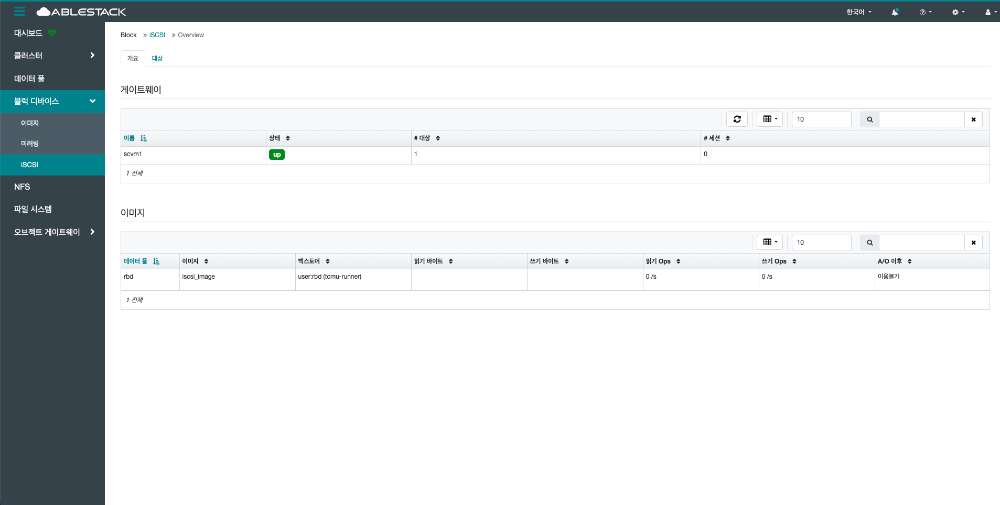
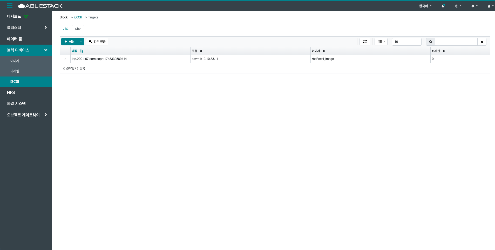
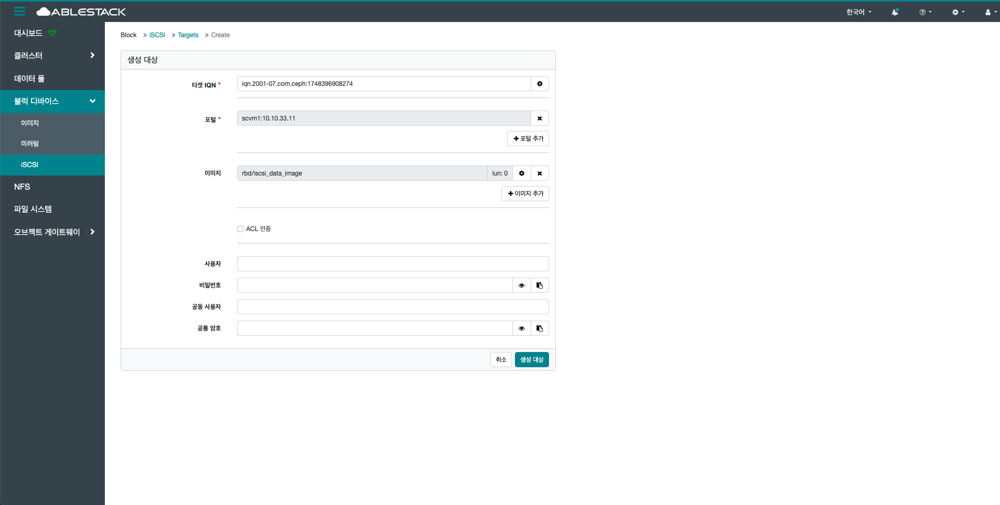
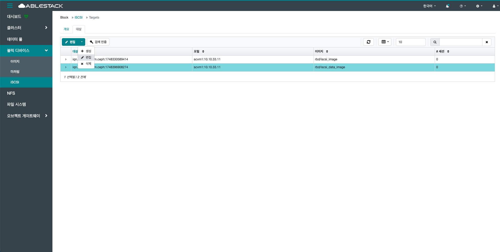
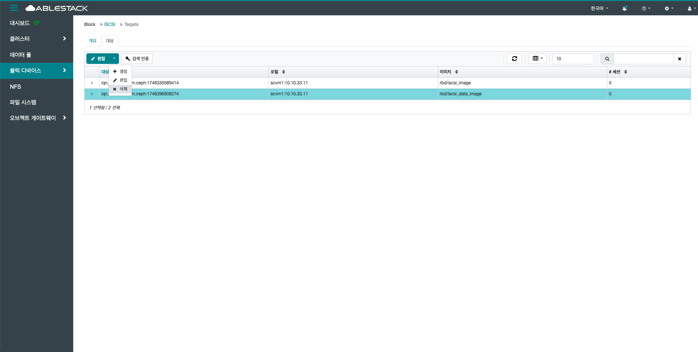
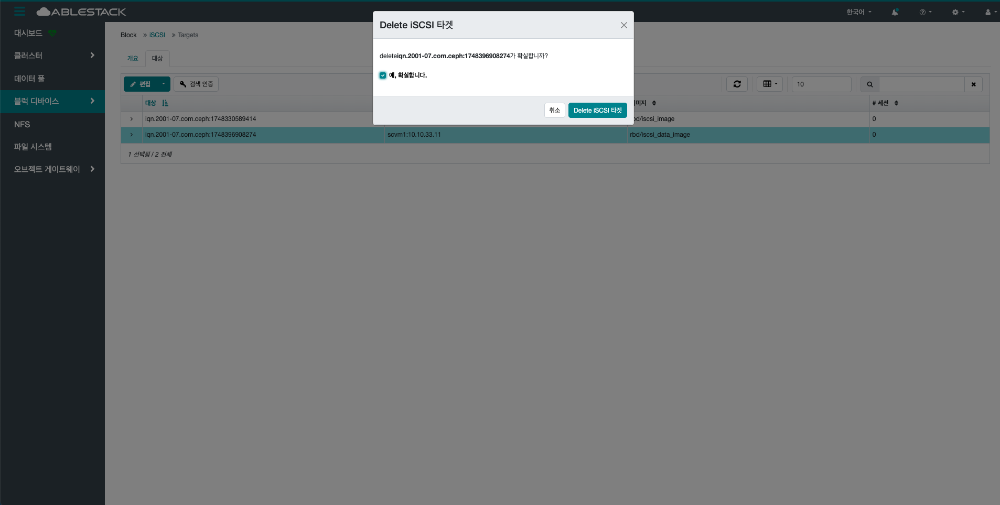

# iSCSI

## 개요
iSCSI는 RBD를 iSCSI 프로토콜로 외부 서버에 제공하기 위한 설정 기능입니다. 게이트웨이를 추가·관리하고 iSCSI 대상을 생성할 수 있으며, 인증 및 접근 제어도 지원합니다. 고가용성을 위해 다중 게이트웨이 구성이 권장됩니다.

## 개요 탭

!!! info
    iSCSI 서비스를 사용하기 위해서는 **클러스터 > 서비스** 에서 iSCSI 서비스를 생성하야 합니다.

1. iSCSI 서비스를 위한 게이트웨이 정보 및 이미지 정보를 확인할 수 있습니다.
    
    { .imgCenter .imgBorder }
    
    - 게이트웨이
        - iSCSI 서비스를 제공하는 게이트웨이 정보를 확인할 수 있습니다.
        - 게이트웨이의 이름, 상태, 대상(타겟) 수, 세션 수를 확인 할 수 있습니다.
    
    - 이미지
        - iSCSI 서비스를 제공하는 이미지 정보를 확인 할 수 있습니다.
        - 이미지의 데이터 풀, 이미지 명, 백스토어, 읽기 바이트, 쓰기 바이트, 읽기 Ops, 쓰기 Ops, A/O 이후를 확인할 수 있습니다.

## 대상 목록 조회

1. 대상(타겟) 목록을 확인하는 화면입니다.
    생성된 타겟 목록을 확인하거나 생성 버튼을 클릭하여 새로운 타겟을 생성할 수 있습니다.
    { .imgCenter .imgBorder }

## 생성

1. 생성 버튼을 클릭 하여 생성 타겟 화면을 호출합니다.

    { .imgCenter .imgBorder }

2. 타겟 생성을 위한 항목을 입력합니다.

    { .imgCenter .imgBorder }

    * **타겟 IQN:** 타겟 IQN을 입력합니다.
    * **포털:** 포털을 선택합니다.
    * **이미지:** 이미지를 선택합니다.
    * 필요시 **사용자, 비밀번호, 공동 사용자, 공통 암호** 를 입력합니다.

        | 항목        | 방향         | 설명                              |
        | --------- | ---------- | ------------------------------- |
        | 사용자/비밀번호  | 클라이언트 → 서버 | 클라이언트가 타겟 인증 시 사용               |
        | 공동 사용자/암호 | 서버 → 클라이언트 | Mutual CHAP 사용 시, 서버도 클라이언트를 인증 |

    * **생성 대상** 버튼을 클릭하여 대상(타겟)을 생성합니다.

## 편집

1. 대상을 목록에서 선택 후 편집 버튼을 클릭 하여 편집 대상 화면을 호출합니다.

    { .imgCenter .imgBorder }

2. 대상 편집을 위한 항목을 입력합니다.

    { .imgCenter .imgBorder }

    * **타겟 IQN:** 타겟 IQN을 입력합니다.
    * **포털:** 포털을 선택합니다.
    * **이미지:** 이미지를 선택합니다.
    * 필요시 **사용자, 비밀번호, 공동 사용자, 공통 암호** 를 입력합니다.

        | 항목        | 방향         | 설명                              |
        | --------- | ---------- | ------------------------------- |
        | 사용자/비밀번호  | 클라이언트 → 서버 | 클라이언트가 타겟 인증 시 사용               |
        | 공동 사용자/암호 | 서버 → 클라이언트 | Mutual CHAP 사용 시, 서버도 클라이언트를 인증 |

    * **편집 대상** 버튼을 클릭하여 대상(타겟)을 생성합니다.

## 삭제

1. 선택한 대상을 삭제합니다.

    { .imgCenter .imgBorder }

    * 목록에서 삭제할 대상를 선택합니다.
    * **삭제** 버튼을 클릭하여 Delete iSCSI 타겟 화면을 호출합니다.

2. RBD 이미지 삭제를 위한 항목을 입력합니다.

    { .imgCenter .imgBorder }

    * **예, 확실합니다.** 를 체크 합니다.
    * **Delete iSCSI 타겟** 버튼을 클릭하여 대상을 삭제합니다.
