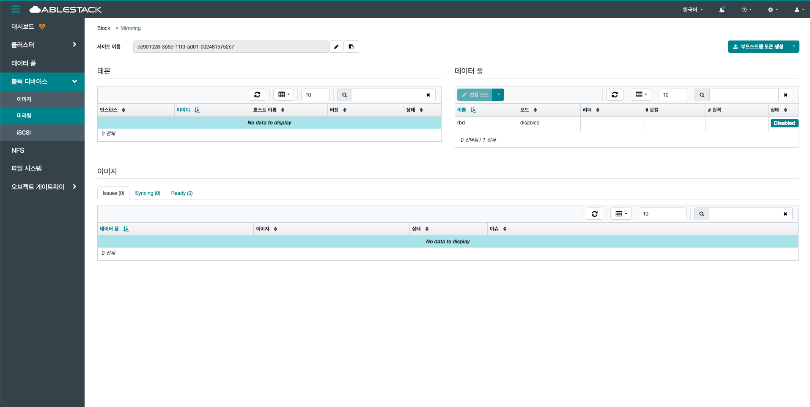

# 미러링

## 개요
Glue RBD 미러링은 두 개의 Glue 클러스터 간에 RBD 이미지를 비동기 방식으로 복제하는 기능입니다. 주로 재해 복구(DR) 및 고가용성을 위해 사용되며 rbd-mirror 데몬이 변경된 데이터를 원격 클러스터로 자동 전송합니다. 풀 또는 이미지 단위로 설정할 수 있습니다.

{ .imgCenter .imgBorder }

## 미러링 방식
* 비동기식(replication mode)
    * RBD 미러링은 journal-based 방식으로 작동.
    * 변경된 블록을 로그(journal) 형태로 기록한 뒤, 네트워크를 통해 복제.
    * 기본적으로는 단방향(one-way) 복제 구조이지만, 양방향으로 설정도 가능 (active-active 구성).

* Image-based 미러링
    * RBD 이미지 단위로 미러링 활성화 여부를 설정.
    * 풀 전체를 미러링할 수도 있고, 특정 이미지에만 적용할 수도 있음.

미러링을 통한 DR 구성 방법은 "[재난 복구(DR) 관리](/administration/mold/dr-mngt-guide)" 에서 확인 가능합니다.
