# 경고
## 개요
클러스터 상태에 이상 징후가 감지되었을 때 관리자에게 경고를 전달하는 시스템입니다.
이 경고는 Prometheus 기반의 모니터링 구조와 연동되어 실시간으로 수집된 메트릭을 기준으로 트리거됩니다.
알림은 일반적으로 OSD, MON, MGR, MDS 등의 데몬 상태나 디스크 사용률, PG 상태 불안정, 네트워크 지연 등 주요 이벤트에 대해 발생합니다.

각 알림은 심각도 수준을 가지며, 일반 경고부터 치명적인 장애까지 분류됩니다.
AlertManager와 연동될 경우 이메일, 슬랙, 웹훅 등 다양한 방식으로 알림을 전송할 수 있습니다.
알림은 자동 복구 여부, 관리자 조치 필요 여부 등과 함께 메시지 형태로 전달됩니다.

사용자는 경고를 기반으로 사전 대응, 자동화된 복구, 혹은 수동 점검 등의 작업을 수행할 수 있습니다.

클러스터 안정성과 가용성 확보를 위한 중요한 기능으로, 운영 환경에서 빠른 대응을 가능하게 합니다.
경고 내역은 히스토리로 저장되어 추후 클러스터 분석과 감사 용도로 활용할 수 있습니다.

UI 또는 CLI를 통해 활성 경고와 해제된 경고를 확인하고, 필터링 및 상세 조회가 가능합니다.

## 경고 조회
1. 클러스터 상태에 영향을 주는 실시간 경로를 확인하는 기능입니다. 이름, 심각도, 그룹, 기간 등 확인하실 수 있습니다.
    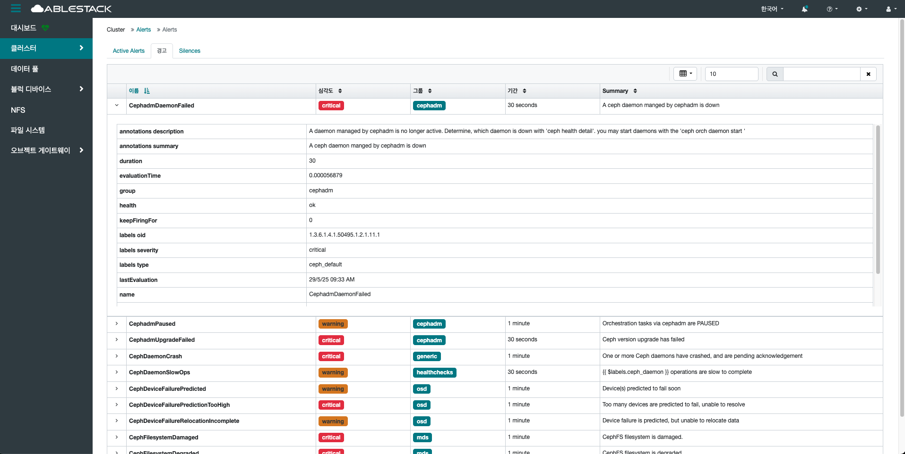{ .imgCenter .imgBorder }
    - 이름 옆 화살표를 클릭하여 경고 발생 시점, 메시지 등 상세 정보를 확인할 수 있습니다.

## Silences 조회(Silences)
1. 현재 무시 처리된 경고를 확인하는 기능입니다. 특정 조건의 경고가 사용자에 의해 일정 시간 동안 표시되지 않도록 차단된 상태를 의미합니다.
    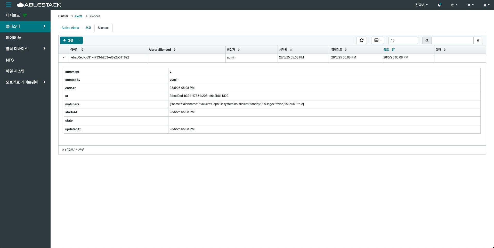{ .imgCenter .imgBorder }
    - 아이디 옆 화살표를 클릭하여 경고 발생 시점, 아이디 등 상세 정보를 확인할 수 있습니다.

### 생성(Create)
1. 특정 경고를 일정 시간 동안 무시하도록 설정하는 기능입니다. 이는 유지보수 작업, 테스트 환경, 혹은 반복적으로 발생하는 경고를 임시로 차단할 때 유용하게 사용됩니다. 아이디 상단의 생성 버튼을 클릭합니다.
    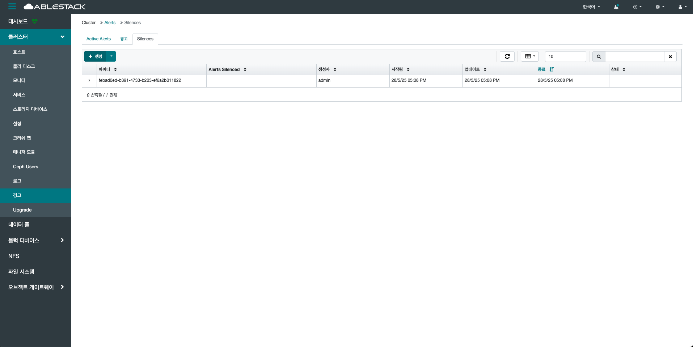{ .imgCenter .imgBorder }
2. 생성 버튼을 클릭한 화면입니다.
    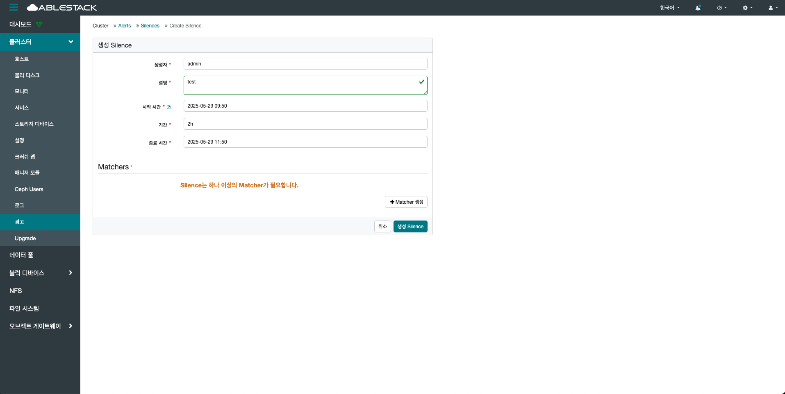{ .imgCenter .imgBorder }
    - **생성자** 를 입력합니다.
    - **설명** 을 입력합니다.
    - **시작 시간** 을 입력합니다.
    - **기간** 을 입력합니다.
    - **종료 시간** 을 입력합니다.
3. Silences 생성 시, 하나 이상의 Matcher가 필요합니다. Matcher 생성 버튼을 클릭한 화면입니다.
    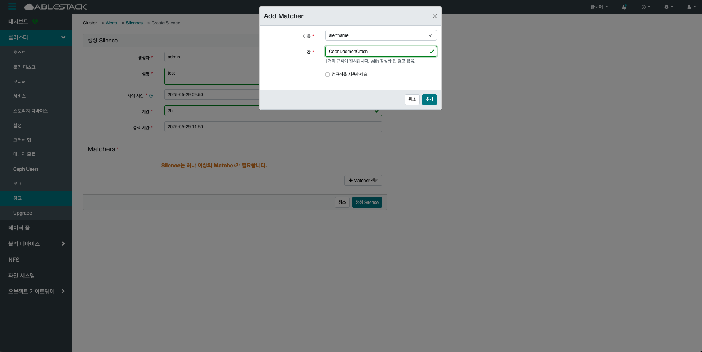{ .imgCenter .imgBorder }
    - **이름** 을 선택합니다.
    - **값** 을 선택 및 입력합니다.
    - **정규식을 사용하세요.** 을 선택 및 미선택합니다.
    - **추가** 버튼을 클릭합니다.
4. 생성 Silence 버튼을 클릭합니다.
    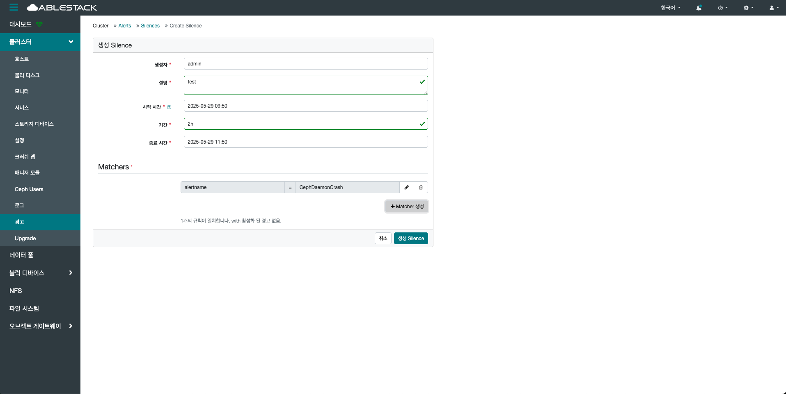{ .imgCenter .imgBorder }

### 다시 만들기(ReCreate)
1. 이미 종료되었거나 삭제된 Silence를 동일한 설정으로 다시 활성화 합니다. 해당 상태가 expired일 경우 활성화됩니다.
    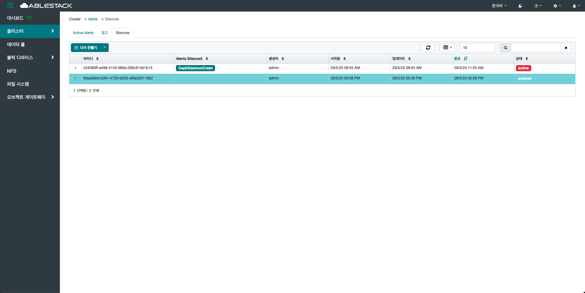{ .imgCenter .imgBorder }
    - 이미 종료된 Silence를 선택하여 다시 만들기 버튼을 클릭합니다.
2. 다시 만들기 버튼을 클릭한 화면입니다.
    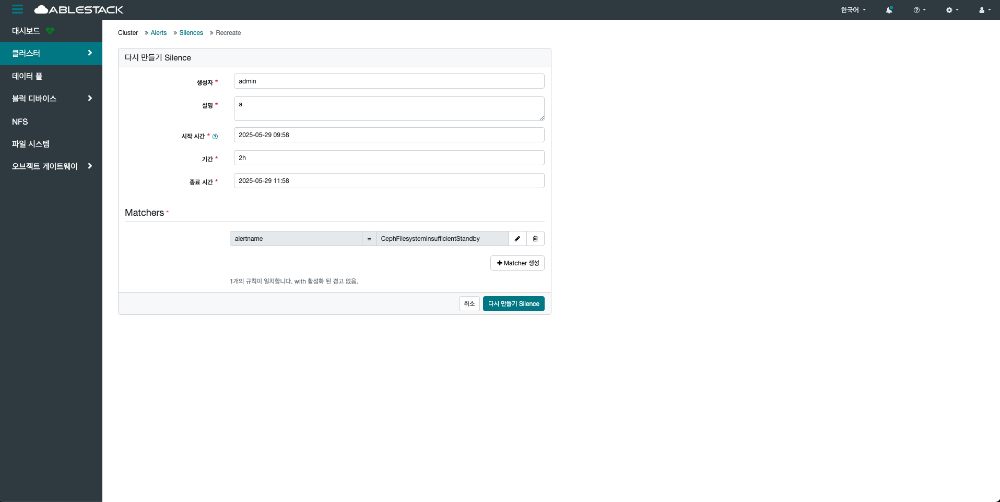{ .imgCenter .imgBorder }
    - 변경할 **생성자** 를 수정합니다.
    - 변경할 **설명** 을 수정합니다.
    - 변경할 **시작 시간** 을 수정합니다.
    - 변경할 **기간** 을 수정합니다.
    - 변경할 **종료 시간** 을 수정합니다.
    - 변경할 **Matchers** 을 수정합니다.
    - **다시 만들기 Silence** 버튼을 클릭합니다.

### 편집(Edit)
1. 실행 중인 Silence를 설정 변경할 수 있는 기능입니다. 해당 상태가 active일 경우 활성화됩니다.
    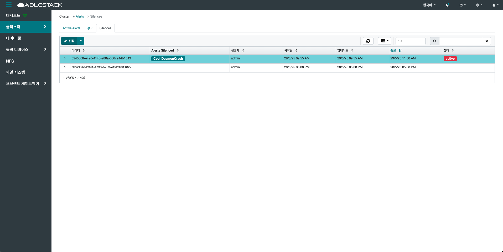{ .imgCenter .imgBorder }
    - 상태가 active인 Silence를 선택하여 편집 버튼을 클릭합니다.
2. 편집 버튼을 클릭한 화면입니다.
    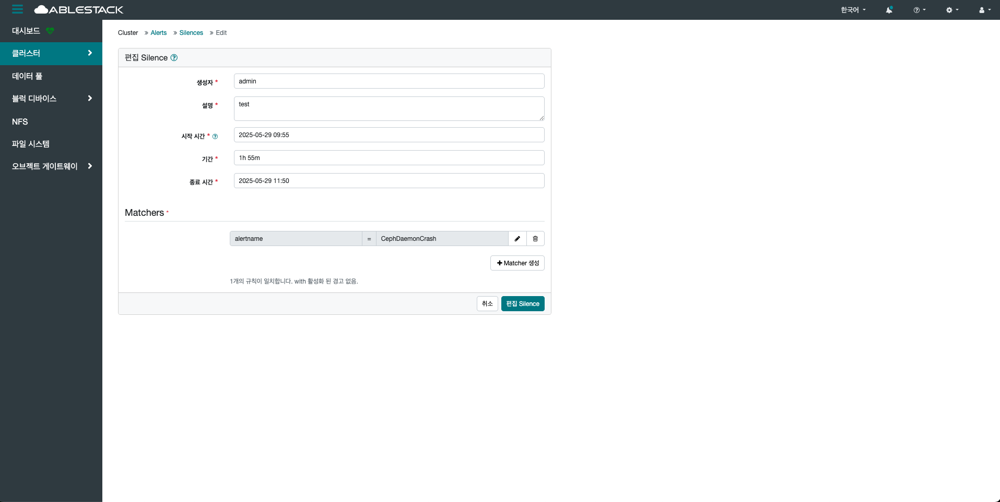{ .imgCenter .imgBorder }
    - 변경할 **생성자** 를 수정합니다.
    - 변경할 **설명** 을 수정합니다.
    - 변경할 **시작 시간** 을 수정합니다.
    - 변경할 **기간** 을 수정합니다.
    - 변경할 **종료 시간** 을 수정합니다.
    - 변경할 **Matchers** 를 수정합니다.
    - **편집 Silence** 버튼을 클릭합니다.

### 만료(Expire)
1. 실행 중인 Silence를 중지 시킬 숫 있는 기능입니다. 해당 상태가 active일 경우 활성화됩니다.
    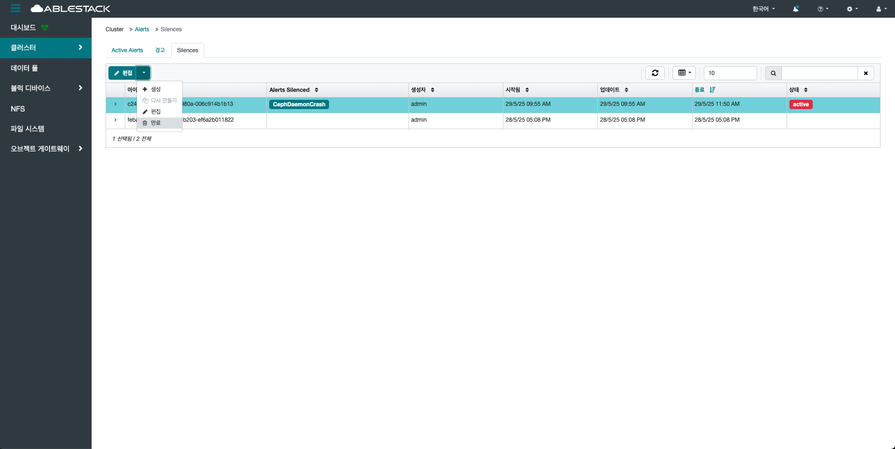{ .imgCenter .imgBorder }
    - 상태가 active인 Silence를 선택하여 만료 버튼을 클릭합니다.
2. 만료 버튼을 클릭한 화면입니다.
    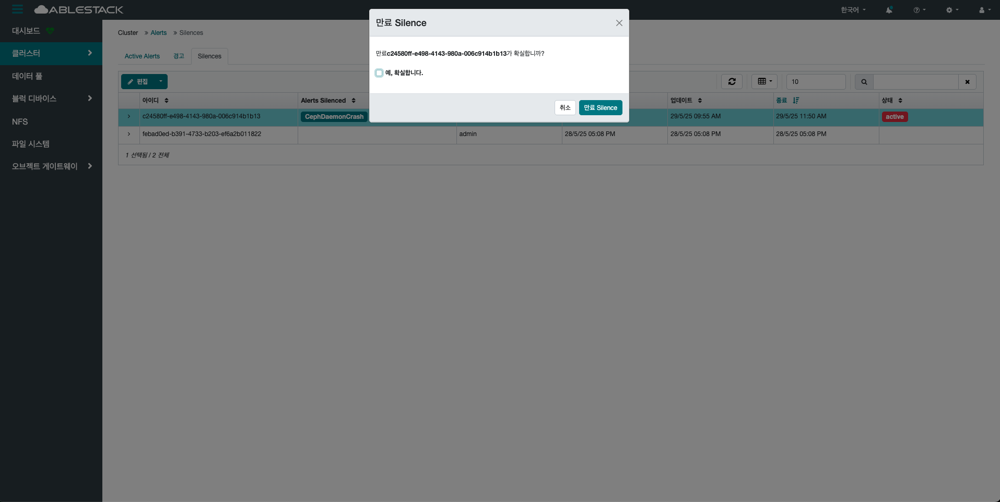{ .imgCenter .imgBorder }
    - 만료시킬 Silence의 ID를 다시 한 번 확인한 후, **예,확실합니다.** 를 선택하고, **만료 Silence** 버튼을 클릭합니다.