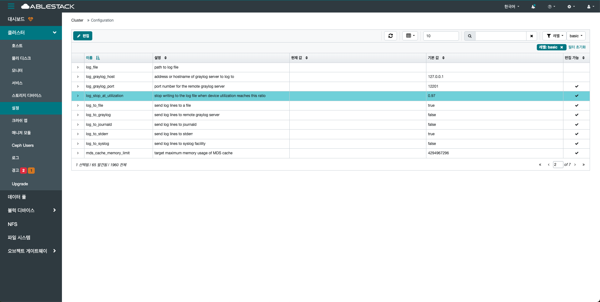
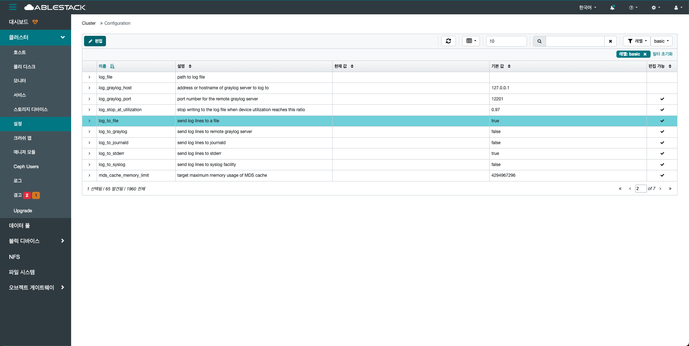
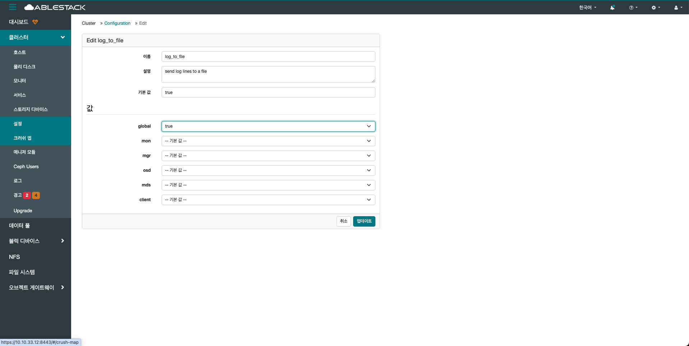

# 설정

## 개요
전체 클러스터에 영향을 미치는 핵심 구성 요소들의 설정 값을 조회하고, 필요 시 수정할 수 있는 메뉴입니다.

이 메뉴에서는 모니터(MON), OSD, MDS, RGW 등 주요 데몬들의 설정 항목들을 세부적으로 확인할 수 있으며,
설정 변경은 클러스터의 동작 방식에 직접적인 영향을 미칩니다.
또한 설정은 데몬 단위 또는 전체 클러스터 단위로 적용할 수 있어, 유연한 구성 변경이 가능합니다.

각 설정 항목은 기본값과 현재 적용된 값을 비교할 수 있으며, 특정 설정 변경시 재시작이 필요한 항목도 안내됩니다.

설정은 잘못 적용 시 서비스 장애로 이어질 수 있으므로, 변경 전 충분한 이해가 필요합니다.
고급 사용 또는 관리자를 위한 기능으로, 안정성과 성능을 세밀하게 조정할 수 있는 중요한 관리 도구입니다.

## 설정 목록 조회(Configuration)
1. Glue에 관한 모든 기본 설정 값들의 목록을 확인할 수 있습니다. 이름, 설명, 기본 값, 현재 값 등 확인할 수 있습니다.
    { .imgCenter .imgBorder }
    - 필터링과 검색 기능을 활용하여 원하는 설정 값을 빠르게 찾아볼 수 있습니다.

## 편집(Edit)
1. 편집 가능 항목에 체크되어 있는 경우에만 해당 설정 값을 수정할 수 있습니다. 체크되지 않은 항목은 시스템 보호 또는 기본 설정 유지 목적 등으로 인해 변경이 제한됩니다.
    { .imgCenter .imgBorder }
    - 변경할 설정 이름을 선택합니다.
2. 편집 버튼을 클릭한 화면입니다.
    { .imgCenter .imgBorder }
    - 값에 변경될 설정 값을 선택합니다.
    - **업데이트** 버튼을 클릭합니다.
    