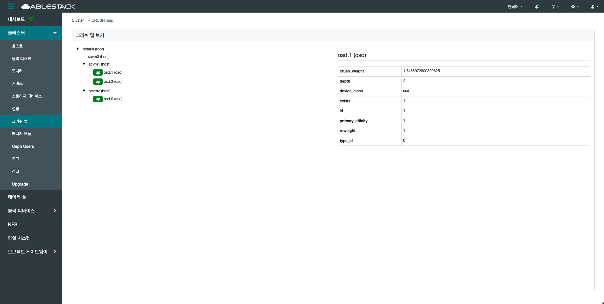

# 크러쉬 맵
## 개요
클러스터의 데이터가 어떻게 저장되고 복제될지를 정의하는 핵심 알고리즘 기반의 맵입니다.
전통적인 중앙 디렉터리 방식과 달리, CRUSH는 분산 방식으로 클라이언트가 직접 데이터를 어디에 저장할지 계산하게 해줍니다.

CRUSH 알고리즘은 데이터 저장 및 검색 방법을 결정하기 위해 저장 위치를 계산합니다. CRUSH를 통해 클라이언트는 중앙 서버나 브로커를 거치지 않고, OSD와 직접 통신할 수 있습니다.
알고리즘에 따라 결정되는 데이터 저장 및 검색 방식을 사용함으로써 단일 장애 지점, 성능 병목 현상, 그리고 확장성의 물리적 한계를 방지합니다.

CRUSH MAP을 사용하여 데이터를 OSD에 매핑하고, 구성된 복제 정책 및 장애 도메인에 따라 클러스터 전체에 데이터를 분산합니다.
OSD 목록과 버킷 계층 구조, 랙 그리고 CRUSH가 클러스터 풀 내에서 데이터를 복제하는 방식을 제어하는 규칙이 포함됩니다.
설치 환경의 기본 물리적 구성을 반영하여 상관 관계가 있는 장치 장애 발생 가능성을 모델링하고 이를 통해 해결할 수 있습니다.
CRUSH 계층 구조와 관련된 몇 가지 요소로는 섀시, 랙, 물리적 근접성, 공유 전원, 공유 네트워킹, 장애 도메인 등이 있습니다.
이러한 정보를 CRUSH 맵에 인코딩함으로써 CRUSH 배치 정책은 원하는 분포를 유지하면서 장애 도메인 전반에 객체 복제본을 분산합니다.
예를 들어, 동시 장애 발생 가능성을 해결하기 위해 데이터 복제본이 서로 다른 셸프, 랙, 전원 공급 장치, 컨트롤러 또는 물리적 위치에 상주하거나 이를 사용하는 장치에 있는지 확인하는 것이 바람직할 수 있습니다.

OSD가 배포되면 OSD가 실행되는 노드의 이름이 지정된 버킷 아래 CRUSH 맵에 자동으로 추가됩니다.
이러한 동작은 구성된 CRUSH 장애 도메인과 결합하여 복제본 또는 삭제 코드 샤드가 여러 호스트에 분산되고 단일 호스트 장애나 기타 장애가 가용성에 영향을 미치지 않도록 보장합니다.

## 크러쉬 맵 조회(CRUSH map)
1. 클러스터의 데이터 배치 정책을 구조적으로 표현한 정보를 제공합니다. OSD들이 어떻게 계층화되어 있는지를 보여주며, root, rack, host, osd와 같은 계층 정보를 포함합니다. 사용자는 이를 통해 데이터가 어떤 기준으로 분산 저장되는지를 시각적으로 확인할 수 있으며, 장애 발생 시 어떤 노드 또는 디바이스에 영향을 주는지도 예측할 수 있습니다.
    { .imgCenter .imgBorder }
    - root, host, osd 등 클릭하여 크러쉬 설정 값을 확인할 수 있습니다.
