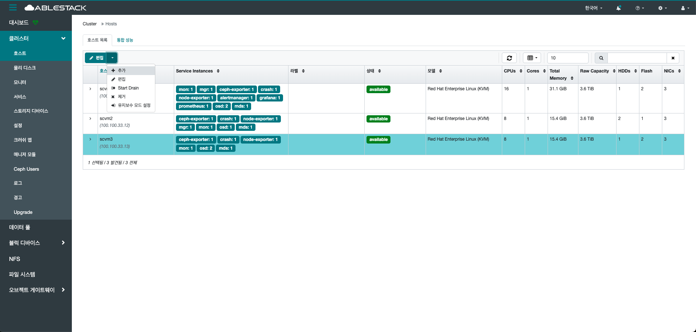

# 호스트

## 개요
호스트는 Glue 클러스터를 구성하는 물리적 또는 가상 서버를 의미합니다.
클러스터 내에서 중요한 역할을 수행하는 기본 구성 단위입니다.

각 호스트는 여러 서비스 데몬(OSD,MON,MGR 등)을 실행하여 데이터 저장, 복제, 모니터링 및 관리 기능을 담당합니다.
이러한 호스트들의 협력으로 데이터 무결성과 고가용성이 유지되며, 클러스터의 성능과 확장성이 결정됩니다.

즉, 호스트는 Glue 클러스터의 안정적인 운여과 효율적인 데이터 관리를 위해 필수적인 요소입니다.
호스트의 상태와 수량은 클러스터의 용량과 처리 능력에 직접적인 영항을 미치므로, 적잘한 관리와 모니터링이 필요합니다.

따라서 Glue 환경에서는 호스트를 체계적으로 관리하여 장애를 최소화하고 최적의 성능을 유지하는 것이 중요합니다.

## 호스트 목록(Hosts)
1. Cube 대시보드에서 스토리지센터 구성하기 기능을 통해 클러스터에 등록된 호스트들을 확인할 수 있습니다. 호스트 이름, 상태, 모델, CPU, Memory 등을 확인 하실 수 있습니다.
    { .imgCenter .imgBorder }

## 장치 탭(Devices)
1. 호스트 이름 옆의 화살표를 클릭하면, 해당 호스트에 연결된 물리 디스크의 장치 정보를 확인할 수 있으며, 장치 ID, 상태, 장치 이름, 그리고 연결된 데몬 정보까지 확인 가능합니다.
    { .imgCenter .imgBorder }

## 물리 디스크 탭(Physical Disks)
1. 호스트 이름 옆의 화살표를 클릭하면, 해당 호스트에 연결된 물리 디스크의 장치 정보를 확인할 수 있으며, 장치 경로, 형태, 모델, 크기 등 확인 가능합니다.
    { .imgCenter .imgBorder }
    - **식별자** 버튼을 클릭하면, 해당 서버에 연결된 물리 디스크의 물리적 위치를 쉽게 확인할 수 있습니다.

## 데몬 탭(Daemons)
1. 호스트 이름 옆의 화살표를 클릭하면, 해당 호스트에서 실행 중인 데몬 이름, 버전, 상태 등 확인 가능합니다.
    { .imgCenter .imgBorder }
    - 각 서비스마다 **Start** , **Stop** , **ReStart** , **Redeploy(재구성)** 동작을 실행할 수 있습니다.

## 성능 세부정보 탭(Performance Details)
1. 호스트 이름 옆의 화살표를 클릭하면, 해당 호스트에 대한 성능 세부정보를 확인 가능합니다.
    { .imgCenter .imgBorder }
    - 시간을 선택하여 해당 호스트에 대한 전반적인 디스크, 네트워크, CPU, Memory 등 구체적인 성능 세부정보를 확인할 수 있습니다.

## 장치 상태 탭(Device health)
1. 호스트 이름 옆의 화살표를 클릭하면, 해당 호스트의 물리 디스크 장치에 대한 이름, 프로토콜, 버전 등 확인 가능합니다.
    { .imgCenter .imgBorder }

## 추가(Add)
1. 호스트 이름 상단의 **추가** 를 클릭합니다.
    { .imgCenter .imgBorder }
2. 추가를 클릭한 화면입니다.
    { .imgCenter .imgBorder }
    - 추가될 호스트의 **이름** 과 **IP** 를 입력합니다.
    - **추가 호스트** 를 클릭합니다.

## 편집(Edit)
1. 호스트 이름 상단의 **편집** 을 클릭합니다.
    { .imgCenter .imgBorder }
    - 편집할 호스트를 선택하세요.
2. 추가를 클릭한 화면입니다.
    { .imgCenter .imgBorder }
    - 해당 호스트에 대한 구분 지을 **라벨** 을 입력합니다.
    - **호스트 편집** 을 클릭합니다.

## Start Drain

!!! info
    Start Drain 기능은 해당 호스트에서 실행 중인 OSD나 MON 등의 데몬들을 안전하게 다른 노드로 이동 시키기 위한 사전 작업 수행 기능입니다. 주로 유지보수나 노드 교체, 재부팅 등의 작업 전에 사용됩니다.

1. 호스트 이름 상단의 **Start Drain** 을 클릭합니다.
    { .imgCenter .imgBorder }
    - Start Drain 기능을 실행할 호스트를 선택하세요.

    !!! info
        Stop Drain 기능은 다시 서비스를 되돌리는 기능입니다.

## 제거(Remove)
1. 호스트 이름 상단의 **삭제** 를 클릭합니다.
    { .imgCenter .imgBorder }
    - 제거할 호스트를 선택하세요.
2. 삭제를 클릭한 화면입니다.
    { .imgCenter .imgBorder }
    - 삭제 대상 호스트를 다시 한번 확인하신 후, **예,확실합니다.** 버튼을 클릭하여 삭제를 진행해 주세요.
    - **Remove Host** 를 클릭합니다.

## 유지보수 모드 설정(Enter Maintenance)
!!! warning
    유지보수 모드 설정은 클릭 즉시 적용됩니다.

    설정 이후 클러스터 자원의 동작 방식에 영향을 줄 수 있으므로, 적용 전 클러스터 및 호스트 자원 상태를 충분히 확인하신 후 진행해 주시기 바랍니다.

1. 호스트 이름 상단의 **유지보수 모드 설정** 을 클릭합니다.
    { .imgCenter .imgBorder }
    - 유지보수 모드 설정할 호스트를 선택하세요.

    !!! info
        유지보수 모드 해제는 해당 설정되어 있는 호스트를 클릭하셔서 해제 하시면 됩니다.

## 통합 성능(Overall Performance)
1. 시간 변화에 따라 클러스터에 포함된 호스트들 및 클러스터에 대한 통합 성능 지표를 확인 할 수 있습니다.
    { .imgCenter .imgBorder }
    