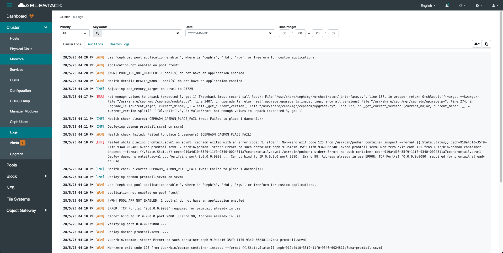
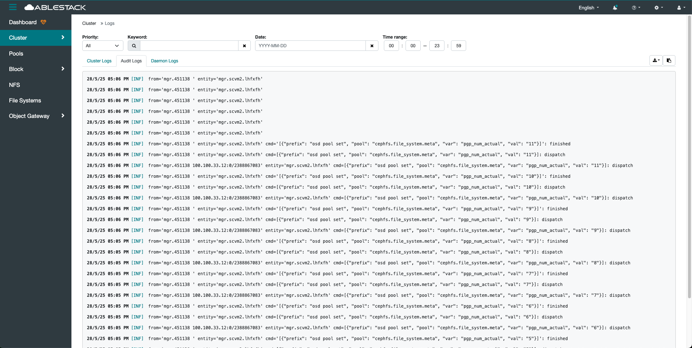
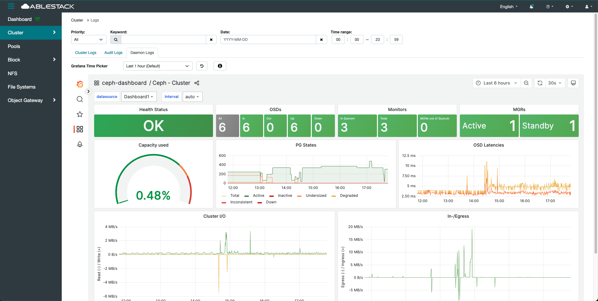
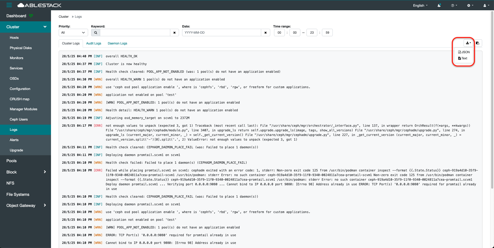
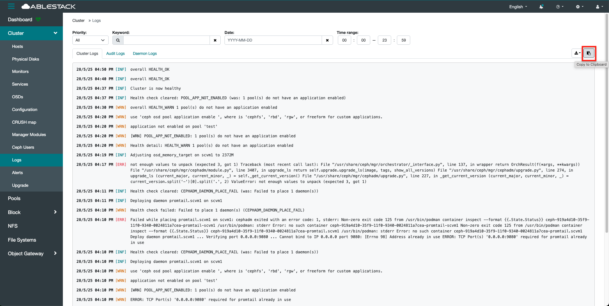

# 로그
## 개요
클러스터 전반의 로그 정보를 실시간으로 수집하고 모니터링하는 기능을 제공합니다.
이 메뉴를 통해 MON, MGR, OSD, MDS, RGW 등 다양한 데몬의 로그 메시지를 통합적으로 확인할 수 있습니다.
일반적으로 로그 수집은 Loki, Fluentd 또는 journald와 같은 로그 백엔드와 연동되며, 구조화된 메타데이터와 함께 저장됩니다.
이를 통해 장애 분석, 이벤트 추적, 성능 이슈 진단 등을 보다 정확하게 수행할 수 있습니다.

로그는 시간, 데몬 종류, 심각도 등의 조건으로 필터링이 가능하여 가시성을 높입니다.
각 데몬은 systemd를 통해 로그를 기록하며, 로그는 journald 또는 로그 수집 에이전트를 통해 외부 저장소로 전달됩니다.

사용자는 UI 상에서 특정 키워드나 시간 조건으로 검색할 수 있으며, 필요한 경우 내보내기도 지원됩니다.

로그는 클러스터 유지보수와 장애 대응에서 필수적인 자료이며, 실시간 모니터링과 연계해 경보 설정도 가능합니다.
또한 Dashboard 또는 외부 로그 뷰어(Grafana, Loki 등)과 통합하여 사용할 수도 있습니다.

!!! info
    현재 로그 조회 기능은 한국어를 지원하지 않습니다.

    로그를 조회하시려면 언어를 English(영어) 로 변경해주시기 바랍니다.

## 클러스터 로그 조회(Cluster Logs)
1. 클러스터의 다양한 로그 데이터를 실시간으로 조회할 수 있습니다. 단, 현재는 영어(English) 언어 환경에서만 로그 내용이 정상적으로 표시됩니다.
    { .imgCenter .imgBorder }
    - **Priority** 로 로그 레벨을 설정하여 로그 조회를 할 수 있습니다.
    - **Keyword** 로 특정 키워드를 검색하여 로그 조회를 할 수 있습니다.
    - **Date** 로 특정 날짜 및 기간을 설정하여 로그 조회를 할 수 있습니다.
    - **Time range** 로 특정 시간을 설정하여 로그 조회를 할 수 있습니다.

## 감사 로그 조회(Audit Logs)
1. 시스템 내에서 발생한 주요 이벤트 및 사용자 활동 내역을 기록한 로그입니다. 보안, 변경 이력 추적, 문제 진단 등 다양한 목적에 활용되며, 관리자는 이를 통해 시스템 운영의 투명성과 신뢰성을 확보할 수 있습니다.
    { .imgCenter .imgBorder }
    - **Priority** 로 로그 레벨을 설정하여 로그 조회를 할 수 있습니다.
    - **Keyword** 로 특정 키워드를 검색하여 로그 조회를 할 수 있습니다.
    - **Date** 로 특정 날짜 및 기간을 설정하여 로그 조회를 할 수 있습니다.
    - **Time range** 로 특정 시간을 설정하여 로그 조회를 할 수 있습니다.

## 데몬 로그 조회(Daemon Logs)
!!! check
    해당 데몬 로그를 조회하기 위해서는 Loki 서비스와 Promtail 서비스가 사전에 생성 및 실행되어 있어야 합니다.

    이 두 서비스는 로그 수집 및 시각화를 위한 필수 구성 요소이며, 설정이 완료되지 않으면 로그 데이터가 수집되지 않아 조회가 불가능합니다.

1. 클러스터를 구성하는 각 데몬(MON, OSD, MGR 등)의 동작 상태와 내부 이벤트를 확인할 수 있는 기능입니다. 문제 발생 시 원인 분석이나 상태 점검에 활용되며, 실시간 또는 특정 시간대의 로그를 통해 클러스터의 안정성을 진단할 수 있습니다.
    { .imgCenter .imgBorder }
    - **Interval** 를 사용하여 자동으로 새로고침 설정하여 반복적으로 새로운 데몬 로그 조회를 할 수 있습니다.
    - 특정 시간 및 날짜를 선택하여 데몬 로그 조회를 할 수 있습니다.

## 로그 내보내기(Download)
1. 로그 데이터를 **JSON** 또는 **Text** 로 내보내는 기능을 제공합니다.
    { .imgCenter .imgBorder }
    - 클릭 시, 해당 파일이 로컬 환경에 자동으로 다운로드 됩니다.

## 로그 복사(Copy To Clipboard)
1. 로그 데이터를 복사할 수 있는 기능을 제공합니다.
    { .imgCenter .imgBorder }
