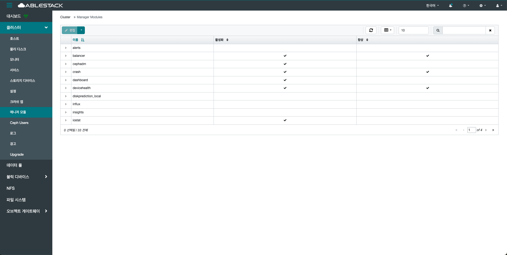
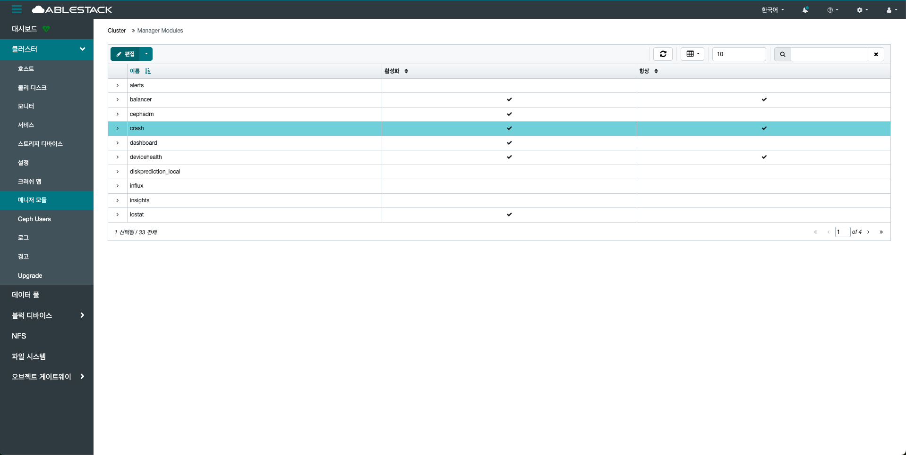
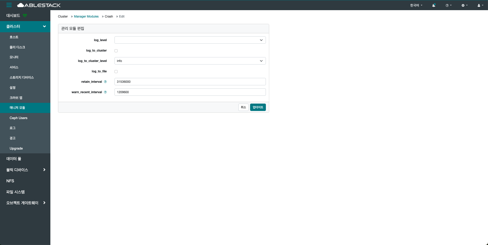
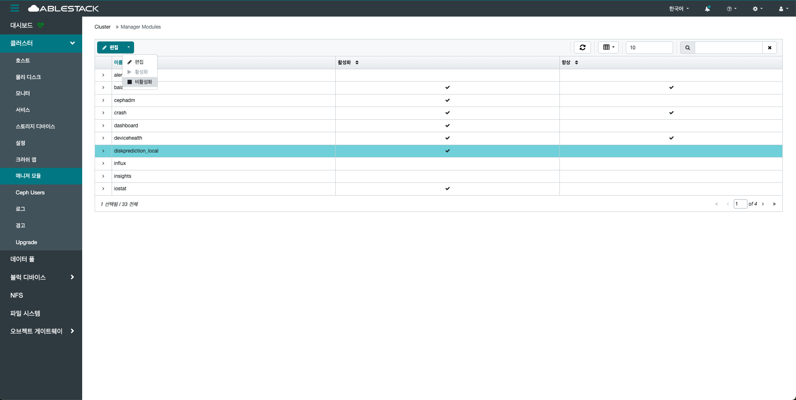
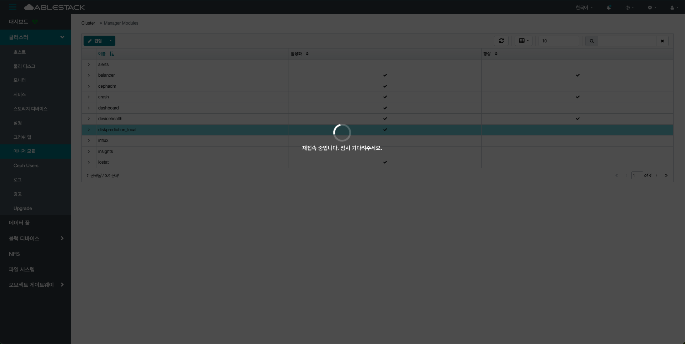

# 매니저 모듈
## 개요
클러스터의 모니터링, 통계 수집, 대시보드, 경고, 외부 시스템 연동 등을 제공하는 확장 가능한 모듈입니다.

MGR데몬은 MON과 OSD 사이의 상태 정보를 종합해 실시간 상태를 판단하고, 각종 모듈들을 실행하는 역할을 합니다.
대표적인 모듈로는 Dashboard, Prometheus, RestFul, Iostat, Zabbix, DeviceHealth 등이 있습니다.
이러한 모듈은 필요에 따라 활성화 또는 비활성화할 수 있으며, 하나의 활성 모듈(Active MGR)과 하나의 대기 모듈(Standby MGR)이 클러스터에 존재합니다.

사용자는 대시보드 및 CLI로 모듈을 쉽게 활성화할 수 있습니다.

클러스터의 운영 편의성과 가시성 향상을 위한 필수 구성 요소입니다.

## 매니저 모듈 조회(Manager Modules)
1. 클러스터에 등록된 매니저 모듈 목록을 확인할 수 있습니다. 활성화된 모듈과 비활성화된 모듈을 한눈에 확인할 수 있으며, 이를 통해 현재 어떤 기능이 클러스터에서 사용 중인지, 또는 추가로 활성화가 필요한 기능이 무엇인지 판단할 수 있습니다. 해당 페이지는 단순 조회 기능만 제공하며, 삭제는 지원하지 않습니다.
    { .imgCenter .imgBorder }
    - 필터링을 통해 검색 및 수량을 통해 조회도 가능합니다.

## 편집(Edit)
1. 사용자는 이 페이지에서 원하는 모듈을 선택하여 상태를 변경할 수 있으며, 클러스터의 목적에 맞게 모듈 구성을 최적화할 수 있습니다. 이름 상단의 편집 버튼을 클릭합니다.
    { .imgCenter .imgBorder }
    - 설정을 변경할 모듈을 선택합니다.
2. 편집 버튼을 클릭한 화면입니다.
    { .imgCenter .imgBorder }
    - 변경할 설정값을 입력하세요.
    - **업데이트** 버튼을 클릭합니다.
    !!! info
        각 모듈마다 설정값들은 상이합니다.

## 활성화(Enable)
!!! info
    모듈을 활성화하면 실시간으로 관련 기능이 클러스터에 적용됩니다.

!!! warning
    해당 버튼을 클릭할 경우, 별도의 확인 절차 없이 즉시 적용되므로 주의하시기 바랍니다.

    버튼 클릭과 동시에 설정이 클러스터에 바로 반영되며, 취소나 되돌리기가 불가능할 수 있습니다.

    따라서 변경 전 충분한 검토 후 진행하시길 권장합니다.

1. 선택한 모듈을 즉시 클러스터에 적용하며, 해당 기능이 활성화됩니다. 이름 상단의 활성화 버튼을 클릭합니다.
    { .imgCenter .imgBorder }
    - 활성화할 모듈을 선택합니다.
2. 활성화 버튼을 클릭한 화면입니다.
    { .imgCenter .imgBorder }

## 비활성화(Disable)
!!! danger
    비활성화 시 해당 기능을 즉시 중단됩니다.

    일부 모듈은 클러스터의 동작에 필수적이거나 외부 서비스와 연동되므로, 비활성화 전 반드시 영향도를 검토하시길 바랍니다.

!!! warning
    해당 버튼을 클릭할 경우, 별도의 확인 절차 없이 즉시 적용되므로 주의하시기 바랍니다.

    버튼 클릭과 동시에 설정이 클러스터에 바로 반영되며, 취소나 되돌리기가 불가능할 수 있습니다.

    따라서 변경 전 충분한 검토 후 진행하시길 권장합니다.

1. 선택한 모듈의 기능을 즉시 중지시키며, 클러스터에서 더 이상 해당 기능을 사용하지 않습니다. 이름 상단의 비활성화 버튼을 클릭합니다.
    { .imgCenter .imgBorder }
    - 비활성화할 모듈을 선택합니다.
2. 비활성화 버튼을 클릭한 화면입니다.
    { .imgCenter .imgBorder }