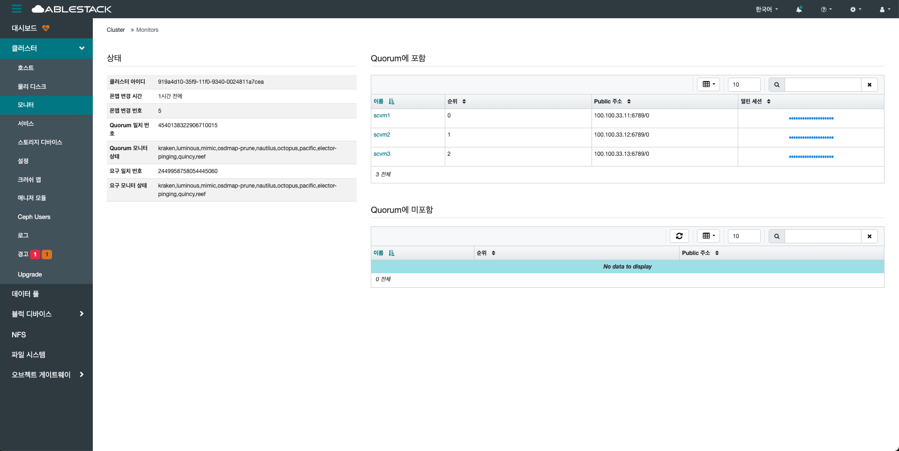

# 모니터

## 개요
Glue 클러스터의 핵심 구성 요소로, 클러스터 상태를 관리하고 전체 맵 정보를 유지하는 역할을 합니다.

클러스터 내의 각 구성 요소들 (OSD, MDS, MGR 등)의 상태와 변경 사항을 기록하고 공유합니다.
일반적으로 클러스터의 안정성과 일관성을 유지하기 위해 홀수 개의 MON 구성을 권장합니다.

본 페이지에서는 각 MON의 이름, IP 주소, 상태, 리더 여부 등을 확인할 수 있으며, 클러스터 전반의 정상 동작 여부를 판단하는데 활용됩니다.
MON이 불안정할 경우 클러스터 전체가 영향을 받을 수 있으므로, 지속적인 모니터링이 필요합니다.

## 모니터 조회(Monitors)
1. 모니터에 대한 상태 및 우선 순위, 해당 서비스가 활성화가 되어 있는 호스트를 확인할 수 있습니다.
    { .imgCenter .imgBorder }
