# 스토리지 디바이스
## 개요
OSD(Object Storage Daemon)는 실제 데이터를 저장하고, 데이터를 복제 및 복구하며, 클러스터 내 데이터를 균형 있게 분산시키는 핵심 구성 요소입니다.
각 OSD는 하나의 물리 또는 가상 디스크에 연결되며, 일반적으로 클러스터에서 수십 개에서 수천 개의 OSD가 함께 동작합니다.

OSD는 데이터를 RADOS 객체로 저장하고, PG(Placement Group)를 기반으로 데이터를 관리합니다.
클러스터 내 장애 조치, 복제, 리밸런싱 등 다양한 작업을 OSD 간 통신을 통해 자율적으로 처리합니다.

OSD는 CRUSH 맵을 통해 데이터의 위치ㅏ를 결정하며, 이를 기반으로 고가용성과 확장성을 보장합니다.
각 OSD는 상태(Up/Down, In/Out)로 관리되며, 클러스터의 안정성 및 성능을 위해 주기적인 상태 점검이 필요합니다.

OSD 장애 발생 시 자동으로 복구 절차가 진행되며, 관리자는 필요한 경우 OSD를 수동으로 재시작하거나 제거할 수 있습니다.

SSD, HDD 또는 NVMe 기반 디스크에서 동작할 수 있으며, 장비 특성에 따라 성능 최적화를 적용할 수 있습니다.
클러스터의 저장 성능과 안정성은 OSD 수와 품질에 큰 영향을 받으며, 설계 시 충분한 리소스 확보가 중요합니다.

## 스토리지 디바이스 목록 조회(OSDs List)
1. 클러스터에 연결된 모든 물리 디스크 정보를 나열한 화면입니다. 각 디바이스의 호스트, 상태, 장치 클래스 등 세부 정보를 기반으로 디스크 자원을 효율적으로 관리할 수 있습니다.
    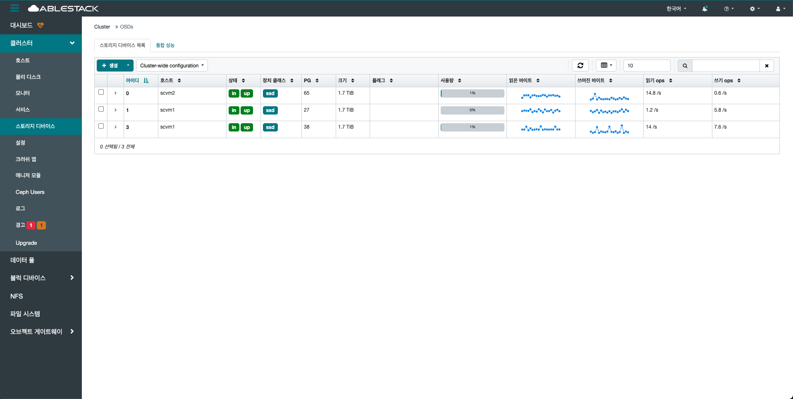{ .imgCenter .imgBorder }

## 장치 탭(Devices)
1. 아이디 옆 화살표를 클릭하면, 해당 OSD의 장치 아이디, 장치 이름, 데몬 등을 확인할 수 있습니다.
    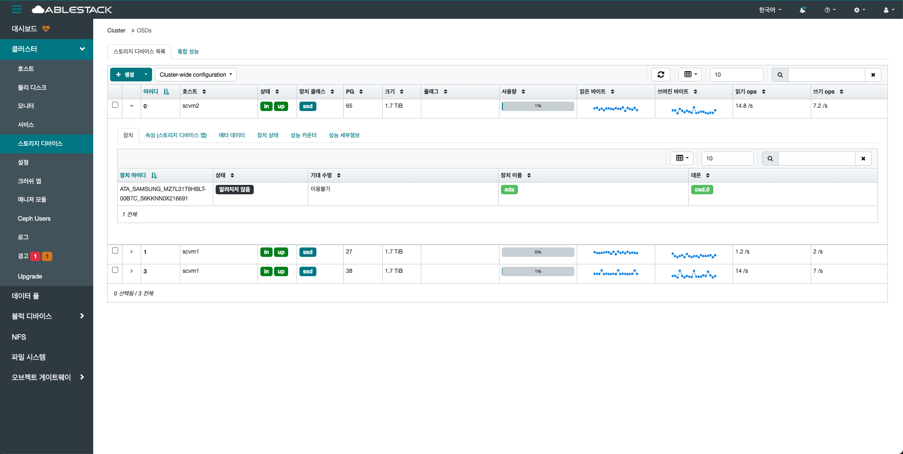{ .imgCenter .imgBorder }

## 속성(스토리지 디바이스 맵) 탭 (Attributes(OSD map))
1. 아이디 옆 화살표를 클릭하면, 해당 OSD의 속성을 확인할 수 있습니다.
    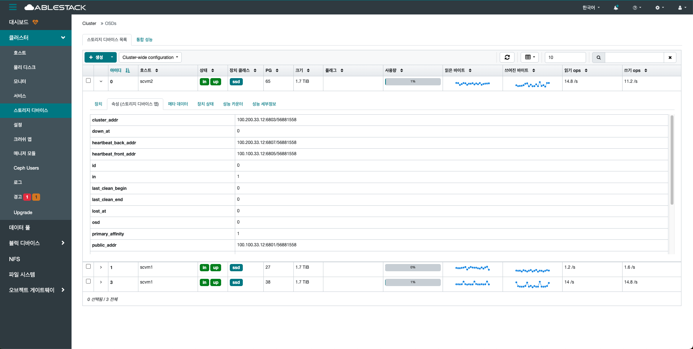{ .imgCenter .imgBorder }

## 메타 데이터 탭(Metadata)
1. 아이디 옆 화살표를 클릭하면, 해당 OSD의 메타 데이터에 대한 세부 설정 값을 확인할 수 있습니다.
    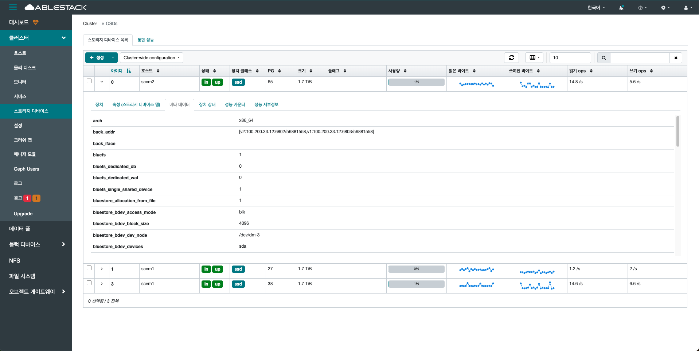{ .imgCenter .imgBorder }

## 장치 상태 탭(Device health)
1. 아이디 옆 화살표를 클릭하면, 해당 OSD의 디스크 세부 정보를 확인할 수 있습니다.
    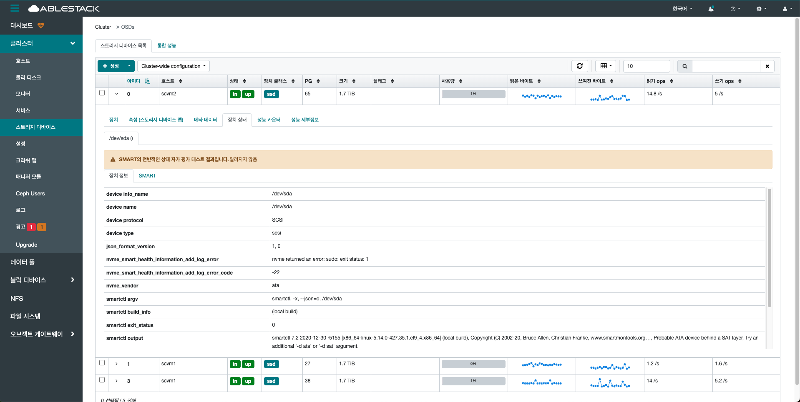{ .imgCenter .imgBorder }

## 성능 카운터 탭(Performance counter)
1. 아이디 옆 화살표를 클릭하면, 해당 OSD의 성능에 대한 세부 설정 값을 확인할 수 있습니다.
    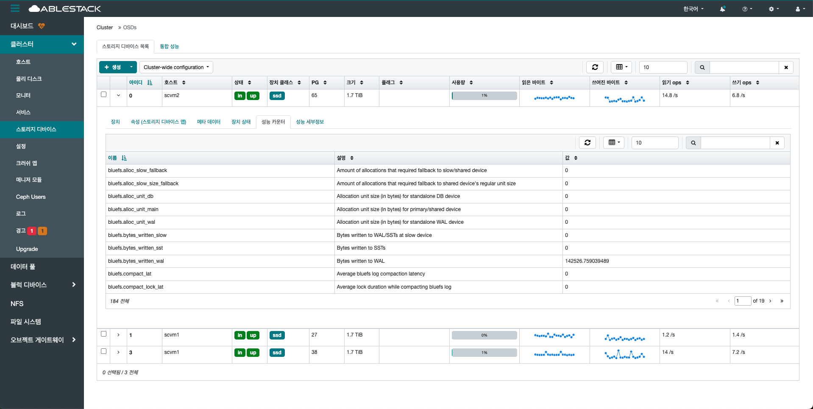{ .imgCenter .imgBorder }

## 성능 세부정보 탭(Performance Details)
1. 아이디 옆 화살표를 클릭하면, 해당 OSD의 자세한 성능 지표를 확인할 수 있습니다.
    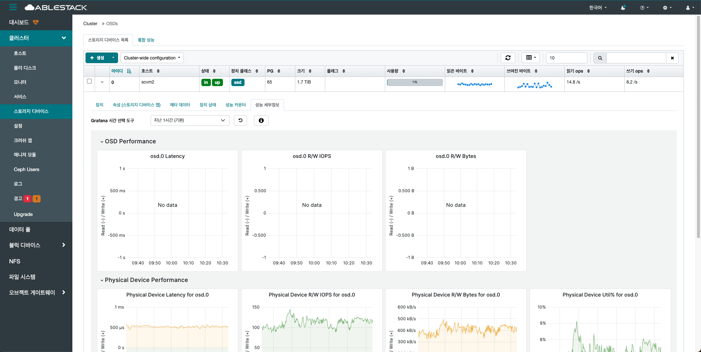{ .imgCenter .imgBorder }

## 생성(Create)
1. 아이디 상단 생성 버튼을 클릭합니다.
    { .imgCenter .imgBorder }
2. 생성 버튼을 클릭한 화면입니다.
    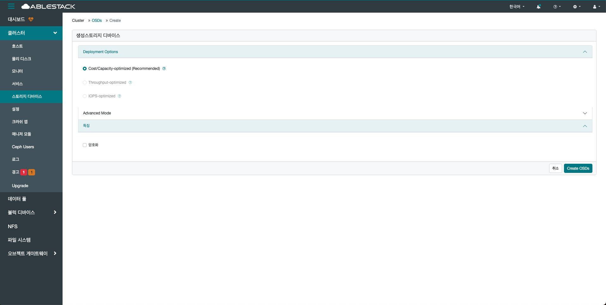{ .imgCenter .imgBorder }
    - **Deployment Options** 에서 **Cost/Capacity-optimized(Recommended)** 를 선택합니다.
    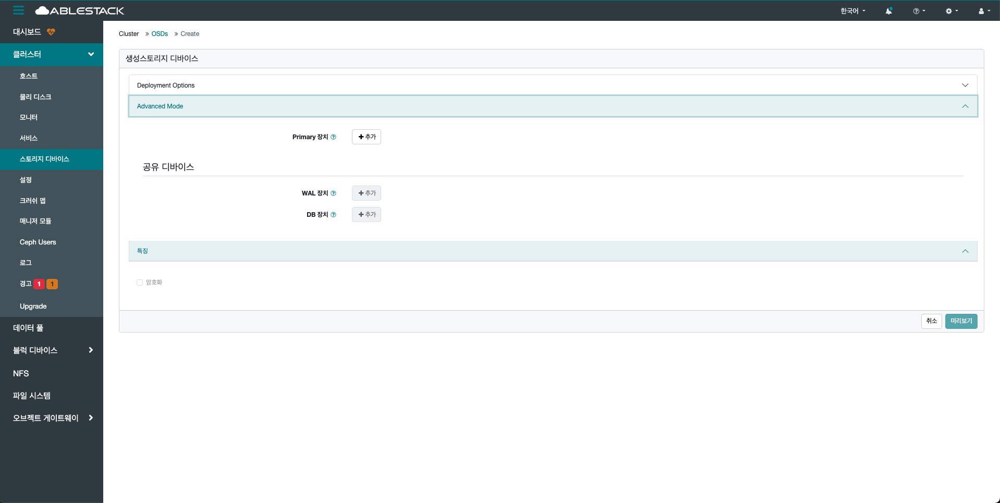{ .imgCenter .imgBorder }
    - **Advanced Mode** 에서 **Primary 장치** 의 **추가** 버튼을 클릭합니다.
    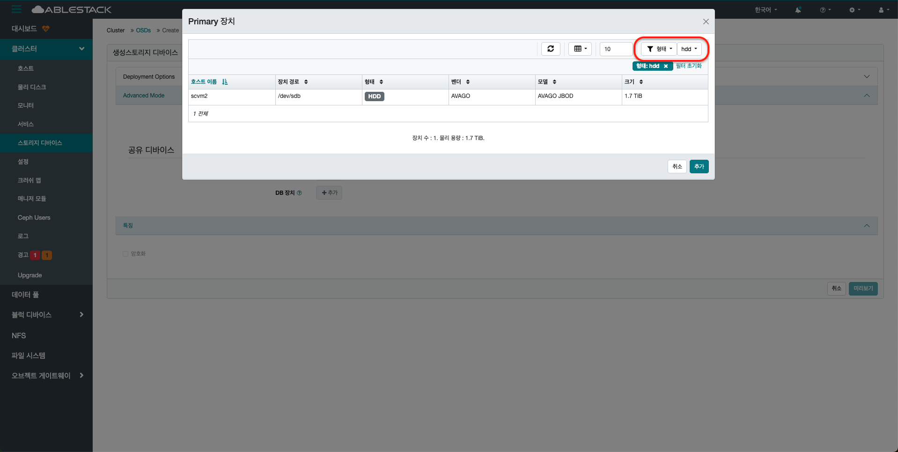{ .imgCenter .imgBorder }
    - 오른쪽 상단의 필터링 옵션에서 **형태** 를 선택한 후, 사용자의 환경에 맞게 **SSD** 또는 **HDD** 중 하나를 선택합니다.
    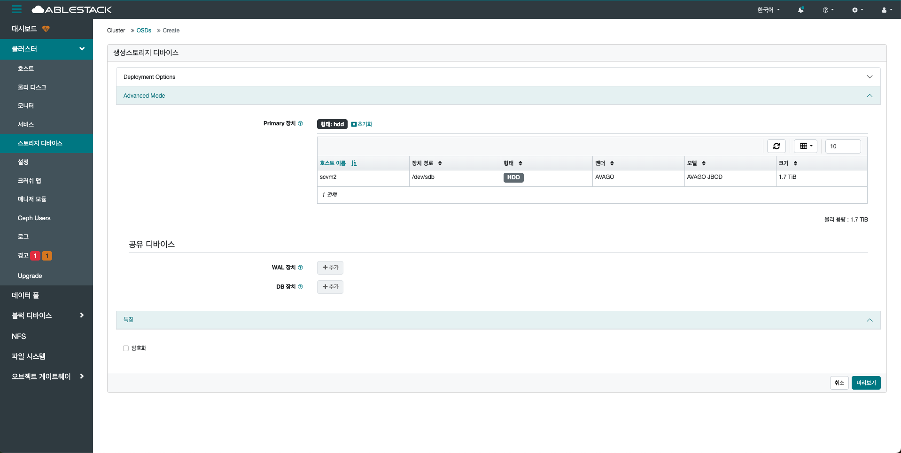{ .imgCenter .imgBorder }
    - 선택한 디스크 위치 및 유형이 올바른지 확인한 후, **미리보기** 버튼을 클릭하여 OSD 구성을 진행합니다.
    !!! info
        만약 SSD와 HDD 유형의 디스크가 혼합되어 있다면, 먼저 SSD 디스크를 추가한 후, 다시 생성 버튼을 클릭하여 HDD 디스크를 추가하시기 바랍니다.

## 편집(Edit)
1. 편집이 필요한 OSD를 선택한 후, 상단의 편집 버튼을 클릭합니다.
    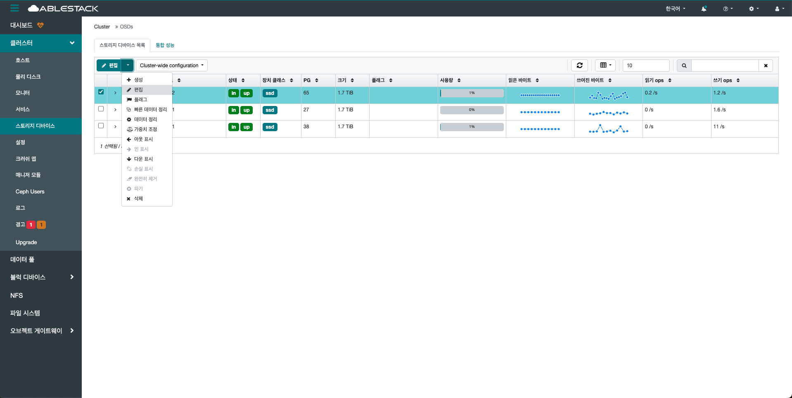{ .imgCenter .imgBorder }
    - 편집할 OSD를 선택하세요.
2. 편집 버튼을 클릭한 화면입니다.
    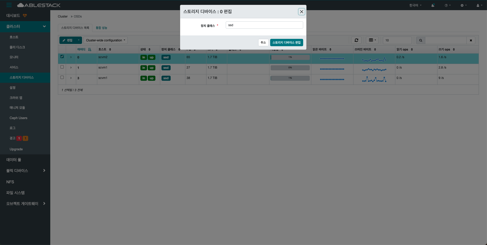{ .imgCenter .imgBorder }
    - 구분 지을 **장치 클래스** 를 수정합니다.

## 플래그(Flags)
!!! info
    플래그는 일반적으로 특정 동작을 제어하거나 제한하기 위한 OSD 상태 제어 플래그 입니다.

    특정 상황에서 OSD의 읽기/쓰기, backfill, 리밸런싱 등의 동작을 제한하거나 강제하기 위해 사용됩니다.

1. 플래그가 필요한 OSD를 선택한 후, 상단의 플래그 버튼을 클릭합니다.
    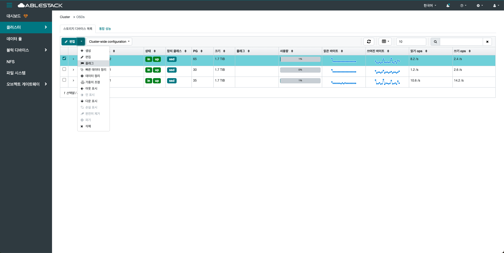{ .imgCenter .imgBorder }
    - 플래그를 설정할 OSD를 선택하세요.
2. 플래그 버튼을 클릭한 화면입니다.
    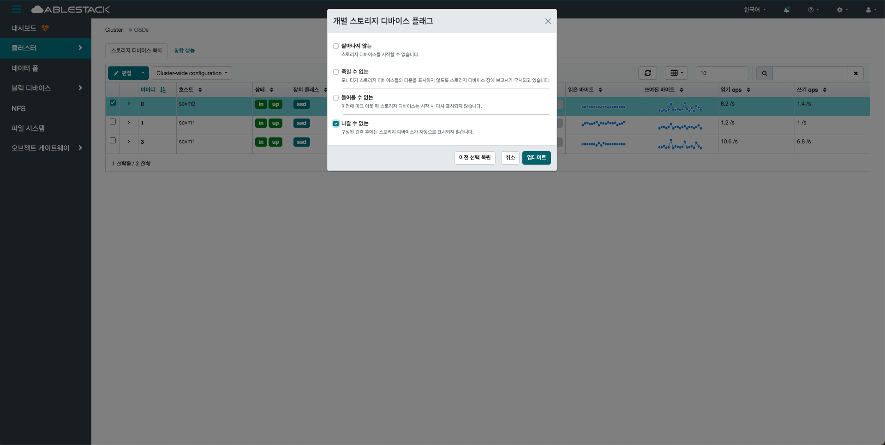{ .imgCenter .imgBorder }
    - 상황에 맞는 플래그를 선택합니다.
    - **업데이트** 버튼을 클릭합니다.

## 빠른 데이터 정리(Scrub)
!!! info
    빠른 데이터 정리는 디스크의 메타데이터 영역이나 파일 시스템 정보만 삭제합니다.

    데이터 전체를 덮어쓰지는 않고, 디스크를 다시 사용할 수 있게 최소한의 정리만 수행하여, 속도가 빠르지만, 실제 데이터는 남아 있을 수 있습니다.

1. 빠른 데이터 정리가 필요한 OSD를 선택한 후, 상단의 빠른 데이터 정리 버튼을 클릭합니다.
    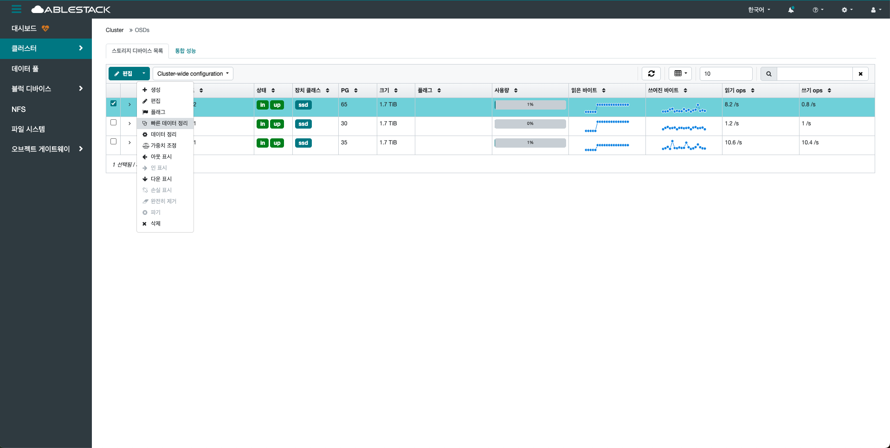{ .imgCenter .imgBorder }
    - 빠른 데이터 정리를 설정할 OSD를 선택하세요.
2. 빠른 데이터 정리 버튼을 클릭한 화면입니다.
    { .imgCenter .imgBorder }
    - 빠른 데이터 정리를 실행할 디스크를 한번 더 확인하신 후, **업데이트** 버튼을 클릭합니다.

## 데이터 정리(Deep Scrub)
!!! info
    데이터 정리는 디스크의 전체 영역을 0 또는 무작위 값으로 덮어쓰기하여 모든 데이터를 물리적으로 제거합니다.

    시간이 오래 걸리지만, 보안이나 재사용 시 완전한 초기화가 필요할 때 사용되며, 데이터 복구는 불가능합니다.

!!! danger
    데이터 정리 기능을 사용할 경우, 디스크의 모든 데이터가 완전히 삭제되며 복구가 불가능합니다. 이 작업은 되돌릴 수 없으므로, 반드시 필요한 경우에만 실행하시기 바랍니다.

1. 데이터 정리가 필요한 OSD를 선택한 후, 상단의 데이터 정리 버튼을 클릭합니다.
    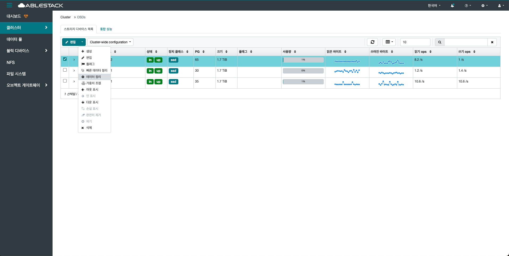{ .imgCenter .imgBorder }
    - 데이터 정리를 설정할 OSD를 선택하세요.
2. 데이터 정리 버튼을 클릭한 화면입니다.
    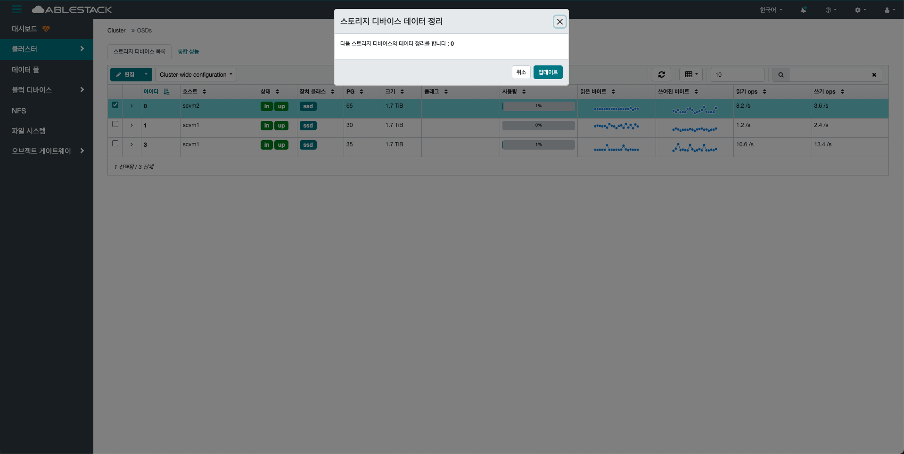{ .imgCenter .imgBorder }
    - 데이터 정리를 실행할 디스크를 한번 더 확인하신 후, **업데이트** 버튼을 클릭합니다.

## 가중치 조정(Reweight)
!!! info
    가중치 조정은 OSD가 저장 데이터 분배에 미치는 영향력을 조절하는 기능입니다.

    즉, 특정 OSD가 데이터 저장 시 얼마나 많이 또는 적게 데이터를 저장할지를 결정할 수 있습니다. 범위는 **0.0 ~ 1.0** 입니다.

1. 가중치 조정이 필요한 OSD를 선택한 후, 상단의 가중치 버튼을 클릭합니다.
    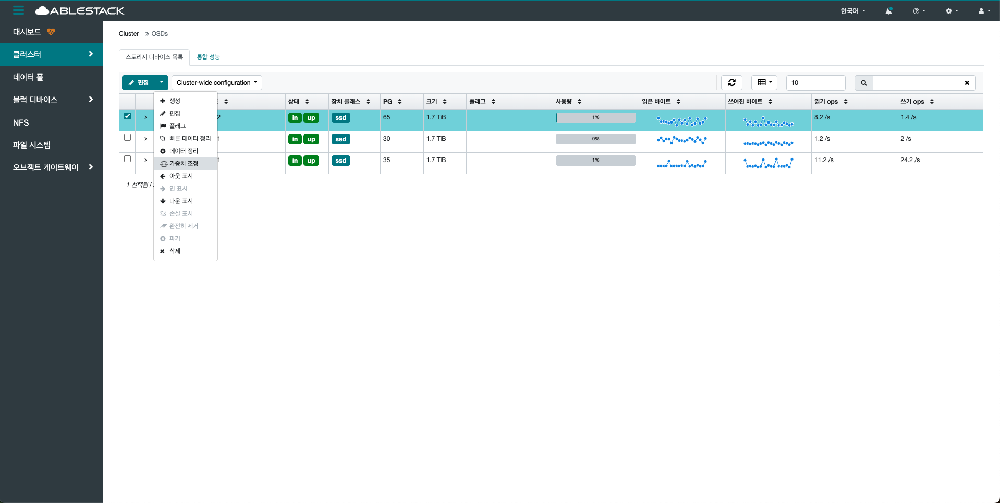{ .imgCenter .imgBorder }
    - 가중치 조정을 설정할 OSD를 선택하세요.
2. 가중치 조정 버튼을 클릭한 화면입니다.
    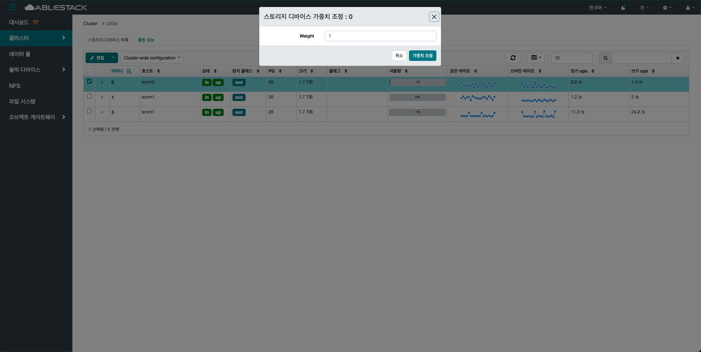{ .imgCenter .imgBorder }
    - 가중치 조정을 위해 0.0부터 1.0까지의 숫자를 입력합니다.

## 아웃 표시(Mark Out)
!!! info
    OSD를 클러스터에서 데이터 재분배 대상으로 지정합니다.

    데이터를 다른 OSD로 옮기기 시작하며, 더 이상 새로운 데이터를 받지 않습니다.

1. 아웃 표시가 필요한 OSD를 선택한 후, 상단의 아웃 표시 버튼을 클릭합니다.
    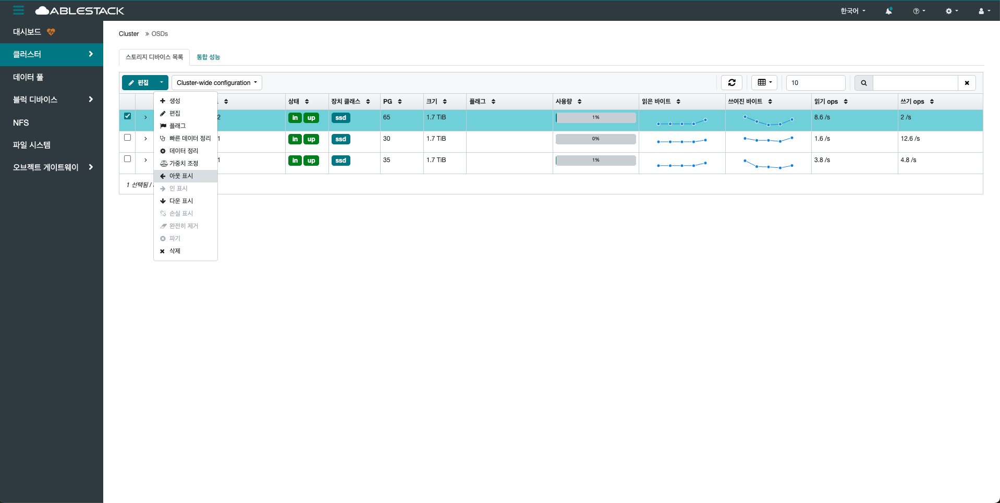{ .imgCenter .imgBorder }
    - 아웃 표시를 설정할 OSD를 선택하세요.
2. 아웃 표시 버튼을 클릭한 화면입니다.
    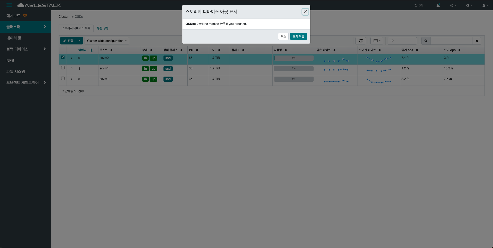{ .imgCenter .imgBorder }
    - 아웃 표시를 실행할 디스크를 한번 더 확인하신 후, **표시 아웃** 버튼을 클릭합니다.

## 인 표시(Mark In)
!!! info
    아웃(Mark Out) 표시 처리된 OSD를 다시 클러스터에 활성화하여 참여시키는 기능입니다.

    이 작업을 수행하면 해당 OSD는 다시 데이터 배치 대상이 되며, 클러스터의 정상 구성원으로 복귀하게 됩니다.

    인(Mark In) 표시 버튼은 OSD가 아웃(Mark Out) 상태일 때만 활성화됩니다.

1. 인 표시가 필요한 OSD를 선택한 후, 상단의 인 표시 버튼을 클릭합니다.
    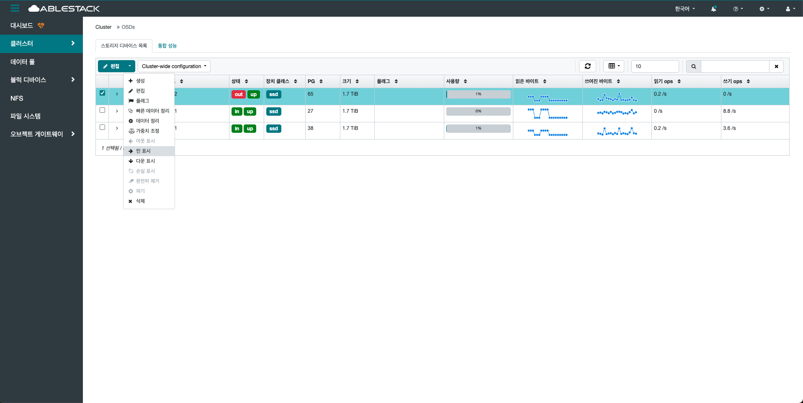{ .imgCenter .imgBorder }
    - 인 표시를 설정할 OSD를 선택하세요.
2. 인 표시 버튼을 클릭한 화면입니다.
    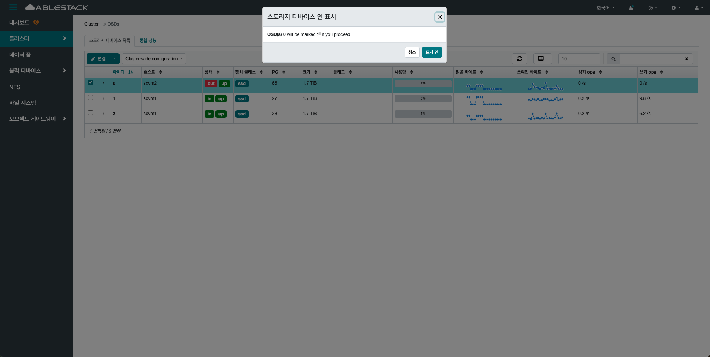{ .imgCenter .imgBorder }
    - 인 표시를 실행할 디스크를 한번 더 확인하신 후, **표시 인** 버튼을 클릭합니다.

## 다운 표시(Mark Down)
!!! info
    OSD가 응답하지 않거나 장애가 감지되었을 때 자동으로 상태를 Down으로 변경하지만, 관리자가 직접 특정 OSD를 비정상 상태로 전환하고자 할 때 사용합니다.

    디스크에서 이상 징후가 발견되었거나, 네트워크 문제로 연결이 불안정한 경우, 사전에 클러스터에서 해당 OSD를 제외하고 후속 조치를 취할 수 있도록 수동 Down 설정을 합니다.

    이 작업을 수행하면 클러스터는 해당 OSD를 더 이상 데이터 입출력에 사용하지 않으며, 필요한 경우 데이터 재배치 또는 복구 작업이 자동으로 진행됩니다.

1. 다운 표시가 필요한 OSD를 선택한 후, 상단의 다운 표시 버튼을 클릭합니다.
    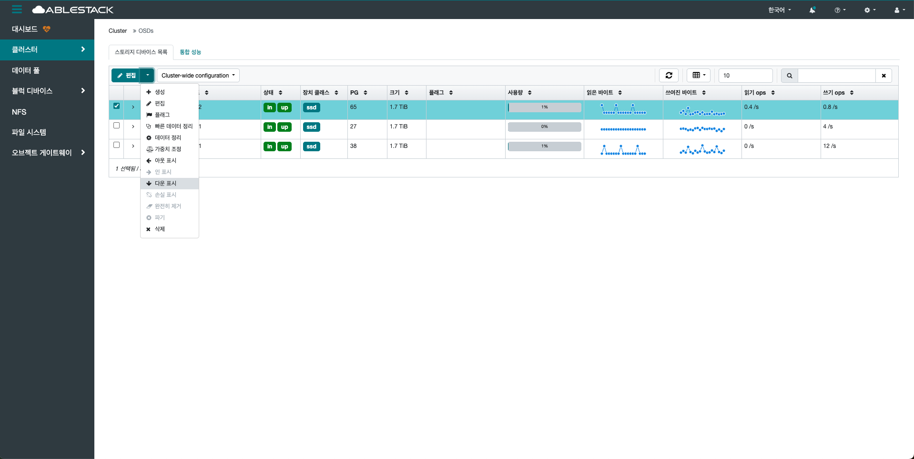{ .imgCenter .imgBorder }
    - 다운 표시를 설정할 OSD를 선택하세요.
2. 다운 표시 버튼을 클릭한 화면입니다.
    { .imgCenter .imgBorder }
    - 다운 표시를 실행할 디스크를 한번 더 확인하신 후, **표시 다운** 버튼을 클릭합니다.

## 손실 표시(Mark Lost)
!!! info
    복구가 불가능한 OSD로 간주하고, 해당 디스크의 데이터를 포기합니다.

    디스크가 완전히 손상되어 더 이상 복구할 수 없을 때 사용하며, 클러스터는 나머지 복제본을 기준으로 데이터를 다시 구성하려 시도합니다.

    손실(Mark Lost) 표시 버튼은 다운(Mark Down) 상태일 때만 활성화됩니다.

!!! danger
    이 작업은 데이터 손실을 감수하겠다는 의미이므로, 데이터가 일부 유실될 수 있습니다. 매우 신중하게 결정해야 합니다.

1. 손실 표시가 필요한 OSD를 선택한 후, 상단의 손실 표시 버튼을 클릭합니다.
    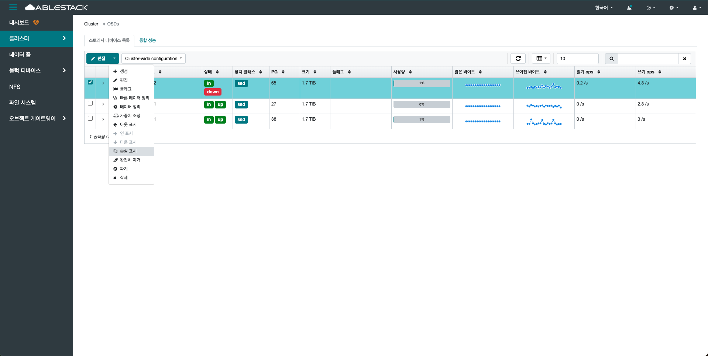{ .imgCenter .imgBorder }
    - 손실 표시를 설정할 OSD를 선택하세요.
2. 손실 표시 버튼을 클릭한 화면입니다.
    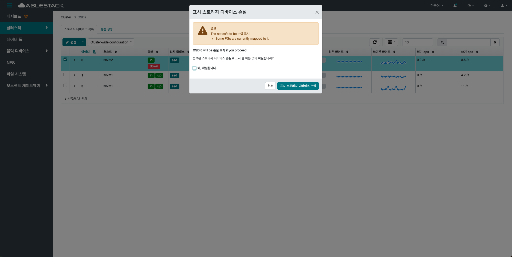{ .imgCenter .imgBorder }
    - 손실 표시를 실행할 디스크를 한번 더 확인하신 후, **예,확실합니다.** 를 선택합니다.
    - **표시 스토리지 디바이스 손실** 버튼을 클릭합니다.

## 완전히 제거(Purge)
!!! info
    OSD의 모든 정보(구성, 메타데이터 등)를 클러스터에서 완전히 삭제합니다.

    시스템에서 영구적으로 제거할 때 사용합니다. 즉, 클러스터에서 해당 디스크의 존재 자체를 완전히 삭제합니다.

1. 완전히 제거가 필요한 OSD를 선택한 후, 상단의 완전히 제거 표시 버튼을 클릭합니다.
    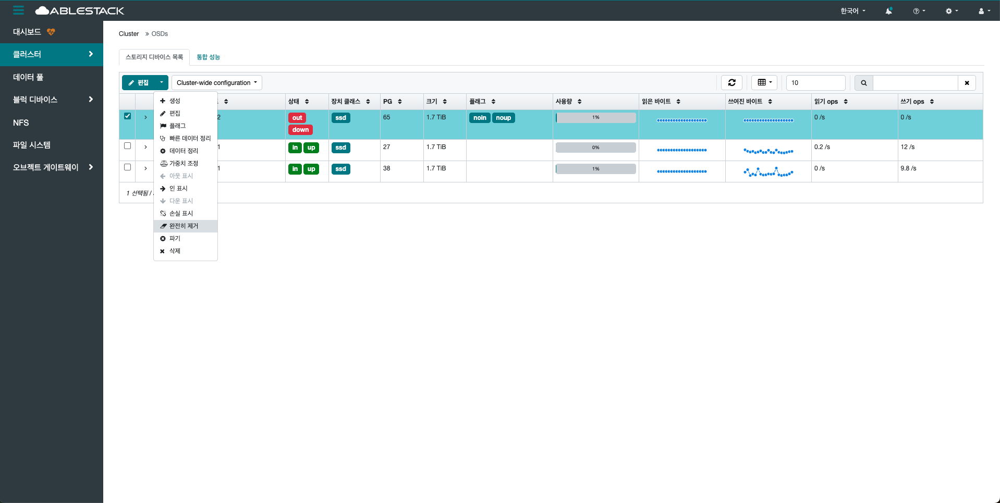{ .imgCenter .imgBorder }
    - 완전히 제거 표시를 설정할 OSD를 선택하세요.
2. 완전히 제거 표시 버튼을 클릭한 화면입니다.
    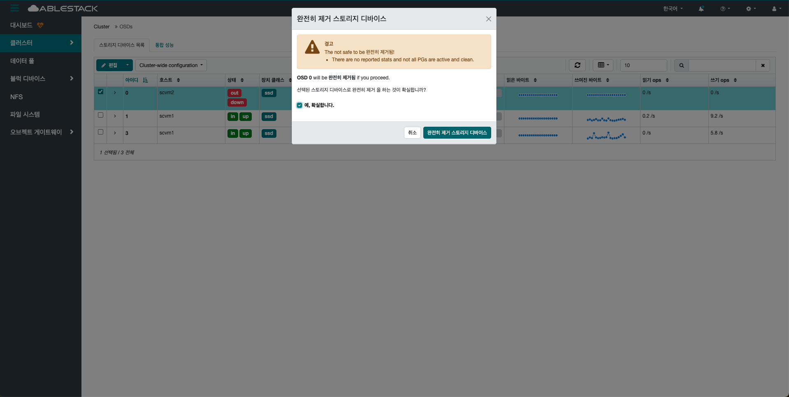{ .imgCenter .imgBorder }
    - 완전히 제거 표시를 실행할 디스크를 한번 더 확인하신 후, **예,확실합니다.** 를 선택합니다.
    - **완전히 제거 스토리지 디바이스** 버튼을 클릭합니다.

## 파기(Destroy)
!!! info
    OSD의 UUID, 크러시 맵 정보 등 메타 정보를 제거합니다.

    실제 OSD 장치의 데이터는 그대로일 수 있으나, 클러스터에서는 더 이상 인식하지 않습니다. 즉, 디스크의 ID나 구성 정보 등은 제거하지만, 실제 장치는 그대로 남아 있을 수 있습니다.

1. 파기 표시가 필요한 OSD를 선택한 후, 상단의 파기 표시 버튼을 클릭합니다.
    { .imgCenter .imgBorder }
    - 파기 표시를 설정할 OSD를 선택하세요.
2. 파기 표시 버튼을 클릭한 화면입니다.
    { .imgCenter .imgBorder }
    - 파기 표시를 실행할 디스크를 한번 더 확인하신 후, **예,확실합니다.** 를 선택합니다.
    - **파기 스토리지 디바이스** 버튼을 클릭합니다.

## 삭제(Delete)
!!! info
    파기(Destroy)와 유사하지만, 일반적으로 OSD ID를 제거하는 데 사용됩니다.

    OSD 정보를 클러스터에서 제거하지만, 메타데이터 일부는 남아 있을 수 있습니다.

!!! warning
    삭제 전에 Mark Out, Mark Down, Destroy 등의 과정을 반드시 선행해야 안전합니다.

1. 삭제 표시가 필요한 OSD를 선택한 후, 상단의 삭제 표시 버튼을 클릭합니다.
    { .imgCenter .imgBorder }
    - 삭제 표시를 설정할 OSD를 선택하세요.
2. 삭제 표시 버튼을 클릭한 화면입니다.
    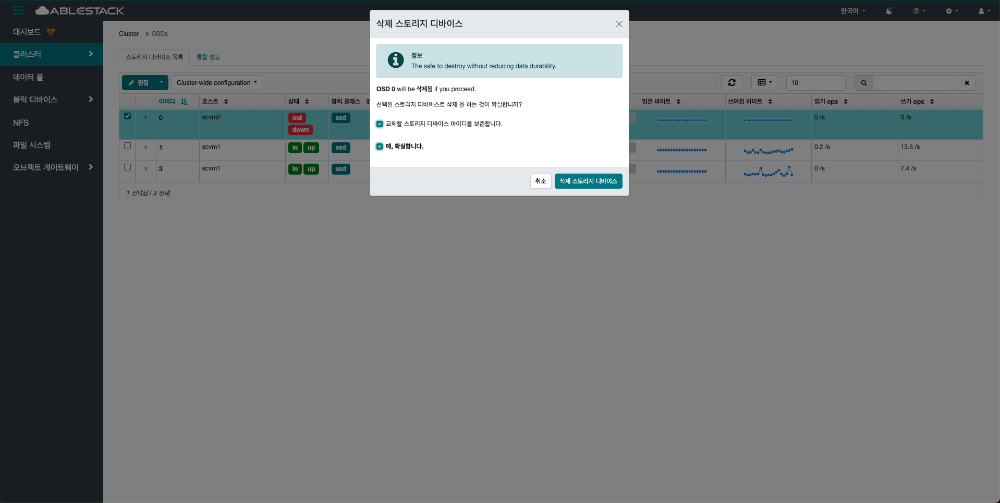{ .imgCenter .imgBorder }
    - 삭제 표시를 실행할 디스크를 한번 더 확인하신 후, **예,확실합니다.** 를 선택합니다.
    - 교체할 스토리지 디바이스 아이디를 동일하게 사용하실 경우, **교체할 스토리지 디바이스 아이디를 보존합니다.** 를 선택합니다.
    - **삭제 스토리지 디바이스** 버튼을 클릭합니다.
    