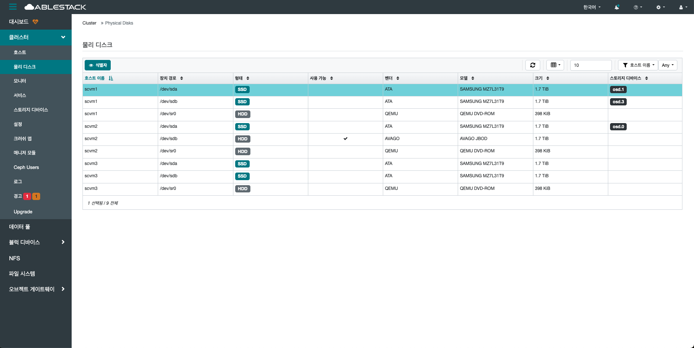

# 물리디스크

## 개요
데이터를 실제로 저장하는 메뉴입니다.
각 디스크는 OSD(Object Storage Daemon)와 연결되어, 데이터를 분산 저장하고 복제하는 데 사용됩니다.
하나의 호스트에는 여러 개의 디스크가 연결될 수 있으며, 이를 통해 고가용성과 확장성을 제공합니다.

대시보드에서는 디스크의 상태, 용량, 장치 이름, 연결 위치 등을 시각적으로 확인할 수 있어 장애 대응이 용이합니다.
디스크의 상태가 오류나 사용 불가로 표시될 경우, 빠르게 교체하거나 복구 조치를 취할 수 있습니다.

또한, 일부 디스크는 데이트를 저장하는 용도 외에도 DB나 WAL 등의 메타데이터 저장 용도로 사용되기도 합니다.
이러한 디스크 구조를 자동으로 인식하고 최적의 형태로 관리합니다.

결과적으로 물리 디스크는 Glue 스토리지 시스템의 핵심 구성 요소이며, 디스크 상태와 구성을 주기적으로 점검하는 것은 클러스터 안정성 유지에 매우 중요 합니다.

## 물리 디스크 조회(Physical Disks)
1. 클러스터에 포함된 모든 호스트의 물리 디스크를 한눈에 확인할 수 있는 목록을 제공합니다. 이 페이지에서는 각 호스트에 연결된 디스크들의 호스트 이름, 장치 경로, 디스크 형태, 모델명, 크기 등의 정보를 조회할 수 있습니다. 디스크의 전체 구성 현황을 빠르게 파악하고 비교할 수 있도록 구성되어 있어, 클러스터 상태 점검 시 유용합니다. 단, 본 페이지는 디스크 상태를 조회하는 용도이며, 물리 디스크에 대한 관리 작업(예: 수정, 삭제 등)은 지원하지 않습니다.
    { .imgCenter .imgBorder }
    - **식별자** 를 통하여 해당 물리 디스크의 위치를 확인할 수 있습니다.
