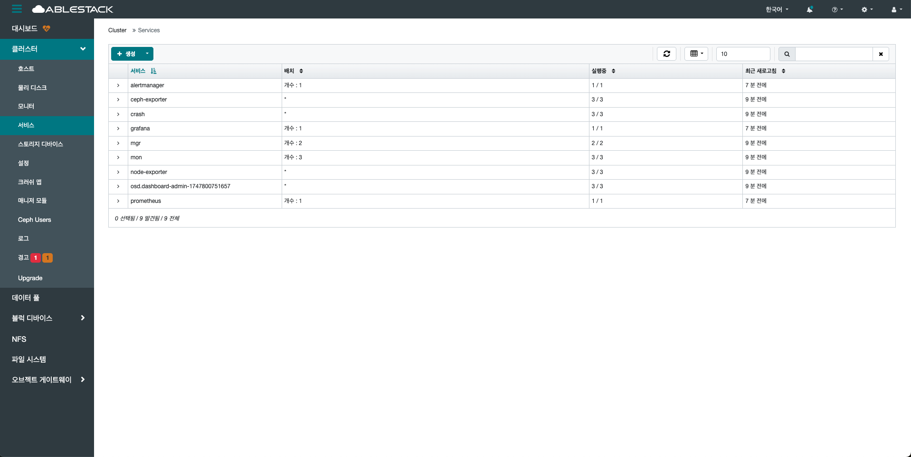
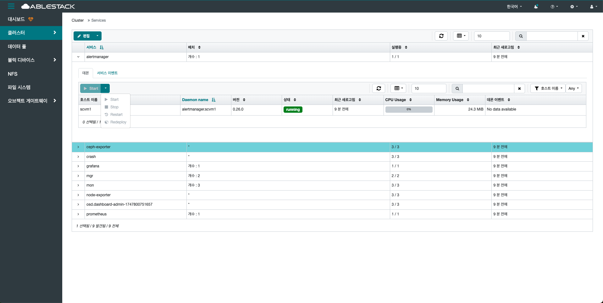
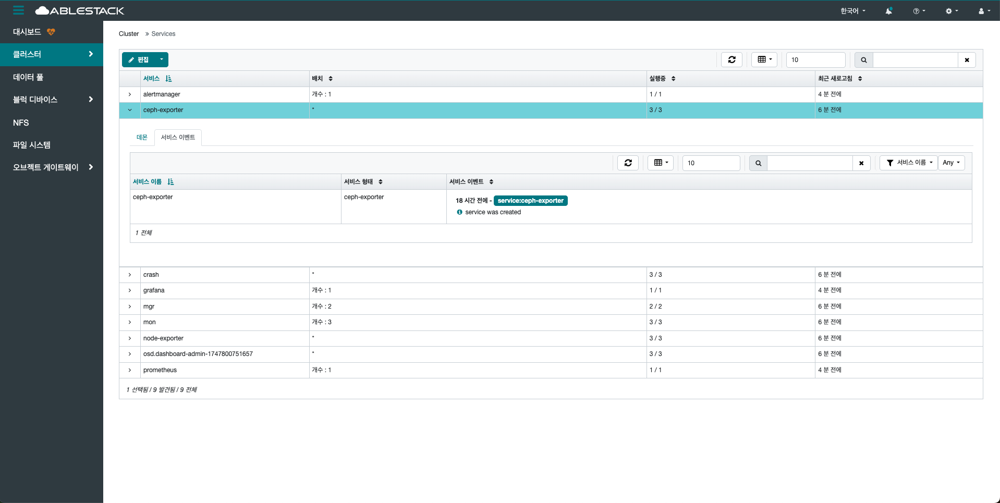
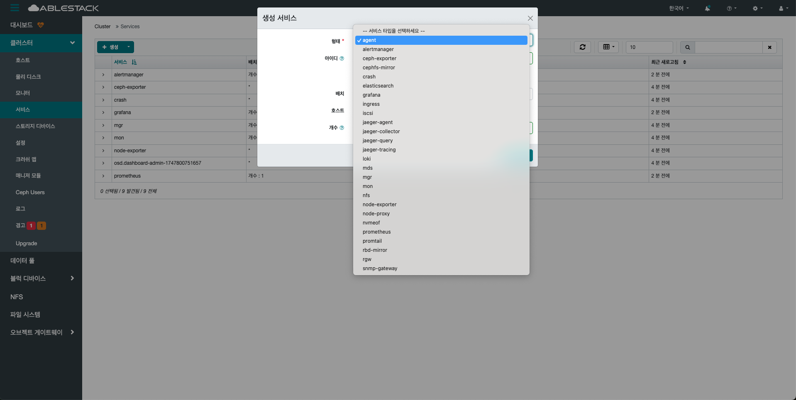
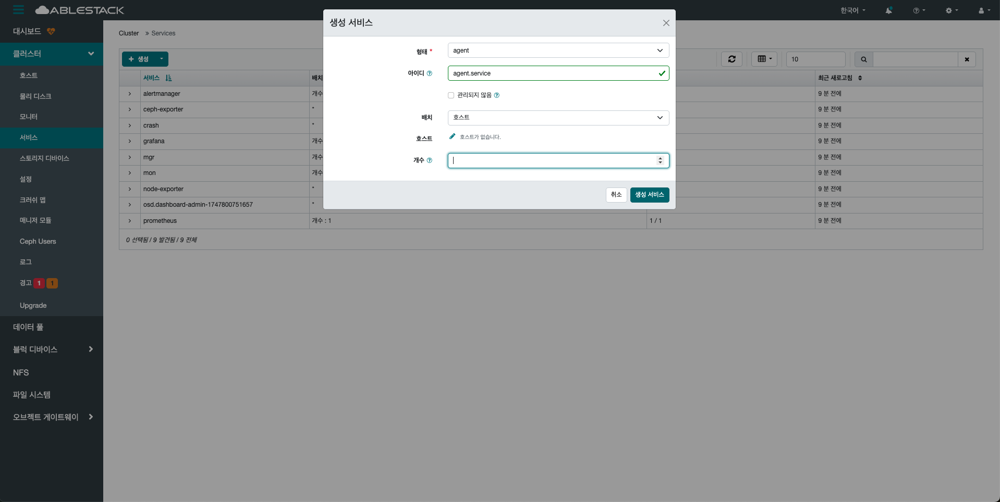
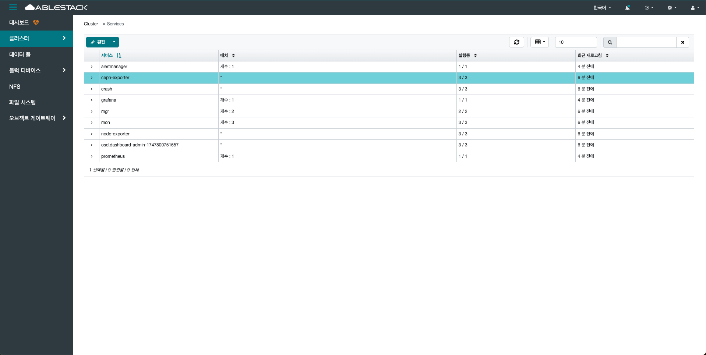
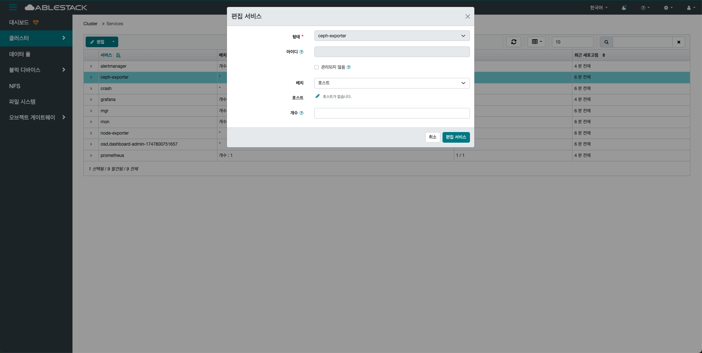
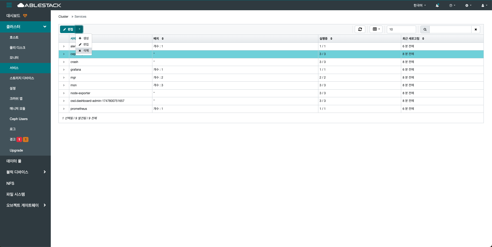
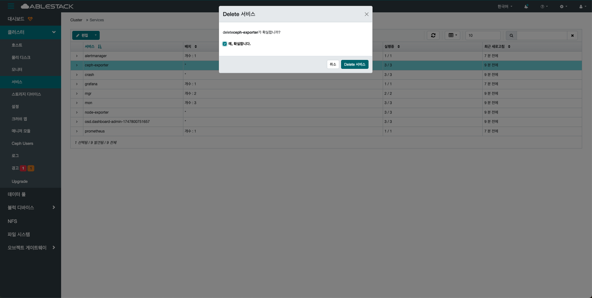

# 서비스

## 개요
클러스터 내에서 실행 중인 모든 서비스(데몬)의 상태를 종합적으로 확인할 수 있는 영역입니다.

이 메뉴를 통해 MON(Monitor), OSD(Object Storage Daemon), MGR(Manager), MDS(Metadata Server), RGW(RADOS Gateway) 등 다양한 구성 요소들의 상태, 호스트 정보, 버전, 상태 코드 등을 확인할 수 있습니다.

각 서비스는 해당 호스트에 연결되어 있으며, 상태가 Running, Stopped, Error 등으로 표기 됩니다.
사용자는 서비스의 상태를 빠르게 파악하고 이상 징후 발생시 원인 분석의 출발점으로 활용할 수 있습니다.
또한 일부 서비스에 대해서는 재시작, 재배포 등의 관리 작업을 수행할 수 있어 클러스터 운영에 핵심적인 역할을 합니다.

클러스터의 안정성과 서비스 가용성을 유지하기 위해 반드시 주기적으로 확인되어야 하는 중요한 항목입니다.

## 서비스 조회(Services)
1. 클러스터 내에서 실행 중인 모든 서비스의 상태와 배포 현황을 한눈에 확인할 수 있는 기능입니다. 서비스 이름, 배치, 상태 등을 확인 할 수 있습니다.
{ .imgCenter .imgBorder }

## 데몬 탭(Daemons)
1. 해당 서비스가 실행 중인 호스트, 버전, 상태 등의 정보를 실시간으로 확인할 수 있습니다. 또한, 서비스를 **Start** , **Stop** , **Restart** , **Redeploy** 등의 동작으로 제어할 수 있는 기능을 제공합니다.
{ .imgCenter .imgBorder }

## 이벤트 탭(Service Events)
1. 서비스의 실행 상태에서 발생하는 이벤트 로그를 통해 서비스의 동작 이력을 확인할 수 있습니다.
{ .imgCenter .imgBorder }

## 생성(Create)
1. 서비스 열의 상단의 생성 버튼을 클릭합니다.
    { .imgCenter .imgBorder }
2. 생성 버튼을 클릭한 화면입니다.
    { .imgCenter .imgBorder }
    - **형태** 의 **서비스 타입** 을 선택하세요.
    { .imgCenter .imgBorder }
    - **서비스 아이디(이름)** 을 입력하세요.
    - **생성 서비스** 를 클릭하세요.

    !!! info
        각 서비스 타입마다 요구되는 정보가 상이합니다.

## 편집(Edit)
1. 서비스 열의 상단의 편집 버튼을 클릭합니다.
    { .imgCenter .imgBorder }
    - 편집할 서비스를 선택하세요.
2. 편집 버튼을 클릭한 화면입니다.
    { .imgCenter .imgBorder }
    - **배치,개수** 를 수정하세요.
    !!! info
        생성된 서비스의 **형태 및 아이디** 는 수정이 제한되어 있습니다. 변경이 필요하신 경우, 서비스를 삭제하신 후 새로 생성해 주시기 바랍니다.

## 제거(Delete)
1. 서비스 열의 상단의 삭제 버튼을 클릭합니다.
    { .imgCenter .imgBorder }
    - 삭제할 서비스를 선택하세요.
2. 삭제 버튼을 클릭한 화면입니다.
    { .imgCenter .imgBorder }
    - 삭제 대상 서비스를 다시 한번 확인하신 후, **예,확실합니다.** 버튼을 클릭하여 삭제를 진행해 주세요.
    - **Delete 서비스** 를 클릭합니다.
    