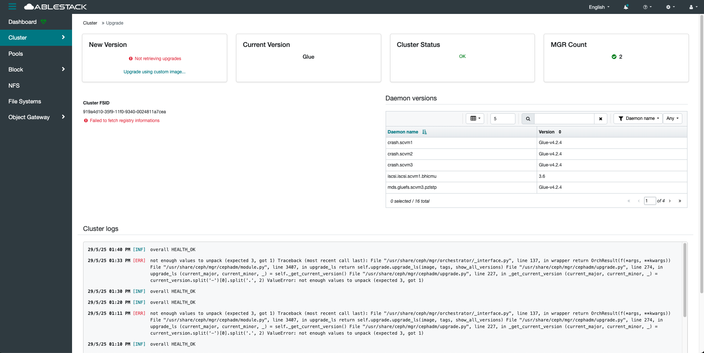

# Upgrade

## 개요
일반적으로 클러스터의 보안, 성능, 기능 향상을 위해 수행되는 유지보수 작업입니다.
공식 배포본에서는 rolling upgrade가 가능하며, MON -> MGR -> OSD 등의 순서로 단계별 갱신이 이루어집니다.

하지만 현재 환경은 패키지 기반이 아닌 수동 빌드된 바이너리로 구성되어 있기 때문에 Glue의 자동 업그레이드 기능은 제공되지 않습니다.

이로인해 버전 갱신 시에는 기존 바이너리를 직접 대체하거나 전체 재설치가 필요하며, 이는 운영 리스트를 수반합니다.
또한 업그레이드 전후의 설정 호환성, 데이터 무결성 검증 등이 수동으로 처리되어야 합니다.

업그레이드 지원을 위해선 cephadm 또는 podman 기반의 관리 체계로의 전환이 요구됩니다.

현재 상태에서는 실질적인 업그레이드가 불가능하며, 향후 운영 편의성과 유지보수를 고려하여 구조 전환이 필요합니다.
클러스터 안정성 확보를 위해 정기적인 백업 및 철저한 테스트 환경을 마련해야 합니다.
수동 빌드 환경에서는 업그레이드보다 신규 배포 및 데이터 마이그레이션 방식이 더 안전한 대안일 수 있습니다.

## Upgrade 조회
!!! info
    해당 클러스터 로그를 조회하시려면, 인터페이스 언어를 영어(English) 로 변경해주시기 바랍니다.

    현재 로그 조회 기능은 한국어 환경에서 정상적으로 동작하지 않습니다.

1. 클러스터의 업그레이드 진행 상태를 확인할 수 있는 기능입니다. 업그레이드 대상 노드, 현재 버전, 진행 단계, 에러 발생 여부 등을 한눈에 확인할 수 있습니다.
    { .imgCenter .imgBorder }
