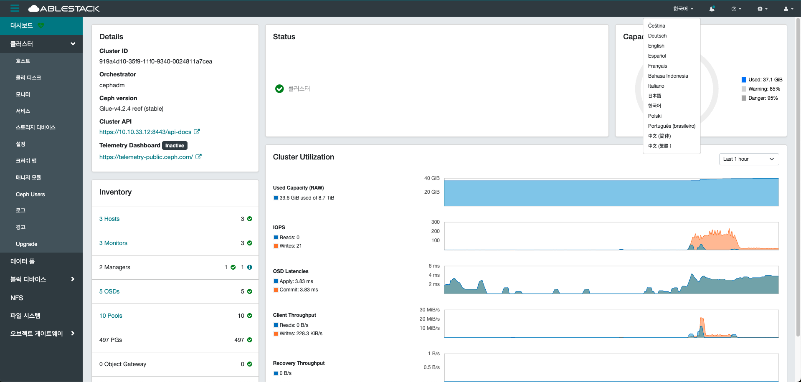
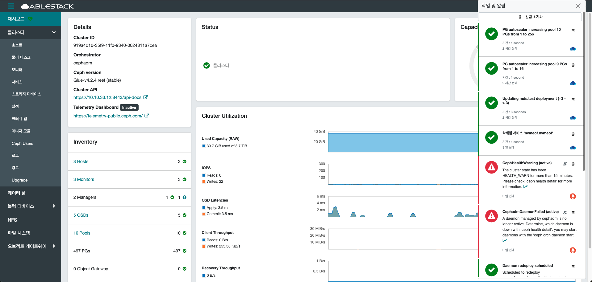
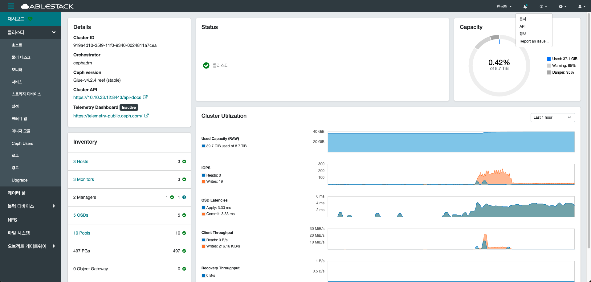
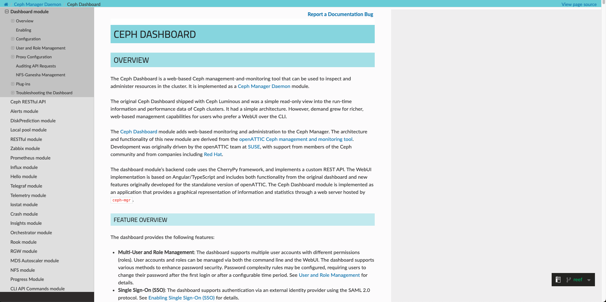
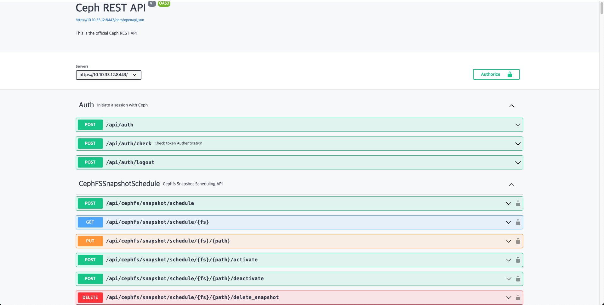
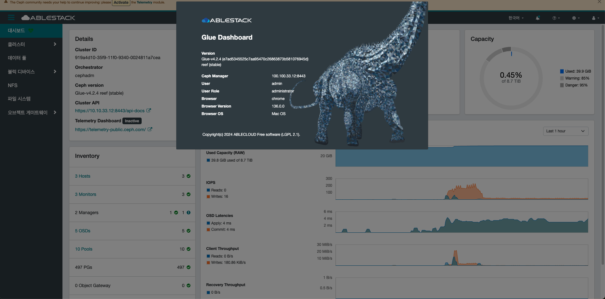
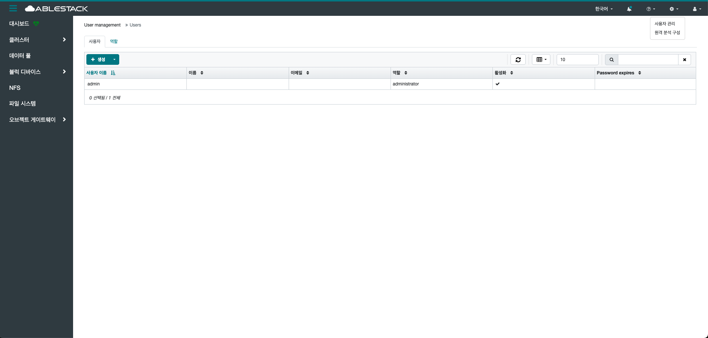
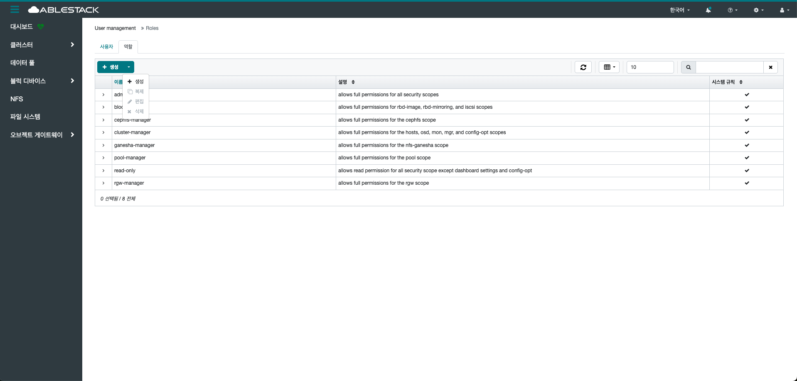
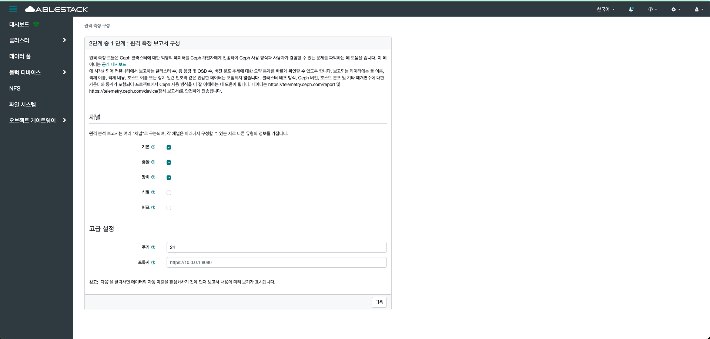
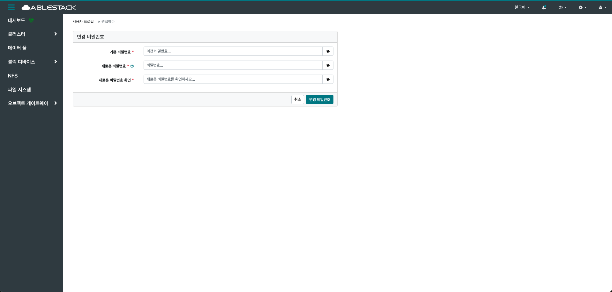

# 대시보드

## 개요
Glue 대시보드는 Glue 클러스터를 관리하고 모니터링할 수 있도록 제공되는 웹 기반 사용자 인터페이스입니다.
사용자는 직관적인 그래픽 환경을 통해 클러스터 상태, 성능 지표, OSD, MON, MGR, RGW 등의 구성 요소를 실시간으로 확인할 수 있습니다.
또한, 풀(pool) 관리, 사용자 및 권한 설정, 알림 구성, 클러스터 설정 변경 등 다양한 관리 작업을 손쉽게 수행할 수 있습니다.

Grafana 및 Prometheus와 통합되어 세부적인 모니터링과 시각화 기능도 지원합니다.
HTTPS를 통한 보안 통신과 인증 기능을 제공하여 안정성과 접근 제어를 강화합니다.

복잡한 CLI 명령어 없이 클릭만으로 운영이 가능해 운영 효율성을 크게 높여줍니다.
특히 장애 상황이나 성능 저하 감지 시 빠르게 원인 분석 및 대응을 도와줍니다.
결과적으로 Glue 대시보드는 대규모 스토리지 시스템을 안정적이고 효율적으로 관리하는 데 핵심적인 역할을 합니다.

## 대시보드 조회
1. 인프라 전반의 현황을 확인할 수 있습니다.
    { .imgCenter .imgBorder }

    * Details 카드
        * Glue에 대한 고유 ID, 버전, API 등 확인하실 수 있습니다.

    * Inventory 카드
        * Glue 클러스터를 구성하는 주요 리소스들의 전체 목록과 상태를 한눈에 확인하실 수 있습니다.
        * 자원 할당 현황을 효율적으로 파악하고 성능을 관리할 수 있습니다.
        * 각 항목에서 대시보드의 하위 페이지에 직접 액세스할 수 있습니다.

    * Status 카드
        * 클러스터 상태를 시각적으로 표시하고 심각도별로 그룹화된 클러스터 알림을 표시합니다.

    * Capacity 카드
        * Used : 스토리지 노드(OSD)에서 제공하는 총 물리적 용량 중 사용된 용량을 표시합니다.
        * Warning : OSD의 거의 전체 임계값을 표시합니다.
        * Danger : OSD의 전체 임계값을 표시합니다.

    * Cluster Utilization 카드
        * Used Capacity(사용된 용량) : 클러스터에서 사용된 총 용량입니다. 차트의 최대값은 클러스터의 최대 용량입니다.
        * IOPS(초당 입출력 작업 수) : 읽기 및 쓰기 작업 수를 의미합니다.
        * Latency(대기시간) : 읽기 또는 쓰기 요청을 처리하는 데 걸리는 시간입니다.
        * Client Throughtput(클라이언트 처리량) : 클라이언트가 클러스터에 읽거나 쓰는 데이터의 양.
        * Recovery Throughput(복구 처리량) : 클라이언트가 클러스터에 읽거나 쓰는 복구 데이터의 양.
        * 각 항목들은 해당 시간에 따라 조회할 수 있습니다.

이 대시보드는 관리자에게 각종 자원의 실시간 현황을 직관적으로 제공하여 운영의 효율성을 높이고, 문제 발생 시 빠르게 대응할 수 있도록 돕습니다.

## 다국어 지원
1. 대시보드 텍스트에 사용되는 언어는 런타임에 선택할 수 있습니다.
    { .imgCenter .imgBorder }

## 작업 및 알림
1. 클러스터에서 수행 중인 작업관 시스템 이상 또는 경고에 대한 알림을 실시간으로 확인할 수 있습니다.
    { .imgCenter .imgBorder }

## 지원 및 도움말
1. 시스템 사용 중 필요한 정보를 빠르게 확인할 수 있도록 공식 문서, API, 버전 정보 등을 제공합니다.
    { .imgCenter .imgBorder }

    ### 문서
    1. Glue는 Ceph 기반 스토리지로 구성되어 있으며, 관련된 자세한 정보는 Ceph 공식 문서를 통해 제공하고 있습니다.
        { .imgCenter .imgBorder }

    ### API
    1. Glue는 Ceph 기반 스토리지를 사용하고 있으며, Ceph와의 연동을 위한 API 상세 내용은 공식 문서를 통해 확인하실 수 있도록 제공합니다.
        { .imgCenter .imgBorder }

    ### 정보
    1. 전반적인 Glue에 대한 자세한 정보를 알 수 있습니다. 버전, 브라우저, 사용자 등 확인할 수 있습니다.
        { .imgCenter .imgBorder }

## 대시보드 설정
1. 대시보드를 통해 사용자 계정 관리 및 원격 분석 구성을 설정 할 수 있습니다. 이를 통해 사용자 접근 권한을 세분화하고, 시스템 사용 현황 데이터를 커뮤니티에 안전하게 전송하여 클러스터 상태 개선 및 품질 향상에 기여할 수 있습니다.
    { .imgCenter .imgBorder }

    ### 사용자 관리
    1. 사용자 관리 기능을 통해 신규 사용자의 추가는 물론, 기존 사용자 정보의 수정과 삭제를 지원합니다.
        { .imgCenter .imgBorder }
    2. 사용자 관리 기능을 통해 등록된 사용자에게 적절한 역할과 권한을 할당하는 작업을 지원합니다.
        { .imgCenter .imgBorder }

    ### 원격 분석 구성
    1. 시스템의 운영 데이터를 수집·전송하여, 클러스터 상태를 분석하고 개선하는 데 도움을 주는 기능을 제공합니다.
        { .imgCenter .imgBorder }

## 비밀번호 변경
1. 대시보드를 통해 로그인된 사용자에 대해 비밀번호 변경 및 로그아웃 기능을 지원합니다.
    { .imgCenter .imgBorder }