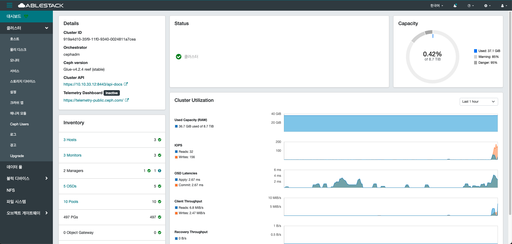

# 대시보드

## 개요
Glue 대시보드는 Glue 클러스터를 관리하고 모니터링할 수 있도록 제공되는 웹 기반 사용자 인터페이스입니다.
사용자는 직관적인 그래픽 환경을 통해 클러스터 상태, 성능 지표, OSD, MON, MGR, RGW 등의 구성 요소를 실시간으로 확인할 수 있습니다.
또한, 풀(pool) 관리, 사용자 및 권한 설정, 알림 구성, 클러스터 설정 변경 등 다양한 관리 작업을 손쉽게 수행할 수 있습니다.

Grafana 및 Prometheus와 통합되어 세부적인 모니터링과 시각화 기능도 지원합니다.
HTTPS를 통한 보안 통신과 인증 기능을 제공하여 안정성과 접근 제어를 강화합니다.

복잡한 CLI 명령어 없이 클릭만으로 운영이 가능해 운영 효율성을 크게 높여줍니다.
특히 장애 상황이나 성능 저하 감지 시 빠르게 원인 분석 및 대응을 도와줍니다.
결과적으로 Glue 대시보드는 대규모 스토리지 시스템을 안정적이고 효율적으로 관리하는 데 핵심적인 역할을 합니다.

## 대시보드 조회
1. 인프라 전반의 현황을 확인할 수 있습니다.
    { .imgCenter .imgBorder }

    * Details 카드
        * Glue에 대한 고유 ID, 버전, API 등 확인하실 수 있습니다.

    * Inventory 카드
        * Glue 클러스터를 구성하는 주요 리소스들의 전체 목록과 상태를 한눈에 확인하실 수 있습니다.
        * 자원 할당 현황을 효율적으로 파악하고 성능을 관리할 수 있습니다.

    * 스토리지 카드
         기본 스토리지 사용량을 확인하여 실제 사용 현황을 파악합니다.
        * 또한, 가상 머신에 할당된 스토리지 크기와 2차 스토리지 사용량도 함께 확인할 수 있습니다.

    * 네트워크 카드
        * VLAN/VNI, Public IP, 직접 IP, 관리 IP 주소에 대한 할당된 개수와 전체 개수를 한눈에 볼 수 있습니다.
        * 네트워크 자원의 효율적 관리와 배분 상태를 점검할 수 있습니다.

    * 알림 카드
        * ABLESTACK에서 발생하는 다양한 알림을 시간순으로 확인할 수 있습니다.
        * 중요 알림을 즉시 파악하고 필요한 조치를 신속히 취할 수 있습니다.

    * 이벤트 카드
        * 사용자 또는 시스템에서 발생한 다양한 이벤트를 시간순으로 확인할 수 있습니다.
        * 이벤트의 흐름을 추적하고 문제 발생 시 원인을 분석할 수 있습니다.

이 대시보드는 관리자에게 각종 자원의 실시간 현황을 직관적으로 제공하여 운영의 효율성을 높이고, 문제 발생 시 빠르게 대응할 수 있도록 돕습니다.
