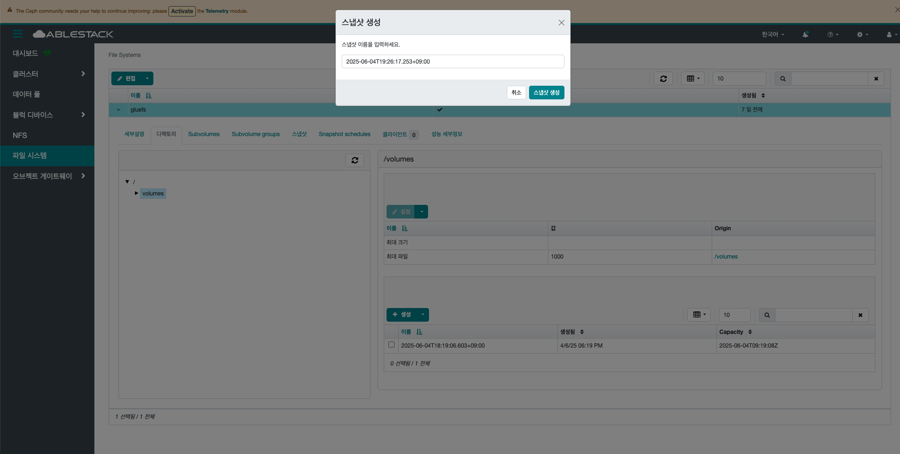
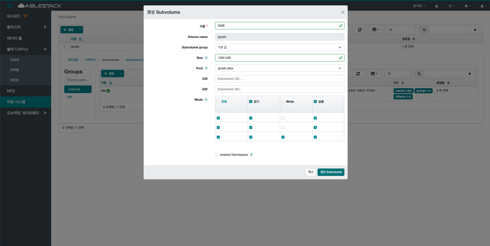

# 파일 시스템

## 개요
파일 시스템은 Glue에서 제공하는 POSIX 호환 분산 파일 시스템으로, 메타데이터 서버가 파일과 디렉터리를 관리하고 데이터는 RADOS에 저장됩니다. 확장성과 안정성이 뛰어나 다양한 대규모 환경에서 활용됩니다.

## 목록 조회

1. File System 목록을 조회하고 관리하는 화면입니다.

    생성된 File System 목록을 확인하거나 생성 버튼을 클릭하여 새로운 File System을 생성할 수 있습니다.
    { .imgCenter .imgBorder }

## 생성

1. 생성 버튼을 클릭 하여 생성 File System 화면을 호출합니다.

    { .imgCenter .imgBorder }

2. File System 생성을 위한 항목을 입력합니다.

    { .imgCenter .imgBorder }

    * **이름:** 이름을 입력합니다.
    * **배치:** 배치 방식을 선택합니다.
    * **호스트:** 서비스를 배치할 호스트를 선택합니다.
    * **생성 File System** 버튼을 클릭하여  생성합니다.

## 편집

1. 선택한 File System의 정보를 편집합니다.

    { .imgCenter .imgBorder }

    * 목록에서 편집할 File System을 선택합니다.
    * **편집** 버튼을 클릭하여 편집 File System 화면을 호출합니다.

    { .imgCenter .imgBorder }

    * **이름:** 이름을 입력합니다.
    * **편집 File System** 버튼을 클릭하여 File System 수정합니다.

## Authorize

1. 선택한 File System의 접근 정보를 변경합니다.

    { .imgCenter .imgBorder }

    * 목록에서 인증정보 변경할 File System을 선택합니다.
    * **편집** 버튼을 클릭하여 업데이트 Access 화면을 호출합니다.

    { .imgCenter .imgBorder }

    * **User ID:** User ID를 입력합니다.
    * **Directory:** Directory를 입력합니다.
    * 필요시 **Permissons:** 정보를 입력합니다.
    * **편집** 버튼을 클릭하여 접근 권한을 업데이트합니다.

## Attach

1. 선택한 File System에 마운트 하는 방법을 확일할 수 있습니다.

    { .imgCenter .imgBorder }

    * 목록에서 마운트 방법을 확인할 File System을 선택합니다.
    * **Attach** 버튼을 클릭하여 Attach commands 화면을 호출합니다.

    { .imgCenter .imgBorder }

    * 커맨드를 확인합니다.
    * 확인후 **Close** 버튼을 클릭하여 창을 닫습니다.

## 제거
1. 선택한 File System을 삭제합니다.

    { .imgCenter .imgBorder }

    * 목록에서 제거할 File System을 선택합니다.
    * **제거** 버튼을 클릭하여 Remove File System 화면을 호출합니다.

2. File System 제거를 위한 항목을 입력합니다.

    { .imgCenter .imgBorder }

    * **예, 확실합니다.** 를 체크 합니다.
    * **Remove File System** 버튼을 클릭하여 File System을 제거합니다.

## 세부 설명 조회

1. File System의 세부 설명 정보를 확인할 수 있습니다.
    { .imgCenter .imgBorder }

    * 순위 영역에서 File System 서비스를 실행중인 데몬 정보를 확인합니다.
    * 데이터 풀에서 사용량 정보를 확인할 수 있습니다.
    * MDS 성능 카운트 정보를 시계열로 확인할 수 있습니다.

## 디렉토리

### 디렉토리 조회

1. File System의 디렉토리 조회하고 관리할 수 있습니다.
    { .imgCenter .imgBorder }

    * 디렉토리 구조를 확인하고 디렉트리를 조회하고 볼륨의 크기 및 파일수와 스냅샷 목록을 조회할 수 있습니다.

### 최대 크기 설정

1. 선택한 File System의 디렉토리의 최대 크기를 설정합니다.
    { .imgCenter .imgBorder }

    * **설정** 설정 버튼을 클릭하여 설정 팝업을 호출합니다.

2. File System 디렉토리의 최대 크기를 설정을 위한 항목을 입력합니다.

    { .imgCenter .imgBorder }

    * **최대 크기:** 최대 크기를 입력합니다.
    * **저장 하기** 버튼을 클릭하여 디렉토리에 최대 크기를 설정합니다.

### 최대 크기 업데인트

1. 선택한 File System의 디렉토리의 최대 크기를 업데이트합니다.
    { .imgCenter .imgBorder }

    * **업데이트** 업데이트 버튼을 클릭하여 설정 팝업을 호출합니다.

2. File System 디렉토리의 최대 크기를 업데이트를 위한 항목을 입력합니다.

    { .imgCenter .imgBorder }

    * **최대 크기:** 최대 크기를 입력합니다.
    * **저장 하기** 버튼을 클릭하여 디렉토리에 최대 크기를 업데이트합니다.

### 최대 크기 설정 해제

1. 선택한 File System의 디렉토리의 최대 크기 설정을 해제합니다.
    { .imgCenter .imgBorder }

    * **설정 해제** 설정해제 버튼을 클릭하여 설정 해제 팝업을 호출합니다.

2. File System 디렉토리의 최대 크기 설정 해제 위한 항목을 입력합니다.

    { .imgCenter .imgBorder }
    
    * **설정 해제** 버튼을 클릭하여 설정을 해제합니다.

### 최대 파일 설정

1. 선택한 File System의 디렉토리의 최대 파일를 설정합니다.
    { .imgCenter .imgBorder }

    * **설정** 설정 버튼을 클릭하여 설정 팝업을 호출합니다.

2. File System 디렉토리의 최대 파일 수 설정을 위한 항목을 입력합니다.

    { .imgCenter .imgBorder }

    * **최대 파일:** 최대 파일을 입력합니다.
    * **저장 하기** 버튼을 클릭하여 디렉토리에 최대 파일 수를 설정합니다.

### 최대 파일 업데이트

1. 선택한 File System의 디렉토리의 최대 파일를 업데이트합니다.
    { .imgCenter .imgBorder }

    * **업데이트** 업데이트 버튼을 클릭하여 설정 팝업을 호출합니다.

2. File System 디렉토리의 최대 파일 수 업데이트를 위한 항목을 입력합니다.

    { .imgCenter .imgBorder }

    * **최대 파일:** 최대 파일을 입력합니다.
    * **저장 하기** 버튼을 클릭하여 디렉토리에 최대 파일 수를 업데이트합니다.

### 최대 크파일기 설정 해제

1. 선택한 File System의 디렉토리의 최대 파일 설정을 해제합니다.
    { .imgCenter .imgBorder }

    * **설정 해제** 설정해제 버튼을 클릭하여 설정 해제 팝업을 호출합니다.

2. File System 디렉토리의 최대 파일 설정 해제 위한 항목을 입력합니다.

    { .imgCenter .imgBorder }
    
    * **설정 해제** 버튼을 클릭하여 설정을 해제합니다.

### 스냅샷 생성 

1. 선택한 File System의 디렉토리의 스냅샷을 생성합니다.
    { .imgCenter .imgBorder }

    * **생성** 생성 버튼을 클릭하여 스냅샷 생성 팝업을 호출합니다.

2. File System 디렉토리의 스냅샷 생성 항목을 입력합니다.

    { .imgCenter .imgBorder }

    * **스냅샷 이름:** 스냅샷 이름을 입력합니다.
    * **스냅샷 생성** 버튼을 클릭하여 디렉토리의 스냅샷을 생성합니다.

### 스냅샷 삭제

1. 선택한 File System의 디렉토리의 스냅샷을 삭제합니다.
    { .imgCenter .imgBorder }

    * **삭제** 삭제 버튼을 클릭하여 Delete CephFs 스냅샷 팝업을 호출합니다.

2. File System 디렉토리의 스냅샷 삭제 항목을 입력합니다.

    { .imgCenter .imgBorder }
    
    * **Delete CephFs 스냅샷** 버튼을 클릭하여 스냅샷을 삭제합니다.

## Subvolumes

### Subvolume 조회

1. File System의 서브 볼륨을 조회할 수 있습니다.
    { .imgCenter .imgBorder }

    * 볼륨 그룹에 하위 서브볼륨을 확인할 수 있습니다.

### 생성

1. 생성 버튼을 클릭 하여 생성 Subvolume 화면을 호출합니다.

    { .imgCenter .imgBorder }

2. Subvolume 생성을 위한 항목을 입력합니다.

    { .imgCenter .imgBorder }

    * **이름:** 이름을 입력합니다.
    * **Subvolume group:** Subvolume group을 선택합니다.
    * **Size:** Size를 입력합니다.
    * **Pool:** Pool을 선택합니다.
    * **Mode:** Mode를 체크합니다.
    * **생성 Subvolume** 버튼을 클릭하여 Subvolume을 생성합니다.

### 편집

1. 선택한 Subvolume의 정보를 편집합니다.

    { .imgCenter .imgBorder }

    * 목록에서 편집할 Subvolume을 선택합니다.
    * **편집** 버튼을 클릭하여 편집 Subvolume 화면을 호출합니다.

    { .imgCenter .imgBorder }

    * **Size:** Size를 입력합니다.
    * **편집 Subvolume** 버튼을 클릭하여 Subvolume을 편집합니다.

### Attach

1. File System의 서브 볼륨을 연결 방법 팝업을 호출합니다.
    { .imgCenter .imgBorder }

    * **Attach** 버튼을 클릭하여 Attach commands 화면을 호출합니다.

2. File System의 서브 볼륨을 연결 방법을 확인합니다.
    { .imgCenter .imgBorder }

    * attach commands를 확인합니다.
    * **Close** 버튼을 클릭하여 Attach commands 화면을 닫습니다.

### 제거
1. 선택한 Subvolume을 삭제합니다.

    { .imgCenter .imgBorder }

    * 목록에서 제거할 Subvolume을 선택합니다.
    * **제거** 버튼을 클릭하여 Remove Subvolume 화면을 호출합니다.

2. Subvolume 제거를 위한 항목을 입력합니다.

    { .imgCenter .imgBorder }

    * **Retain snapshots** 를 체크 합니다.
    * **예, 확실합니다.** 를 체크 합니다.
    * **Remove Subvolume** 버튼을 클릭하여 Subvolume을 제거합니다.

## Subvolume groups

### Subvolume groups 조회

1. File System의 Subvolume groups을 조회할 수 있습니다.
    { .imgCenter .imgBorder }

    * 서브 볼륨 그룹을 확인할 수 있습니다.

### 생성

1. 생성 버튼을 클릭 하여 생성 Subvolume group 화면을 호출합니다.

    { .imgCenter .imgBorder }

2. Subvolume groups 생성을 위한 항목을 입력합니다.

    { .imgCenter .imgBorder }

    * **이름:** 이름을 입력합니다.
    * **Size:** Size를 입력합니다.
    * **Pool:** Pool을 선택합니다.
    * **Mode:** Mode를 체크합니다.
    * **생성 Subvolume group** 버튼을 클릭하여 Subvolume group을 생성합니다.

### 편집

1. 선택한 Subvolume group의 정보를 편집합니다.

    { .imgCenter .imgBorder }

    * 목록에서 편집할 Subvolume group을 선택합니다.
    * **편집** 버튼을 클릭하여 편집 Subvolume 화면을 호출합니다.

    { .imgCenter .imgBorder }

    * **이름:** 이름을 입력합니다.
    * **Size:** Size를 입력합니다.
    * **Pool:** Pool을 선택합니다.
    * **Mode:** Mode를 체크합니다.
    * **편집 Subvolume group** 버튼을 클릭하여 Subvolume group을 편집합니다.

### 제거
1. 선택한 Subvolume group을 삭제합니다.

    { .imgCenter .imgBorder }

    * 목록에서 제거할 Subvolume group을 선택합니다.
    * **제거** 버튼을 클릭하여 Remove Subvolume group 화면을 호출합니다.

2. Subvolume group 제거를 위한 항목을 입력합니다.

    { .imgCenter .imgBorder }

    * **예, 확실합니다.** 를 체크 합니다.
    * **Remove Subvolume group** 버튼을 클릭하여 Subvolume group을 제거합니다.

## 스냅샷

### 스냅샷 조회

1. File System의 서브볼륨의 스냅샷 목록을 조회할 수 있습니다.
    { .imgCenter .imgBorder }

    * 서브 볼륨 스냅샷을 확인할 수 있습니다.

### 생성

1. 생성 버튼을 클릭 하여 생성 Snapshot 화면을 호출합니다.

    { .imgCenter .imgBorder }

2. Snapshot 생성을 위한 항목을 입력합니다.

    { .imgCenter .imgBorder }

    * **이름:** 이름을 입력합니다.
    * **Subvolume group:** Subvolume group을 선택합니다.
    * **Subvolume:** Subvolume을 선택합니다.
    * **생성 Snapshot** 버튼을 클릭하여 Snapshot을 생성합니다.

### Clone

1. 선택한 Snapshot을 복제합니다.

    { .imgCenter .imgBorder }

    * 목록에서 복제할 Snapshot을 선택합니다.
    * **Clone** 버튼을 클릭하여 Create clone 화면을 호출합니다.

    { .imgCenter .imgBorder }

    * **이름:** 이름을 입력합니다.
    * **Group name:** Group name을 선택합니다.
    * **Create clone** 버튼을 클릭하여 Create clone을 편집합니다.

### 제거
1. 선택한 Snapshot을 삭제합니다.

    { .imgCenter .imgBorder }

    * 목록에서 제거할 Snapshot을 선택합니다.
    * **제거** 버튼을 클릭하여 Delete Snapshot 화면을 호출합니다.

2. Snapshot 제거를 위한 항목을 입력합니다.

    { .imgCenter .imgBorder }

    * **예, 확실합니다.** 를 체크 합니다.
    * **Delete Snapshot** 버튼을 클릭하여 Snapshot을 제거합니다.

## Snapshot schedules

### 스냅샷 조회

1. Snapshot schedules 목록을 조회할 수 있습니다.
    { .imgCenter .imgBorder }

    * 스냅샷 스케줄을 확인할 수 있습니다.

### 생성

1. 생성 버튼을 클릭 하여 생성 Snapshot schedule 화면을 호출합니다.

    { .imgCenter .imgBorder }

2. Snapshot 생성을 위한 항목을 입력합니다.

    { .imgCenter .imgBorder }

    * **Directory:** Directory를 선택합니다.
    * **Start date:** Start date를 선택합니다.
    * **Start time:** Start time을 선택합니다.
    * **Schedule:** 스케줄 정책을 선택합니다.
    * **생성 Snapshot schedule** 버튼을 클릭하여 Snapshot 스케줄을 생성합니다.

### 편집

1. 선택한 Snapshot schedule의 정보를 편집합니다.

    { .imgCenter .imgBorder }

    * 목록에서 편집할 Snapshot schedule을 선택합니다.
    * **편집** 버튼을 클릭하여 편집 Snapshot schedule 화면을 호출합니다.

    { .imgCenter .imgBorder }

    * **add retention policy:** 버튼을 클릭하여 추가 정책 설정을 활성화 합니다.
    * **Retention policy** 에 정책을 설정합니다.
    * **편집 Snapshot schedule** 버튼을 클릭하여 Snapshot schedule을 편집합니다.

### 제거
1. 선택한 Snapshot schedule을 삭제합니다.

    { .imgCenter .imgBorder }

    * 목록에서 제거할 Snapshot schedule을 선택합니다.
    * **제거** 버튼을 클릭하여 snapshot schedule 화면을 호출합니다.

2. Snapshot schedule을 제거를 위한 항목을 입력합니다.

    { .imgCenter .imgBorder }

    * **예, 확실합니다.** 를 체크 합니다.
    * **Delete snapshot schedule** 버튼을 클릭하여 Snapshot schedule을 제거합니다.

### Deactivate

1. 선택한 snapshot schedule을 비활성화 합니다.

    { .imgCenter .imgBorder }

    * 목록에서 비활성화할 Snapshot schedule을 선택합니다.
    * **Deactivate** 버튼을 클릭하여 Deactivate snapshot schedule 화면을 호출합니다.

    { .imgCenter .imgBorder }

    * **예, 확실합니다.** 를 체크 합니다.
    * **Deactivate snapshot schedule** 버튼을 클릭하여 Snapshot schedule을 비활성화합니다.

### Activate

1. 선택한 snapshot schedule을 활성화 합니다.

    { .imgCenter .imgBorder }

    * 목록에서 활성화할 Snapshot schedule을 선택합니다.
    * **Activate** 버튼을 클릭하여 Activate snapshot schedule 화면을 호출합니다.

    { .imgCenter .imgBorder }

    * **예, 확실합니다.** 를 체크 합니다.
    * **Activate snapshot schedule** 버튼을 클릭하여 Snapshot schedule을 활성화합니다.

## 클라이언트

1. 파일 시스템에 연결된 클라이언트 목록을 조회할 수 있습니다.
    { .imgCenter .imgBorder }

    * 클라이언트 목록을 확인할 수 있습니다.

## 성능 세부정보 조회

1. Glue FileSystem의 성능 세부정보 정보를 대시보드로 확인할 수 있습니다.
    <!-- { .imgCenter .imgBorder } -->
