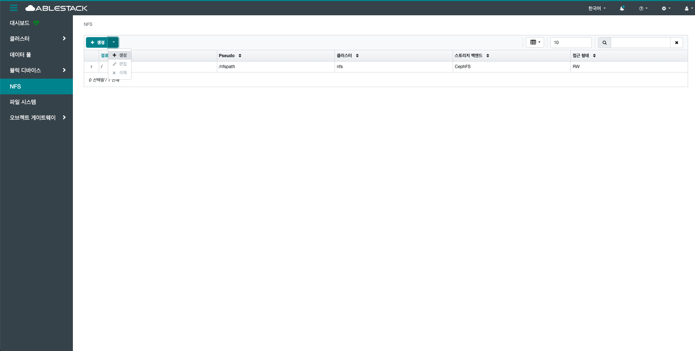

# NFS

## 개요
NFS는 GlueFS를 NFS 프로토콜로 공유하여 NFS 클라이언트가 Glue 스토리지에 접근할 수 있게 하는 서비스입니다. NFS 게이트웨이 데몬이 Glue MDS와 연동해 메타데이터를 관리하며, 클라이언트는 일반 NFS처럼 마운트해 사용합니다. 고가용성 구성이 가능하며, GlueFS가 정상 운영돼야 제대로 작동합니다.

## 목록 조회

!!! info
    NFS 서비스를 사용하기 위해서는 **클러스터 > 서비스** 에서 NFS 서비스를 생성하야 합니다.

1. NFS Export 목록을 조회하고 관리하는 화면입니다.

    생성된 NFS Export 목록을 확인하거나 생성 버튼을 클릭하여 새로운 NFS Export를 생성할 수 있습니다.
    { .imgCenter .imgBorder }

## 세부 설명 조회

1. NFS Export의 세부 설명 정보를 확인할 수 있습니다.
    { .imgCenter .imgBorder }

## 클라이언트 조회

1. NFS Export의 클라이언트 정보를 확인할 수 있습니다.
    { .imgCenter .imgBorder }

    - 클라이언트가 없을 경우 모두 접근 가능합니다.
    - 특정 CIDR만 허용할 경우 NFS Export 생성시 클라이언트를 입력하세요.

## 생성

1. 생성 버튼을 클릭 하여 생성 NFS 내보내기 화면을 호출합니다.

    { .imgCenter .imgBorder }

2. NFS 내보내기 생성을 위한 항목을 입력합니다.

    { .imgCenter .imgBorder }

    * **클러스터:** NFS 클러스터를 선택합니다.
    * **스토리지 백엔드:** 스토리지 백엔드를 선택합니다.
    * **Volume:** Volume을 선택합니다.
    * **CephFS 경로:** CephFS 경로를 입력합니다. (NFS를 제공할 GlueFS의 경로)
    * **NFS 프로토콜:** NFS 프로토콜을 체크합니다.
    * **Pseudo:** Pseudo를 입력합니다. (내보내기 경로)
    * **접근 형태:** 접근 형태를 선택합니다.
    * **Squash:** Squash를 선택합니다.
    * **전송 프로토콜:** 전송 프로토콜를 선택합니다.
    * 필요시 **클라이언트** 를 설정합니다.
        - 클라이언트가 없을 경우 모두 접근 가능합니다.
        - 특정 CIDR만 허용할 경우 NFS Export 생성시 클라이언트를 입력하세요.
    * **생성 NFS 내보내기** 버튼을 클릭하여 NFS 내보내기를 생성합니다.

## 편집

1. 선택한 NFS 내보내기의 정보를 편집합니다.

    { .imgCenter .imgBorder }

    * 목록에서 편집할 NFS 내보내기를 선택합니다.
    * **편집** 버튼을 클릭하여 편집 NFS 내보내기 화면을 호출합니다.

    { .imgCenter .imgBorder }

    * **클러스터:** NFS 클러스터를 선택합니다.
    * **스토리지 백엔드:** 스토리지 백엔드를 선택합니다.
    * **Volume:** Volume을 선택합니다.
    * **CephFS 경로:** CephFS 경로를 입력합니다. (NFS를 제공할 GlueFS의 경로)
    * **NFS 프로토콜:** NFS 프로토콜을 체크합니다.
    * **Pseudo:** Pseudo를 입력합니다. (내보내기 경로)
    * **접근 형태:** 접근 형태를 선택합니다.
    * **Squash:** Squash를 선택합니다.
    * **전송 프로토콜:** 전송 프로토콜를 선택합니다.
    * 필요시 **클라이언트** 를 설정합니다.
        - 클라이언트가 없을 경우 모두 접근 가능합니다.
        - 특정 CIDR만 허용할 경우 NFS Export 생성시 클라이언트를 입력하세요.
    * **편집 NFS 내보내기** 버튼을 클릭하여 NFS 내보내기를 편집합니다.

## 삭제
1. 선택한 NFS 내보내기를 삭제합니다.

    { .imgCenter .imgBorder }

    * 목록에서 삭제할 NFS 내보내기를 선택합니다.
    * **삭제** 버튼을 클릭하여 Delete NFS 내보내기 화면을 호출합니다.

2. NFS 내보내기 삭제를 위한 항목을 입력합니다.

    { .imgCenter .imgBorder }

    * **예, 확실합니다.** 를 체크 합니다.
    * **Delete NFS 내보내기** 버튼을 클릭하여 NFS 내보내기를 삭제합니다.
