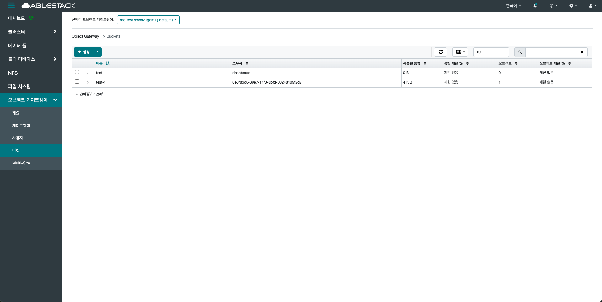
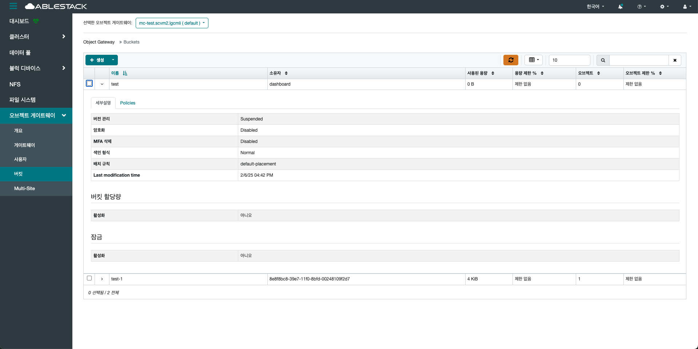
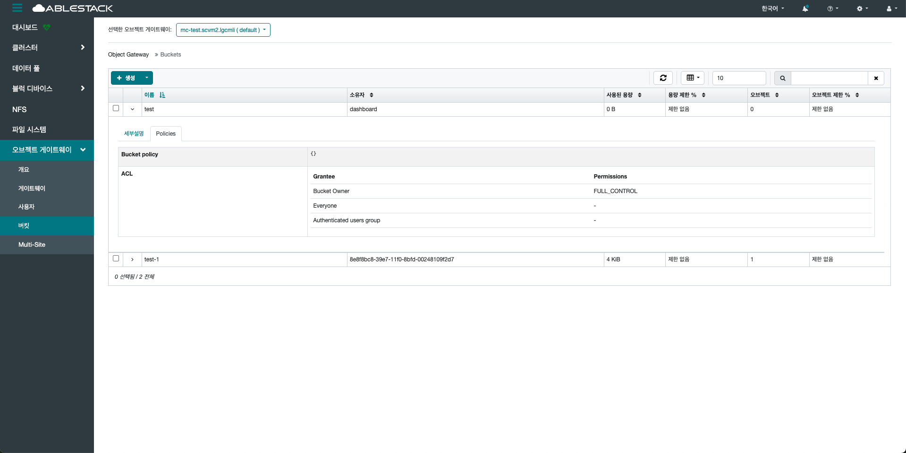
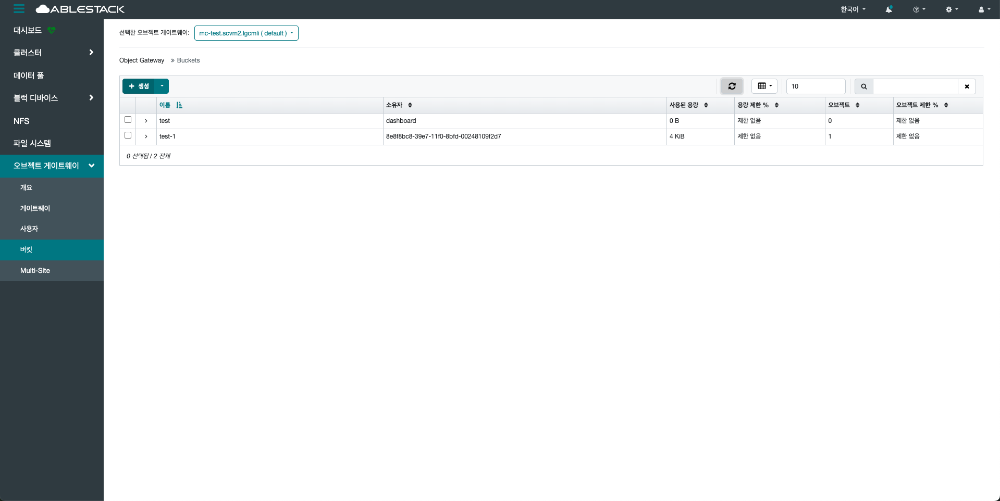
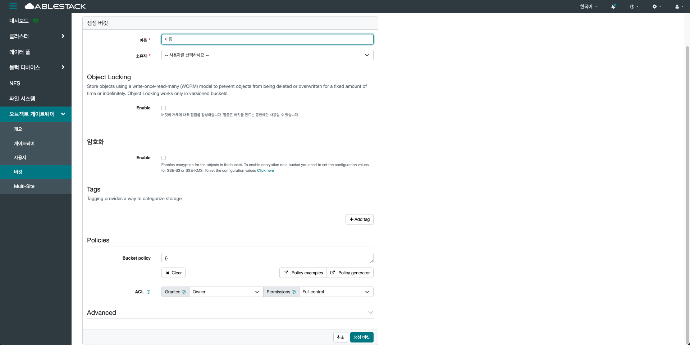
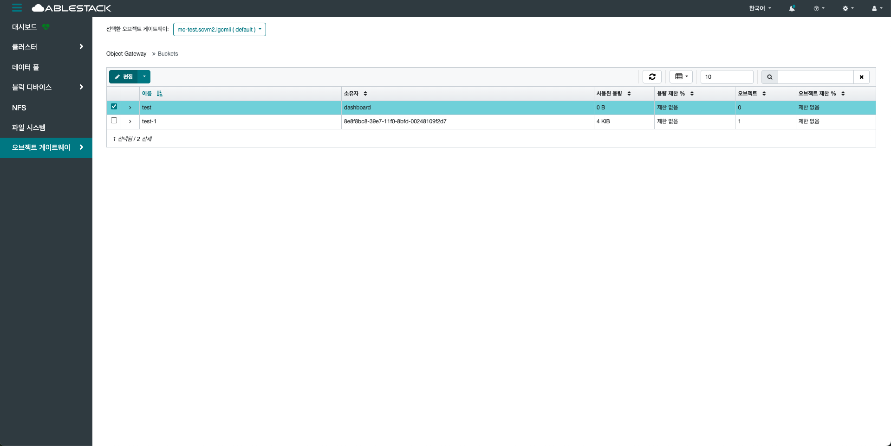
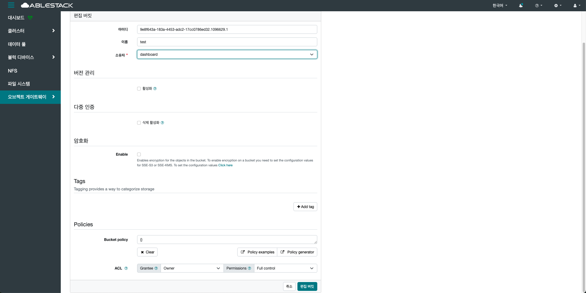
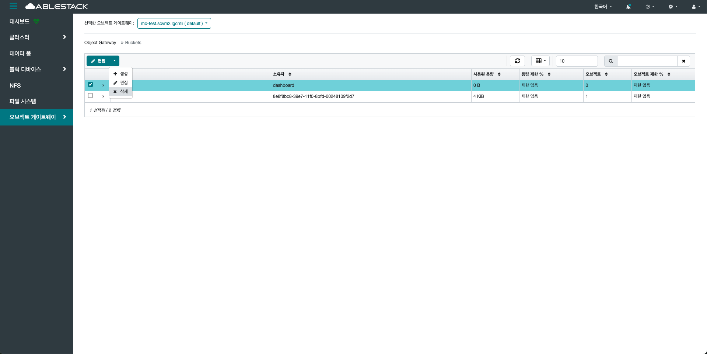
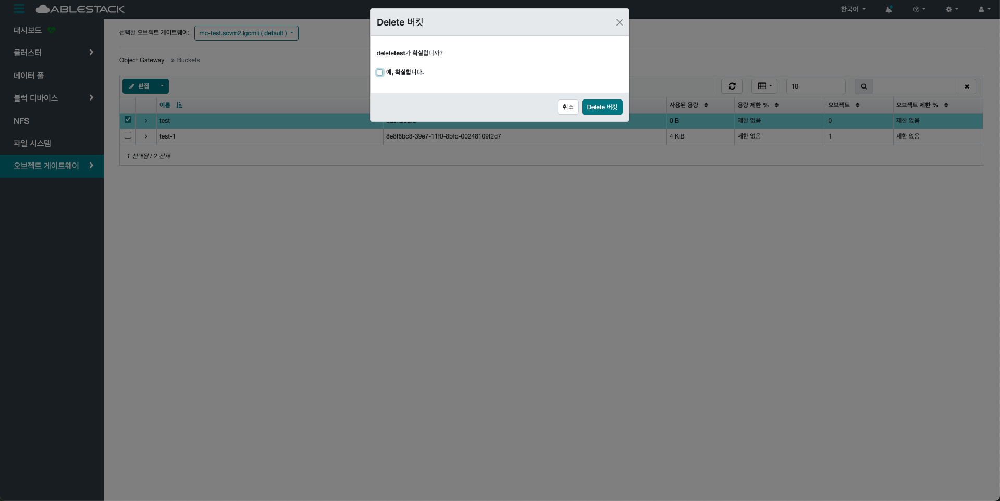

# 버킷
## 개요
RGW에서 객체 데이터를 저장하는 기본 단위입니다.
Amazon S3와 호환되며, 사용자 계정 아래에 생성되어 객체(Object)를 계층 없이 저장합니다.

각 버킷은 고유한 이름을 가지며, 글로벌하게 유일해야 합니다.
버킷 내부에는 메타데이터와 데이터 객체가 포함되어 있으며, RESTful API를 통해 접근합니다.

버킷의 데이터를 RADOS에 분산 저장하여 고가용성과 확장성을 보장합니다.
버킷은 정책(Policy), 라이프사이클(Lifecycle), 버전 관리(Versioning) 등의 기능을 지원합니다.

멀티 사이트(Multi-site) 환경에서는 각 사이트 간 버킷 복제를 통해 데이터 동기화를 수행합니다.

버킷은 사용량 통계, 객체 수, 용량 등의 메트릭을 통해 모니터링이 가능합니다.
Quota 설정을 통해 저장 용량이나 객체 수에 대한 제한을 둘 수 있습니다.
보안 관점에서는 사용자 권한, IAM 정책, 버킷 정책 등을 통해 세부 제어가 가능합니다.

## 버킷 조회(Bucket)
1. 현재 클러스터에 생성된 모든 버킷 목록을 확인할 수 있는 기능입니다. 버킷 이름, 소유자, 생성일자, 객체 수 등 주요 정보를 테이블 형식으로 제공합니다. 필요한 경우 검색을 통하여 확인할 수 있습니다.
    { .imgCenter .imgBorder }

## 세부 설명(Details)
1. 버전 관리, 암호화, MFA 삭제 등 버킷에 대한 정책 정보를 확인할 수 있습니다.
    { .imgCenter .imgBorder }
    - 이름 옆 화살표를 클릭합니다.

## Policies
1. 버킷 또는 사용자에 대한 접근 권한을 정의하는 JSON 기반의 정책 문서입니다. 특정 사용자, 동작, 리소스를 기준으로 세분화된 권한 제어가 가능하며, RGW에서 이를 통해 요청을 허용하거나 거부합니다.
    { .imgCenter .imgBorder }

## 생성(Create)
1. 데이터를 저장하기 위한 논리적 저장 단위를 만드는 작업입니다. 이름, 리전 등 필수 정보를 입력하여 사용자 목적에 맞게 설정할 수 있습니다.
    { .imgCenter .imgBorder }
2. 생성 버튼을 클릭한 화면입니다.
    { .imgCenter .imgBorder }
    - **이름** 을 입력합니다.
    - **소유자** 를 선택합니다.
    - **Object Locking** 은 선택사항 입니다.
    - **암호화** 는 선택사항 입니다.
    - **Policies** 는 선택사항 입니다.
    - **생성 버킷** 을 클릭합니다.

## 편집(Edit)
1. 생성된 버킷을 편집하는 과정입니다.
    { .imgCenter .imgBorder }
    - 편집할 버킷을 선택합니다.
2. 편집 버튼을 클릭한 화면입니다.
    { .imgCenter .imgBorder }
    - 편집할 **메뉴** 에서 수정합니다.
    - **편집 버킷** 을 클릭합니다.

## 삭제(Delete)
1. 생성된 버킷을 삭제하는 과정입니다.
    { .imgCenter .imgBorder }
    - 삭제할 버킷을 선택합니다.
2. 삭제 버튼을 클릭한 화면입니다.
    { .imgCenter .imgBorder }
    - 삭제하실 버킷을 한번 더 확인하신 후, **예, 확살합니다.** 를 선택하여 **Delete 버킷** 을 클릭합니다.
