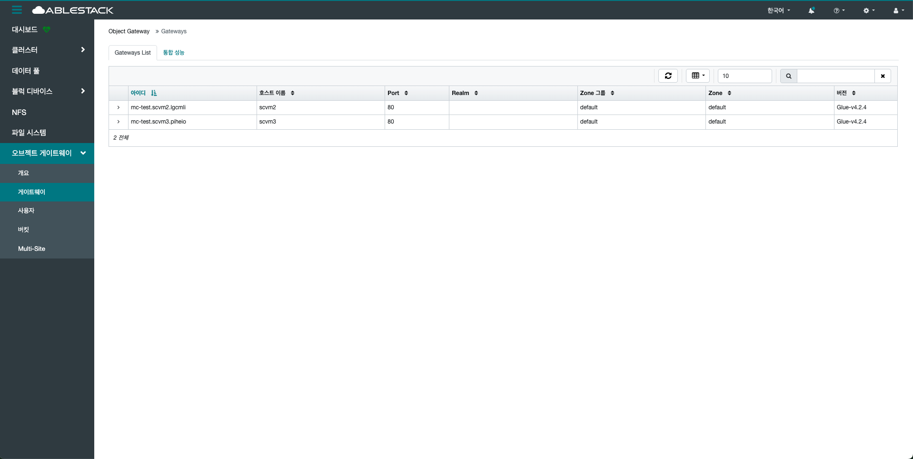
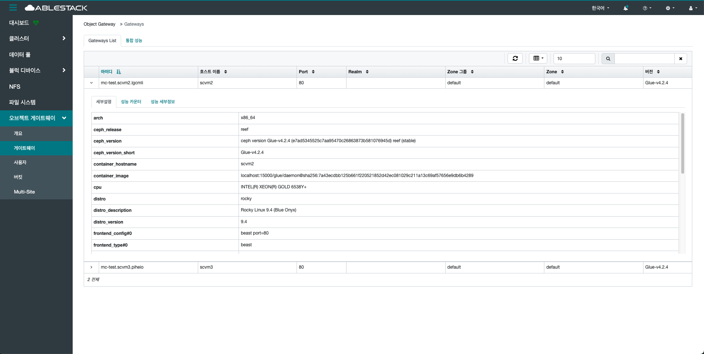
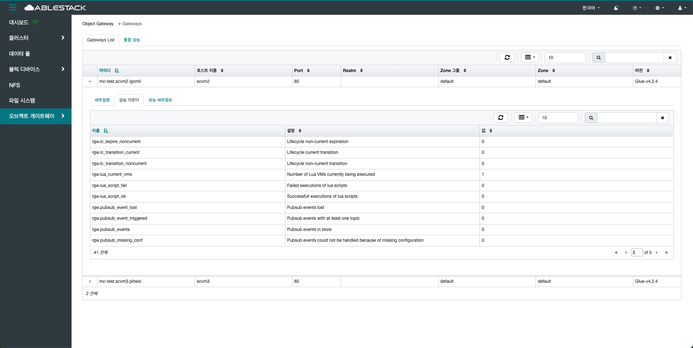
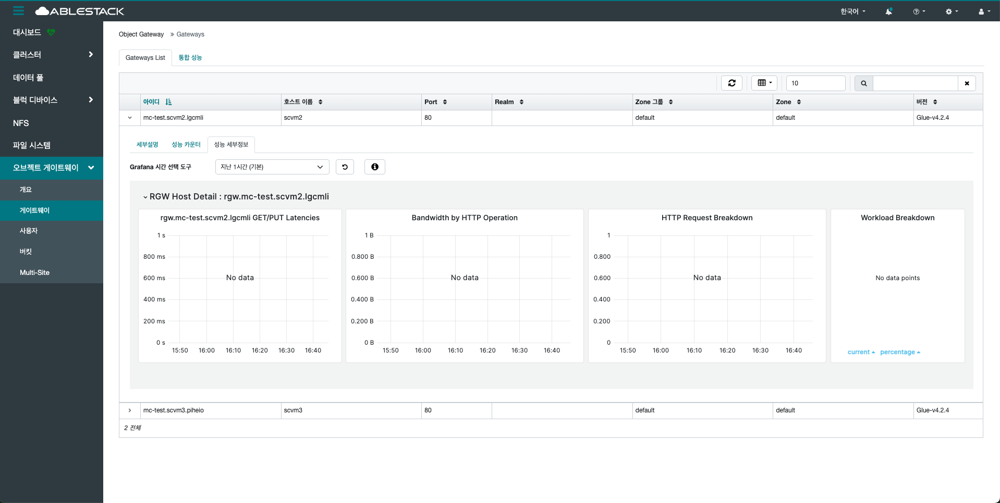
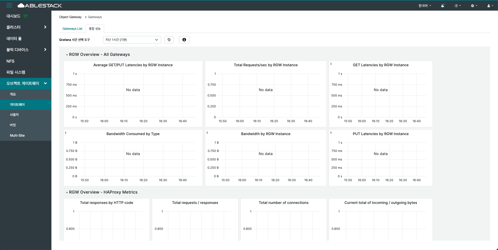

# 게이트웨이
## 개요
RADOS Gateway(RGW)를 관리하고 모니터링하는 중심 기능을 제공합니다.
S3 및 Swift API 호환 서비스를 제공하는 게이트웨이 노드의 상태와 구성을 확인할 수 있습니다.
RGW는 클러스터의 객체 데이터를 외부 애플리케이션에 제공하는 인터페이스로 작동하며, 사용자와 애플리케이션은 이 경로를 통해 객체 데이터를 저장하거나 조회할 수 있습니다.

게이트웨이의 상태, 서비스 포트, 바인딩된 인터페이스 정보 등을 확인할 수 있으며, 오류 발생 시 상태 변경이나 재시작 등의 조치가 가능합니다.
또한 RGW 인스턴스 간의 부하 분산, 고가용성 설정 등도 이 메뉴를 통해 조율할 수 있습니다.
특히 멀티 사이트 동기화(Multi-Site Sync)를 사용하는 경우, 각 사이트별 게이트웨이 연동 상태 및 복제 현황도 확인할 수 있습니다.

RGW가 HTTP RESTful API를 통해 요청을 받아 내부적으로 RADOS에 연산을 수행하며, 이를 통해 객체의 메타데이터 및 실제 데이터를 분산 저장합니다.
이를 통해 대규모 객체 스토리지 서비스를 안정적으로 운영할 수 있도록 지원합니다.

## 게이트웨이 리스트(Gateway List)
1. RGW의 인스턴스 목록을 표시하는 메뉴입니다. 해당 목록을 통해 현재 클러스터에 배포된 RGW 인스턴스들의 상태와 구성을 한눈에 확인할 수 있습니다.
    { .imgCenter .imgBorder }

## 세부설명(Details)
1. 세부 정보를 제공하는 영역입니다. 개별 게이트웨이 구성 및 상태를 보다 구체적으로 확인할 수 있습니다. 아이디 옆 화살표를 클릭합니다.
    { .imgCenter .imgBorder }

## 성능 카운터(Performance Counters)
1. 성능 지표에 따른 세부 성능 설정 값을 확인할 수 있습니다.
    { .imgCenter .imgBorder }

## 성능 세부정보(Performance Details)
1. 각 게이트웨이의 실시간 성능 상태를 수치로 보여주는 지표 모음입니다. 요청 처리 속도, 지연 시간, 처리된 요청 수, 데이터 입출력 양 등이 있으며, 게이트웨이의 현재 부하 상태 및 처리 효율성을 분석할 수 있습니다.
    { .imgCenter .imgBorder }

## 통합 성능(Overall Performance)
1. 모든 게이트웨이의 실시간 성능 상태를 수치로 보여주는 지표 모음입니다. 요청 처리 속도, 지연 시간, 처리된 요청 수, 데이터 입출력 양 등이 있으며, 게이트웨이의 현재 부하 상태 및 처리 효율성을 분석할 수 있습니다.
    { .imgCenter .imgBorder }
