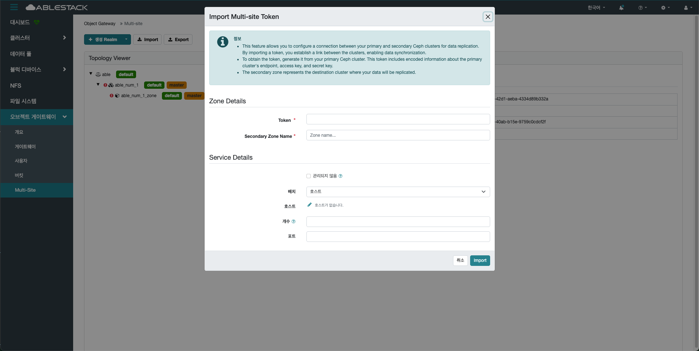

# Multi-Site
## 개요
여러 지역(Region) 간의 데이터 복제를 지원하는 기능으로, RGW간 동기화를 통해 고가용성과 재해 복구(Disaster Recovery)를 제공합니다.

모든 데이터는 Zone 단위로 나뉘며, 하나 이상의 Zone을 묶은 ZoneGroup으로 구성되어 계층적인 복제 구조를 형성합니다.
Primary Zone에 기록된 객체는 Secondary Zone으로 비동기식으로 복제되어 데이터 일관성을 유지합니다.

Multi-Site 환경에서는 각 사이트마다 독립적인 RGW 인스턴스를 가질 수 있어 로컬 성능과 전반적인 확장성을 향상시킵니다.

데이터 복제는 bucket sync와 metadata sync로 구분되며, 세밀한 제어와 모니터링이 가능합니다.

사용자는 각 Zone 별로 트래픽을 분산하거나, 특정 지역 장애 시에도 서비스 연속성을 유지할 수 있습니다.
멀티 리전 아키텍처로 데이터 규제 대응이나 글로벌 서비스 제공에 유리합니다.

동기화 상태는 admin API 또는 Dashboard를 통해 실시간으로 확인할 수 있습니다.
구성 시, 적절한 인증 및 네트워크 연결이 필요하며, 복제 지연이나 충돌 관리에 대한 고려도 필요합니다.
안정성과 확장성을 동시에 확보하고자 하는 분산 오브젝트 스토리지 환경에 적합합니다.

## Multi-Site 조회
1. ZoneGroup과 Zone, 동기화 상태 등의 정보를 조회할 수 있습니다. 복제 지연, 실패 여부 등 상세한 상태도 함께 확인 가능합니다.
    { .imgCenter .imgBorder }

## 생성 Realm(Create Realm)
1. 멀티사이트 구성을 위한 첫 단계로, Object Storage의 글로벌 동기화 범위를 정의합니다.
    { .imgCenter .imgBorder }
2. 생성 Realm 버튼을 클릭한 화면입니다.
    { .imgCenter .imgBorder }
    - **Realm Name** 을 입력합니다.
    - **Create Realm** 을 클릭합니다.

## 생성 Zone Group(Create Zone Group)
1. 여러 Zone을 묶어 복제 도메인을 구성하는 과정입니다. 데이터 복제의 기준이 되는 그룹으로, 하나의 마스터 Zone Group만 설정 가능합니다.
    { .imgCenter .imgBorder }
2. 생성 Zone Group 버튼을 클릭한 화면입니다.
    { .imgCenter .imgBorder }
    - 사전에 정의된 **Select Realm** 을 선택합니다.
    - **Zone Group Name** 을 입력합니다.
    - **Endpoints** 를 입력합니다.
    - **Create Zone Group** 을 클릭합니다.

## 생성 Zone(Create Zone)
1. Zone Group 내에 포함될 복제 단위를 설정하는 작업입니다. 각 Zone은 자체적으로 Object Gateway를 갖추며, 마스터 Zone과 동기화 관계를 가질 수 있습니다.
    { .imgCenter .imgBorder }
2. 생성 Zone 버튼을 클릭한 화면입니다.
    { .imgCenter .imgBorder }
    - 사전에 정의된 **Select Zone Group** 을 선택합니다.
    - **Zone Name** 을 입력합니다.
    - **Endpoints** 를 입력합니다.
    - **Create Zone** 을 클릭합니다.

## Import
1. 기존에 정의된 Realm, Zone Group, Zone 구성 정보를 외부로부터 가져오는 작업입니다.  동일한 멀티사이트 구성을 여러 환경에서 재사용하거나, 백업된 설정을 복원할 때 유용하게 활용됩니다.
    { .imgCenter .imgBorder }
2. Import 버튼을 클릭한 화면입니다.
    { .imgCenter .imgBorder }
    - **Token** 을 입력합니다.
    - **Secondary Zone Name** 을 입력합니다.
    - **배치** 를 선택사항 입니다.
    - **개수 및 포트** 는 선택사항 입니다.
    - **Import** 를 클릭합니다.

## Export
1. 현재 구성된 Realm, Zone Group, Zone 설정 정보를 JSON 형식으로 추출하는 기능입니다. 이를 통해 설정을 백업하거나, 다른 클러스터에 동일한 멀티사이트 구성을 적용할 수 있습니다.
    { .imgCenter .imgBorder }
2. Export 버튼을 클릭한 화면입니다.
    { .imgCenter .imgBorder }
    - **Realm Name** 을 확인합니다.
    - **Token** 의 복사 버튼을 클릭합니다.
    - 복사한 Token을 가지고, Import를 실행합니다.

## Edit
1. 구성된 Realm, Zone Group, Zone 설정 정보를 편집할 수 있는 기능입니다. 해당 Realm, Zone Group, Zone 을 클릭하여 Edit를 클릭합니다.
    { .imgCenter .imgBorder }
2. Edit 버튼을 클릭한 화면입니다.
    { .imgCenter .imgBorder }
    - 편집할 **Realm Name** 을 편집합니다.
    - **Edit Realm** 을 클릭합니다.

    !!! info
        Realm, Zone Group, Zone 설정 정보는 각 메뉴에 따라 포함된 항목과 형식이 상이하므로, 편집 전 수정하려는 메뉴와 해당 설정 정보를 정확히 확인한 후 편집을 진행하시길 바랍니다.

## Delete
1. 기본(Default)으로 구성된 Realm, Zone Group, Zone은 삭제할 수 없습니다. 추가로 생성된 항목만 삭제가 가능하며, 삭제하려는 Realm, Zone Group, Zone을 선택한 후 Delete 버튼을 클릭합니다.
    { .imgCenter .imgBorder }
2. Delete 버튼을 클릭한 화면입니다.
    { .imgCenter .imgBorder }
    - 삭제하실 항목을 다시 한번 더 확인 하신 후, **예,확실합니다.** 를 선택하여 **Delete realm** 를 클릭합니다.
