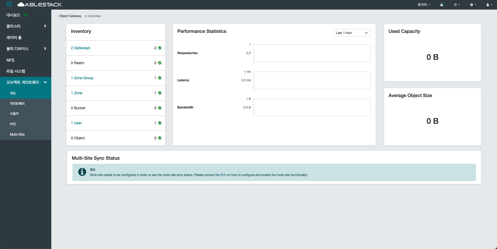

# 개요
## 개요
S3 및 Swift 호환 API를 통해 객체 데이터를 저장하고 접근할 수 있는 분산 스토리지 시스템입니다.
RADOS(Reliable Autonomic Distributed Object Store)를 기반으로 하며, 고가용성과 데이터 복제 기능을 제공합니다.
내부적으로 데이터를 객체 단위로 저장하며, 메타데이터와 데이터가 분리되어 저장되어 효율적인 관리가 가능합니다.

게이트웨이(예: RGW, Rados Gateway)를 통해 HTTP 기반 REST API 요청을 받아 처리합니다.
사용자는 Bucket을 생성하고, 그 안에 객체를 업로드하며 권한을 설정할 수 있습니다.

멀티 사이트(Multi-Site) 구성도 가능하여 지리적 분산 환경에서도 동기화 및 복제가 가능합니다.
내부 인증 외에도 LDAP, Keystone 등 외부 인증 연동이 가능합니다.

QoS, 버전 관리, 로그 수집 등 고급 기능도 제공하여 엔터프라이즈 환경에서도 적합합니다.

통합된 클러스터 환경 내에서 Block, File과 함께 동시에 사용할 수 있어 유연한 구조를 갖습니다.
장기 보관, 미디어 저장, 백업, 웹 서비스 정적 자산 저장 등 다양한 활용이 가능합니다.

## 개요 조회
1. Object Storage에 대한 전반적인 현황을 확인할 수 있습니다.
    { .imgCenter .imgBorder }

    * Inventory 카드
        * 현재 구성된 Object Gateway와 사용자 계정, 버킷(Bucket) 등의 전체 개요 정보를 제공합니다.
        * 리소스 수와 상태를 한눈에 파악할 수 있도록 요약된 형태로 보여줍니다.
        * 각 탭을 클릭할 시, 해당 메뉴로 넘어갑니다.

    * Performance Statistics 카드
        * 전체 Object Gateway의 요청 처리량, 지연 시간 등의 성능 지표를 실시간 및 시간 별로 확인할 수 있습니다.
        * 서비스 품질을 모니터링하고 병목 현상을 분석하는 데 유용합니다.

    * Used Capacity 카드
        * 전체 객체 스토리지에서 사용된 총 저장 용량을 보여줍니다.
        * 계정 또는 버킷 단위로도 세부 용량 확인이 가능합니다.

    * Average Object Size 카드
        * 저장된 객체들의 평균 크기를 계산하여 보여줍니다.
        * 스토리지 사용 패턴 및 최적화 방향을 판단하는 데 도움이 됩니다.

    * Multi-Site Sync Status 카드
        * 멀티사이트 간 동기화 현황을 나타내며, 동기화 지연이나 오류 여부를 확인할 수 있습니다.
        * 지리적으로 분산된 환경에서도 데이터 일관성을 유지하는 데 중요한 항목입니다.
