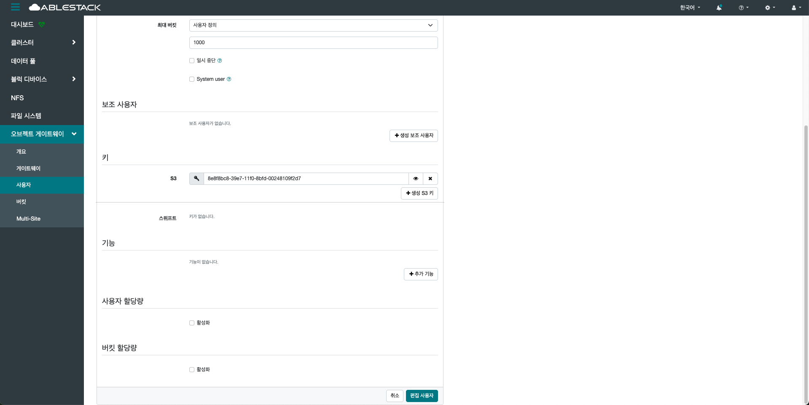

# 사용자
## 개요
RGW(RADOS Gateway)를 통해 객체 저장소에 접근할 수 있는 사용자 계정을 의미합니다.

사용자는 S3 및 Swift API 을 위한 접근 키(Access Key)와 비밀 키(Secret Key)를 부여받아 객체 저장소 리소스에 접근합니다.
각 사용자는 자체적으로 버킷(Bucket)을 생성하고, 객체(Object)를 업로드하거나 다운로드할 수 있는 권한을 가집니다.

사용자별로 쿼터(Quota), 버킷 개수, 사용 용량 등을 제한할 수 있어 효율적인 리소스 관리가 가능합니다.
추가적으로 사용자 그룹을 구성하여 정책 기반 접근 제어를 수행할 수 있습니다.

사용자 정보는 radosgw-admin 또는 API를 통해 관리 및 조회할 수 있으며, 인증 방식은 AWS S3 호환 표준을 따릅니다.
이러한 사용자 관리는 멀티 테넌시(Multi-Tenancy) 환경을 지원하는 데 필수적입니다.
또한 사용자 계정은 Multi-Site 환경에서 동기화되어 글로벌 접근 제어를 제공할 수 있습니다.

UI를 통해 사용자 생성. 키 관리, 권한 변경 등이 직관적으로 수행 가능합니다.
결과적으로 Object Storage 사용자 기능은 객체 저장소 서비스의 보안성과 확장성을 모두 만족시키는 핵심 구성 요소입니다.

## 사용자 조회(Users)
1. Object Storage에 등록된 사용자 목록과 상세 정보를 확인할 수 있는 기능입니다. 각 사용자의 접근 키, 생성된 버킷 수, 사용 용량, 권한 상태 등을 한눈에 확인할 수 있어 계정 관리와 모니터링에 유용합니다.
    { .imgCenter .imgBorder }

### 생성(Create)
1. 새로운 사용자 계정을 등록하는 과정입니다.
    { .imgCenter .imgBorder }
2. 사용자 ID, 접근 키, 비밀 키 등을 자동 또는 수동으로 설정할 수 있으며, 필요한 경우 사용량 제한과 권한도 함께 지정할 수 있습니다. 이를 통해 외부 시스템이나 애플리케이션이 S3 API를 통해 안전하게 스토리지에 접근할 수 있도록 구성합니다. 생성 버튼을 클릭한 화면입니다.
    { .imgCenter .imgBorder }
    - **사용자 ID** 를 입력합니다.
    - **전체 이름** 을 입력합니다.
    - **이메일 주소** 를 입력합니다.
    - **최대 버킷** 을 설정합니다.
    - **사용자 할당량** 은 선택 사항입니다.
    - **버킷 할당량** 은 선택 사항입니다.
    - **생성 사용자** 버튼을 클릭합니다.

### 편집(Edit)
1. 생성된 사용자 계정을 편집하는 과정입니다.
    { .imgCenter .imgBorder }
    - 편집할 사용자를 클릭한 후, 편집 버튼을 클릭합니다.
2. 사용자 ID, 이메일 주소, 키, 권한 재설정 등 수동으로 설정할 수 있으며, 필요한 경우 사용량 제한과 권한도 함께 지정할 수 있씁니다. 편집 버튼을 클릭한 화면입니다.
    { .imgCenter .imgBorder }
    - 편집할 **메뉴** 를 선택하여 수정합니다.
    { .imgCenter .imgBorder }
    - 편집이 완료되었으면 **편접 사용자** 버튼을 클릭합니다.

### 삭제(Delete)
1. 생성된 사용자 계정을 삭제하는 과정입니다.
    { .imgCenter .imgBorder }
    - 삭제할 사용자를 클릭한 후, 삭제 버튼을 클릭합니다.
2. 삭제 버튼을 클릭한 화면입니다.
    { .imgCenter .imgBorder }
    - 삭제하실 계정을 한번 더 확인하신 후, **예, 확실합니다.** 를 선택하여 **Delete 사용자** 버튼을 클릭합니다.

## 역할 조회(Roles)
1. 사용자 또는 서비스의 권한을 정의하는 정책 단위입니다. 특정 리소스(S3 버킷, 오브젝트 등)에 대해 어떤 작업(읽기, 쓰기, 삭제 등)을 수행할 수 있는 지를 규정하며, 사용자에게 역할을 할당함으로써 세밀한 접근 제어를 구현할 수 있습니다. 또한 JSON 형식의 정책 문서를 통해 구성되며, IAM(Identity and Access Management) 기반의 정책 설정을 지원하여 보안성과 유연성을 제공합니다.
    { .imgCenter .imgBorder }
    - 생성된 역할의 옆 화살표를 클릭하면 아이디 및 역할 정책 문서를 보다 자세하게 확인할 수 있습니다.

### 생성(Create)
1. 새로운 역할을 등록하는 과정입니다.
    { .imgCenter .imgBorder }
2. 역할 이름, 경로, 역할 가정 정책 문서를 설정할 수 있습니다. 생성 버튼을 클릭한 화면입니다.
    { .imgCenter .imgBorder }
    - **Role name** 을 입력합니다.
    - **Path** 를 입력합니다.
    - **Assume Role Policy Document** 에 JSON 형식의 역할 기반 정책 문서를 입력합니다.
    - **Create Role** 버튼을 클릭합니다.

    !!! check
        Path는 반드시 "/" 로 끝나야 합니다.

        Assume Role Policy Document 는 반드시 올바른 JSON 형식으로 작성되어야 합니다.

### 편집(Edit)
1. 생성된 역할을 편집하는 과정입니다.
    { .imgCenter .imgBorder }
    - 생성된 역할을 선택하여 편집 버튼을 클릭합니다.
2. 편집 버튼을 클릭한 화면입니다.
    { .imgCenter .imgBorder }
    - 편집할 **Role name** 을 수정합니다.
    - 편집할 **Max Session Duration** 을 수정합니다.
    - **Edit Role** 을 클릭합니다.

### 삭제(Delete)
1. 생성된 역할을 삭제하는 과정입니다.
    { .imgCenter .imgBorder }
    - 생성된 역할을 선택하여 삭제 버튼을 클릭합니다.
2. 삭제 버튼을 클릭한 화면입니다.
    { .imgCenter .imgBorder }
    - 삭제하실 역할을 한번 더 확인하신 후, **예, 확실합니다.** 를 선택합니다.
    - **Delete Role** 을 클릭합니다.
