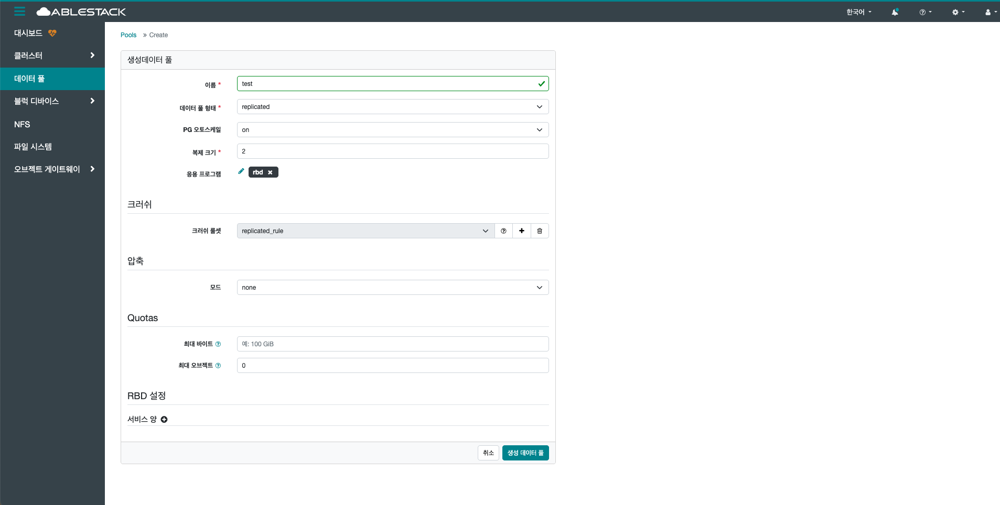

# 데이터 풀

## 개요
클러스터 내의 풀(Pool) 들에 대한 상태와 세부 정보를 시각적으로 확인하고 관리할 수 있는 기능입니다. Glue의 Pool은 데이터를 저장하기 위한 논리적 공간이며, 각 Pool은 특정한 CRUSH 규칙, 복제 방식, PG 개수 등을 관리할 수 있습니다.

## 목록 조회

1. 데이터 풀 목록을 확인하는 화면입니다.
    생성된 데이터 풀 목록을 확인하거나 데이터 풀 생성 버튼을 클릭하여 데이터 풀을 생성할 수 있습니다.
    { .imgCenter .imgBorder }

## 세부 설명 조회

1. 데이터 풀의 세부 설명 정보를 확인할 수 있습니다.
    { .imgCenter .imgBorder }

## 성능 세부정보 조회

1. 데이터 풀의 성능 세부정보 정보를 대시보드로 확인할 수 있습니다.
    { .imgCenter .imgBorder }

## 설정 조회

1. 데이터 풀의 설정 정보를 확인할 수 있습니다.
    { .imgCenter .imgBorder }

## 생성

1. 생성 버튼을 클릭 하여 생성데이터 풀 화면을 호출합니다.

    { .imgCenter .imgBorder }

2. 데이터 풀 생성을 위한 항목을 입력합니다.

    { .imgCenter .imgBorder }

    * **이름:** 이름을 입력합니다.
    * **데이터 풀 형태:** 데이터 풀 형태를 선택합니다.
    * **PG 오토스케일:** PG 오토스케일을 선택합니다.
    * **복제 크기:** 복제 크기를 입력합니다. (기본은 2벌 복제 입니다.)
    * **응용 프로그램:** 응용 프로그램을 선택합니다.
    * **크러쉬 룰셋:** 크러쉬 룰셋을 선택합니다.
    * **모드:** 모드를 선택합니다.
    * 필요시 **쿼터** 를 설정합니다.
    * **생성 데이터 풀** 버튼을 클릭하여 데이터 풀을 생성합니다.

## 편집

1. 선택한 데이터 풀의 정보를 편집합니다.

    { .imgCenter .imgBorder }

    * 목록에서 편집할 데이터 풀을 선택합니다.
    * **편집** 버튼을 클릭하여 데이터풀 편집 화면을 호출합니다.

    { .imgCenter .imgBorder }

    * 수정할 **항목** 을 입력합니다.
    * **편집 데이터 풀** 버튼을 클릭하여 데이터 풀을 편집합니다.

## 삭제

1. 선택한 데이터 풀을 삭제합니다.

    { .imgCenter .imgBorder }

    * 목록에서 삭제할 데이터 풀을 선택합니다.
    * **삭제** 버튼을 클릭하여 Delete Pool 화면을 호출합니다.

2. 데이터 풀 삭제를 위한 항목을 입력합니다.

    { .imgCenter .imgBorder }

    * **예, 확실합니다.** 를 체크 합니다.
    * **Delete Pool** 버튼을 클릭하여 데이터 풀을 삭제합니다.

## 통합 성능 조회

1. 데이터 풀의 통합 성능 정보를 대시보드로 확인할 수 있습니다.
    { .imgCenter .imgBorder }
