# 계정

## 개요
계정은 ABLESTACK 클라우드 리소스를 관리하고 사용하는 기본 단위입니다. 각 계정은 가상 머신, 스토리지, 네트워크 등 리소스를 소유하고 관리할 수 있으며, 리소스 사용에 대한 과금도 계정 단위로 이루어집니다. 계정 내에는 여러 사용자를 생성하고, 리소스에 대한 구성을 제한할 수 있습니다. 계정은 조직이나 개인이 리소스를 효율적으로 관리하고 협업하며 시스템을 안전하게 운영할 수 있도록 도와줍니다.

## 목록 조회

1. 계정 목록을 확인하는 화면입니다. 생성된 계정 목록을 확인하거나 계정 추가 버튼을 클릭하여 계정을 추가할 수 있습니다.

    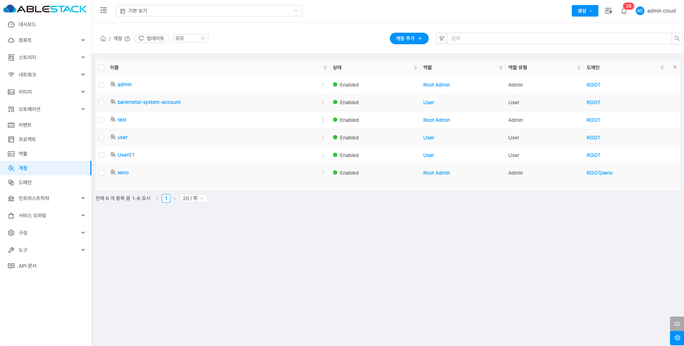{ align=center }

## 계정 추가

1. 계정 추가 버튼 클릭 하여 계정 추가 팝업을 호출합니다.
    
    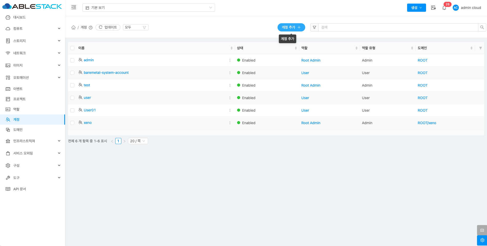{ align=center }

2. 계정 추가를 위한 항목을 입력합니다.

    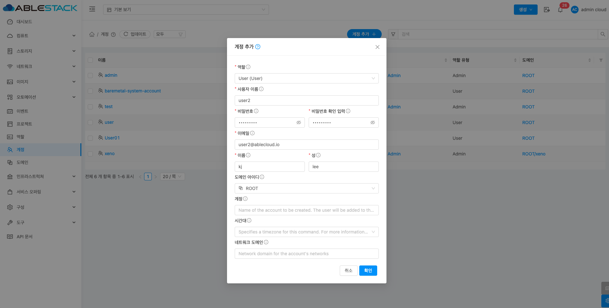{ align=center }

    * **역할:** 역할을 선택합니다.
    * **사용자 이름:** 사용자 이름을 입력합니다.
    * **비밀번호:** 비밀번호를 입력합니다.
    * **비밀번호 확인 입력:** 비밀번호 확인 입력을 입력합니다.
    * **이메일:** 이메일을 입력합니다.
    * **이름:** 이름을 입력합니다.
    * **성:** 성을 입력합니다.
    * **도메인 아이디:** 도메인 아이디를 선택합니다.
    * **확인** 버튼을 클릭하여 계정을 추가합니다.

## 계정 편집

1. 해당 계정 정보를 편집합니다.

    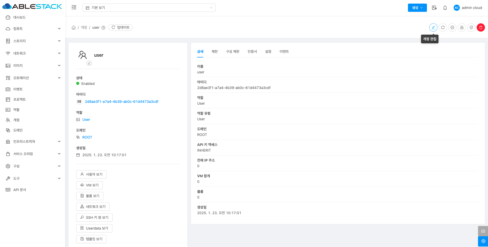{ align=center }

    * **계정 편집** 버튼을 클릭하여 편집 화면을 호출합니다.

    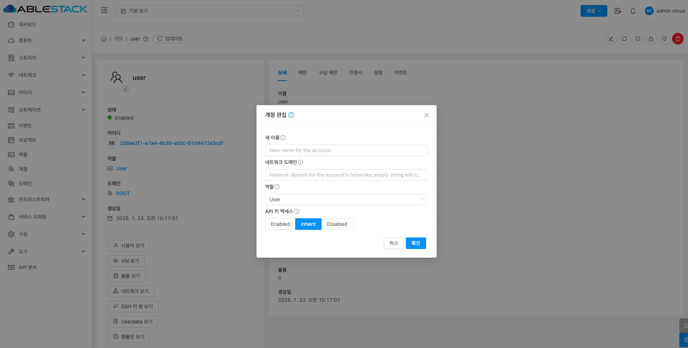{ align=center }

    * 수정할 **항목** 을 입력합니다.
    * **확인** 버튼을 클릭하여 계정을 업데이트합니다.

## 리소스 수 업데이트

1. 해당 계정이 사용 가능한 리소스 수를 업데이트합니다.

    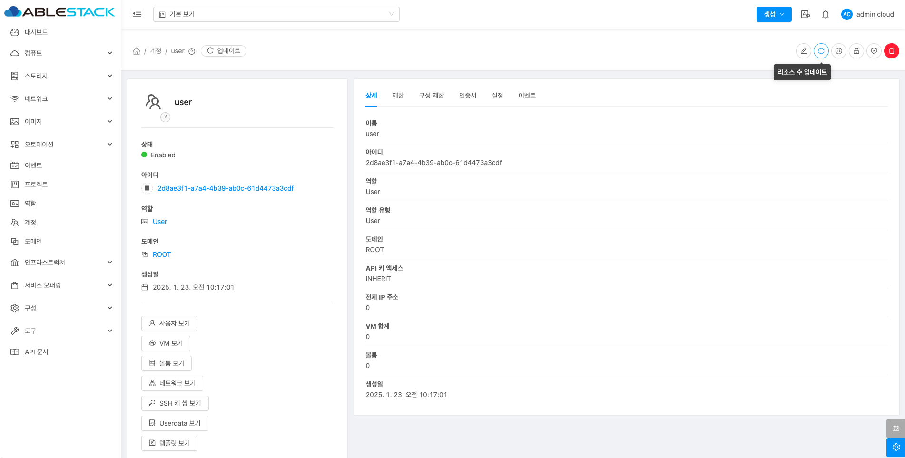{ align=center }

    * **리소스 수 업데이트** 버튼을 클릭하여 편집 화면을 호출합니다.

    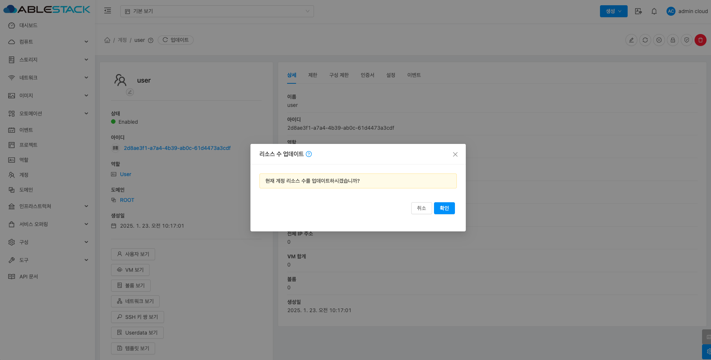{ align=center }

    * **확인** 버튼을 클릭하여 리소스 수 업데이트합니다.

## 계정 비활성화

!!! warning
    해당 계정의 모든 사용자가 클라우드 리소스에 접근 할 수 없게 됩니다. 실행중인 모든 가상머신은 바로 종료 됩니다.

1. 해당 계정을 비활성화합니다.

    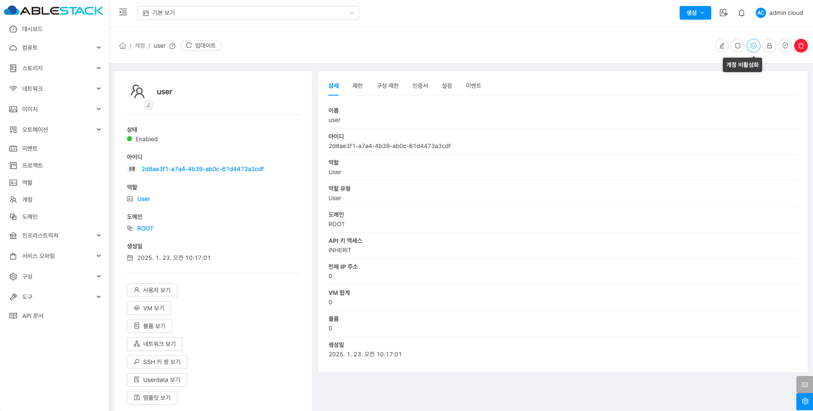{ align=center }

    * **계정 비활성화** 버튼을 클릭하여 계정 비활성화 화면을 호출합니다.

    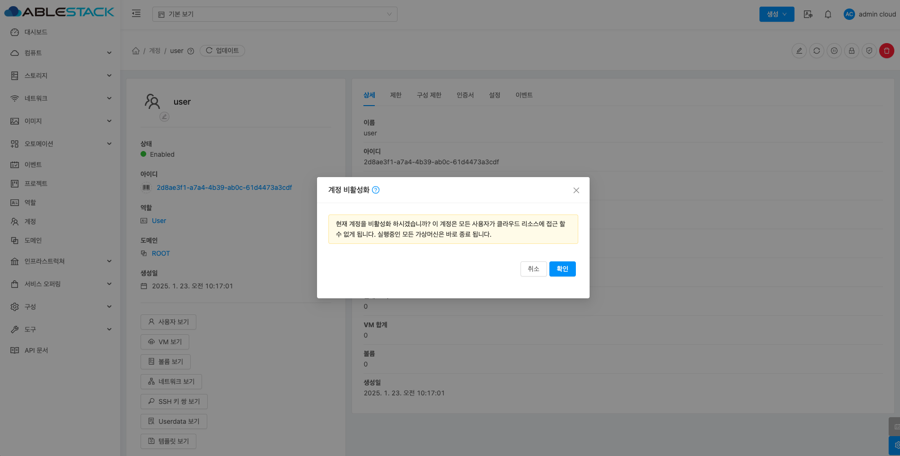{ align=center }

    * **확인** 버튼을 클릭하여 계정 비활성화합니다.

## 계정 활성화

1. 해당 계정을 활성화합니다.

    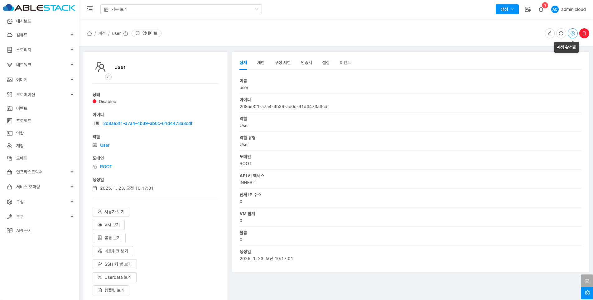{ align=center }

    * **계정 활성화** 버튼을 클릭하여 계정 활성화 화면을 호출합니다.

    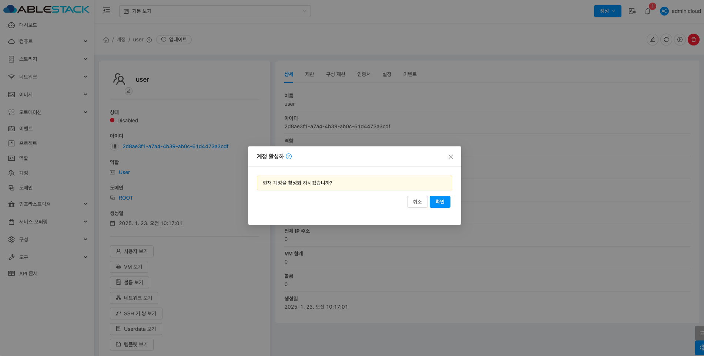{ align=center }

    * **확인** 버튼을 클릭하여 계정 활성화합니다.

## 계정 잠금

!!! warning
    해당 계정의 모든 사용자가 클라우드 리소스를 관리할 수 없게 됩니다. 그 후도 기존 Zone 리소스에는 접근 할 수 있습니다.

1. 해당 계정을 잠금 설정니다. 

    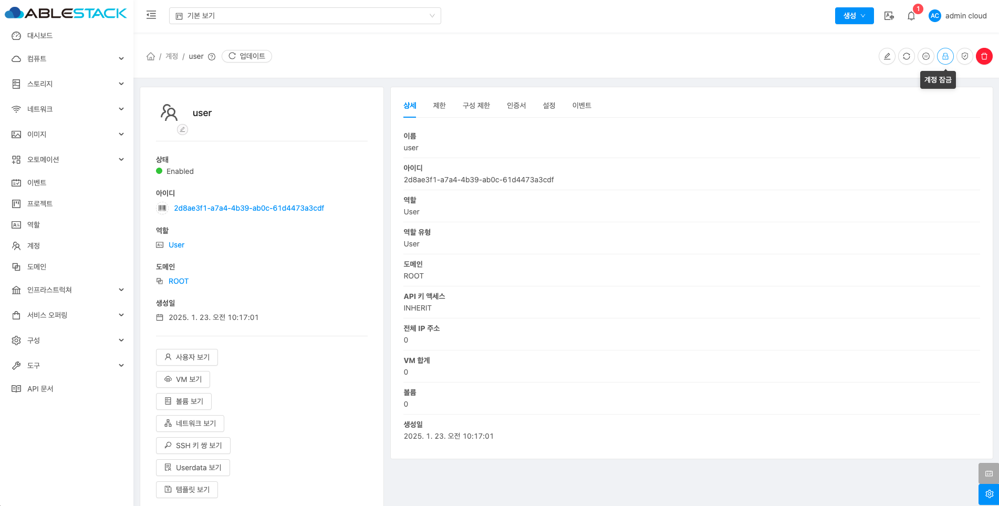{ align=center }

    * **계정 잠금** 버튼을 클릭하여 계정 잠금 화면을 호출합니다.

    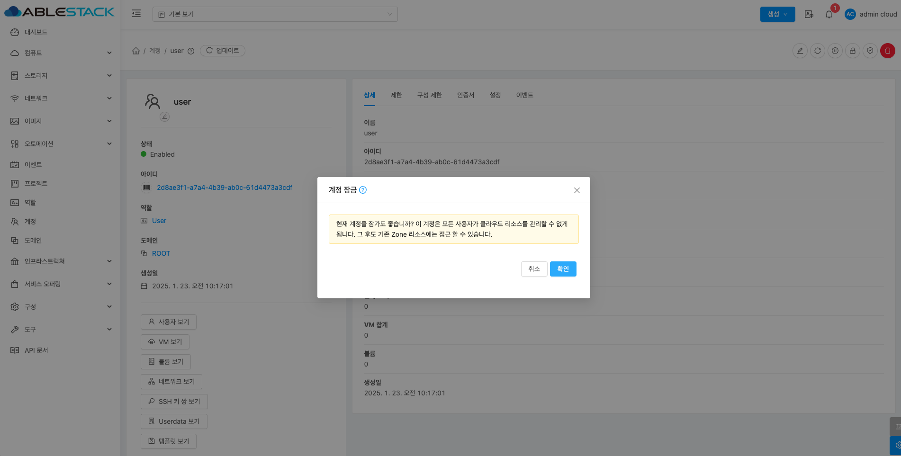{ align=center }

    * **확인** 버튼을 클릭하여 계정 잠금 설정합니다.

## 인증서 추가

1. 인증서를 추가합니다.

    { align=center }

    * **인증서 추가** 버튼을 클릭하여 인증서 추가 화면을 호출합니다.

    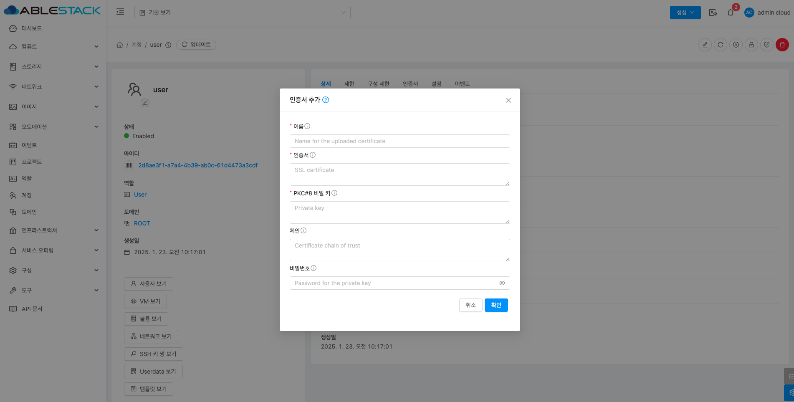{ align=center }

    * **확인** 버튼을 클릭하여 계정에 인증서를 추가합니다.

## 계정 삭제

1. 해당 계정을 삭제합니다.

    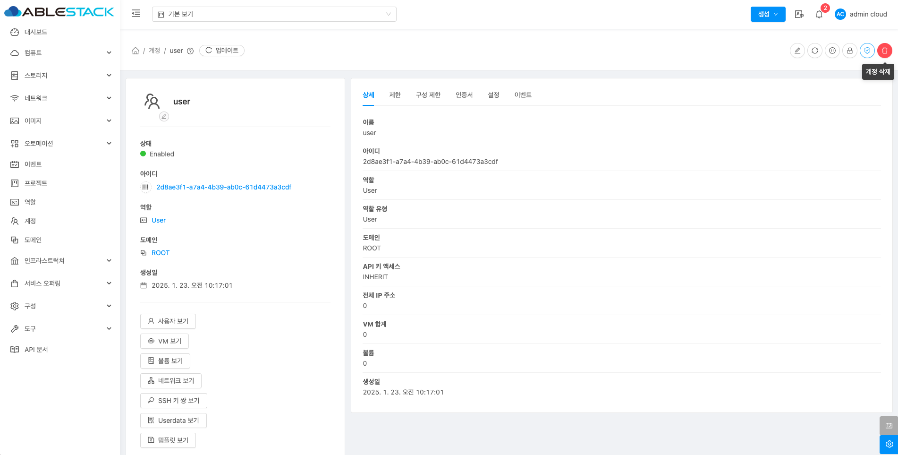{ align=center }

    * **계정 삭제** 버튼을 클릭하여 계정 삭제 화면을 호출합니다.

    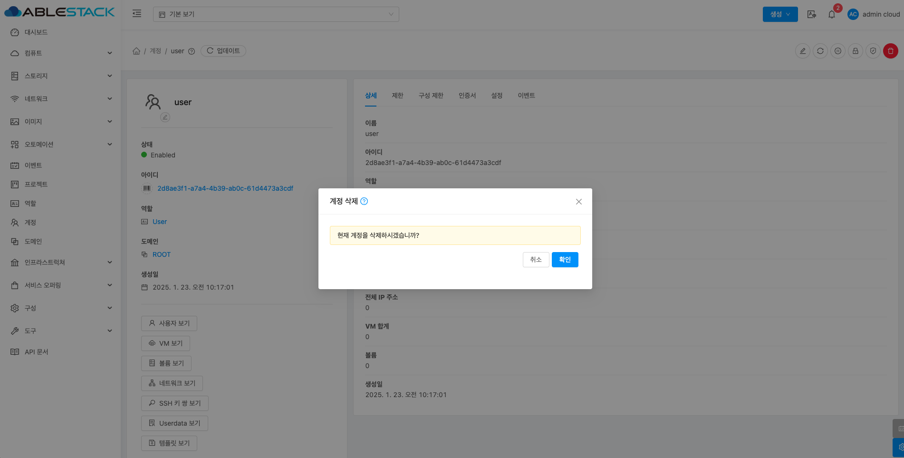{ align=center }

    * **확인** 버튼을 클릭하여 계정을 삭제합니다.

## 상세 탭

1. 계정에 대한 상세정보를 조회하는 화면입니다. 해당 계정의 이름, 아이디, 역할, 역할 유형, 도메인, API 키 액세스, 전체 IP 주소, VM 합계, 볼륨, 생성일 등의 정보를 확인할 수 있습니다.

    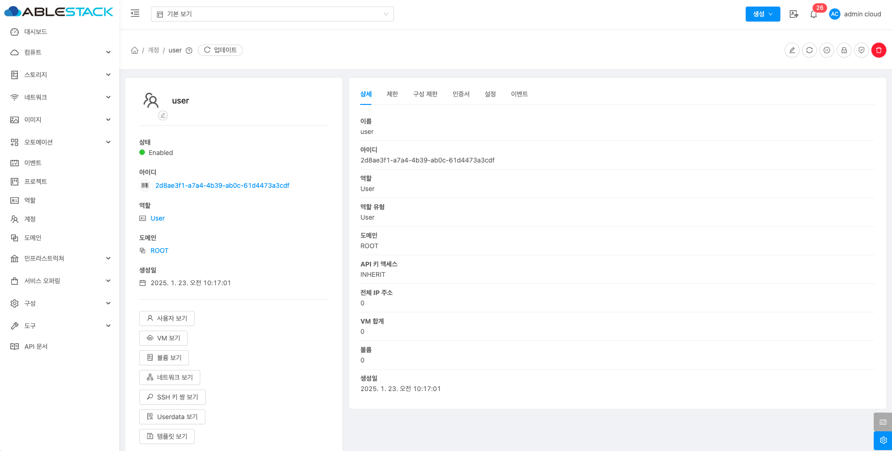{ align=center }

## 제한 탭

1. 해당 계정에 할당된 자원에 대하여 ( 사용됨/제한 ) 으로 계산하여 시각적으로 보여주는 화면입니다.

    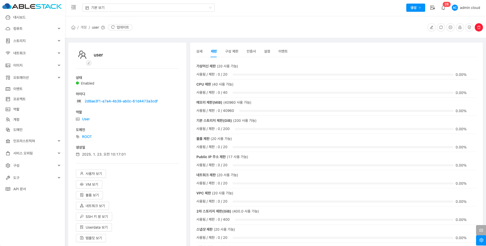{ align=center }

## 구성 제한 탭

1. 해당 계정에 리소스를 할당하는 기능입니다. 해당 기능을 통해 계정에서 사용 가능한 자원의 최대값을 설정할 수 있습니다.

    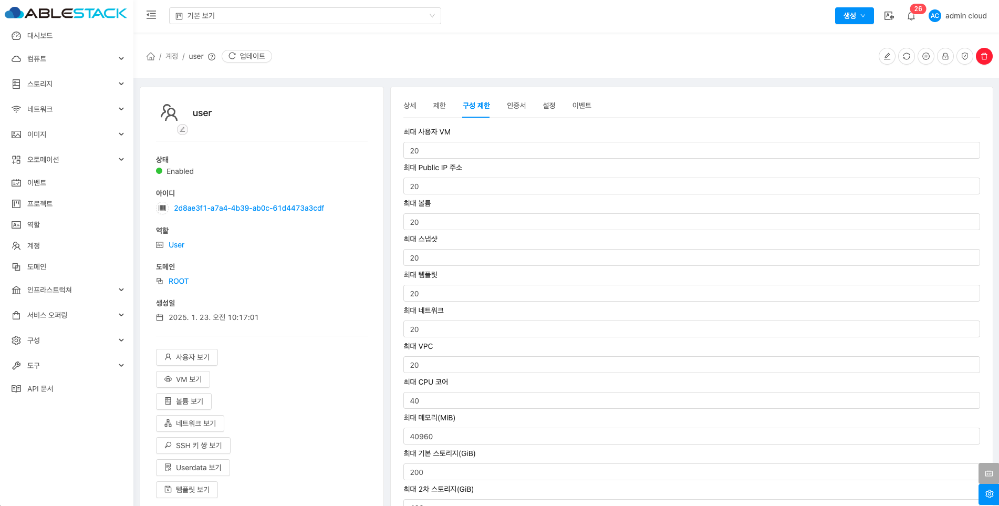{ align=center }
    
    * 자원 할당 수를 확인 하거나 변경합니다.

    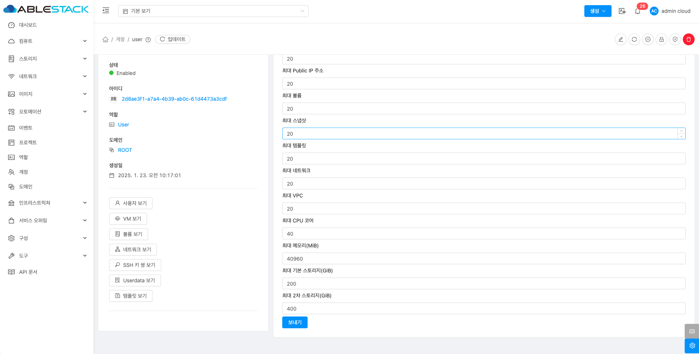{ align=center }

    * **보내기** 버튼을 클릭하여 구성 제한을 편경합니다.

## 인증서 탭

1. 계정에 추가된 인증서 정보를 조회하는 화면입니다.

    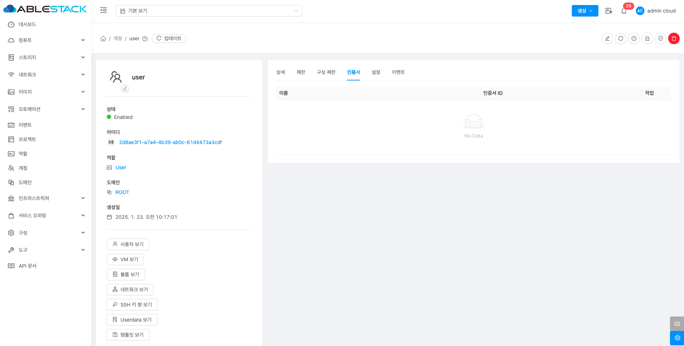{ align=center }

## 설정 탭

1. 계정에서 사용하는 설정을 조회 및 관리하는 화면입니다. 해당 계정 설정 정보를 편집하고 초기값으로 원복할 수 있습니다.

    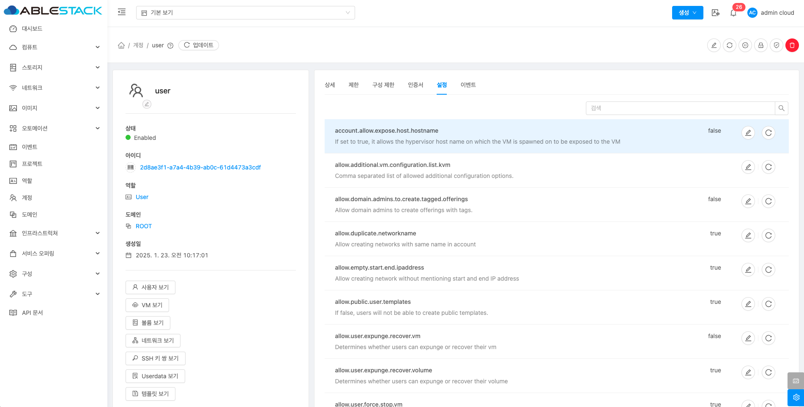{ align=center }

### 편집

1. 계정에 설정 값을 변경합니다.

    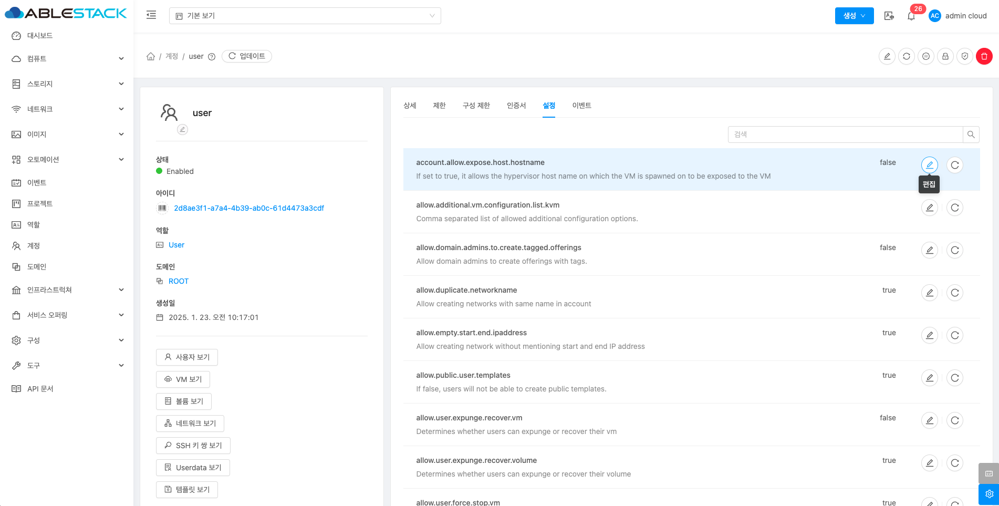{ align=center }

    * 설정 값을 수정후 확인 버튼을 클릭하여 해당 계정에 설정 값을 변경합니다. 

### 기본값으로 재설정

1. 계정의 설정 값을 초기값으로 재설정합니다.

    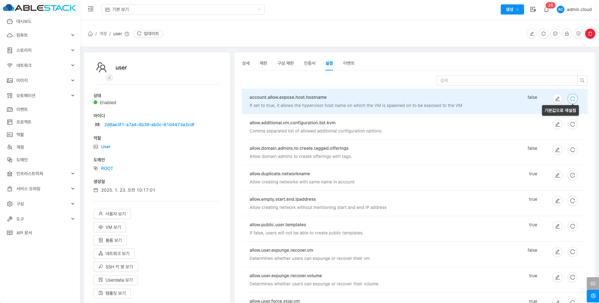{ align=center }

## 이벤트 탭

1. 계정에 관련된 이벤트 정보를 확인할 수 있는 화면입니다. 계정에서 발생한 다양한 액션과 변경 사항을 쉽게 파악할 수 있습니다.

    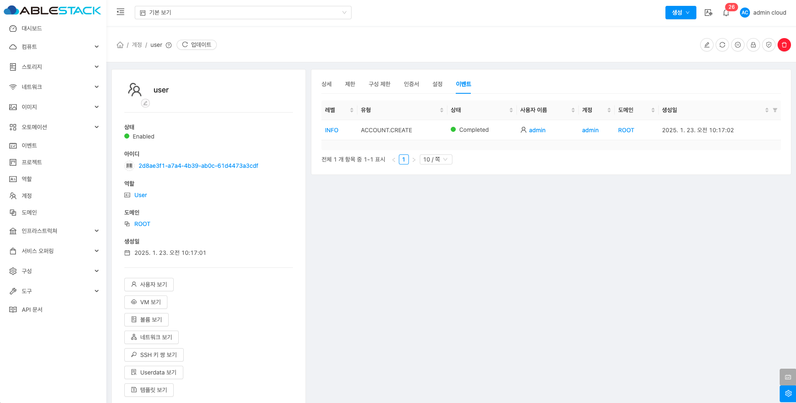{ align=center }
