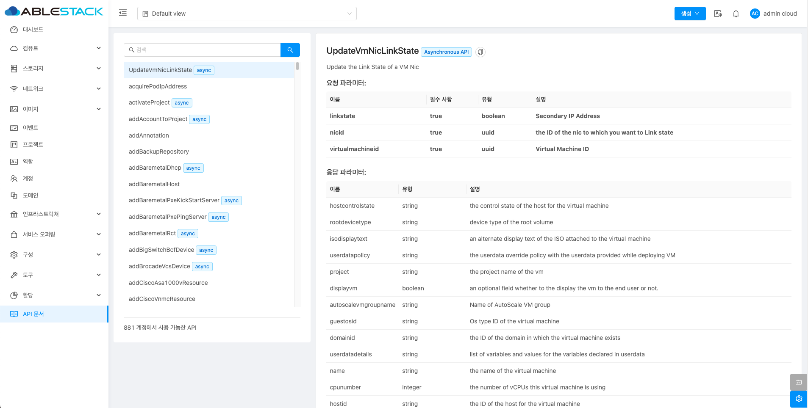

# API 문서

## 개요
ABLESTACK API Docs 메뉴는 Mold의 기능을 프로그래밍적으로 제어할 수 있는 API에 대한 문서를 제공합니다. 이 메뉴에서는 API 엔드포인트, 요청 파라미터, 응답 형식 등을 상세히 설명하며, 개발자가 Mold의 다양한 기능을 자동화하거나 외부 시스템과 통합할 때 필요한 정보를 제공합니다. 각 API 호출에 대한 예제와 응답 형식(JSON, XML 등)도 제공되어 효율적인 사용이 가능합니다.

## API 문서 조회

1. ABLESTACK Mold에서 사용 가능한 API 목록을 제공합니다. 목록을 선택하여 API를 요청 및 응답 파라미터를 확인할 수 있습니다.

    { .imgCenter .imgBorder }
