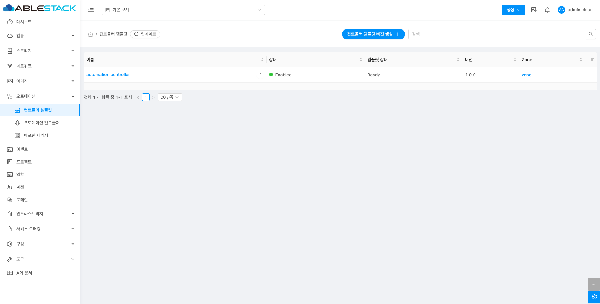
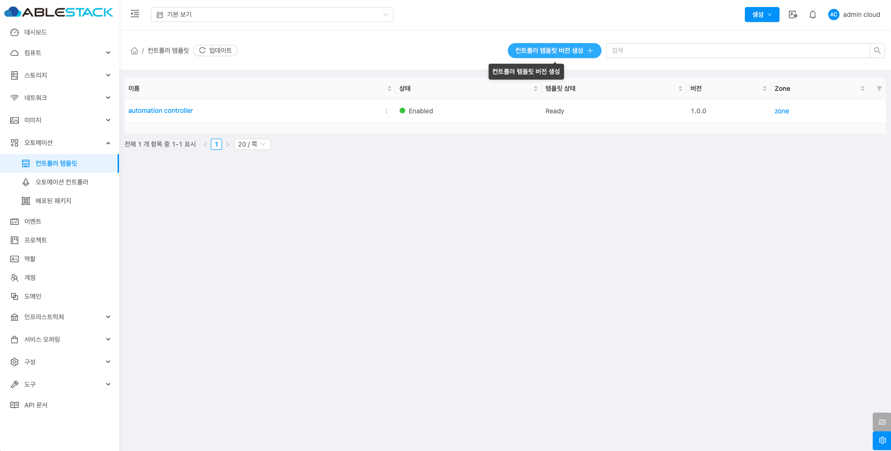
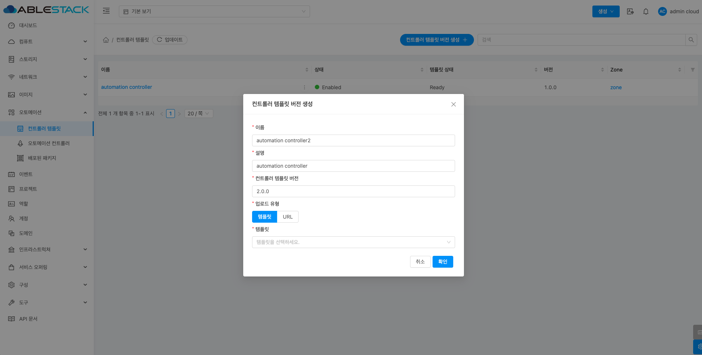
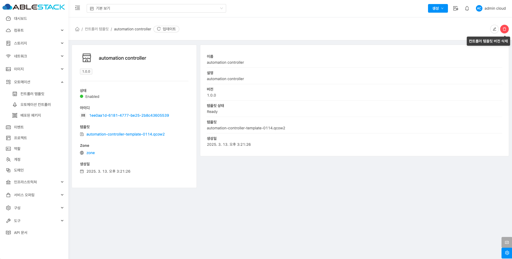
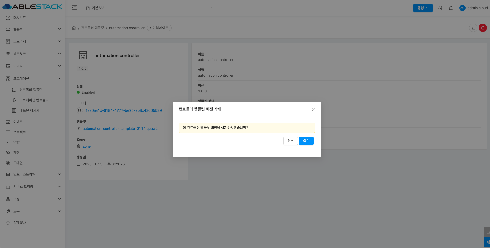
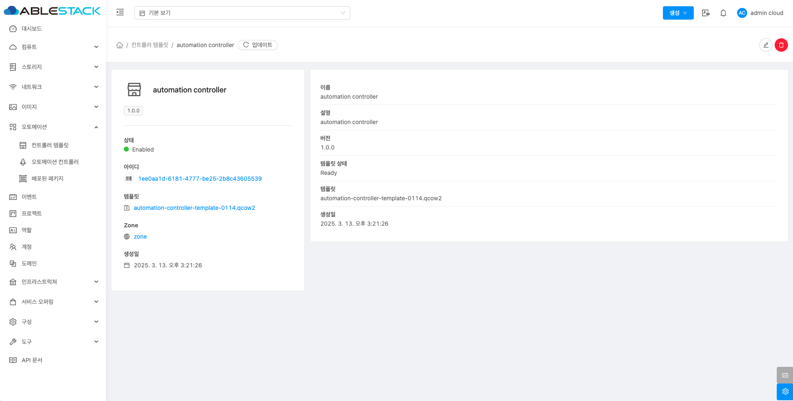
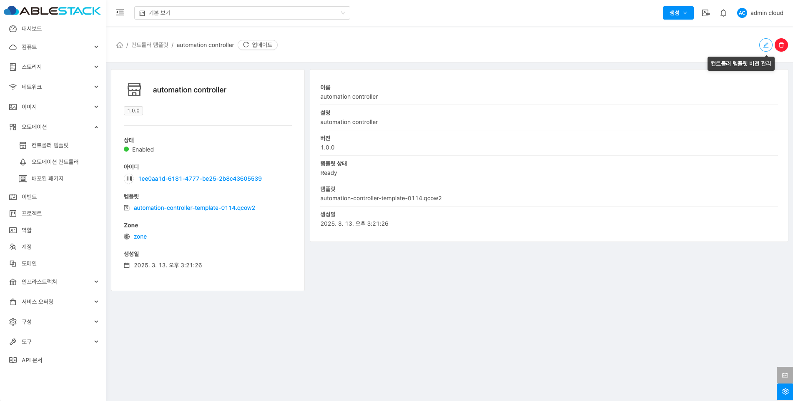
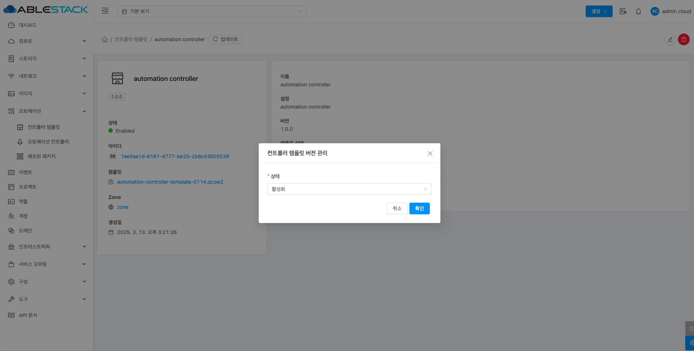

# 컨트롤러 템플릿

## 개요
ABLESTACK에서 제공하는 자동화 기능을 수행하는 컨트롤러 템플릿입니다. 자동화 기능을 사용하려면 해당 템플릿을 사용해야합니다.

## 목록 조회

1. 컨트롤러 템플릿 목록을 확인하는 화면입니다.
    생성된 컨트롤러 템플릿 목록을 확인하거나 컨트롤러 템플릿 버전 생성 버튼을 클릭하여 컨트롤러 템플릿을 생성할 수 있습니다.
    { .imgCenter .imgBorder }

## 컨트롤러 템플릿 추가

1. 컨트롤러 템플릿 추가 버튼 클릭 하여 컨트롤러 템플릿 추가 팝업을 호출합니다.

    { .imgCenter .imgBorder }

2. 컨트롤러 템플릿 추가를 위한 항목을 입력합니다.

    { .imgCenter .imgBorder }

    * **이름:** 이름을 입력합니다.
    * **설명:** 설명을 입력합니다.
    * **컨트롤러 템플릿 버전:** 컨트롤러 템플릿 버전을 입력합니다.
    * **업로드 유형:** 업로드 유형을 선택합니다.
    * **템플릿:** 템플릿을 선택합니다.
    * **확인** 버튼을 클릭하여 컨트롤러 템플릿을 추가합니다.

## 컨트롤러 템플릿 버전 삭제

1. 해당 컨트롤러 템플릿을 삭제합니다.

    { .imgCenter .imgBorder }

    * **컨트롤러 템플릿 버전 삭제** 버튼을 클릭하여 컨트롤러 템플릿 버전 삭제 화면을 호출합니다.

    { .imgCenter .imgBorder }

    * **확인** 버튼을 클릭하여 컨트롤러 템플릿을 삭제화합니다.

## 상세 탭

1. 컨트롤러 템플릿에 대한 상세정보를 조회하는 화면입니다. 해당 컨트롤러 템플릿의 이름, 설명, 버전, 템플릿 상태, 템플릿, 생성일 등의 정보를 확인할 수 있습니다.

    { .imgCenter .imgBorder }

## 컨트롤러 템플릿 버전 관리

1. 해당 컨트롤러 템플릿을 활성화 또는 비활성화시킵니다.

    { .imgCenter .imgBorder }

    * **컨트롤러 템플릿 버전 관리** 버튼을 클릭하여 컨트롤러 템플릿 버전 관리 화면을 호출합니다.

    { .imgCenter .imgBorder }

    * **상태:** 상태를 선택합니다.
        * 상태를 비활성화 하면 오토메이션 컨트롤러 생성시 템플릿에서 안보이게 됩니다.
    * **확인** 버튼을 클릭하여 컨트롤러 템플릿을 활성화 또는 비활성화합니다.
