# 컨트롤러 템플릿

## 개요
ABLESTACK에서 제공하는 자동화 기능을 수행하는 오토메이션 컨트롤러를 관리하는 기능입니다. 해당 기능으로 미리 구성된 자동화 도구 Playbook을 실행여 자동으로 가상머신 및 네트워크를 생성하고 서비스를 설치할 수 있습니다. 

## 목록 조회

1. 컨트롤러 템플릿 목록을 확인하는 화면입니다.
    생성된 컨트롤러 템플릿 목록을 확인하거나 컨트롤러 템플릿 버전 생성 버튼을 클릭하여 컨트롤러 템플릿을 생성할 수 있습니다.
    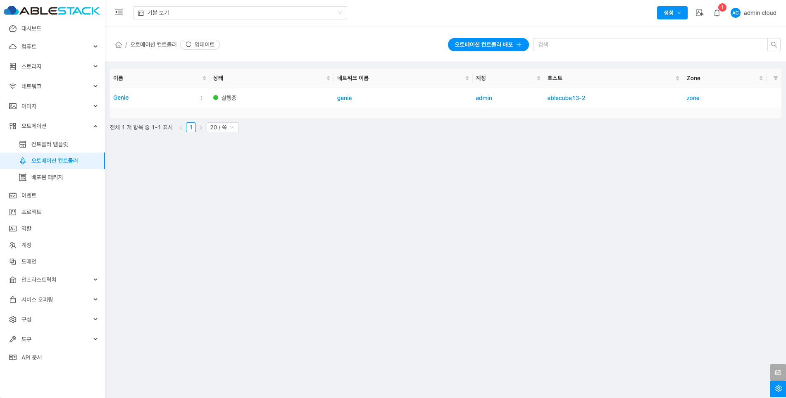{ align=center }

## 오토메이션 컨트롤러 배포

1. 컨트롤러 템플릿 추가 버튼 클릭 하여 컨트롤러 템플릿 추가 팝업을 호출합니다.
    
    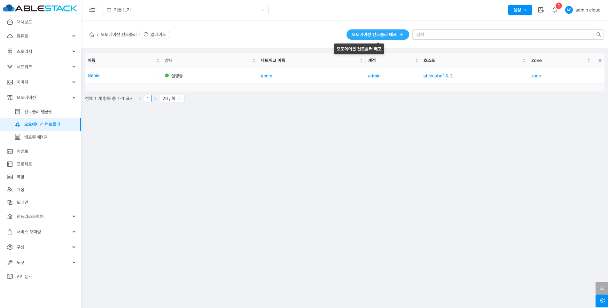{ align=center }

2. 컨트롤러 템플릿 추가를 위한 항목을 입력합니다.

    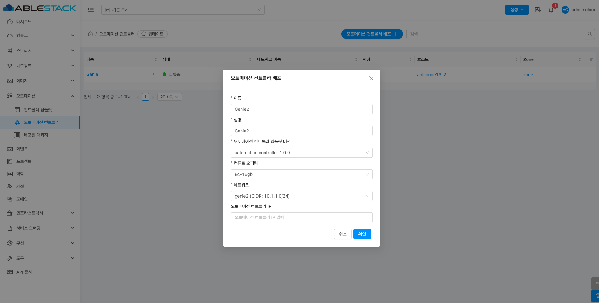{ align=center }

    * **이름:** 이름을 입력합니다.
    * **설명:** 설명을 입력합니다.
    * **컨트롤러 템플릿 버전:** 컨트롤러 템플릿 버전을 선택합니다.
    * **컴퓨트 오퍼링:** 컴퓨트 오퍼링을 선택합니다.
    * **네트워크:** 네트워크를 선택합니다.
    * **확인** 버튼을 클릭하여 오토메이션 컨트롤러를 배포합니다.

## Genie 대시보드 연결

1. Genie 대시보드 웹 포털에 접근할 수 있습니다.

    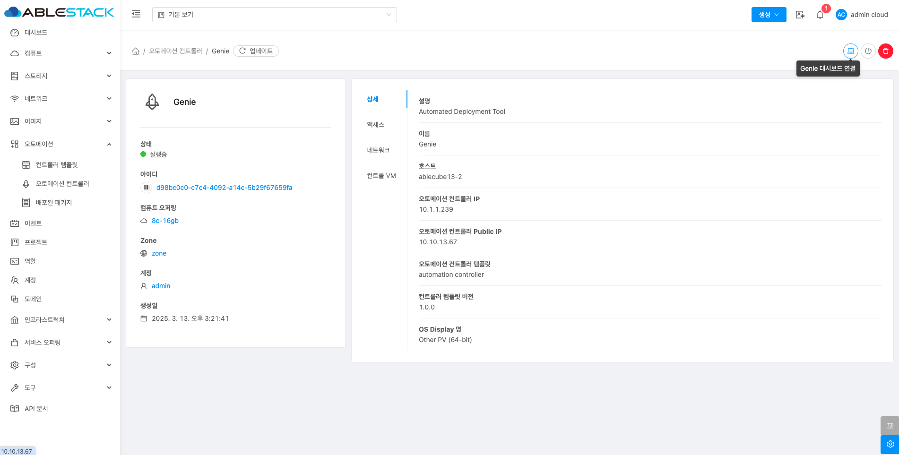{ align=center }

    * **Genie 대시보드 연결** 버튼을 클릭하여 Genie 대시보드 웹 포털에 접속합니다.

    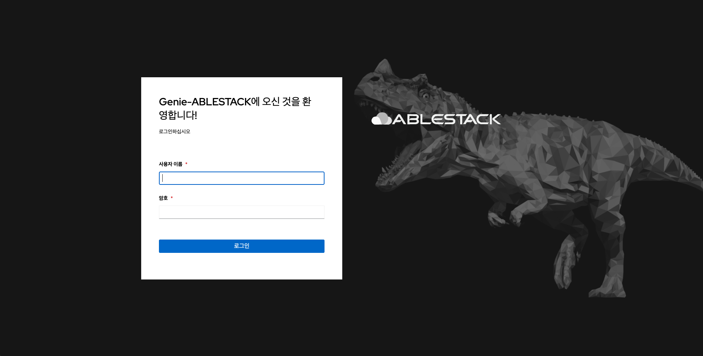{ align=center }

    * 접속된 web ui를 확인할 수 있습니다.

## 오토메이션 컨트롤러 정지

!!! info
    오토메이션 컨트롤러를 포함하여 관리하는 가상머신을 모두 정지합니다.

1. 해당 컨트롤러 템플릿을 정지 시킵니다.

    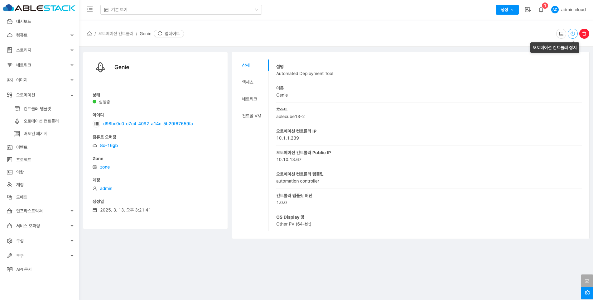{ align=center }

    * **오토메이션 컨트롤러 정지** 버튼을 클릭하여 오토메이션 컨트롤러 정지 화면을 호출합니다.

    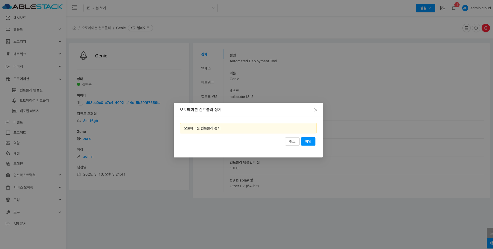{ align=center }

    * **확인** 버튼을 클릭하여 컨트롤러 템플릿을 정지합니다.

## 오토메이션 컨트롤러 시작

!!! info
    오토메이션 컨트롤러를 포함하여 관리하는 가상머신을 모두 시작합니다.

1. 해당 컨트롤러 템플릿을 시작 시킵니다.

    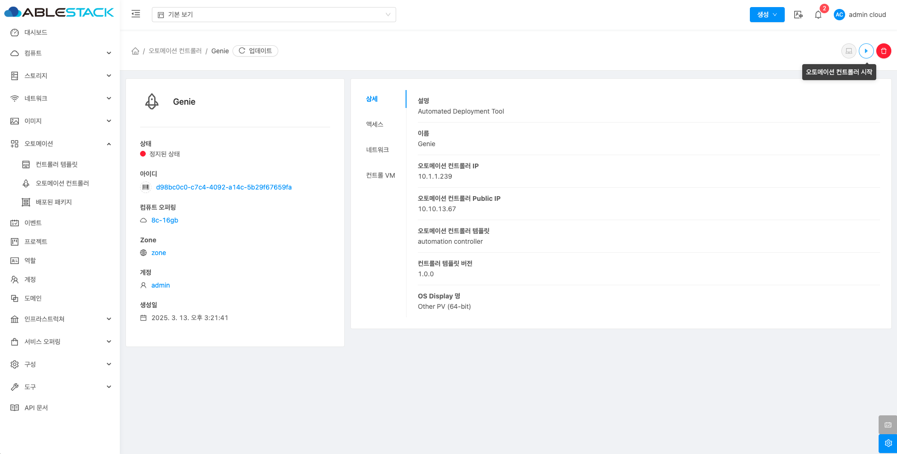{ align=center }

    * **오토메이션 컨트롤러 시작** 버튼을 클릭하여 오토메이션 컨트롤러 시작 화면을 호출합니다.

    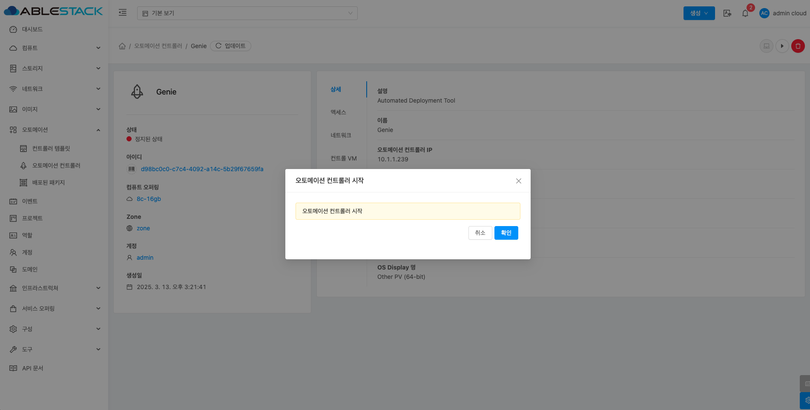{ align=center }

    * **확인** 버튼을 클릭하여 컨트롤러 템플릿을 시작합니다.

## 오토메이션 컨트롤러 삭제

!!! info
    오토메이션 컨트롤러를 포함하여 관리하는 가상머신을 모두 삭제합니다.

1. 해당 컨트롤러 템플릿을 삭제 시킵니다.

    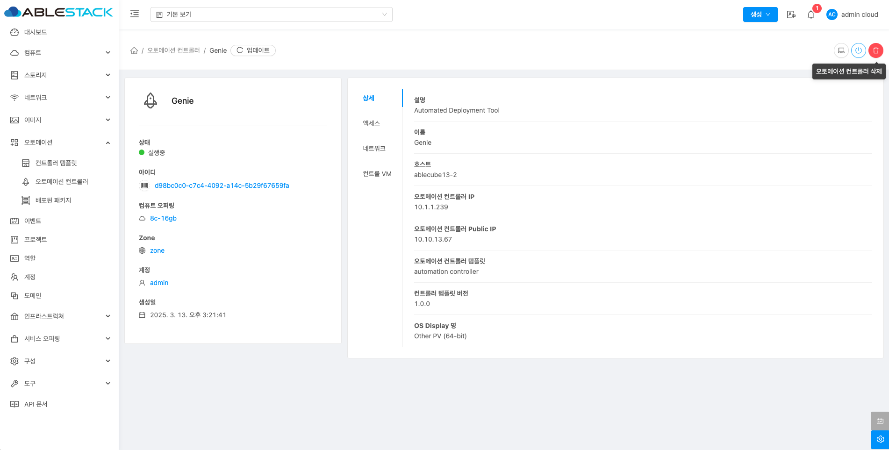{ align=center }

    * **오토메이션 컨트롤러 삭제** 버튼을 클릭하여 오토메이션 컨트롤러 삭제 화면을 호출합니다.

    { align=center }

    * **확인** 버튼을 클릭하여 컨트롤러 템플릿을 삭제합니다.

## 상세 탭

1. 오토메이션 컨트롤러에 대한 상세정보를 조회하는 화면입니다. 해당 오토메이션 컨트롤러의 설명, 이름, 호스트, 오토메이션 컨트롤러 IP, 오토메이션 컨트롤러 Public IP, 컨트롤러 템플릿 버전, OS Display 명 등의 정보를 확인할 수 있습니다.

    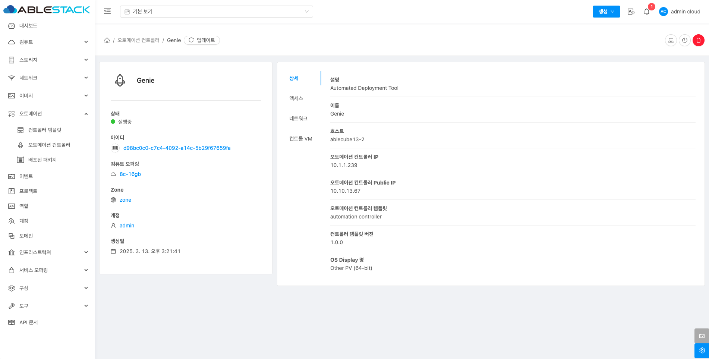{ align=center }

## 액세스 탭

1. 오토메이션 컨트롤러에 접근하는 방법을 설명하는 화면입니다.

    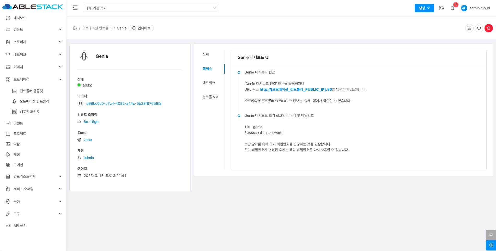{ align=center }

## 네트워크 탭

1. 오토메이션 컨트롤러에 네트워크를 조회하는 화면입니다.

    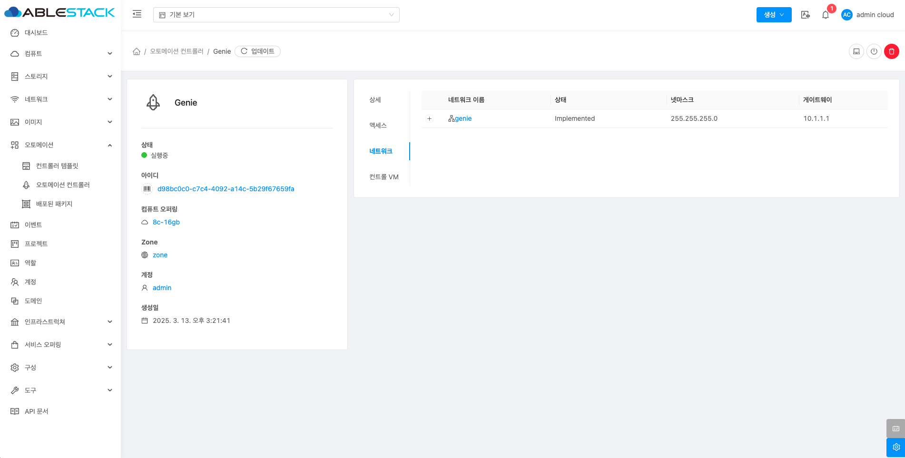{ align=center }

## 컨트롤러 VM 탭

1. 오토메이션 컨트롤러 가상머신을 조회하는 화면입니다.

    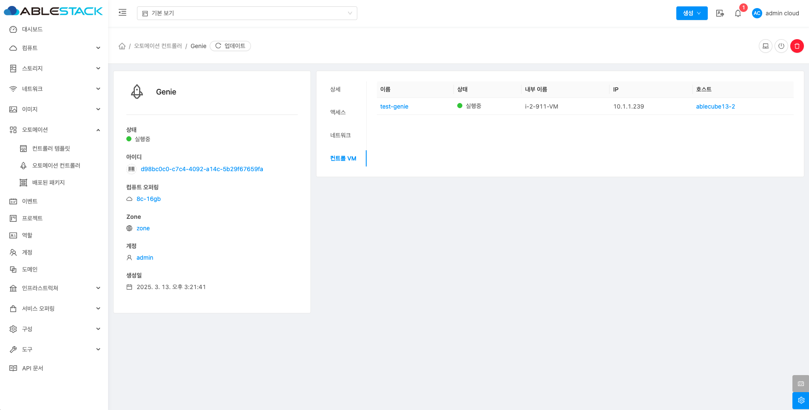{ align=center }
