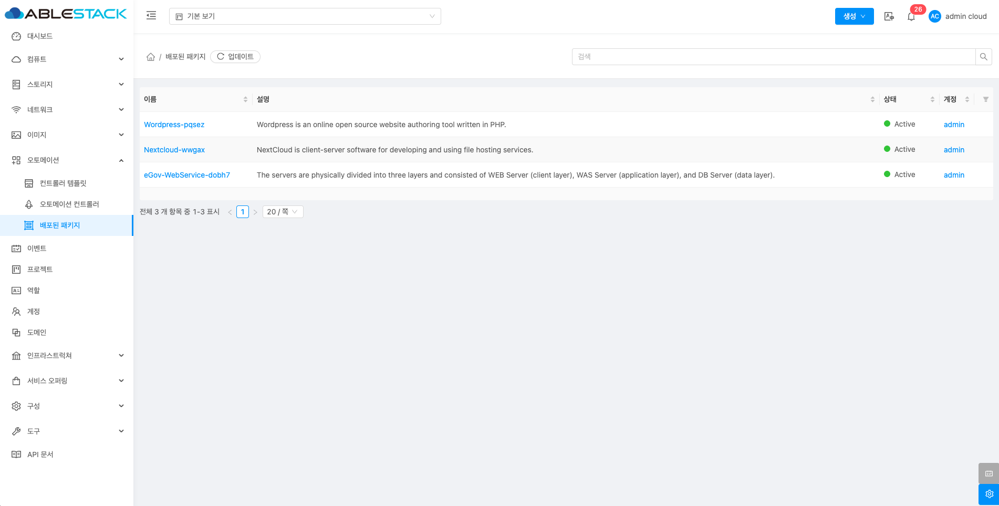
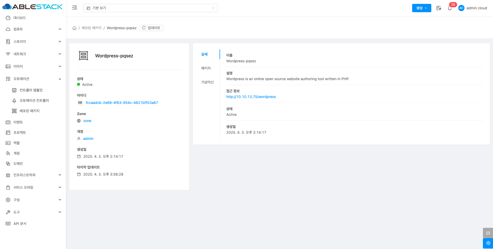
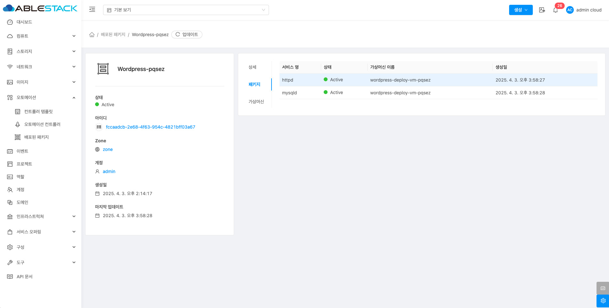
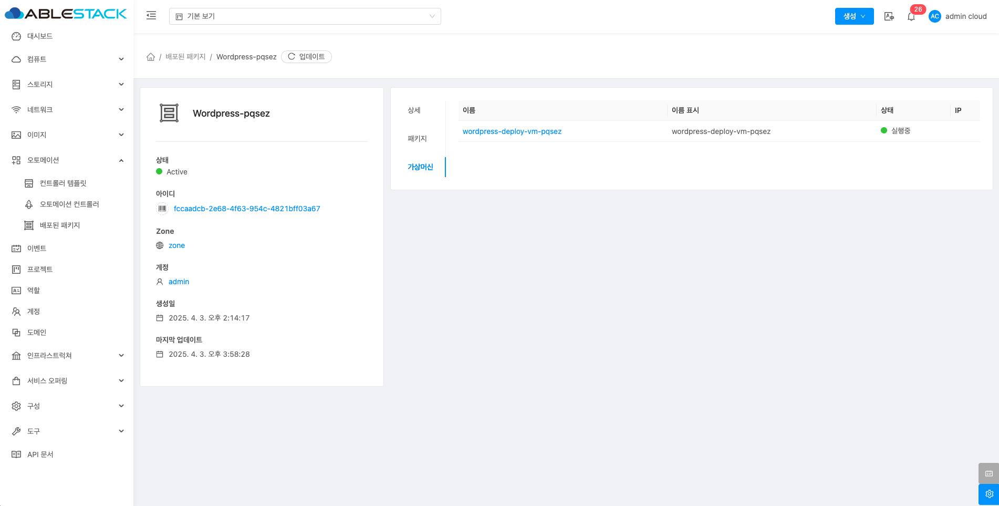

# 배포된 패키지

## 개요

오토메이션 컨트롤러가 구성요소에 대한 접근방법 및 서비스의 상태를 확인할 수 있는 기능을 제공합니다.

## 목록 조회

1. 배포된 패키지 목록을 확인하는 화면입니다. 생성된 배포된 패키지 목록을 확인할 수 있습니다.

    { align=center }

## 상세 탭

1. 배포된 패키지에 대한 상세정보를 조회하는 화면입니다. 해당 배포된 패키지의 이름, 설명, 접근 정보, 상태, 생성일 등의 정보를 확인할 수 있습니다.

    { align=center }

## 패키지 탭

1. 관리 대상 서비스에 대해 상태정보를 확인할 수 있습니다.

    { align=center }

## 가상머신 탭

1. 관리 대상 가상머신에 대해 상태정보를 확인할 수 있습니다.

    { align=center }
