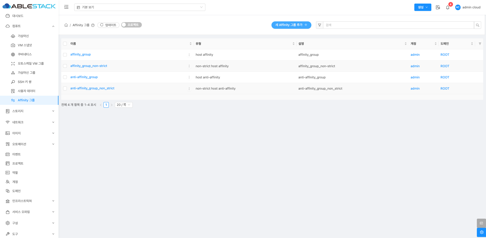
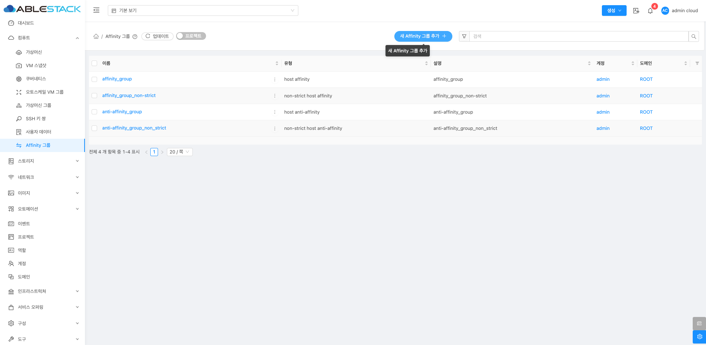
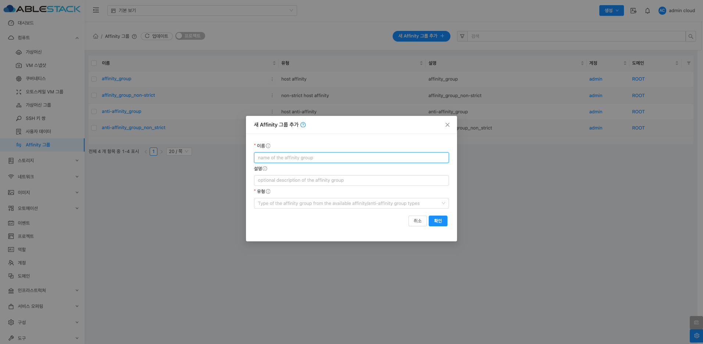
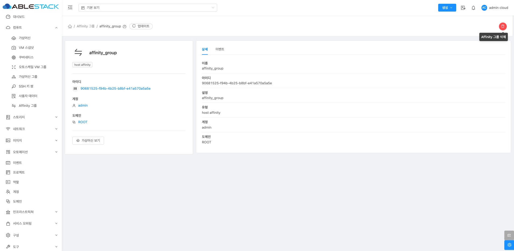
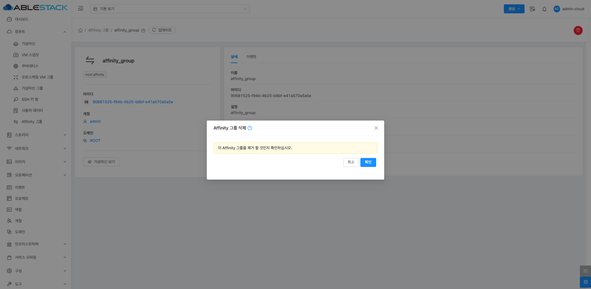
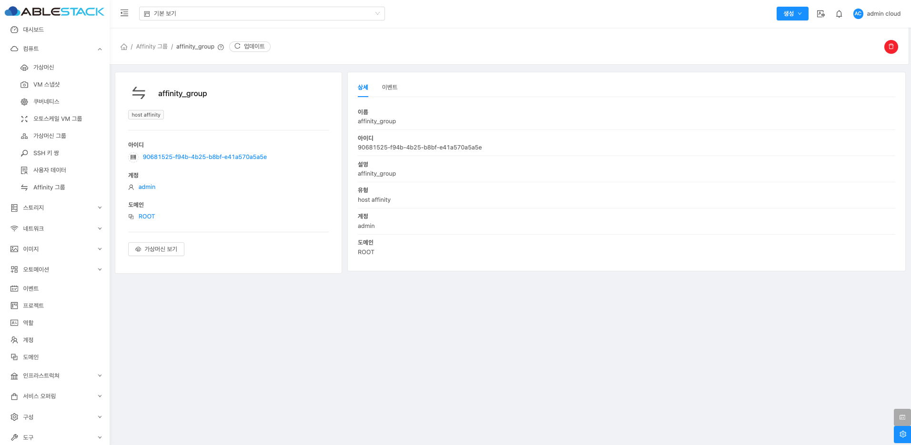
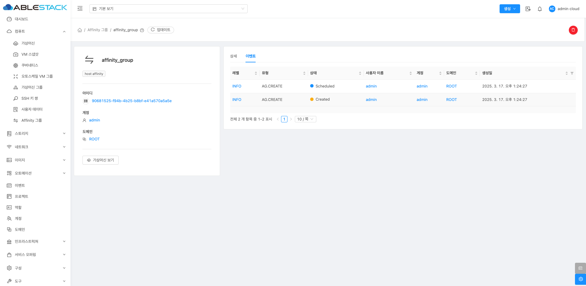

# Affinity 그룹

## 개요
Affinity 그룹은 클라우드 환경에서 가상 머신(VM) 간의 배치를 제어하는 기능입니다. 이를 통해 특정 VM들이 동일한 호스트에 배치되거나 서로 다른 호스트에 배치되도록 설정할 수 있습니다. 이를 활용하면 성능 최적화, 가용성 향상 및 네트워크 지연 최소화 등의 효과를 얻을 수 있습니다.

## Affinity 그룹 조회
Affinity 그룹 목록을 확인하는 화면입니다. 생성된 Affinity 그룹 목록을 확인하거나 Affinity 그룹에 대한 이름, UUID, 설명, 유형, 계정, 도메인등 정보를 확인할 수 있습니다.
{ align=center }

## 새 Affinity 그룹 추가
새로운 Affinity 그룹을 생성할 수 있습니다.
{ align=center }
{ align=center }

  - **이름** 을 입력합니다.
  - **설명** 을 입력합니다.
  - **유형** 을 선택합니다.
    - host affinity (Strict)
        - 동일한 Affinity 그룹 내 VM들이 **반드시** 같은 호스트에 배치됩니다.
        - 고속 네트워크 통신이 필요한 애플리케이션에 적합합니다.
    - host affinity (Non-Strict)
        - 동일한 Affinity 그룹 내 VM들이 **가능하면** 같은 호스트에 배치됩니다.
        - 리소스 상황에 따라 일부 VM이 다른 호스트로 배치될 수도 있습니다.
    - host anti-affinity (Strict)
        - 동일한 Affinity 그룹 내 VM들이 **반드시** 서로 다른 호스트에 배치됩니다.
        - 고가용성이 필요한 경우, 같은 호스트에 배치되지 않도록 강제합니다.
    - host anti-affinity (Non-Strict)
        - 동일한 Affinity 그룹 내 VM들이 **가능하면** 서로 다른 호스트에 배치됩니다.
        - 리소스 부족 등의 이유로 일부 VM이 동일한 호스트에 배치될 수 있습니다.

## Affinity 그룹 삭제
Affinity 그룹 상세 오른쪽 상단의 Affinity 그룹 삭제 버튼을 클릭한 화면입니다.
{ align=center }
{ align=center }

## Affinity 그룹 상세 탭
Affinity 그룹에 대한 상세 정보를 확인하는 화면입니다. 좌측 화면의 "가상머신 보기" 버튼을 통해 해당 Affinity 그룹에 속한 가상머신들을 확인할 수 있으며 우측 화면에서는 목록이름, UUID, 설명, 유형, 계정, 도메인등 상세 정보를 확인할 수 있습니다.
{ align=center }

## Affinity 그룹 이벤트
Affinity 그룹에 대한 이벤트 정보를 확인하는 화면입니다. 해당 Affinity 그룹의 유형 및 생성일 등 확인할 수 있습니다.
{ align=center }

