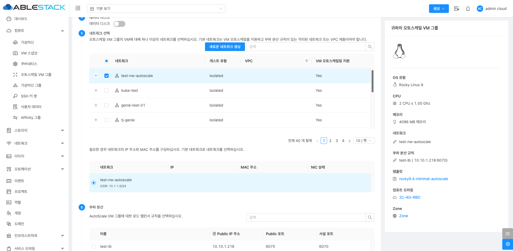
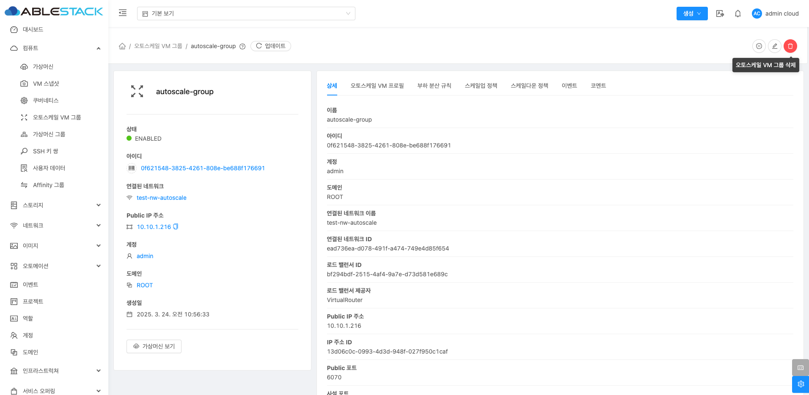
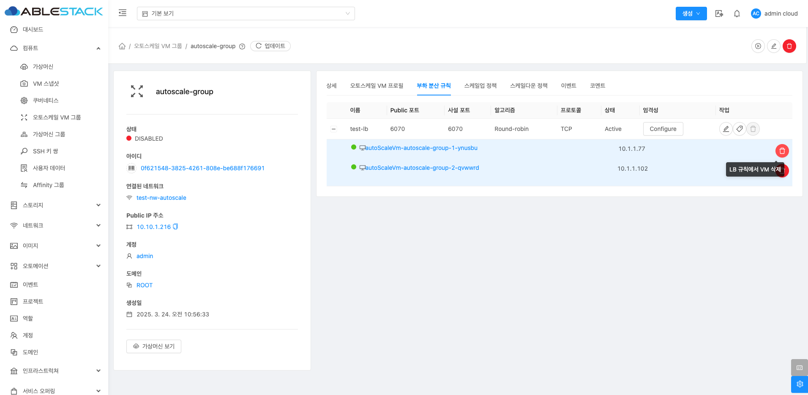

# 오토스케일 VM 그룹

## 개요
AutoScale VM 그룹은 Mold에서 자동 확장 기능을 제공하는 인스턴스 그룹입니다. AutoScale을 사용하면 특정 정책에 따라 가상 머신을 자동으로 추가하거나 제거할 수 있어 트래픽 변화에 유연하게 대응할 수 있습니다. 이를 통해 비용을 절감하고 가용성을 향상시킬 수 있습니다.

## 오토스케일 VM 그룹 조회
오토스케일 VM 그룹 목록을 조회할 수 있습니다. 등록된 인스턴스 그룹의 이름, 계정, 도메인 등을 확인할 수 있습니다.
{ .imgCenter .imgBorder }

## 오토스케일 VM 그룹 등록
새로운 새 오토스케일 VM 그룹을 생성할 수 있습니다.

1. Zone 선택
{ .imgCenter .imgBorder }

    오토스케일 VM 그룹의 Zone을 선택합니다.

2. 템플릿 선택
{ .imgCenter .imgBorder }

    오토스케일 VM 그룹의 VM이 사용할 템플릿을 선택합니다.

3. 컴퓨트 오퍼링 선택
{ .imgCenter .imgBorder }

    오토스케일 VM 그룹의 VM이 사용할 컴퓨트 오퍼링을 선택합니다.

4. 데이터 디스크 활성화 및 선택
{ .imgCenter .imgBorder }

    오토스케일 VM 그룹의 VM이 사용할 데이터 디스크를 선택합니다.

5. 네트워크 선택
{ .imgCenter .imgBorder }

    오토스케일 VM 그룹의 VM이 사용할 네트워크를 선택합니다. 네트워크는 VM의 통신을 담당하며, 특히 부하 분산과 오토스케일링을 지원하는 격리된 네트워크 또는 VPC 계층이어야 합니다.

6. 부하 분산
{ .imgCenter .imgBorder }

    오토스케일 VM 그룹이 생성되면, 해당 그룹의 트래픽을 효과적으로 관리하기 위해 로드 밸런서 규칙을 설정해야 합니다. 이를 통해 들어오는 네트워크 요청을 여러 VM 인스턴스로 자동으로 분배하여 부하를 균등하게 분산하고 서비스 가용성을 보장할 수 있습니다.

    !!! info "INFO"
        오토스케일 VM 그룹 생성을 위해 로드 밸런서 규칙을 미리 생성해야 합니다.

7. 스케일업 정책
{ .imgCenter .imgBorder }

    이 옵션은 부하가 증가할 때 VM을 추가하는 정책입니다.

    - **이름** :스케일업 정책의 이름을 입력합니다.
    - **기간** :조건을 평가할 주기를 설정합니다. 설정된 시간 동안 리소스를 모니터링하여 스케일링을 결정합니다. 예시로 300초를 설정하면 스케일링 조건을 5분 간격으로 평가하고, 조건이 충족되면 스케일업 정책을 실행합니다.
    - **Quiet 시간 (Cooldown)** :스케일링 작업 후, 추가적인 스케일링 작업이 발생하지 않도록 대기 시간을 설정합니다. 이를 통해 과도한 스케일링을 방지합니다.
    - **카운터** :스케일업 정책이 적용되는 조건을 설정합니다. 예를 들어, CPU 사용률이 일정 임계값을 초과하면 스케일업을 하도록 설정할 수 있습니다.
    - **관계 연산자** :스케일링을 결정하는 기준이 되는 값(예: CPU 사용률)과 설정된 임계값(Threshold) 사이의 관계를 정의합니다.
    - **임계값** :스케일다운 정책이 트리거되는 기준을 설정하는 값입니다
    - **동작** :+ 상태 추가 버튼을 클릭하여 스케일업 정책을 설정합니다.

8. 스케일다운 정책
{ .imgCenter .imgBorder }

    부하가 감소했을 때 VM 인스턴스를 자동으로 제거하는 역할을 합니다. 스케일업 정책과 유사하게 설정할 수 있으며, 조건이 충족되면 기존에 설정된 임계값에 맞춰 자동으로 리소스를 축소합니다.

    - **이름** :스케일다운 정책의 이름을 입력합니다.
    - **기간** :조건을 평가할 주기를 설정합니다. 설정된 시간 동안 리소스를 모니터링하여 스케일링을 결정합니다. 예시로 300초를 설정하면 스케일링 조건을 5분 간격으로 평가하고, 조건이 충족되면 스케일다운 정책을 실행합니다.
    - **Quiet 시간 (Cooldown)** :스케일링 작업 후, 추가적인 스케일링 작업이 발생하지 않도록 대기 시간을 설정합니다. 이를 통해 과도한 스케일링을 방지합니다.
    - **카운터** :스케일업 정책이 적용되는 조건을 설정합니다. 예를 들어, CPU 사용률이 일정 임계값을 초과하면 스케일업을 하도록 설정할 수 있습니다.
    - **관계 연산자** :스케일링을 결정하는 기준이 되는 값(예: CPU 사용률)과 설정된 임계값(Threshold) 사이의 관계를 정의합니다.
    - **임계값** :스케일다운 정책이 트리거되는 기준을 설정하는 값입니다
    - **동작** :+ 상태 추가 버튼을 클릭하여 스케일다운 정책을 설정합니다.

    !!! info "INFO"
        카운터 항목은 ( VM CPU - average percentage, VM Memory - average percentage, Public Network - mbps received, Public Network - mbps transmit, Load Balancer - average connect ) 이 있는데 같은 스케일 업/다 운 정책에 중복 등록할 경우 카운터 조 건을 모두 만족 해야 하고, 스케일 정책을 추 가적으로 생성하면 하나만 만족 해도 스케일 업/다운이 동작합니다.

9. 확장 모드
{ .imgCenter .imgBorder }
10. 상세
{ .imgCenter .imgBorder }

     - **이름** 을 입력합니다.
     - **VM 삭제 유예 기간** :VM이 삭제되기 전에 대기하는 시간을 설정합니다. 스케일다운 이벤트가 발생했을 때 VM을 즉시 제거하는 것이 아니라, 설정된 유예 기간이 지난 후 삭제가 진행됩니다. 이를 통해 일시적인 부하 감소로 인한 과도한 스케일다운을 방지할 수 있습니다.
     - **최대 멤버 수** :오토스케일 그룹에서 유지할 수 있는 최대 VM 개수를 설정합니다. 오토스케일링이 활성화되었을 때, 이 값을 초과하여 인스턴스를 생성하지 않습니다.
     - **최대 멤버 수** :오토스케일 그룹에서 유지할 수 있는 최소 VM 개수를 설정합니다. 스케일다운 정책이 적용되더라도 최소 멤버 수 이하로 줄어들지 않습니다.
     - **폴링 주기** :오토스케일 정책을 실행하기 위해 모니터링할 주기를 설정합니다. 일정한 간격으로 스케일링 조건을 평가하며, 설정된 시간마다 모니터링이 수행됩니다.

    !!! info "가상머신에 오토스케일 VM 그룹 적용 방법"
        오토스케일 VM 그룹을 생성한 후 가상머신 생성 시 이를 적용합니다.

## 오토스케일 VM 그룹 비활성화
오토스케일 VM 그룹 상세 화면 오른쪽 상단의 오토스케일 VM 그룹 업데이트 버튼을 클릭하여 오토스케일 VM 그룹을 비활성화하면 설정된 스케일업(Scale-Up) 및 스케일다운(Scale-Down) 정책이 일시적으로 중지되어, VM 인스턴스의 자동 조정을 멈출 수 있습니다.
{ .imgCenter .imgBorder }
{ .imgCenter .imgBorder }

## 오토스케일 VM 그룹 활성화
오토스케일 VM 그룹 상세 화면 오른쪽 상단의 오토스케일 VM 그룹 업데이트 버튼을 클릭하여 오토스케일 VM 그룹을 활성화하면 설정된 스케일업(Scale-Up) 및 스케일다운(Scale-Down) 정책이 다시 시작되어, VM 인스턴스의 자동 조정을 시작할 수 있습니다.
{ .imgCenter .imgBorder }
{ .imgCenter .imgBorder }

## 오토스케일 VM 그룹 업데이트
오토스케일 VM 그룹 상세 화면 오른쪽 상단의 오토스케일 VM 그룹 업데이트 버튼을 클릭하여 오토스케일 VM 그룹을 업데이트할 수 있습니다.
{ .imgCenter .imgBorder }
{ .imgCenter .imgBorder }

## 오토스케일 VM 그룹 삭제
오토스케일 VM 그룹 상세 화면 오른쪽 상단의 오토스케일 VM 그룹 삭제 버튼을 클릭하여 오토스케일 VM 그룹을 삭제할 수 있습니다.

{ .imgCenter .imgBorder }
{ .imgCenter .imgBorder }

   - **"정리" 스위치를 활성화** :오토스케일 VM 그룹과 함께 해당 그룹에서 실행 중인 VM 인스턴스도 삭제합니다.
   - **"정리" 스위치를 비활성화** :오토스케일 VM 그룹만 삭제되고, 기존 VM 인스턴스는 그대로 유지됩니다.

## 오토스케일 VM 그룹 상세 탭
인스턴스 그룹에 대한 상세 정보를 확인하는 화면입니다. 좌측 화면의 "가상머신 보기" 버튼을 통해 해당 오토스케일 VM 그룹을 적용중인 가상머신들을 확인할 수 있으며 우측 화면에서는 이름, 아이디, 계정, 도메인, 연결된 네트워크 이름, 연결된 네트워크 ID, 로드 밸런서 ID, 로드 밸런서 제공자, Public IP 주소, IP 주소 ID, Public 포트, 사설 포트, 최소 멤버 수, 최대 멤버 수, 사용 가능한 VMs, 폴링 주기(초), 상태, 생성일 등의 정보가 포함됩니다.
{ .imgCenter .imgBorder }

## 오토스케일 VM 그룹 오토스케일 VM 프로필 탭

!!! info "INFO"
    오토스케일 VM 그룹이 비활성화된 경우에만 오토스케일 VM 프로필을 업데이트할 수 있습니다.

인스턴스 그룹에 대한 코멘트를 확인하는 화면입니다. 오토스케일 VM 프로필은 오토스케일 VM 그룹 내에서 실행되는 가상 머신(VM)의 구체적인 설정을 정의하는 구성 요소입니다. 이 프로필을 통해 각 VM 인스턴스에 필요한 리소스를 정밀하게 설정하고, 스케일링 동작을 최적화할 수 있습니다.
{ .imgCenter .imgBorder }
{ .imgCenter .imgBorder }

- **VM 삭제 유예 기간(초)** :오토스케일 VM 그룹에서 VM이 삭제되기 전에 기다리는 시간을 변경합니다.
- **템플릿** :VM을 생성할 때 사용할 운영 체제 이미지 또는 가상 머신의 기본 이미지를 변경합니다.
- **컴퓨트 오퍼링** :오토스케일 VM 그룹 내 생성되는 VM의 오퍼링을 변경합니다.

{ .imgCenter .imgBorder }
AutoScale VM 그룹에서 사용자 데이터 재설정은 오토스케일 그룹 내에서 생성되는 VM에 대해 초기화 스크립트나 설정 파일을 새로 적용하는 작업입니다. 사용자 데이터(Userdata)는 VM이 부팅될 때 자동으로 실행되어, 예를 들어 소프트웨어 설치나 시스템 설정을 자동화하는 데 사용됩니다. 이를 재설정하면, 이후 생성되는 VM 인스턴스가 새로운 사용자 데이터를 기반으로 초기화되며, 이전에 설정된 사용자 데이터가 무시되고 새로운 데이터가 적용됩니다. 이 기능을 통해 VM이 오토스케일링될 때 일관된 환경을 유지할 수 있습니다.

- **사용자 데이터 선택 또는 입력** :사전 정의된 사용자 데이터를 선택하거나 새로운 사용자 데이터를 입력합니다.

{ .imgCenter .imgBorder }
오토스케일 VM 그룹에서 매개변수는 가상 머신의 특정 설정을 추가하는 데 사용됩니다. 다양한 매개변수를 설정하여 VM을 커스터마이징할 수 있습니다. 다음은 변경 가능한 매개변수들입니다:

- **rootdisksize** :루트 디스크의 크기를 입력합니다.
- **diskofferingid** :디스크 오퍼링 ID를 입력합니다.
- **size** :VM 크기를 입력합니다.
- **securitygroupids** :보안 그룹 ID를 입력합니다.
- **overridediskofferingid** :디스크 오퍼링을 덮어쓸 ID를 입력합니다.
- **keypairs** :키 쌍 값을 입력합니다.
- **affinitygroupids** :Affinity 그룹 ID를 입력합니다.
- **networkids** :네트워크 ID를 입력합니다.

{ .imgCenter .imgBorder }
파라미터 삭제 기능은 특정 파라미터를 제거하여 가상 머신 또는 오토스케일 VM 그룹의 설정에서 해당 파라미터를 더 이상 사용하지 않도록 하는 기능입니다.

## 오토스케일 VM 그룹 부하분산 탭
인스턴스 그룹에 대한 오토스케일 VM 그룹과 관련된 로드 밸런서 설정을 관리하는 섹션입니다. 이 탭을 통해 오토스케일 VM 그룹에 대한 트래픽 분배를 제어할 수 있는 로드 밸런서 규칙을 설정하거나 변경할 수 있습니다.
{ .imgCenter .imgBorder }
{ .imgCenter .imgBorder }

- 엄격성란의 Configure 버튼을 클릭하여 Sticky 방법을 선택 변경합니다.
    - Stickiness method (Sticky 방법) : 로드 밸런서가 클라이언트 요청을 동일한 서버로 지속적으로 보내도록 하는 방법을 정의합니다. 다양한 방식으로 설정할 수 있습니다.
      - LbCookie (로드 밸런서 쿠키) : 로드 밸런서가 직접 쿠키를 관리하므로 클라이언트 측에서 추가적인 설정이 필요하지 않습니다. 세션 지속성이 중요한 서비스에서 적합합니다.
      - AppCookie (애플리케이션 쿠키) : 애플리케이션에서 특정 쿠키를 사용해 세션을 유지하려는 경우에 유용합니다. 클라이언트 측에서 애플리케이션 쿠키를 관리해야 합니다.
      - Source 기반 (Source IP Hashing) : 클라이언트 IP가 일정한 경우에만 유효하며, IP 주소를 기준으로 요청을 처리해야 하는 환경에서 유용합니다.
      - 없음 (None) : 세션 지속성이 필요 없는 간단한 부하 분산이 필요한 환경에서 사용됩니다.

- 작업란의 편집 버튼을 클릭하여 부하 분산 규칙을 변경합니다.

    { .imgCenter .imgBorder }
    { .imgCenter .imgBorder }

- 작업란의 태그 버튼을 클릭하여 부하 분산 규칙을 변경합니다.

    { .imgCenter .imgBorder }
    { .imgCenter .imgBorder }

- 작업란의 삭제 버튼을 클릭하여 부하 분산 규칙을 변경합니다.

    { .imgCenter .imgBorder }

## 오토스케일 VM 그룹 스케일업 정책 탭
오토스케일 VM 그룹의 확장(Scale-Up) 정책을 추가하거나 설정을 관리하는 섹션입니다.
{ .imgCenter .imgBorder }

- 정책 추가: 새로운 스케일업 정책을 추가합니다.

    { .imgCenter .imgBorder }

    - **이름** :스케일업 정책의 이름을 입력합니다.
    - **기간** :조건을 평가할 주기를 설정합니다. 설정된 시간 동안 리소스를 모니터링하여 스케일링을 결정합니다. 예시로 300초를 설정하면 스케일링 조건을 5분 간격으로 평가하고, 조건이 충족되면 스케일업 정책을 실행합니다.
    - **Quiet 시간 (Cooldown)** :스케일링 작업 후, 추가적인 스케일링 작업이 발생하지 않도록 대기 시간을 설정합니다. 이를 통해 과도한 스케일링을 방지합니다.
    - **카운터** :스케일업 정책이 적용되는 조건을 설정합니다. 예를 들어, CPU 사용률이 일정 임계값을 초과하면 스케일업을 하도록 설정할 수 있습니다.
    - **관계 연산자** :스케일링을 결정하는 기준이 되는 값(예: CPU 사용률)과 설정된 임계값(Threshold) 사이의 관계를 정의합니다.
    - **임계값** :스케일업 정책이 트리거되는 기준을 설정하는 값입니다
    - **동작** :+ 상태 추가 버튼을 클릭하여 스케일업 정책을 설정합니다.

- 정책 삭제: 생성된 스케일업 정책을 삭제합니다.

    { .imgCenter .imgBorder }

- 정책 편집: 생성된 정책을 편집합니다. 먼저 편집 버튼을 눌러 편집기능을 활성화 한 후, 값을 변경하고 적용 버튼을 클릭합니다.

    { .imgCenter .imgBorder }

- 정책 조건 편집: 생성된 정책의 조건을 편집합니다.

    { .imgCenter .imgBorder }
    { .imgCenter .imgBorder }

- 정책 조건 삭제: 생성된 정책의 조건을 삭제합니다.

    { .imgCenter .imgBorder }

- 정책 조건 추가: 상태 추가 버튼을 클릭하여 생성된 정책에 새로운 조건을 추가합니다.

    { .imgCenter .imgBorder }

## 오토스케일 VM 그룹 스케일다운 정책 탭
오토스케일 VM 그룹의 축소(Scale-Down) 정책을 추가하거나 설정을 관리하는 섹션입니다.
{ .imgCenter .imgBorder }

- 정책 추가: 새로운 스케일다운 정책을 추가합니다.

    { .imgCenter .imgBorder }

    - **이름** :스케일다운 정책의 이름을 입력합니다.
    - **기간** :조건을 평가할 주기를 설정합니다. 설정된 시간 동안 리소스를 모니터링하여 스케일링을 결정합니다. 예시로 300초를 설정하면 스케일링 조건을 5분 간격으로 평가하고, 조건이 충족되면 스케일다운 정책을 실행합니다.
    - **Quiet 시간 (Cooldown)** :스케일링 작업 후, 추가적인 스케일링 작업이 발생하지 않도록 대기 시간을 설정합니다. 이를 통해 과도한 스케일링을 방지합니다.
    - **카운터** :스케일다운 정책이 적용되는 조건을 설정합니다. 예를 들어, CPU 사용률이 일정 임계값을 초과하면 스케일업을 하도록 설정할 수 있습니다.
    - **관계 연산자** :스케일링을 결정하는 기준이 되는 값(예: CPU 사용률)과 설정된 임계값(Threshold) 사이의 관계를 정의합니다.
    - **임계값** :스케일다운 정책이 트리거되는 기준을 설정하는 값입니다
    - **동작** :+ 상태 추가 버튼을 클릭하여 스케일다운 정책을 설정합니다.

- 정책 삭제: 생성된 스케일다운 정책을 삭제합니다.

    { .imgCenter .imgBorder }

- 정책 편집: 생성된 정책을 편집합니다. 먼저 편집 버튼을 눌러 편집기능을 활성화 한 후, 값을 변경하고 적용 버튼을 클릭합니다.

    { .imgCenter .imgBorder }

- 정책 조건 편집: 생성된 정책의 조건을 편집합니다.

    { .imgCenter .imgBorder }
    { .imgCenter .imgBorder }

- 정책 조건 삭제: 생성된 정책의 조건을 삭제합니다.

    { .imgCenter .imgBorder }

- 정책 조건 추가: 상태 추가 버튼을 클릭하여 생성된 정책에 새로운 조건을 추가합니다.

    { .imgCenter .imgBorder }

## 오토스케일 VM 그룹 이벤트 탭
인스턴스 그룹에 대한 이벤트를 확인하는 화면입니다.
    { .imgCenter .imgBorder }

## 오토스케일 VM 그룹 코멘트
인스턴스 그룹에 대한 코멘트를 확인하는 화면입니다.
    { .imgCenter .imgBorder }

