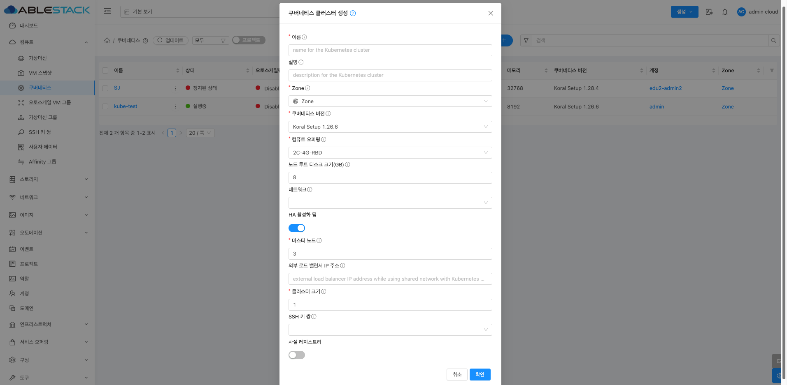
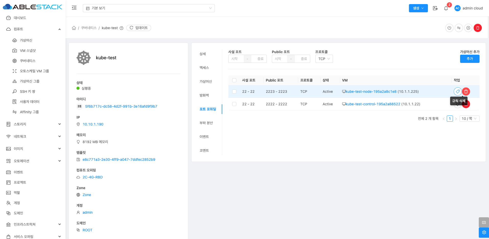

# 쿠버네티스

## 개요
Kubernetes는 컨테이너화된 애플리케이션의 배포, 확장 및 관리를 자동화하기 위한 오픈 소스 시스템입니다. 이를 통해 개발자는 인프라 설정 부담을 줄이고, 보다 효율
적인 애플리케이션 운영이 가능합니다. 또한, Kubernetes는 자동 복구, 서비스 디스커버리, 로드 밸런싱, 자동 스케일링 등의 기능을 제공하여 대규모 애플리케이션을 
안정적으로 운영할 수 있도록 지원합니다.

특히 Mold를 통해 자동으로 배포되는 Kubernetes 클러스터로 컨테이너를 이용한 애플리케이션 프로비저닝, 운영 및 수명주기 관리, 클러스터 확장 등의 관리가 매우 단순화 됩니다.

## 쿠버네티스 클러스터 조회
쿠버네티스 목록을 조회할 수 있습니다. 등록된 쿠버네티스 클러스터의 이름, 상태, 오토스케일링, 클러스터 유형, 크기, CPU 코어, 메모리, 쿠버네티스 버전, 계정, Zone 등을 확인할 수 있습니다.
{ .imgCenter .imgBorder }

## 쿠버네티스 클러스터 생성
새로운 쿠버네티스 클러스터를 생성할 수 있습니다.
{ .imgCenter .imgBorder }
{ .imgCenter .imgBorder }

- **이름**: Kubernetes 클러스터 이름을 입력 합니다.
- **설명**: Kubernetes 클러스터 설명을 입력 합니다.
- **Zone**: Zone을 선택 합니다.
- **쿠버네테스 버전**: Kubernetes ISO에서 등록한 ISO 버전을 선택 합니다.
- **컴퓨트 오퍼링**: Kubernetes Node의 컴퓨트 오퍼링을 선택 합니다.
- **노드 루트 디스크 크리(GB)**: 각 노드의 루트 디스크 크기를 입력 합니다.
- **네트워크**: Kubernetes 용 생성한 네트워크를 선택하거나 선택하지 않고 자동생성합니다.
- **HA 활성화 됨**: 마스터 노드를 2개 이상 생성 할 경우 선택 합니다.
- **마스터 노드**: HA 를 활성화 할 경우 보이는 입력창 입니다. 마스터 노드 수를 입력 합니다.
- **외부 로드 밸런서 IP 주소**: 외부 로드 밸런서 IP 주소를 입력 합니다.
- **클러스터 크기**: Worker Node 수를 입력합니다.
- **SSH 키 쌍**: 생성된 SSH 키를 선택 합니다.
- **사설 레지스트리**: 사설 레지스트리를 보유 중인 상태이면 선택 후 값을 입력 합니다.

!!! info "쿠버네티스 클러스터 생성 시 네트워크 선택 여부"
    네트워크를 선택하지 않을 경우 클러스터 생성 중에 자동으로 쿠버네티스 네트워크를 생성합니다.

!!! info "쿠버네티스 클러스터 생성 후 오퍼링 변경 가능"
    Kubernetes의 각 노드는 생성 후 개별적으로 오퍼링이 변경이 가능합니다.

!!! info "쿠버네티스 클러스터 생성 시 외부 통신 가능 여부"
    Kubernetes는 기본적으로 외부와 통신이 가능한 환경에서만 구성이 됩니다. 외부와 통신이 안되는 경우 사설 레지스트리를 먼저 구성 후 Kubernetes Cluster를 생성 해야 합니다.

## 쿠버네티스 클러스터 정지
쿠버네티스 상세 화면 오른쪽 상단의 쿠버네티스 정지 버튼을 클릭하여 실행 중인 Kubernetes 클러스터를 중지하여 리소스 사용을 최적화할 수 있습니다. 중지된 클러스터는 필요 시 다시 시작할 수 있습니다.
{ .imgCenter .imgBorder }
{ .imgCenter .imgBorder }

## 쿠버네티스 클러스터 스케일
쿠버네티스 상세 화면 오른쪽 상단의 쿠버네티스 스케일 버튼을 클릭하여 실행 중이거나 중지된 클러스터의 워커 노드 수를 조정하여 클러스터의 처리 능력을 동적으로 관리할 수 있습니다. 이를 통해 클러스터를 확장하거나 축소할 수 있습니다.​
{ .imgCenter .imgBorder }
{ .imgCenter .imgBorder }

- **컴퓨트 오퍼링** :Kubernetes 클러스터 노드에 할당할 컴퓨트 오퍼링을 선택합니다.
- **클러스터 오토스케일링 활성화** :스위치를 활성화하면 클러스터 오토스케일링이 동작합니다. 활성화하면 Mold가 Kubernetes 클러스터의 리소스 수요를 모니터링하여 자동으로 워커 노드를 추가하거나 제거합니다.

    !!! warning "오토스케일링이 활성화되면, 수동 크기 조정 옵션이 제한될 수 있습니다."

- **클러스터 크기** :Kubernetes 클러스터 크기를 입력 합니다.

    !!! warning "크기 조정 시 참고사항"
        - 클러스터 크기 조정은 워커 노드 수에 영향을 미치며, 컨트롤 노드에는 영향을 주지 않습니다.
        - 클러스터 크기를 줄이는 경우, 일부 노드가 종료되므로 서비스 중단 가능성을 고려해야 합니다.

## 쿠버네티스 클러스터 업그레이드
쿠버네티스 상세 화면 오른쪽 상단의 쿠버네티스 업그레이드 버튼을 클릭하여 실행 중인 클러스터의 Kubernetes 버전을 최신 버전으로 업그레이드할 수 있습니다. 단, 마이너 버전 간의 순차적 업그레이드만 지원되며, 메이저 버전 건너뛰기는 지원되지 않습니다.
{ .imgCenter .imgBorder }
{ .imgCenter .imgBorder }

## 쿠버네티스 클러스터 삭제
쿠버네티스 상세 화면 오른쪽 상단의 쿠버네티스 클러스터 삭제 버튼을 클릭하여 쿠버네티스를 삭제할 수 있습니다.
{ .imgCenter .imgBorder }
{ .imgCenter .imgBorder }

## 쿠버네티스 클러스터 상세 탭
쿠버네티스 클러스터에 대한 상세 정보를 확인하는 화면입니다. 우측 화면에서 이름, 설명, Zone, 쿠버네티스 버전, 오토스케일링 여부, 크기, 마스터 노드, CPU 코어, 메모리, 연결된 네트워크 이름, 계정, 도메인, 클러스터 유형, 생성일 등 상세 정보를 확인할 수 있습니다.
{ .imgCenter .imgBorder }

## 쿠버네티스 클러스터 액세스 탭
쿠버네티스 클러스터에 대한 액세스 정보를 확인하는 화면으로, Kubeconfig 파일 다운로드 및 API 엔드포인트 정보를 제공하며, Kubernetes CLI(kubectl) 또는 기타 클러스터 관리 도구를 통해 접속하는 데 필요한 정보를 포함합니다.

{ .imgCenter .imgBorder }

## 쿠버네티스 클러스터 가상머신 탭
쿠버네티스 클러스터를 구성하는 마스터 노드 및 워커 노드 목록을 확인할 수 있는 화면으로, 각 노드의 상태(실행 중, 중지됨 등) 및 성능 지표(CPU, 메모리, 디스크 사용량 등)를 모니터링하고, 노드를 선택하여 재부팅, 삭제, 크기 조정 등의 작업을 수행할 수 있습니다.

{ .imgCenter .imgBorder }

### 노드 삭제
우측 삭제 버튼을 클릭하여 해당 클러스터에서 노드를 삭제할 수 있습니다.
{ .imgCenter .imgBorder }

## 쿠버네티스 클러스터 방화벽 탭
쿠버네티스 클러스터에 대한 방화벽 정보를 추가하고 확인하는 화면으로, 클러스터가 사용하는 네트워크 방화벽 규칙을 관리할 수 있습니다. "추가" 버튼을 클릭하여 특정 IP 주소 또는 포트에 대한 허용/차단 규칙을 설정할 수 있으며, 일반적으로 클러스터의 API 서버(6443/tcp) 및 서비스 간 통신을 위한 포트를 열어야 합니다.
{ .imgCenter .imgBorder }

### 태그 추가 및 삭제 
추가된 방화벽 우측 "태그 편집" 버튼을 클릭하여 태그를 추가하거나 삭제할 수 있습니다. 
{ .imgCenter .imgBorder }
{ .imgCenter .imgBorder }

### 방화벽 삭제
추가된 방화벽을 삭제할 수 있습니다.
{ .imgCenter .imgBorder }

## 쿠버네티스 클러스터 포트 포워딩 탭
쿠버네티스 클러스터에 대한 포트 포워딩을 추가하고 정보를 확인하는 화면입니다. 외부에서 Kubernetes 클러스터 내부의 서비스로 접근할 수 있도록 특정 포트를 매핑하는 기능을 제공합니다.
"추가" 버튼을 클릭하면 클러스터 내부에서 실행 중인 웹 애플리케이션(예: ClusterIP 서비스)에 대해 외부에서 접근할 수 있도록 특정 포트를 포워딩할 수 있으며, 로드밸런서를 설정하지 않고 개별 포트만 개방하여 접근할 때 유용합니다.
{ .imgCenter .imgBorder }

### 태그 추가 및 삭제
추가된 포트 포워딩 우측 "태그 편집" 버튼을 클릭하여 태그를 추가하거나 삭제할 수 있습니다.
{ .imgCenter .imgBorder }
{ .imgCenter .imgBorder }

### 포트 포워딩 삭제
추가된 포트 포워딩을 삭제할 수 있습니다.
{ .imgCenter .imgBorder }

## 쿠버네티스 클러스터 부하 분산 탭
쿠버네티스 클러스터에 대한 부하 분산을 추가하고 정보를 확인하는 화면입니다. 클러스터의 로드 밸런서 설정을 관리하며, 외부 트래픽을 Kubernetes 서비스로 라우팅하는 데 사용됩니다. 
Mold의 네트워크 기능을 활용하여 Kubernetes Ingress 또는 LoadBalancer 서비스와 연동할 수 있으며, 트래픽을 특정 노드나 서비스로 분산하는 설정을 구성할 수 있습니다.
{ .imgCenter .imgBorder }

- **이름** :Kubernetes 클러스터 이름을 입력 합니다.
- **Public 포트** ::외부에서 접근할 수 있는 공용 포트입니다.
- **사설 포트** :내부 네트워크에서 사용되는 포트입니다. Public 포트와 매핑됩니다.
- **CIDR 목록** :특정 CIDR(클래스 기반 도메인 라우팅) 범위에서만 트래픽을 허용할 수 있도록 제한하는 옵션입니다.
- **알고리즘** :부하 분산 알고리즘을 선택할 수 있습니다.
    - 라운드 로빈(Round Robin): 요청을 순차적으로 각 가상 머신에 분배합니다.
    - 최소 연결(Least Connections): 현재 가장 적은 연결을 가진 서버로 트래픽 전달합니다.
    - 출처 기반(Source Hashing): 특정 클라이언트가 항상 동일한 백엔드 서버로 연결합니다.
- **프로토콜** :트래픽을 처리할 프로토콜을 선택하는 옵션입니다. TCP, UDP 등의 프로토콜을 설정이 가능합니다.
- **오토스케일** :부하에 따라 자동으로 가상 머신을 추가하거나 제거할지를 선택하는 옵션입니다.

## 쿠버네티스 클러스터 이벤트 탭
쿠버네티스 클러스터에 대한 이벤트를 확인하는 화면입니다.
{ .imgCenter .imgBorder }

## 쿠버네티스 클러스터 코멘트
쿠버네티스에 대한 코멘트를 확인하는 화면입니다.
{ .imgCenter .imgBorder }

## 용어사전

* 서비스 디스커버리 (Service Discovery)
    * Kubernetes 환경에서 서비스의 위치(IP 주소와 포트)를 자동으로 감지하여 애플리케이션이 서로 통신할 수 있도록 해주는 기능입니다.
    * 컨테이너화된 마이크로서비스 환경에서는 서비스 인스턴스가 동적으로 변경되기 때문에, 서비스의 위치를 자동으로 찾아주는 메커니즘이 필요합니다.
    * 애플리케이션 간 통신 시 특정 IP를 하드코딩하지 않고 서비스 이름으로 접근하여 가용성을 높입니다.

* 자동 스케일링 (Auto Scaling)
    * Mold에서 자동 스케일링은 애플리케이션 부하에 따라 가상 머신(VM) 또는 컨테이너 인스턴스를 자동으로 추가하거나 축소하는 기능입니다.
    * 사용자가 직접 자원을 관리하지 않아도, 트래픽 증가나 감소에 따라 필요한 자원을 자동으로 조정하여 비용 효율성과 서비스 가용성을 동시에 확보할 수 있습니다.

* 마스터 노드 (Master Node)
    * Kubernetes 클러스터에서 클러스터를 관리하고 제어하는 중앙 관리 서버 역할을 하는 노드입니다.
    * 클러스터 내 모든 워크로드 관리, 상태 모니터링, 클러스터 리소스 할당 등을 담당합니다.
    * 구성 요소:
        * API 서버 (kube-apiserver): 클러스터와 외부 간의 통신을 담당합니다.
        * 컨트롤러 매니저 (kube-controller-manager): 다양한 컨트롤러를 관리합니다.
        * 스케줄러 (kube-scheduler): 파드를 적절한 워커 노드에 할당합니다.
        * ETCD: 클러스터 상태 정보를 저장합니다.

* 컨트롤러 노드 (Controller Node)
    * Kubernetes 클러스터에서 클러스터를 관리하고 제어하는 중앙 관리 서버 역할을 하는 노드입니다. 마스터 노드 내에서 하위 역할로 존재하는 경우가 많습니다.
    * 구성 요소:
        * 컨트롤러 매니저 (kube-controller-manager): 여러 컨트롤러를 모아 관리합니다.
        * 노드 컨트롤러: 노드 상태를 모니터링하고, 장애 발생 시 복구를 시도합니다.
        * 복제 컨트롤러: 파드 개수를 원하는 대로 유지합니다.
        * 엔드포인트 컨트롤러: 서비스와 파드를 연결합니다.
        * 서비스 어카운트 컨트롤러: 네임스페이스에 대한 접근 권한 관리합니다.

* 워커 노드 (Worker Node)
    * Kubernetes 클러스터에서 애플리케이션 워크로드(컨테이너)를 실제로 실행하는 노드입니다. 클러스터 내에 여러 워커 노드를 둘 수 있으며, 워커 노드가 많을수록 애플리케이션 확장성이 증가합니다.
    * 구성 요소:
        * Kubelet: 마스터 노드로부터 받은 명령을 수행하여 파드(Pod)를 관리합니다.
        * Kube-Proxy: 네트워크 프록시로, 클러스터 내부의 서비스와 파드 간의 네트워크 트래픽을 관리합니다. 클러스터 IP와 포트 간의 로드밸런싱 역할을 수행하여, 외부 요청을 적절한 파드로 전달합니다.
        * 컨테이너 런타임: 컨테이너를 실제로 구동하는 엔진입니다. 대표적으로 Docker, containerd, CRI-O 등이 있습니다. 파드 내에 정의된 여러 컨테이너를 관리하며, 실행, 중지, 모니터링 작업을 수행합니다.

* Kubernet
    * Kubernetes 클러스터와 통신하기 위해 필요한 인증 정보와 설정을 담고 있는 파일입니다.
    * 주로 kubectl 명령어를 사용하여 클러스터에 접근할 때 사용되며, 여러 클러스터를 관리할 때도 활용할 수 있습니다.

* kubectl
    * Kubernetes 클러스터를 관리하기 위한 명령줄 도구(CLI)입니다.
    * Kubernetes API 서버와 통신하여 클러스터 상태를 조회하거나 애플리케이션을 배포, 업데이트, 삭제할 수 있습니다.

* ClusterIP 서비스
    * Kubernetes에서 가장 기본적인 서비스 유형으로, 클러스터 내부에서만 접근할 수 있는 가상 IP(ClusterIP)를 할당하여 파드에 트래픽을 라우팅하는 역할을 합니다.
    * 기본 서비스 유형으로 별도 설정이 없으면 ClusterIP로 자동 생성됩니다.
    * 클러스터 외부에서 직접 접근할 수 없으며, 내부 애플리케이션 간 통신 목적으로 사용됩니다. 클러스터 외부에서 접근하려면 NodePort, LoadBalancer, Ingress 등 다른 서비스 유형을 사용해야 합니다.

* Kubernetes Ingress
    * Kubernetes 클러스터 외부에서 내부 서비스로 HTTP 및 HTTPS 트래픽을 라우팅하기 위한 API 객체입니다.
    * 도메인 기반의 가상 호스팅, 경로 기반 라우팅, SSL/TLS 종료를 지원하여 웹 애플리케이션을 손쉽게 외부에 노출할 수 있습니다.
    * Ingress를 사용하면 NodePort나 LoadBalancer와 달리 단일 진입점으로 여러 서비스를 노출할 수 있습니다.

