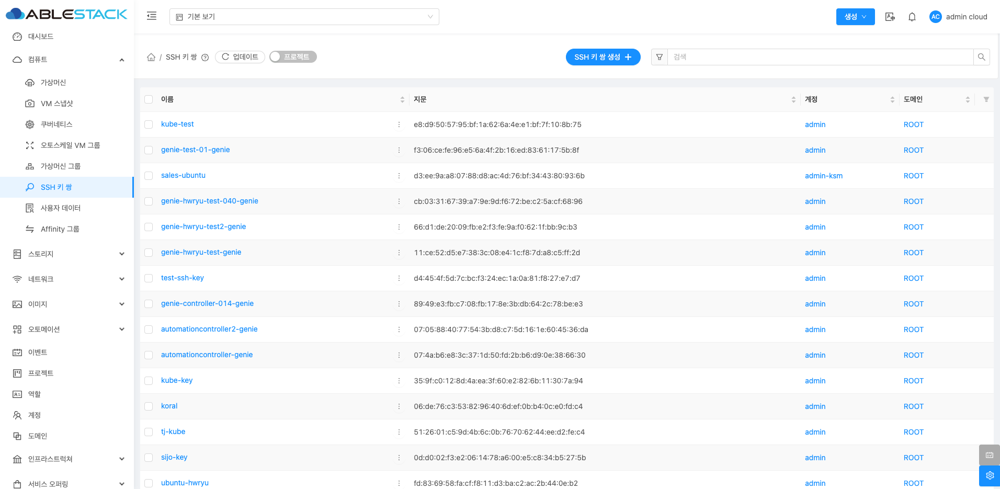
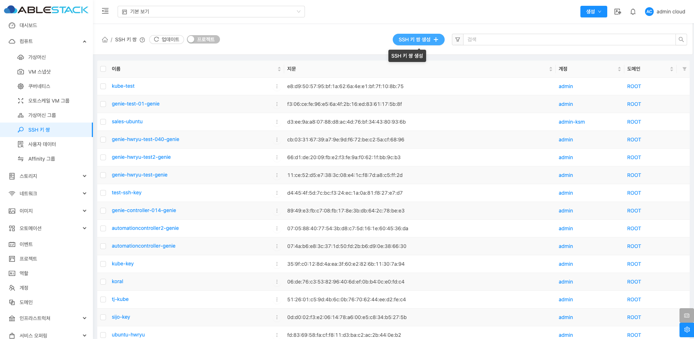
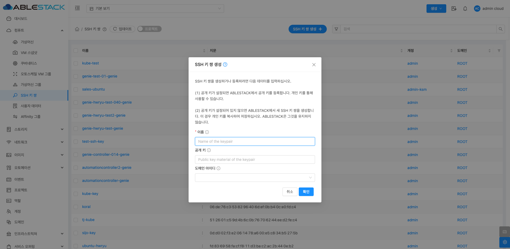
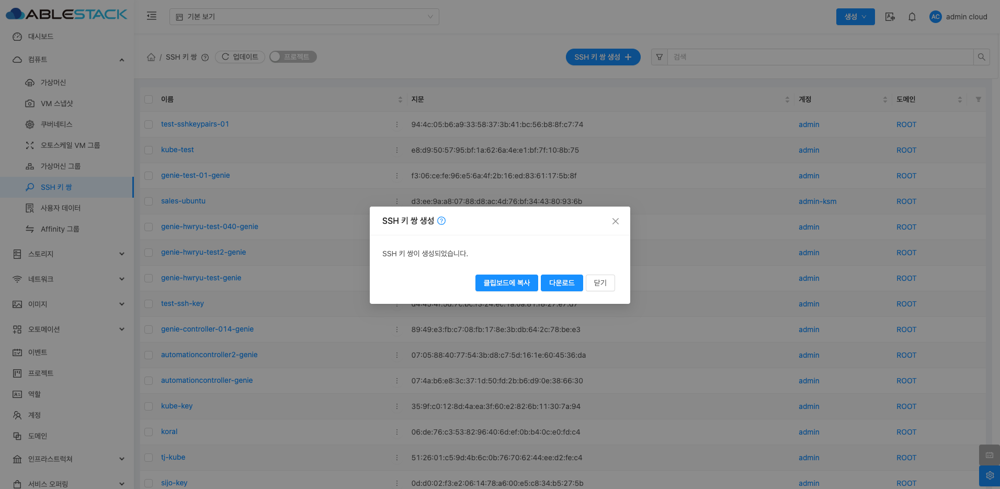
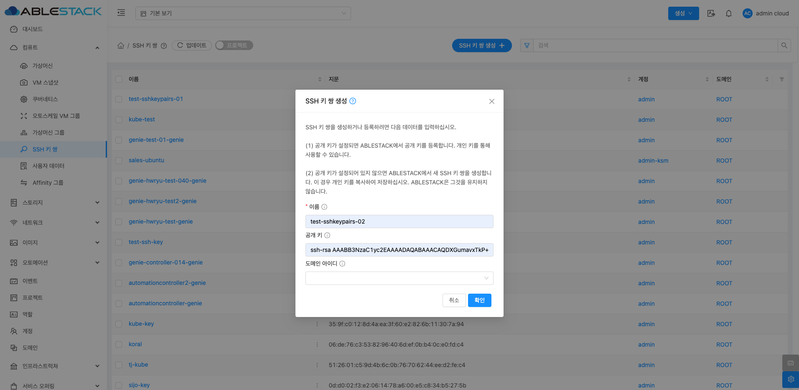
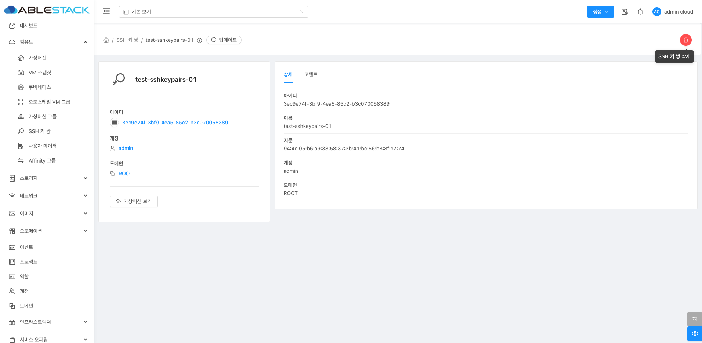
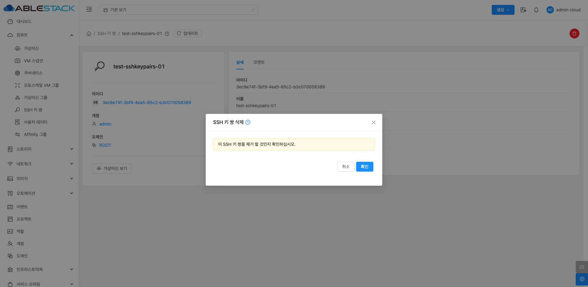
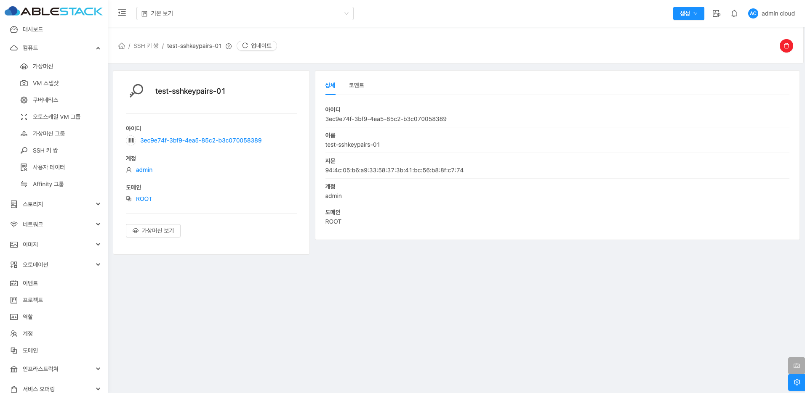
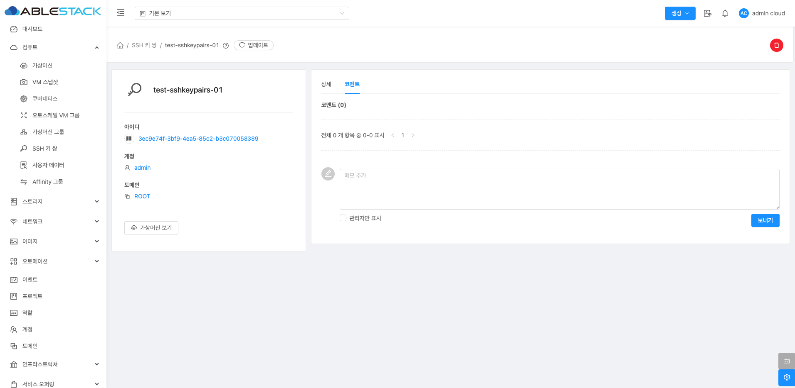

# SSH 키 쌍

## 개요
SSH 키 쌍은 Mold 환경에서 가상 머신(VM)에 안전하게 접근할 수 있도록 지원하는 기능입니다. 사용자는 공개 키를 Mold에 등록하고, 해당 키를 사용하여 VM에 비밀번호 없이 SSH 접속할 수 있습니다. 이를 통해 보안성을 높이고, 관리의 편의성을 제공합니다.

## SSH 키 쌍 조회
SSH 키 쌍 목록을 확인하는 화면입니다. 생성된 SSH 키 쌍 목록을 확인하거나 이름, 지문, 계정, 도메인 등의 정보를 조회할 수 있습니다.
{ .imgCenter .imgBorder }

## SSH 키 쌍 등록
새로운 SSH 키 쌍를 생성할 수 있습니다.
{ .imgCenter .imgBorder }
{ .imgCenter .imgBorder }

- **이름** : SSH 키 쌍의 이름을 입력합니다.
- **공개 키** : 공개 키를 입력합니다.
    - 새로운 공개 키를 생성하려면 해당란을 입력하지 않습니다. 사전 생성된 공개 키가 있다면 입력합니다.
- **도메인 아이디** 를 입력합니다.

공개 키를 새로 생성할 경우 공개 키를 클립보드에 복사하거나 다운로드할 수 있습니다.
{ .imgCenter .imgBorder }

!!! warning "공개 키를 입력하지 않을 경우 시 주의사항"
    공개 키가 설정되어 있지 않으면 ABLESTACK에서 새 SSH 키 쌍을 생성합니다. 이 경우 개인 키를 복사하여 저장하십시오. ABLESTACK은 그것을 유지하지 않습니다.

사전 생성된 공개 키가 있을 경우 아래와 같이 입력합니다.
{ .imgCenter .imgBorder }

## SSH 키 쌍 삭제
SSH 키 쌍 상세 화면 오른쪽 상단의 SSH 키 쌍 삭제 버튼을 클릭하여 SSH 키 쌍를 삭제할 수 있습니다.
{ .imgCenter .imgBorder }
{ .imgCenter .imgBorder }

## SSH 키 쌍 상세 정보
SSH 키 쌍에 대한 상세 정보를 확인하는 화면입니다. 좌측 화면의 "가상머신 보기" 버튼을 통해 해당 SSH 키 쌍을 사용중인 가상머신들을 확인할 수 있으며 우측 화면에서는 이름, UUID, 지문, 계정, 도메인등 상세 정보를 확인할 수 있습니다.
{ .imgCenter .imgBorder }

## SSH 키 쌍 코멘트
SSH 키 쌍에 대한 코멘트를 확인하는 화면입니다.
{ .imgCenter .imgBorder }

## 용어사전

* 공개키 (Public Key)
    * 비대칭 키 암호화 방식에서 개인키와 함께 사용되며, 공개키로 암호화한 데이터는 개인키로만 복호화할 수 있습니다.

* 개인키 (Private Key)
    * SSH 접속 시 이 개인키를 사용하여 서버에 인증합니다.
    * 개인키가 유출되면 누구나 VM에 접근할 수 있으므로 반드시 안전한 장소에 보관해야 합니다.
