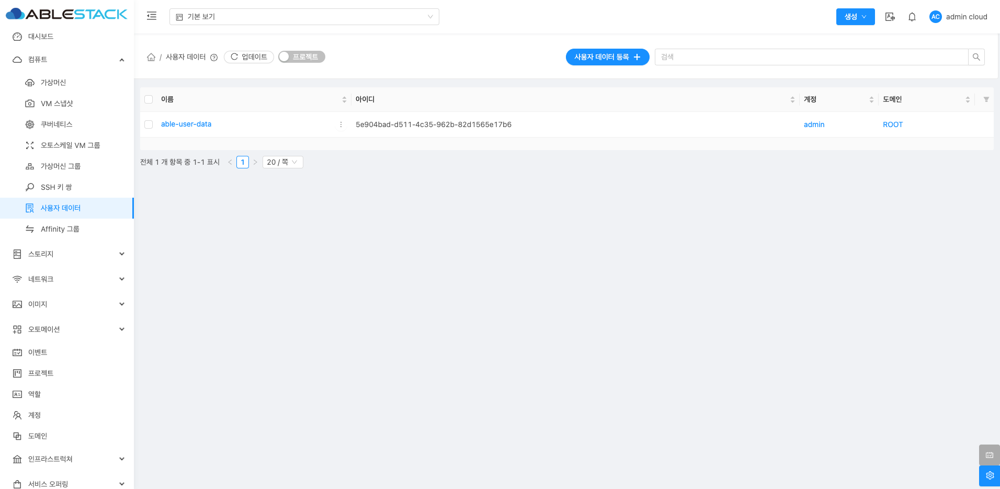
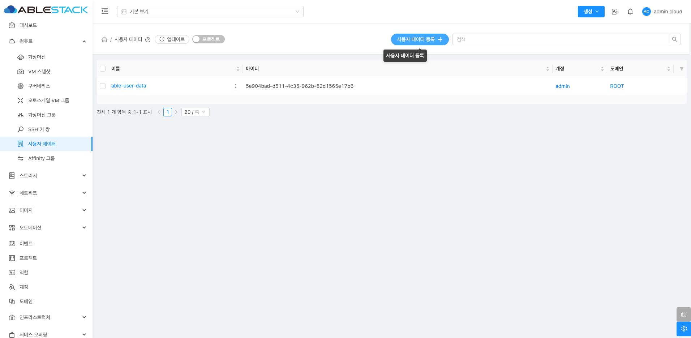
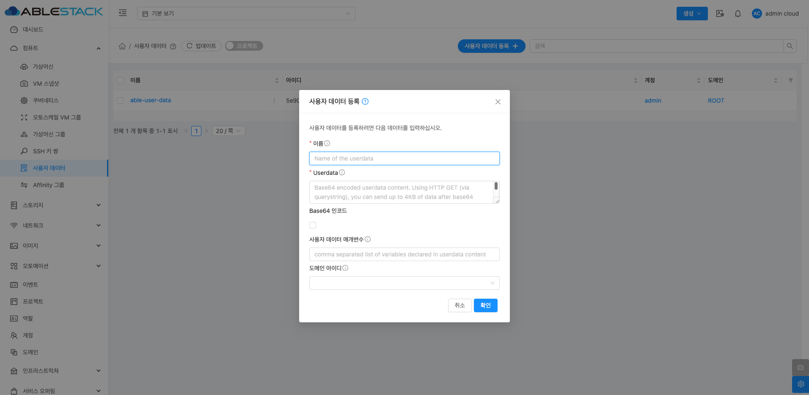
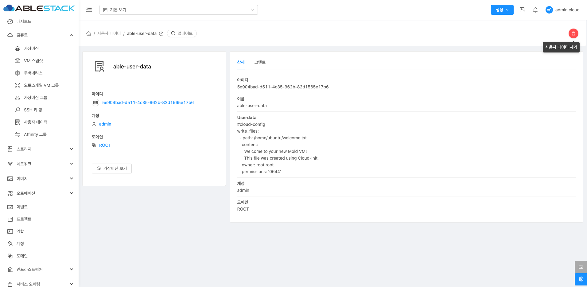
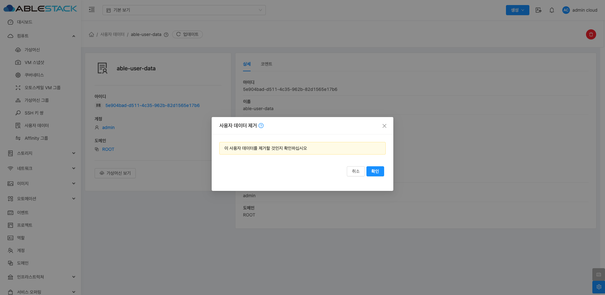
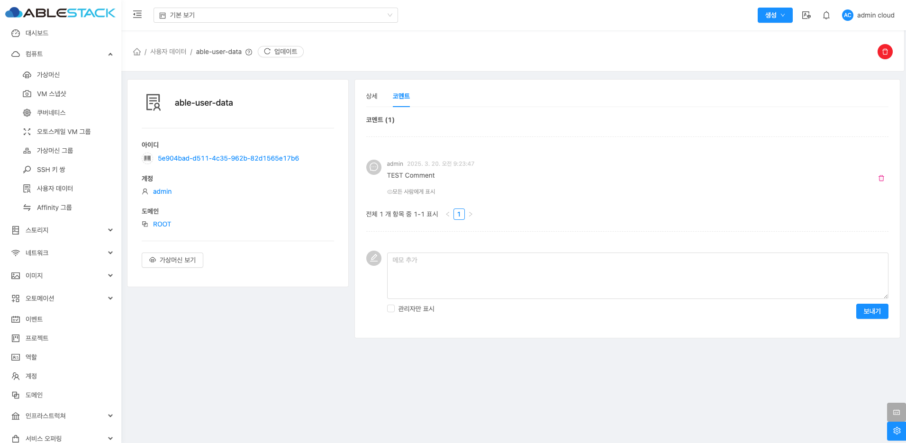

# 사용자 데이터

## 개요
사용자 데이터는 클라우드 환경에서 가상 머신(VM) 간의 배치를 제어하는 기능입니다. 이를 통해 특정 VM들이 동일한 호스트에 배치되거나 서로 다른 호스트에 배치되도록 설정할 수 있습니다. 이를 활용하면 성능 최적화, 가용성 향상 및 네트워크 지연 최소화 등의 효과를 얻을 수 있습니다.

## 사용자 데이터 조회
사용자 데이터 목록을 확인하는 화면입니다. 생성된 사용자 데이터 목록을 확인하거나 사용자 데이터에 대한 이름, UUID, 계정, 도메인등 정보를 확인할 수 있습니다.
{ align=center }

## 사용자 데이터 등록
새로운 사용자 데이터를 생성할 수 있습니다.
{ align=center }
{ align=center }

 - **이름** 을 입력합니다.
 - **Userdata** 입력합니다.
    - Base64로 인코딩된 사용자 데이터 내용을 입력하는 필드입니다. 보통 쉘 스크립트 또는 클라우드 초기화 설정을 포함합니다.
 - **Base64 인코드** 를 선택합니다.
    - 입력된 데이터를 Base64로 변환할지 여부를 선택하는 옵션입니다. (일반적으로 체크하지 않아도 자동으로 처리됩니다.)
 - **사용자 데이터 매개변수** 를 입력합니다.
    - 쉼표(,)로 구분된 변수 목록을 입력하여 사용자 데이터에서 사용할 값을 설정할 수 있습니다.
 - **도메인 아이디** 를 입력합니다.

!!! info "Userdata 예시"
    ```shell
      #cloud-config
      write_files:
       - path: /home/welcome.txt
        content: |
         Welcome to your new Mold VM!
         This file was created using Cloud-init.
        owner: root:root
        permissions: '0644'
    ```


## 사용자 데이터 삭제
사용자 데이터 상세 화면 오른쪽 상단의 사용자 데이터 삭제 버튼을 클릭하여 사용자 데이터를 삭제할 수 있습니다.
{ align=center }
{ align=center }

## 사용자 데이터 상세 정보
사용자 데이터에 대한 상세 정보를 확인하는 화면입니다. 우측 화면에서는 목록이름, UUID, Userdata, 계정, 도메인등 상세 정보를 확인할 수 있습니다.
{ align=center }

## 사용자 데이터 코멘트
사용자 데이터에 대한 코멘트를 확인하는 화면입니다.
{ align=center }

