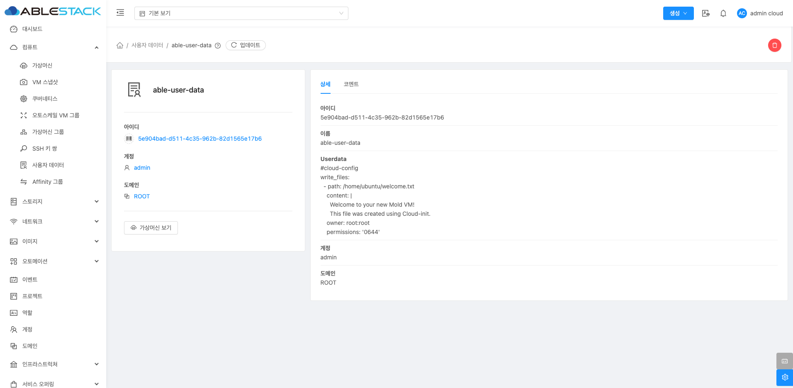

# 사용자 데이터

## 개요
사용자 데이터는 VM 인스턴스 초기 설정을 자동화하는 기능입니다. 클라우드 환경에서 서버를 효율적으로 관리하기 위해 cloud-init과 연계하여 다양한 설정을 미리 지정할 수 있습니다. User Data를 통해 VM이 시작되자마자 필요한 소프트웨어 설치와 설정이 자동으로 이루어지므로, 관리자는 초기 설정 부담을 줄일 수 있습니다.

## 사용자 데이터 조회
사용자 데이터 목록을 확인하는 화면입니다. 생성된 사용자 데이터 목록을 확인하거나 사용자 데이터에 대한 이름, UUID, 계정, 도메인등 정보를 확인할 수 있습니다.
{ align=center }

## 사용자 데이터 등록
새로운 사용자 데이터를 생성할 수 있습니다.
{ align=center }
{ align=center }

 - **이름** :사용자 데이터의 이름을 입력합니다.
 - **Userdata** : 사용자 데이터를 입력합니다.
    - Base64로 인코딩된 사용자 데이터 내용을 입력하는 필드입니다. 보통 쉘 스크립트 또는 클라우드 초기화 설정을 포함합니다.
 - **Base64 인코드** :Base64 인코드 변환 여부를 선택합니다.
    - 입력된 데이터를 Base64로 변환할지 여부를 선택하는 옵션입니다. (일반적으로 체크하지 않아도 자동으로 처리됩니다.)
 - **사용자 데이터 매개변수** :사용자 데이터 매개변수를 입력합니다.
    - 쉼표(,)로 구분된 변수 목록을 입력하여 사용자 데이터에서 사용할 값을 설정할 수 있습니다.
    - 예) username,servername,port
 - **도메인 아이디** 를 입력합니다.

!!! info "Userdata 예시"
    ```shell
      #cloud-config
      write_files:
       - path: /home/welcome.txt
        content: |
         Welcome to your new Mold VM!
         This file was created using Cloud-init.
        owner: root:root
        permissions: '0644'
    ```

!!! warning "WARN"
    * 보안 문제: User Data에 민감 정보를 포함하지 않도록 주의해야 합니다.
    * 크기 제한: 일반적으로 User Data는 64KB 이내로 제한됩니다.
    * 디버깅: 초기 설정이 실패할 경우 VM 내부의 로그(/var/log/cloud-init.log)를 통해 문제를 파악해야 합니다.
    * 인코딩 필수: CLI를 통해 User Data를 전달할 때는 Base64 인코딩을 필수로 해야 합니다.


## 사용자 데이터 삭제
사용자 데이터 상세 화면 오른쪽 상단의 사용자 데이터 삭제 버튼을 클릭하여 사용자 데이터를 삭제할 수 있습니다.
{ align=center }
{ align=center }

## 사용자 데이터 상세 정보
사용자 데이터에 대한 상세 정보를 확인하는 화면입니다. 우측 화면에서는 목록이름, UUID, Userdata, 계정, 도메인등 상세 정보를 확인할 수 있습니다.
{ align=center }

## 사용자 데이터 코멘트
사용자 데이터에 대한 코멘트를 확인하는 화면입니다.
{ align=center }


## 용어사전

* cloud-init
    * 클라우드 환경에서 가상 머신(VM)의 초기 설정을 자동화하기 위해 사용되는 멀티 플랫폼 초기화 도구입니다.
    * 주로 VM이 부팅될 때 실행되며, 사용자 데이터(User Data)를 기반으로 다양한 설정 작업을 수행합니다.
    * VM 인스턴스가 시작할 때 초기화 스크립트나 설정 파일을 자동으로 실행하여 기본 환경을 구성합니다.

* Cloud-Config
    * 클라우드 환경에서 가상 머신(VM) 초기 설정을 자동화하기 위한 구성 파일 형식입니다.
    * 클라우드 인스턴스의 초기화 과정에서 사용되며, cloud-init이라는 도구를 통해 실행됩니다.
    * YAML 형식으로 작성되며, 인스턴스 시작 시 자동으로 파싱되어 초기화 작업을 수행합니다.
    * VM 생성 시 사용자 데이터를 통해 cloud-config 스크립트를 전달할 수 있습니다.

