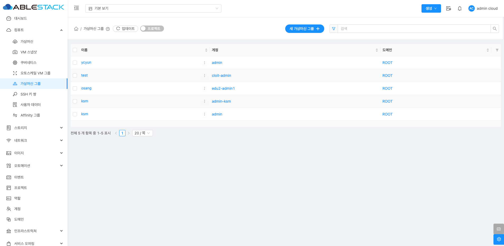
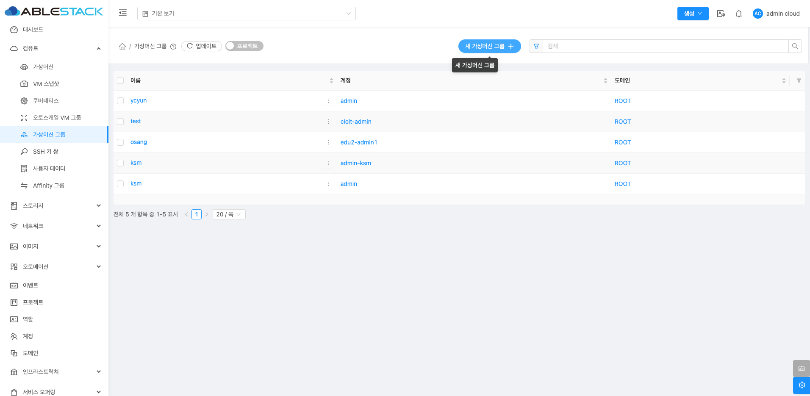
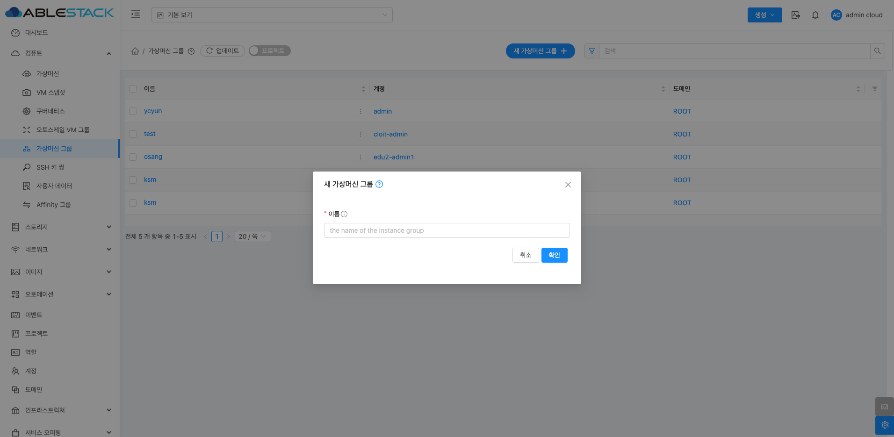
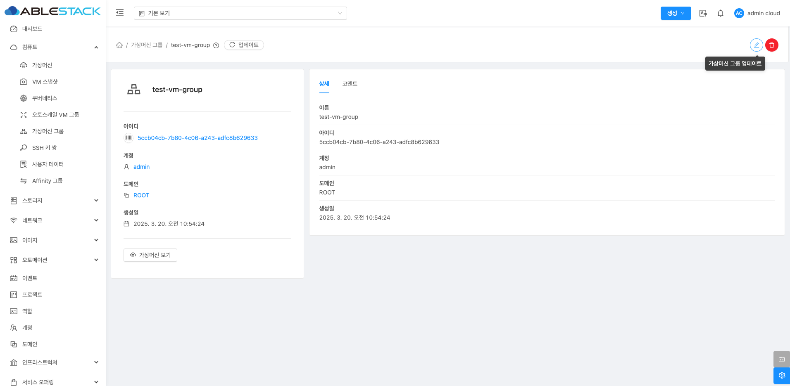
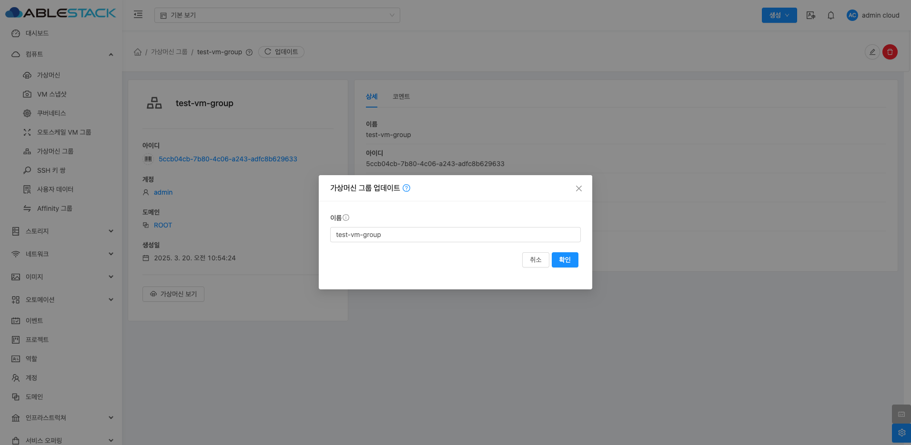
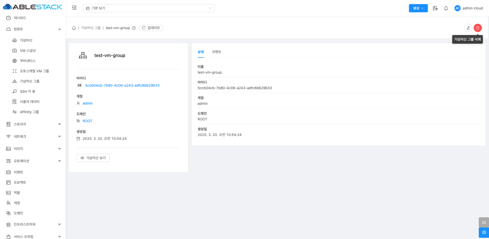
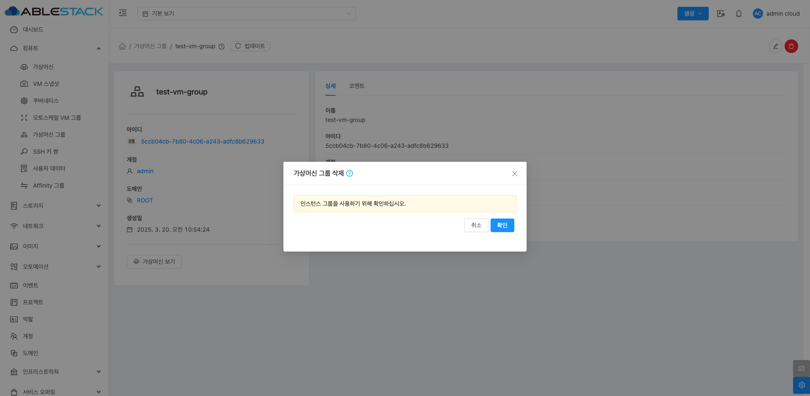
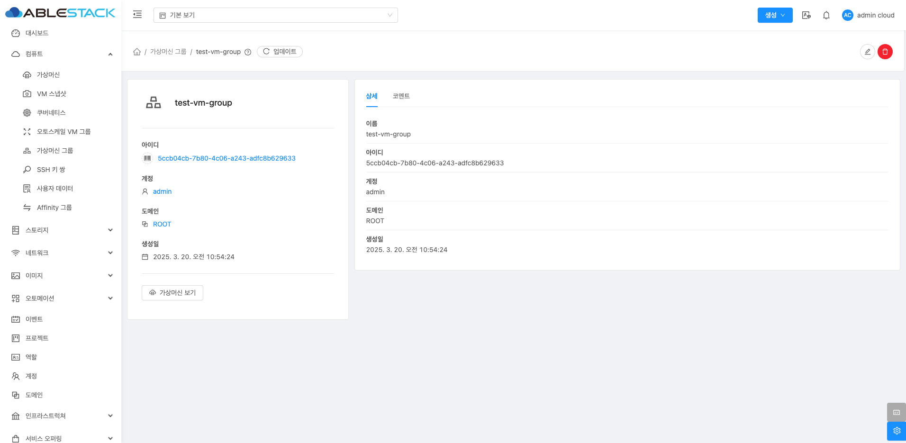
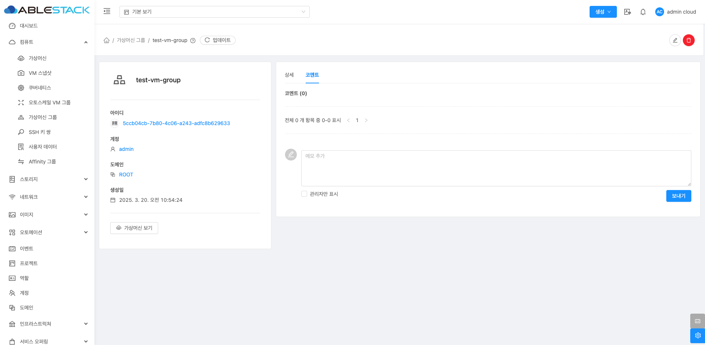

# 가상머신 그룹

## 개요
인스턴스 그룹은 Mold에서 가상머신을 논리적으로 그룹화하는 기능입니다. 이를 활용하면 여러 VM을 하나의 그룹으로 묶어 관리할 수 있으며, 필터링 및 정렬이 용이해집니다. 일반적으로 대규모 환경에서 특정 용도별로 VM을 그룹화하여 운영 효율성을 높이는 데 사용됩니다.

## 인스턴스 그룹 조회
인스턴스 그룹 목록을 조회할 수 있습니다. 등록된 인스턴스 그룹의 이름, 계정, 도메인 등을 확인할 수 있습니다.
{ align=center }

## 인스턴스 그룹 등록
새로운 인스턴스 그룹을 생성할 수 있습니다.
{ align=center }
{ align=center }

- **이름** :인스턴스 그룹의 이름을 입력합니다.

!!! info "가상머신에 인스턴스 그룹 적용 방법"
    인스턴스 그룹을 생성한 후 가상머신 생성 시 이를 적용합니다.

## 인스턴스 그룹 업데이트
인스턴스 그룹 상세 화면 오른쪽 상단의 인스턴스 그룹 업데이트 버튼을 클릭하여 인스턴스 그룹을 업데이트할 수 있습니다.
{ align=center }
{ align=center }

## 인스턴스 그룹 삭제
인스턴스 그룹 상세 화면 오른쪽 상단의 인스턴스 그룹 삭제 버튼을 클릭하여 인스턴스 그룹을 삭제할 수 있습니다.
{ align=center }
{ align=center }

## 인스턴스 그룹 상세 탭
인스턴스 그룹에 대한 상세 정보를 확인하는 화면입니다. 좌측 화면의 "가상머신 보기" 버튼을 통해 해당 인스턴스 그룹을 적용중인 가상머신들을 확인할 수 있으며 우측 화면에서는 이름, UUID, 계정, 도메인, 생성일 등 상세 정보를 확인할 수 있습니다.
{ align=center }

## 인스턴스 그룹 코멘트
인스턴스 그룹에 대한 코멘트를 확인하는 화면입니다.
{ align=center }

