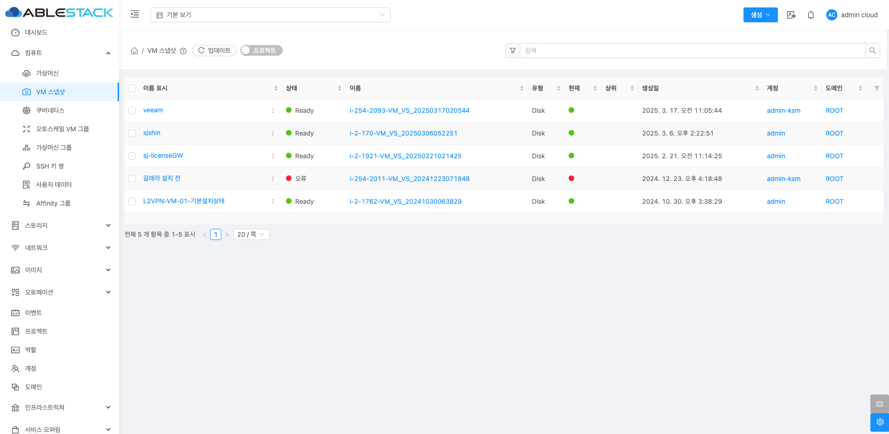
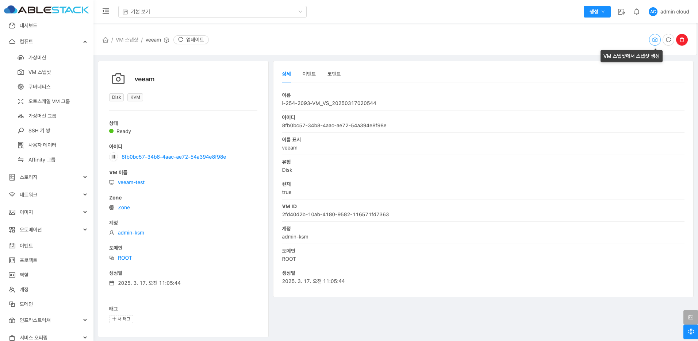
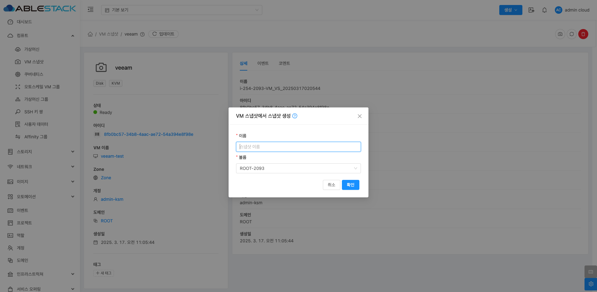
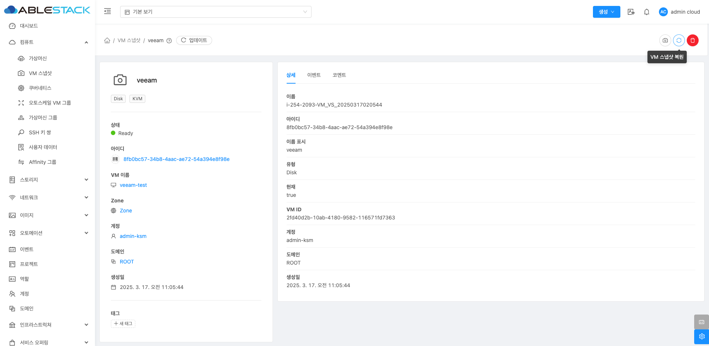
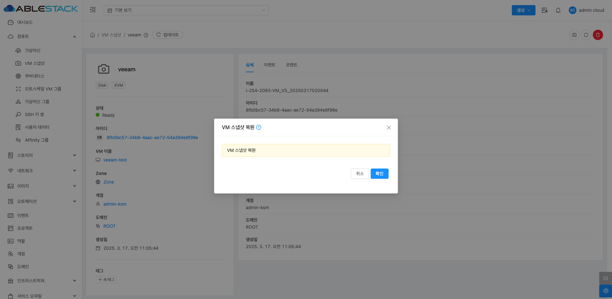
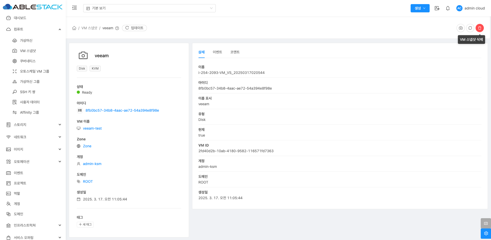
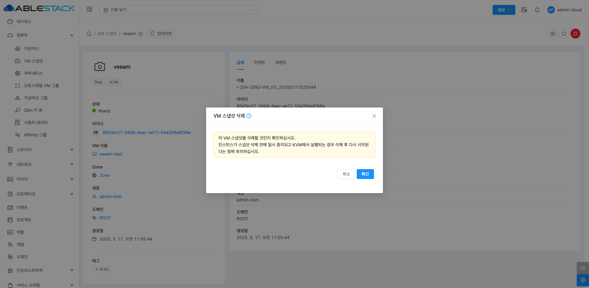
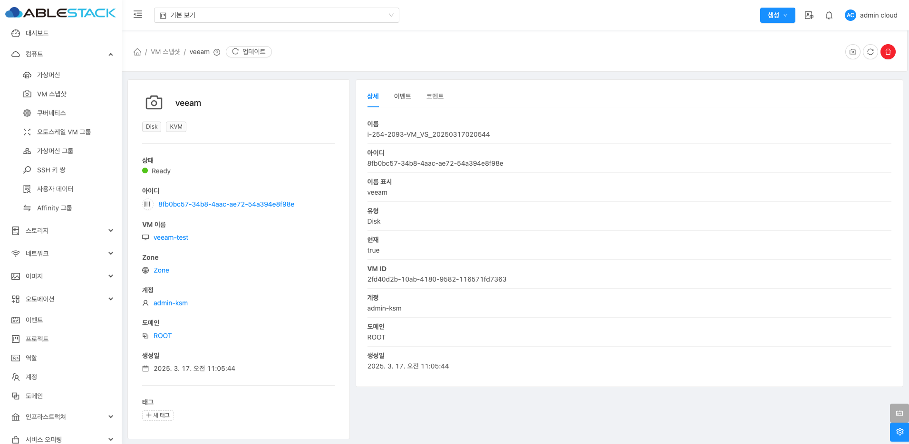
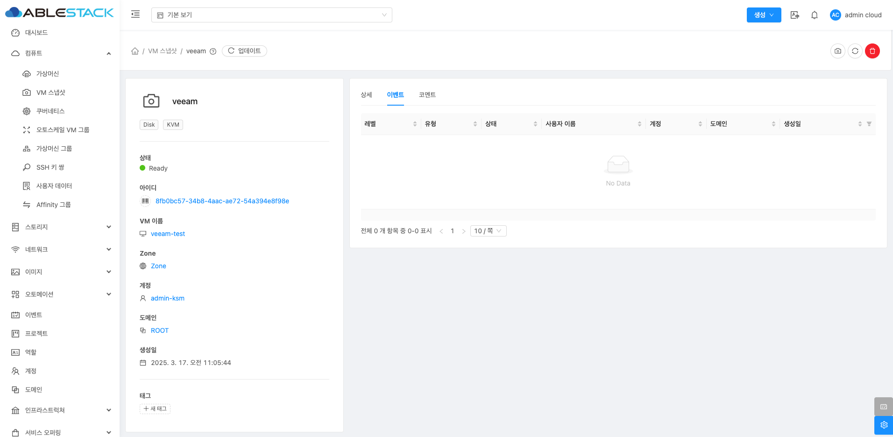
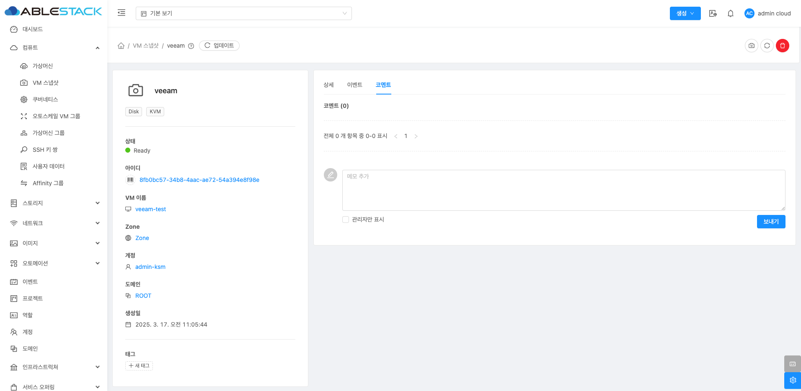

# VM 스냅샷

## 개요
VM 스냅샷을 관리하는 기능입니다. VM 스냅샷은 가상머신의 특정 시점 상태를 저장하여 이후 복원할 수 있도록 하는 기능으로, 시스템 장애 발생 시 
빠르게 복구하거나 중요한 변경 전에 백업용으로 사용할 수 있습니다. 가상머신 메뉴에서 스냅샷을 생성하면 해당 시점의 VM 디스크 및 메모리 상태가 저장되며, 
필요할 때 이를 활용하여 동일한 상태로 복원할 수 있습니다. Mold에서는 VM 스냅샷을 수동으로 생성하거나 일정에 따라 자동으로 생성하도록 설정할 수 있습니다.

## VM 스냅샷 조회
VM 스냅샷 조회 기능은 Mold에서 생성된 VM 스냅샷 목록을 확인하고 세부 정보를 검토할 수 있도록 지원합니다. 
생성된 스냅샷의 이름, 상태, 이름 표시, 유형, 현재(상태), 생성 날짜, 계정, 도메인 등을 조회할 수 있으며, 특정 스냅샷을 선택하면 해당 VM의 정보와 생성 시점 등의 세부 정보를 확인할 수 있습니다.
또한 스냅샷 상태(예: Creating, Ready)를 모니터링하고, VM 이름이나 생성 날짜 등을 기준으로 필터링하여 원하는 스냅샷을 빠르게 찾을 수 있습니다.
이를 통해 스냅샷 복원 전 상태를 확인하거나, 불필요한 스냅샷을 정리하여 스토리지 용량을 효율적으로 관리할 수 있습니다.
{ .imgCenter .imgBorder }

## VM 스냅샷에서 스냅샷 생성
VM 스냅샷 상세 화면 오른쪽 상단의 VM 스냅샷에서 스냅샷 생성 버튼을 클릭하여 스냅샷을 생성합니다. 기존 VM 스냅샷 기능과 비교하여 특정 인스턴스의 스냅샷에서 새로운 볼륨 스냅샷을 생성하는 기능입니다. 이를 통해 기존 VM의 특정 시점 상태를 저장하고, 이후 해당 상태를 기반으로 개별 볼륨을 복구하거나 새로운 인스턴스를 배포하는 데 활용할 수 있습니다.
{ .imgCenter .imgBorder }
{ .imgCenter .imgBorder }

- **스냅샷 이름 지정**: 생성할 스냅샷의 이름을 입력합니다.
- **볼륨 선택**: 기존 VM 스냅샷에서 특정 볼륨(예: 루트 디스크)을 선택하여 해당 볼륨의 상태를 저장하는 스냅샷을 생성할 수 있습니다.

## VM 스냅샷 복원
VM 스냅샷 상세 화면 오른쪽 상단의 VM 스냅샷 복원 버튼을 클릭하여 VM 스냅샷 복원 기능은 기존에 생성된 VM 스냅샷을 사용하여 해당 VM의 상태를 특정 시점으로 되돌리는 기능입니다. 복원을 수행하면 선택한 스냅샷이 포함하는 운영 체제, 애플리케이션, 데이터 등이 스냅샷 생성 시점의 상태로 복구됩니다. 이를 통해 시스템 장애나 설정 오류 발생 시 빠르게 복구할 수 있으며, VM을 동일한 상태로 여러 번 재구성할 때도 활용할 수 있습니다.
{ .imgCenter .imgBorder }
{ .imgCenter .imgBorder }

## VM 스냅샷 삭제
VM 스냅샷 상세 화면 오른쪽 상단의 VM 스냅샷 삭제 버튼을 클릭하여 VM 스냅샷을 삭제할 수 있습니다.

!!! warning "이 VM 스냅샷을 삭제하시겠습니까? KVM에서 실행 중인 경우, 스냅샷 삭제 전에 인스턴스가 일시 중지되며, 삭제 후 자동으로 다시 시작됩니다."

{ .imgCenter .imgBorder }
{ .imgCenter .imgBorder }

## VM 스냅샷 상세 탭
VM 스냅샷 클러스터에 대한 상세 정보를 확인하는 화면입니다. 우측 화면에서 이름, 아이디, 이름표시, 유형, 현재(상태), VM ID, 계정, 도메인, 생성일 등 상세 정보를 확인할 수 있습니다.
{ .imgCenter .imgBorder }

## VM 스냅샷 이벤트 탭
VM 스냅샷 클러스터에 대한 이벤트를 확인하는 화면입니다.
{ .imgCenter .imgBorder }

## VM 스냅샷 코멘트
쿠버네티스에 대한 코멘트를 확인하는 화면입니다.
{ .imgCenter .imgBorder }

