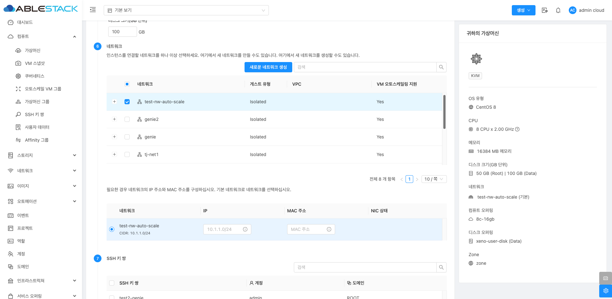
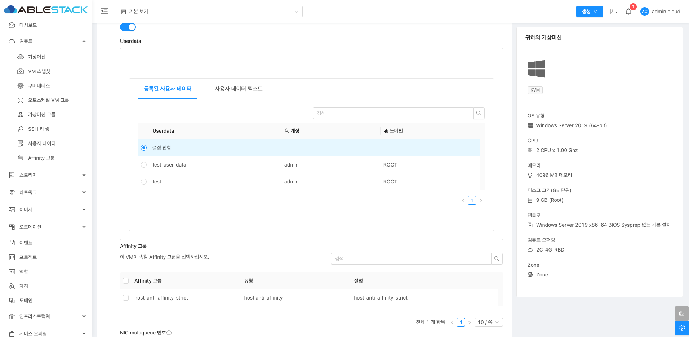
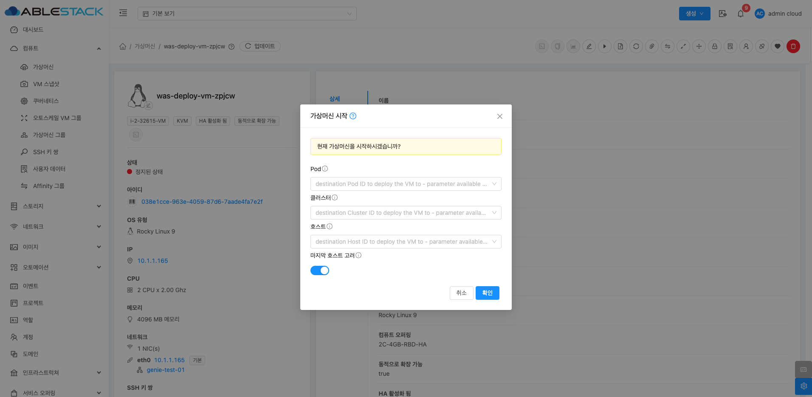
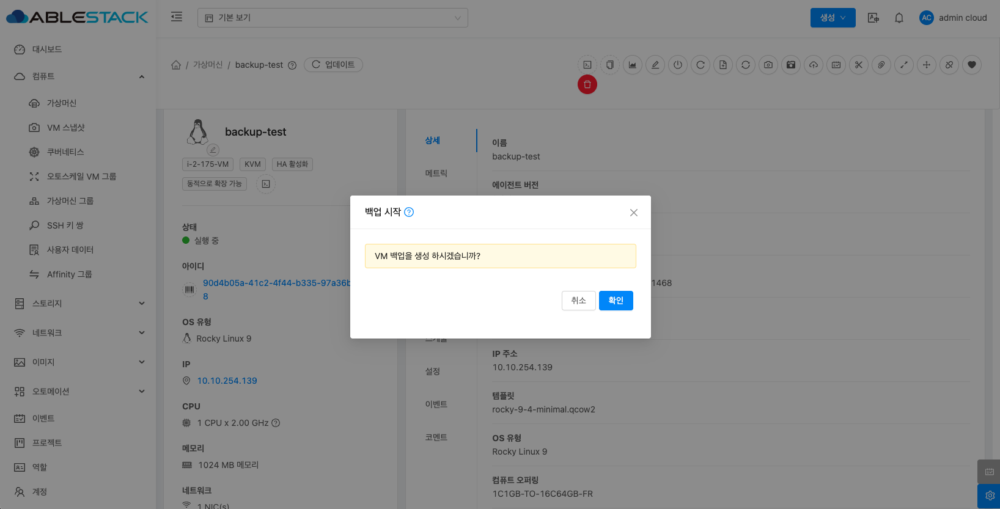
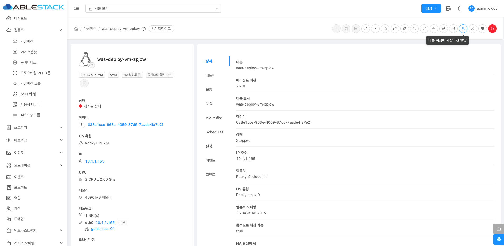
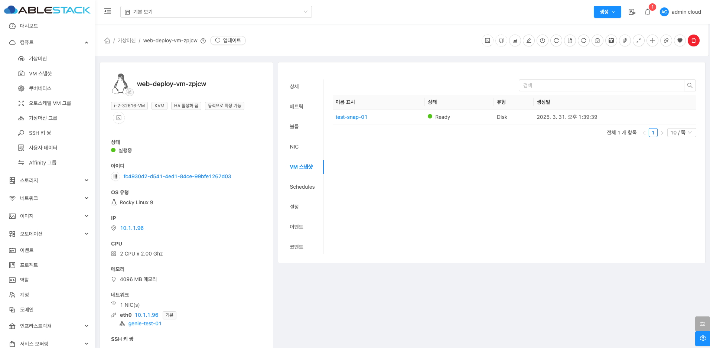

# 가상머신

Mold의 가상머신(Virtual Machine, VM) 메뉴는 클라우드 환경에서 가상머신을 생성, 관리 및 제어하는 기능을 제공합니다. 사용자는 원하는 인프라 환경에 맞춰 VM을 설정하고, 다양한 네트워크 및 스토리지 옵션을 적용할 수 있습니다.

## 목록 조회

가상머신의 목록을 확인하는 화면입니다.
생성된 가상머신 목록을 확인하거나 가상머신 추가버튼을 클릭하여 가상머신을 생성할 수 있습니다.
{ .imgCenter .imgBorder }

## 가상머신 추가
가상머신 추가 버튼 클릭하여 새 가상머신 생성 화면을 호출합니다.

1. 다른 계정에 가상머신 할당합니다. 새로 생성하는 VM을 특정 계정에 할당할 수 있습니다.
    { .imgCenter .imgBorder }

    * **소유자 유형**: VM을 할당할 계정의 유형을 지정합니다.
    * **도메인**: VM이 속할 도메인을 선택합니다.
    * **계정**: VM을 생성할 특정 계정을 선택합니다.

2. 배포 인프라를 선택합니다. 가상머신이 배포될 클라우드 인프라를 설정하는 단계입니다.
    { .imgCenter .imgBorder }
    
    * **Zone**: Zone을 선택합니다.
    * **Pod**: Zone 내에서 VM이 배포될 Pod를 선택합니다.
    * **클러스터**: Pod 내에서 VM을 실행할 클러스터를 선택합니다.
    * **호스트**: 클러스터 내에서 VM이 실행될 물리적 호스트를 선택합니다.


3. 템플릿 또는 ISO 또는 Glue 이미지를 선택합니다. 가상머신을 배포할 때 사용할 OS 템플릿 또는 ISO 이미지를 선택합니다. "추천", "커뮤니티", "나의 템플릿", "공유" 등의 카테고리에서 선택할 수 있습니다.

    * **템플릿**: 템플릿: 미리 설정된 OS 이미지 중 하나를 선택합니다.
        { .imgCenter .imgBorder }
    * **ISO**: 직접 OS 설치가 필요한 경우 ISO 파일을 선택하여 VM을 생성한 후 수동으로 OS를 설치할 수 있습니다.
        { .imgCenter .imgBorder }
    * **Glue 이미지**: 볼륨을 복제하여 가상머신을 시작할 수 있는 Glue 이미지를 선택합니다.
        { .imgCenter .imgBorder }

        !!! note "NOTE"
            가상머신 이미지로 Glue 이미지를 선택한 경우, 컴퓨트오퍼링의 디스크 크기를 이미지 크기에 맞춰서 선택하십시오.

4. 컴퓨트 오퍼링을 선택합니다. 미리 정의된 고정 컴퓨트 오퍼링 또는 사용자가 원하는 값을 직접 설정할 수 있는 커스텀 오퍼링을 선택할 수 있습니다.
   { .imgCenter .imgBorder }

    * **루트 디스크 오퍼링 무시**: 활성화하면 기본 디스크 설정을 무시하고 별도로 디스크를 선택하고 용량을 변경할 수 있습니다.
        { .imgCenter .imgBorder }

5. 데이터 디스크를 사용 유무를 선택합니다. 루트 디스크외에 추가적인 데이터 저장소가 필요하면 데이터 디스크를 추가할 수 있습니다.
   { .imgCenter .imgBorder }

6. 네트워크를 선택합니다. 기존 네트워크를 선택할 수도 있으며, "새로운 네트워크 생성" 버튼을 눌러 새로운 네트워크를 추가할 수도 있습니다. 사용자가 선택한 네트워크의 IP 주소 및 MAC 주소를 설정할 수 있으며 이 값은 기본적으로 자동 할당되고, 필요한 경우 수동으로 값을 입력할 수 있습니다. 
   { .imgCenter .imgBorder }

7. SSH 키 쌍을 선택합니다. SSH를 통해 가상머신에 접속하기 위한 키 쌍을 설정하는 단계입니다. 기존 키를 사용하거나 새 키를 생성할 수 있습니다.
   { .imgCenter .imgBorder }

8. 확장 모드를 선택합니다. 고급 기능을 사용하려면 확장 모드를 활성화해야 합니다.
   { .imgCenter .imgBorder }

    * **부팅 유형**: VM이 부팅할 때 사용할 펌웨어 타입을 결정하는 설정입니다. 일반적으로 BIOS 또는 UEFI 중에서 선택할 수 있습니다.
      { .imgCenter .imgBorder }

    * **부팅 모드**: 부팅 방식에 대한 추가 설정입니다.
      { .imgCenter .imgBorder }

    * **TPM 활성화 (Trusted Platform Module)**: 보안 칩을 이용하여 VM의 보안성을 강화할 수 있습니다.
        { .imgCenter .imgBorder }

    * **Dynamic Scaling 활성화**: VM의 리소스를 동적으로 조정할 수 있도록 하는 기능입니다. 기본적으로 비활성화되어 있으며, 사용자가 필요할 경우 활성화할 수 있습니다.
        { .imgCenter .imgBorder }
        * 단, 이 기능을 활성화하려면 다음 조건이 필요합니다. 
            * VM 템플릿에서 Dynamic Scaling 지원
            * 서비스 오퍼링에서 Dynamic Scaling 지원
            * Mold 글로벌 설정에서 Dynamic Scaling 활성화

    * **Userdata**: 클라우드 초기화 과정에서 VM 내부에서 실행할 사용자 스크립트를 입력하거나 미리 설정된 사용자 데이터를 선택할 수 있습니다.
        { .imgCenter .imgBorder }

    * **Affinity 그룹**: VM이 특정 호스트에서 함께 실행되거나, 서로 다른 호스트에서 실행되도록 제어하는 기능입니다. 미리 생성된 Affinity 그룹을 선택할 수 있습니다.
        { .imgCenter .imgBorder }

    * **NIC Multiqueue**: Multiqueue 기능은 여러 개의 큐를 사용하여 네트워크 트래픽을 분산 처리함으로써 VM의 네트워크 성능을 향상시키며, 일반적으로 vCPU 개수와 동일한 값으로 설정하는 것이 권장됩니다. 
        * NIC multiqueue 번호는 KVM에서만 지원되며, "-1" 값은 해당 번호가 인스턴스의 vCPU 개수로 설정됨을 의미합니다.

    * **NIC 압축 Virtqueues**: Virtio-Net 장치의 성능을 최적화하는 이 옵션은 Virtqueues(가상 큐)를 압축하여 메모리 사용량을 줄이고 성능을 향상시킵니다.
        * 최신 Linux 커널 및 일부 최적화된 VM 환경에서 사용 가능합니다. QEMU >= 4.2.0 및 Libvirt >= 6.3.0인 KVM만 지원합니다.

    * **IOThreads**: VM의 디스크 및 네트워크 I/O 처리를 위한 스레드 수를 지정하는 이 옵션은 높은 I/O 부하가 예상되는 VM에서 성능 향상을 위해 IOThreads 수를 늘릴 수 있습니다.

    * **IO 드라이버 정책**: 클라우드 초기화 과정에서 VM 내부에서 실행할 사용자 스크립트를 입력하거나 미리 설정된 사용자 데이터를 선택할 수 있습니다.
        * IO 드라이버 정책은 기본(default), io_uring, 스레드(thread) 중에서 선택할 수 있으며, 스토리지 풀 옵션 'kvm.storage.pool.io.policy'가 설정된 경우(사용 가능 시) 이를 재정의할 수 있습니다.

9. 가상머신을 생성하기 전에 아래 항목을 확인하고 올바르게 설정하는 단계입니다.
   { .imgCenter .imgBorder }

    * **이름(옵션)**: 가상머신의 식별을 위해 고유한 이름을 지정할 수 있습니다. 이름을 입력하지 않으면 기본값이 자동으로 할당됩니다.
    * **그룹(옵션)**: 가상머신을 특정 그룹에 할당하여 관리할 수 있습니다.
    * **키보드 언어**: VM에서 사용할 키보드 레이아웃을 선택합니다.
    * **생성할 가상머신 수**: 동시에 생성할 가상머신의 개수를 지정합니다. 여러 대의 VM을 한 번에 생성할 경우 동일한 설정이 적용됩니다.
    * **가상머신 시작**: VM 생성 후 즉시 부팅할지 여부를 선택합니다. 체크하면 VM이 자동으로 시작되며, 체크 해제 시 생성만 진행되고 수동으로 부팅해야 합니다.

## 가상머신 콘솔 보기
가상머신 상세 화면 오른쪽 상단의 콘솔 보기 버튼을 클릭하여 사용자가 가상 머신의 직접적인 화면을 통해 상호작용할 수 있도록 합니다. 
{ .imgCenter .imgBorder }
{ .imgCenter .imgBorder }

!!! info "INFO"
    중지된 VM은 콘솔 보기 기능을 사용할 수 없습니다.

## 클립보드에 콘솔 URL 복사
가상머신 상세 화면 오른쪽 상단의 클립보드에 콘솔 URL 복사 버튼을 클릭하여 관리자는 클라우드 환경 내에서 가상 머신의 콘솔에 직접 접근할 수 있는 URL을 빠르게 복사하고 다른 도구나 시스템에서 사용할 수 있습니다.
{ .imgCenter .imgBorder }

## 가상머신 실시간 모니터링 연결
가상머신 상세 화면 오른쪽 상단의 실시간 모니터링 연결 버튼을 클릭하여 사용자가 가상 머신 리소스에 대한 실시간 성능 데이터를 모니터링할 수 있는 기능입니다. 이를 통해 사용자는 가상 머신의 상태, 네트워크 트래픽, CPU 사용량, 메모리 사용량 등을 실시간으로 확인하고, 문제를 신속하게 진단할 수 있습니다.
{ .imgCenter .imgBorder }
{ .imgCenter .imgBorder }

## 가상머신 편집
가상머신 상세 화면 오른쪽 상단의 편집 버튼을 클릭하여 기존에 생성된 가상 머신의 속성을 수정할 수 있습니다.
{ .imgCenter .imgBorder }
{ .imgCenter .imgBorder }

!!! info "INFO"
    이름 및 이름 표시 이외의 항목을 업데이트하려면 VM을 다시 시작해야 합니다.

* **이름**: 가상 머신의 이름을 수정할 수 있습니다.
* **이름 표시**: 가상 머신의 이름 표시를 수정할 수 있습니다.
* **OS 유형**: 가상 머신에 설치된 OS 유형을 변경할 수 있습니다.
* **동적으로 확장 가능**: 가상 머신(VM)의 CPU 및 메모리 리소스를 동적으로 확장할 수 있도록 지원하는 기능입니다. 이 기능은 가상 머신이 XS/VMware Tools를 포함하고 있을 때 활성화되며, 이를 통해 가상 머신의 리소스를 필요에 따라 실시간으로 확장하거나 축소할 수 있습니다.
* **HA(High Availability) 활성화**: HA 활성화를 설정하여 고가용성 기능을 사용할 수 있습니다.
* **그룹**: 가상 머신을 특정 그룹에 할당할 수 있습니다. 그룹을 통해 관련된 가상 머신들을 관리할 수 있습니다.
* **Userdata**: 가상 머신의 주로 초기 설정 및 스크립트 실행에 사용되는 Userdata를 설정할 수 있습니다.
* **삭제 보호**: 제 보호를 활성화하여, 해당 가상 머신이 실수로 삭제되지 않도록 보호할 수 있습니다.
    * 삭제 보호 활성화: 삭제 보호를 활성화하면, 해당 가상 머신은 삭제 시도가 있더라도 보호됩니다. 사용자는 명시적으로 삭제 명령을 실행하거나, 보호 기능을 비활성화해야만 삭제가 가능합니다.
    * 만약 가상 머신이 자동 확장 그룹(autoscaling groups)이나 Cloud Kubernetes Service (CKS)와 같은 다른 서비스에 의해 관리되고 있다면, 삭제 보호 기능은 무시될 수 있습니다. 이러한 서비스들은 가상 머신의 생애 주기를 관리하며, 자동으로 가상 머신을 생성하거나 삭제할 수 있기 때문에 삭제 보호 기능이 적용되지 않습니다.

## 가상머신 시작 (가상머신 정지 시 활성화)
가상머신 상세 화면 오른쪽 상단의 시작 버튼을 클릭하여 정지되었던 가상 머신을 시작할 수 있습니다.
{ .imgCenter .imgBorder }
{ .imgCenter .imgBorder }

* **Pod**: 가상 머신을 배포할 Pod를 선택합니다.
* **클러스터**: 가상 머신을 배포할 클러스터를 선택합니다.
* **호스트**: 가상 머신을 배포할 호스트를 선택합니다.
* **마지막 호스트 고려**: 가상 머신이 마지막에 실행된 호스트에 자동으로 배포됩니다. 이 기능은 VM이 특정 호스트에서 계속 실행되도록 보장할 수 있습니다.

## 가상머신 정지
가상머신 상세 화면 오른쪽 상단의 정지 버튼을 클릭하여 가상 머신을 정지할 수 있습니다. 가상 머신에 대한 리소스는 해제되지 않지만, CPU 및 메모리 자원은 소모되지 않습니다. 또한 가상 머신이 정상적으로 정지되지 않았거나, 정지 명령이 백엔드에 전송되지 않는 경우, 강제 정지 기능을 사용할 수 있습니다.
{ .imgCenter .imgBorder }
{ .imgCenter .imgBorder }

!!! warning "WARN"
    - 정지 후 재시작: 정지된 가상 머신은 자동으로 재시작되지 않습니다. 수동으로 재시작해야 다시 사용할 수 있습니다.
    - 서비스 중단: 가상 머신을 정지하면 서비스나 애플리케이션이 중단될 수 있습니다.
    - 강제 정지: 해당 기능은 정상적인 정지가 실패한 경우에만 사용하는 것이 권장되며, 가상 머신에 실행 중인 서비스나 애플리케이션에 영향을 미칠 수 있습니다.

## 가상머신 재시작
가상머신 상세 화면 오른쪽 상단의 재시작 버튼을 클릭하여 사용자가 가상 머신을 종료한 후 다시 시작하여, 변경된 설정을 적용하거나 시스템을 초기화하는 데 사용할 수 있습니다.
{ .imgCenter .imgBorder }
{ .imgCenter .imgBorder }

!!! warning "WARN"
    - 서비스 중단: 연결된 서비스나 애플리케이션이 일시적으로 중단될 수 있습니다.
    - 강제 재시작: 가상 머신이 정상적으로 재시작되지 않거나 응답하지 않는 경우, 강제 재시작(Force Restart) 옵션을 사용할 수 있습니다. 가상 머신의 상태와 관계없이 강제로 재시작을 시도하며, 이때 시스템이나 데이터 손상이 발생할 수 있습니다.

## 가상머신 복제
가상머신 상세 화면 오른쪽 상단의 가상 머신 복제 버튼을 클릭하여 기존의 가상 머신을 기반으로 새로운 가상 머신을 생성합니다. 이 기능은 특히 여러 개의 동일한 설정을 가진 가상 머신을 빠르게 배포해야 할 때 유용합니다.
{ .imgCenter .imgBorder }
{ .imgCenter .imgBorder }

* **이름**: 복제할 가상 머신의 이름을 입력합니다.
* **가상머신 시작**: VM 생성 후 즉시 부팅할지 여부를 선택합니다. 체크하면 VM이 자동으로 시작되며, 체크 해제 시 생성만 진행되고 수동으로 부팅해야 합니다.
* **생성할 가상머신 수**: 동시에 생성할 가상머신의 개수를 지정합니다. 여러 대의 VM을 한 번에 생성할 경우 동일한 설정이 적용됩니다.

## VM 재설치
가상머신 상세 화면 오른쪽 상단의 VM 재설치 버튼을 클릭하여 사용자가 가상 머신의 운영 체제를 새로 설치하는 작업입니다.
{ .imgCenter .imgBorder }
{ .imgCenter .imgBorder }

* **템플릿 선택**: 재설치할 가상머신의 템플릿을 선택합니다.
* **루트 디스크 오퍼링 무시**: VM 생성 후 즉시 부팅할지 여부를 선택합니다. 체크하면 VM이 자동으로 시작되며, 체크 해제 시 생성만 진행되고 수동으로 부팅해야 합니다.
* **루트 디스크 크기 무시**: 루트 디스크의 크기를 기본값에서 변경하여, 원하는 크기로 설정할 수 있습니다.
* **제거**: 재설치 후 이전의 루트 볼륨을 완전히 삭제하고 새로 설정된 운영 체제나 템플릿을 적용하려는 경우 사용됩니다. 기존 루트 디스크에 남아 있는 데이터나 설정을 완전히 초기화하고 싶을 경우 이 옵션을 사용합니다.

!!! warning "WARN"
    가상 머신 재설치 시, 기존의 루트 디스크의 데이터가 모두 삭제되고 새롭게 운영 체제가 설치됩니다. 

## VM 스냅샷 생성
가상머신 상세 화면 오른쪽 상단의 VM 스냅샷 생성 버튼을 클릭하여 가상 머신의 현재 상태를 저장하여 이후 특정 시점으로 복원할 수 있도록 할 수 있습니다. 이 기능을 사용하면 운영 체제, 애플리케이션, 데이터 및 메모리 상태를 포함한 VM의 전체 상태를 캡처할 수 있습니다. 
{ .imgCenter .imgBorder }
{ .imgCenter .imgBorder }

* **이름**: VM 스냅샷의 이름을 입력합니다.
* **설명**: VM 스냅샷에 대한 추가 정보를 입력합니다.
* **스냅샷 메모리**: 이 옵션을 선택하면 VM의 현재 메모리 상태를 포함한 스냅샷이 생성됩니다. 이를 통해 VM이 실행 중이던 상태 그대로 복원할 수 있습니다.
* **VM 일시정지**: 스냅샷 생성 시 VM을 일시정지하여 데이터 일관성을 보장할 수 있습니다. 특히, 데이터베이스와 같이 높은 일관성이 필요한 애플리케이션이 실행 중인 경우 유용합니다.

## VM 볼륨 스냅샷 생성
가상머신 상세 화면 오른쪽 상단의 VM 볼륨 스냅샷 생성 버튼을 클릭하여 사용자가 특정 시점의 VM 디스크 상태를 캡처하여 백업하거나 복구합니다. 이 기능은 VM의 디스크 볼륨을 대상으로 하며, 메모리나 CPU 상태는 포함하지 않습니다.
{ .imgCenter .imgBorder }
{ .imgCenter .imgBorder }

* **볼륨**: 스냅샷을 생성하려는 디스크 볼륨을 선택합니다.
* **이름**: VM 볼륨 스냅샷의 이름을 입력합니다.
* **스냅샷 메모리**: 스냅샷 생성 작업을 비동기적으로 수행할지 여부를 결정합니다. 비동기 백업을 활성화하면 스냅샷 생성 요청이 즉시 반환되며, 백그라운드에서 스냅샷 생성이 진행됩니다. 이를 통해 사용자 인터페이스의 응답성을 유지할 수 있습니다.

## 백업 시작 (가상머신 백업 오퍼링 할당 시 활성화)
가상머신 상세 화면 오른쪽 상단의 백업 시작 버튼을 클릭하여 해당 가상머신을 백업합니다.
{ .imgCenter .imgBorder }
{ .imgCenter .imgBorder }

## 백업 스케줄 구성 (가상머신 백업 오퍼링 할당 시 활성화)
가상머신 상세 화면 오른쪽 상단의 백업 스케줄 구성 버튼을 클릭하여 해당 가상머신에 백업 스케줄을 구성합니다.
{ .imgCenter .imgBorder }
{ .imgCenter .imgBorder }

!!! info "INFO"
    가상머신은 한 개의 백업 스케줄만 설정이 가능합니다.

* **스케줄**: 매시간, 매일, 매주, 매월 유형으로 스케줄을 설정할 수 있습니다.
* **예약된 백업**: 예약된 백업 스케줄을 표시하며, 삭제 버튼을 클릭하여 예약된 백업을 삭제할 수 있습니다.

## 가상머신에 백업 오퍼링 할당
가상머신 상세 화면 오른쪽 상단의 가상머신에 백업 오퍼링 할당 버튼을 클릭하여 해당 가상머신에 백업 오퍼링을 할당합니다.
{ .imgCenter .imgBorder }
{ .imgCenter .imgBorder }

* **백업 오퍼링 ID**: 가상머신에 할당하려는 백업 오퍼링을 선택합니다.

!!! info "INFO"
    * 글로벌 설정에서 ```backup.framework.enabled``` 값을 ```true```로 설정하여 가상머신에 백업 오퍼링 할당 기능을 활성화 할 수 있으며, 사전에 서비스 오퍼링의 백업 오퍼링 메뉴에서 백업 오퍼링 가져오기를 실행해야 합니다.

## 가상머신에 백업 오퍼링 제거 (가상머신 백업 오퍼링 할당 시 활성화)
가상머신 상세 화면 오른쪽 상단의 가상머신에 백업 오퍼링 제거 버튼을 클릭하여 해당 가상머신에 백업 오퍼링을 제거합니다.
{ .imgCenter .imgBorder }
{ .imgCenter .imgBorder }

!!! warning "WARN"
    - 강제: 체크 시 가상머신의 백업도 함께 삭제됩니다.

## 가상머신 ISO 연결
가상머신 상세 화면 오른쪽 상단의 ISO 연결 버튼을 클릭하여 사용자가 운영체제 설치, 소프트웨어 추가, 드라이버 업데이트 등 다양한 작업을 수행할 수 있도록 합니다.

!!! info "INFO"
    연결된 이미지가 없는 상태에서 해당 기능 사용이 가능합니다.

{ .imgCenter .imgBorder }
{ .imgCenter .imgBorder }

* **ISO 이름**: 등록된 ISO 목록에서 원하는 이미지를 선택한 후 '확인'을 클릭합니다.

## ISO 분리
가상머신 상세 화면 오른쪽 상단의 ISO 분리 버튼을 클릭하여 연결되었던 ISO를 연결 해제합니다.

!!! info "INFO"
    이미지가 연결된 상태에서 해당 기능 사용이 가능합니다.

{ .imgCenter .imgBorder }
{ .imgCenter .imgBorder }

## VM 확장
가상머신 상세 화면 오른쪽 상단의 VM 확장 버튼을 클릭하여 CPU와 메모리(RAM) 리소스를 조정할 수 있습니다. VM이 실행 중이든 정지 상태이든 리소스 조정이 가능하지만, 각 경우에 따라 적용되는 절차와 제한 사항이 있습니다.

- VM이 정지 상태인 경우: VM이 정지된 상태에서는 CPU, 메모리 등 오퍼링 변경을 통해 자유롭게 조정할 수 있습니다. 이 경우, VM의 설정을 변경한 후 다시 시작하면 새로운 리소스 설정이 적용됩니다.
- VM이 실행 중인 경우: 동적 확장(Dynamic Scaling) 기능을 활용해야 합니다. 글로벌 설정과 컴퓨트 오퍼링에서 기능을 활성화한 후 사용할 수 있습니다. 

!!! info "INFO"
    * 글로벌 설정에서 ```enable.dynamic.scale.vm``` 값을 ```true```로 설정하여 동적 확장 기능을 활성화 할 수 있습니다.
    * 실행 중인 VM이 고정 컴퓨팅 오퍼링을 사용하는 경우, KVM 하이퍼바이저를 활용하는 VM은 확장할 수 없습니다.

{ .imgCenter .imgBorder }
{ .imgCenter .imgBorder }

* **컴퓨트 오퍼링**: 변경할 오퍼링을 선택합니다.
* **필요한 경우 볼륨을 다른 스토리지 풀로 자동 마이그레이션**: 활성화하면 특정 조건에 따라 가상 머신의 데이터 저장소인 볼륨을 자동으로 다른 스토리지 풀로 이동시킵니다. 한 스토리지 풀에 저장된 볼륨이 과부하 상태일 경우, Mold는 자동으로 볼륨을 다른 스토리지 풀로 이전하여 시스템 안정성을 유지할 수 있습니다.

## 다른 기본 스토리지에 가상머신 마이그레이션 (가상머신 정지 시 활성화)
가상머신 상세 화면 오른쪽 상단의 시작 버튼을 클릭하여 정지되었던 가상 머신을 시작할 수 있습니다.
{ .imgCenter .imgBorder }
{ .imgCenter .imgBorder }

* **Pod**: 가상 머신을 배포할 Pod를 선택합니다.
* **클러스터**: 가상 머신을 배포할 클러스터를 선택합니다.
* **호스트**: 가상 머신을 배포할 호스트를 선택합니다.
* **마지막 호스트 고려**: 가상 머신이 마지막에 실행된 호스트에 자동으로 배포됩니다. 이 기능은 VM이 특정 호스트에서 계속 실행되도록 보장할 수 있습니다.

## SSH 키 쌍 재설정 (가상머신 정지 시 활성화)
가상머신 상세 화면 오른쪽 상단의 SSH 키 쌍 재설정 버튼을 클릭하여 기존에 설정된 SSH 키 쌍을 새로운 키로 교체할 수 있습니다.

!!! warning "WARN"
    SSH 키 쌍 재설정 후 새로 선택한 SSH 키로만 접근할 수 있습니다.

{ .imgCenter .imgBorder }
{ .imgCenter .imgBorder }

* **SSH 키 쌍**: 해당 VM에 변경할 SSH 키 쌍을 선택합니다.

## VM에서 사용자 데이터 재설정 (가상머신 정지 시 활성화)
가상머신 상세 화면 오른쪽 상단의 VM에서 사용자 데이터 재설정 버튼을 클릭하여 가상머신의 초기 설정 정보(Userdata)를 필요에 따라 업데이트하거나 변경할 수 있습니다.

!!! note "NOTE"
    * Userdata 재설정 후, 가상머신을 재부팅해야 변경 사항이 완전히 적용됩니다.
    * 잘못된 Userdata 입력 시 가상머신이 정상적으로 동작하지 않을 수 있습니다.

{ .imgCenter .imgBorder }
{ .imgCenter .imgBorder }

## 다른 계정에 가상머신 할당 (가상머신 정지 시 활성화)
가상머신 상세 화면 오른쪽 상단의 다른 계정에 가상머신 할당 버튼을 클릭하여 가상머신의 특정 가상머신을 다른 사용자 또는 관리 계정으로 쉽게 이전할 수 있습니다.

!!! info "INFO"
    * 대상 계정에서 가상머신 관리 권한과 접근 권한이 자동으로 활성화됩니다.
    * 계정 간 할당 시 보안 그룹, 네트워크 설정 및 접근 정책 등 기존 설정이 변경되지 않고 그대로 유지됩니다

{ .imgCenter .imgBorder }
{ .imgCenter .imgBorder }

* **소유자 유형**: 계정 또는 프로젝트를 선택합니다.
* **도메인**: VM이 속할 도메인을 선택합니다.
* **계정**: VM이 속할 계정을 선택합니다.
* **프로젝트**: VM이 속할 프로젝트를 선택합니다.
* **네트워크**: VM이 속할 네트워크를 선택합니다.
    * 인스턴스의 기본 NIC가 서비스용 네트워크에 있으면 네트워크를 지정하지 않아도 됩니다. 이 경우 ABLESTACK에서 새 계정의 네트워크 사용 가능 여부를 자동으로 확인합니다.
    * 기본 NIC가 격리된 네트워크에 있고 새 계정에 격리된 네트워크가 하나 이상 존재하는 경우에는 반드시 네트워크를 하나 지정해야 합니다.

## 다른 호스트에게 가상머신 마이그레이션
가상머신 상세 화면 오른쪽 상단의 다른 호스트에게 가상머신 마이그레이션 버튼을 클릭하여 가상 머신(VM)을 다른 호스트로 마이그레이션할 수 있습니다.

- VM이 정지 상태인 경우(Offline Migration): VM을 정지한 후, 디스크 이미지와 설정 파일을 다른 호스트로 이동합니다.
- VM이 실행 중인 경우(Live Migration): VM이 실행 중인 상태에서 메모리, CPU 상태 등을 실시간으로 다른 호스트로 이전합니다. 이를 통해 서비스 중단 없이 호스트의 유지 보수나 부하 분산을 수행할 수 있습니다.

{ .imgCenter .imgBorder }
{ .imgCenter .imgBorder }
{ .imgCenter .imgBorder }

* **호스트 선택**: 마이그레이션에 적합 판정이 된 호스트를 선택합니다.
    * 적합성: 각 호스트에 대한 적합성 정보가 제공됩니다. 각 호스트의 CPU 사용률, 메모리 사용량, 할당된 메모리 등의 정보가 표시됩니다.
    * CPU 사용률: 마이그레이션할 VM이 대상 호스트에서 원활하게 실행될 수 있도록 CPU 사용률이 낮은 호스트를 선택합니다.
    * 메모리 사용량: 대상 호스트가 충분한 메모리를 보유하고 있어야 합니다.
* **스토리지 마이그레이션**: 마이그레이션에 적합 판정이 된 호스트를 선택합니다.
    * 스토리지 마이그레이션 필요 여부: 활성화 하면 스토리지 마이그레이션도 함께 진행됩니다.
    * 볼륨 및 스토리지 정보: 예를 들어, ROOT-782 볼륨이 GlueBlock PS 스토리지에 저장되어 있고, 이를 "자동 할당"된 스토리지로 마이그레이션할 수 있습니다.
    * "자동 할당" 대신 다른 스토리지를 변경하기 위해 "변경" 버튼을 눌러 선택합니다.

## 가상머신 관리 해제
가상머신 상세 화면 오른쪽 상단의 콘솔 보기 버튼을 클릭하여 가상머신 관리 해제를 할 수 있습니다. 특정 가상 머신을 Mold의 관리 대상에서 제외하여 이후 해당 VM을 Mold 외부의 도구나 플랫폼에서 직접 관리할 수 있도록 하는 기능입니다.

{ .imgCenter .imgBorder }
{ .imgCenter .imgBorder }
{ .imgCenter .imgBorder }
관리 해제된 가상머신은 인스턴스 가져오기-내보내기 메뉴에 비관리 인스턴스 항목에서 확인할 수 있습니다.

## VBMC 포트 할당
가상머신 상세 화면 오른쪽 상단의 VBMC 포트 할당 버튼을 클릭하여 해당 가상머신에 VBMC(Virtual Baseboard Management Controller) 포트를 할당합니다.
{ .imgCenter .imgBorder }
{ .imgCenter .imgBorder }

## VBMC 포트 해제 (VBMC 할당 시 활성화)
가상머신 상세 화면 오른쪽 상단의 VBMC 포트 해제 버튼을 클릭하여 해당 가상머신에 VBMC(Virtual Baseboard Management Controller) 포트를 해제합니다.
{ .imgCenter .imgBorder }
{ .imgCenter .imgBorder }

## 가상머신 파기
가상머신 상세 화면 오른쪽 상단의 가상머신 파기 버튼을 클릭하여 가상 머신을 파기(Destroy)하고 제거(Expunge)할 수 있습니다.
{ .imgCenter .imgBorder }
{ .imgCenter .imgBorder }

* **제거(Expunge)**: 제거를 활성화 하면 VM과 관련된 모든 데이터를 Mold 데이터베이스에서 완전히 제거하는 작업을 수행합니다.

    !!! danger "제거(Expunge) 작업을 수행할 경우 VM을 복구할 수 없습니다."

{ .imgCenter .imgBorder }

* **삭제될 데이터 볼륨**: 가상머신과 함께 삭제될 데이터 볼륨은 선택합니다.

    !!! danger "선택된 데이터 볼륨은 영구적으로 삭제됩니다."


## 가상머신 상세 탭
가상머신에 대한 상세 정보를 확인하는 화면입니다. 가상머신의 상태, 설정 및 리소스 사용 정보를 포함하여 다양한 관리 기능을 제공합니다.

### 상세 탭에서 제공하는 주요 정보
* 상태: 가상머신의 현재 상태(예: 정지, 실행 중)를 나타냅니다.
* 에이전트 버전: QEMU Guest Agent version 정보입니다.
* 아이디: 가상머신의 고유 식별자입니다.
* OS 유형: 설치된 운영 체제의 종류를 표시합니다.
* IP 주소: 할당된 IP 주소를 표시합니다.
* CPU 및 메모리: 할당된 CPU 코어 수와 클럭 속도, 메모리 용량을 표시합니다.
* 네트워크: 가상머신의 네트워크 인터페이스(NIC) 정보와 연결된 네트워크를 표시합니다.
* SSH 키 쌍: 연결된 SSH 키 쌍 이름을 제공합니다.
* 템플릿: 가상머신를 생성할 때 사용된 템플릿의 이름을 표시합니다.
* 컴퓨트 오퍼링: 사용된 컴퓨트 오퍼링 이름을 표시합니다.
* Zone: 가상머신이 위치한 영역을 나타냅니다.
* 계정 및 도메인: 가상머신를 소유한 계정과 도메인을 표시합니다.
* 생성일 및 마지막 업데이트: 가상머신의 생성일과 최근 업데이트 날짜를 표시합니다.

{ .imgCenter .imgBorder }


## 가상머신 메트릭 탭
메트릭 탭은 선택한 가상머신의 실시간 성능 정보를 시각적으로 제공합니다. 이를 통해 가상머신의 성능 상태를 빠르게 파악하고 리소스를 최적화할 수 있습니다.

{ .imgCenter .imgBorder }

### 메트릭 탭에서 제공하는 주요 지표

* CPU 사용률
    * 가상머신의 CPU 자원 사용 현황을 백분율(%)로 표시합니다.
    * 가상머신에 여러 vCPU가 할당되었거나 CPU Cap이 비활성화된 경우, CPU 사용률이 100%를 초과할 수 있습니다.(하이퍼바이저 통계 계산 방식)
* 메모리 사용량
    * 가상머신에 할당된 전체 메모리 대비 사용 중인 메모리 용량을 시각적으로 나타냅니다.
    * 하이퍼바이저에서 메모리 데이터를 가져올 수 없거나, 추가 도구가 미설치된 경우, 실제 메모리 사용량과 차이가 있을 수 있습니다.
* 디스크
    * 모든 디스크의 IOPS와 읽기/쓰기 트래픽 합산 데이터를 제공합니다.
    * 각 데이터는 이전 데이터 이후 증가한 읽기/쓰기량을 나타냅니다.
* 네트워크 트래픽
    * 모든 vNIC의 업로드/다운로드 데이터 합계를 표시합니다.
    * 각 데이터는 이전 데이터 이후 증가한 네트워크 트래픽을 나타냅니다.


## 가상머신 볼륨 탭
볼륨 탭에서는 선택된 가상머신에 연결된 스토리지 볼륨 정보를 확인하거나 추가 볼륨을 생성 및 연결할 수 있습니다.

{ .imgCenter .imgBorder }

### 볼륨 탭에서 제공하는 주요 정보 및 기능

* 이름: 볼륨의 고유 식별 이름을 표시합니다.
* 상태: 볼륨의 현재 상태(예: Ready, Allocated)를 나타냅니다.
* 유형: 볼륨 유형(ROOT 또는 DATA)을 구분하여 표시합니다.
* 크기: 볼륨의 할당된 용량을 표시합니다.
* 스토리지: 볼륨이 위치한 스토리지 풀 이름을 표시하며 클릭하면 상세 스토리지 정보 확인이 가능합니다.

### 볼륨 탭에서 볼륨 생성 및 추가 방법

{ .imgCenter .imgBorder }

1. 볼륨 생성 및 추가 버튼을 클릭합니다.
2. 팝업창에서 다음 정보를 입력합니다.
    * 소유자 유형: 계정 또는 프로젝트를 선택합니다.
    * 도메인: 도메인을 선택합니다.
    * 계정 계정을 선택합니다.
    * 이름: 볼륨의 이름을 입력합니다.
    * 디스크 오퍼링: 사용할 디스크 오퍼링 ID를 선택합니다. (디스크 오퍼링 ID와 스냅샷 ID 중 하나는 반드시 지정해야 합니다.)
    * 크기: 볼륨의 크기를 설정합니다. 단위는 (GB)입니다.
3. 모든 설정 입력 후 확인 버튼을 눌러 볼륨 생성을 완료합니다.


## 가상머신 NIC 탭
NIC 탭은 선택한 가상머신에 연결된 네트워크 인터페이스(NIC)의 상세 정보를 확인하고, 새 NIC을 추가하거나 기존 NIC을 관리할 수 있습니다.

{ .imgCenter .imgBorder }

### NIC 탭에서 제공하는 주요 정보

* 장치 ID: NIC의 고유 장치 식별 번호입니다.
* 네트워크 이름: NIC이 연결된 네트워크 이름을 표시합니다.
* MAC 주소: NIC의 MAC 주소를 나타냅니다.
* IP 주소: NIC에 할당된 IP 주소를 표시합니다.
* 넷마스크: 네트워크의 서브넷 마스크를 나타냅니다.
* 게이트웨이: NIC이 연결된 네트워크의 기본 게이트웨이 주소를 표시합니다.

### NIC 탭에서 제공하는 상세 정보 및 기능

NIC 옆의 + 버튼을 누르면 상세 정보가 표시되고, 아래 세 가지 관리 기능이 제공됩니다.

* NIC 상태: NIC의 현재 상태(예: UP, DOWN)를 나타냅니다.
* 아이디: NIC의 고유 식별자입니다.
* 네트워크 ID: NIC이 연결된 네트워크의 ID를 표시합니다.
* 유형: 네트워크의 유형(예: Isolated, Shared 등)을 표시합니다.
* 트래픽 유형: 네트워크의 트래픽 유형(예: Guest, Public)을 나타냅니다.
* 브로드캐스트 및 Isolation URI: VLAN 정보 등 네트워크 격리 방식을 나타냅니다.

* NIC의 IP 주소 변경
    { .imgCenter .imgBorder }
    * 현재 NIC의 IP 주소를 새로운 Public IP 주소로 변경할 수 있습니다.
* 새 보조 IP 주소 가져오기
    { .imgCenter .imgBorder }
    * NIC에 추가 보조 IP 주소를 할당할 수 있으며, 할당된 보조 IP 주소는 가상머신 내부에서 수동으로 설정해야 합니다.
* NIC 비활성화
    { .imgCenter .imgBorder }
    * NIC를 비활성화(다운)하여 일시적으로 네트워크 연결을 끊을 수 있습니다.

### NIC 탭에서 네트워크 추가 방법

{ .imgCenter .imgBorder }

1. 상단 VM에 네트워크 추가 버튼 클릭합니다.
2. 네트워크를 선택하고 필요하면 Public IP 주소 입력합니다.
3. 모든 설정 입력 후 확인 버튼을 눌러 네트워크 생성을 완료합니다.


## 가상머신 VM 스냅샷 탭
VM 스냅샷 탭은 가상머신의 특정 시점 상태를 저장한 스냅샷 정보를 관리하는 탭입니다. 이를 통해 가상머신을 이전의 정상 상태로 빠르게 복원하거나 백업을 관리할 수 있습니다.

{ .imgCenter .imgBorder }

### VM 스냅샷 탭에서 제공하는 주요 정보

* 이름 표시: VM 스냅샷 이름을 표시합니다.
* 상태: 스냅샷 상태를 나타내며, 정상 생성된 경우 Ready로 표시됩니다.
* 유형: 스냅샷의 유형(예: Disk)을 나타냅니다.
* 생성일: 스냅샷이 생성된 날짜 및 시간을 표시합니다.


## 가상머신 Schedules 탭
Schedules 탭은 선택한 가상머신의 특정 작업(시작, 정지 등)을 미리 설정한 스케줄에 따라 자동으로 실행할 수 있는 기능을 제공합니다.

{ .imgCenter .imgBorder }

### Schedules 탭에서 제공하는 주요 정보

* 동작: 스케줄링된 작업 유형(start, stop, reboot, force_stop, force_reboot 등)을 나타냅니다.
* 상태: 스케줄의 활성화 여부(Enabled/Disabled)를 표시합니다.
* 설명: 스케줄의 이름 또는 용도를 나타냅니다.
* 스케줄: 작업 실행 주기를 크론 표현식(cron expression)으로 나타내며, 빈도도 함께 표시됩니다.
* 시간대: 스케줄의 적용 기준이 되는 시간대입니다.
* 시작 일시 및 종료 일시: 스케줄 작업이 시작되는 날짜 및 시간과 종료 시점을 표시합니다.
* 생성일: 스케줄이 생성된 날짜 및 시간을 나타냅니다.
* Actions:
    { .imgCenter .imgBorder } 
    { .imgCenter .imgBorder } 
    * 편집: 편집 버튼을 눌러 스케쥴을 삭제합니다.
        * 설명: 스케줄에 대한 간략한 설명을 입력합니다.(선택)
        * 동작: 스케줄이 생성된 이후에는 작업의 동작 유형은 변경할 수 없습니다.
        * 시간대: 스케줄이 적용되는 시간대 설정합니다.
        * 시작 일시 / 종료 일시: 작업이 활성화되는 기간 설정합니다.(선택 사항)
        * 스케줄: 반복 주기 설정합니다. (기본 모드 또는 Cron 모드 사용 가능)
        * 기본 모드: 직관적인 주기 설정합니다. (매일, 매시간, 매분 등)
        * Cron 모드: cron 표현식으로 직접 입력합니다.
        * 활성화: 즉시 스케줄 활성화 여부 선택 가능합니다.
    * 삭제: 삭제 버튼을 눌러 스케쥴을 삭제합니다. 
    { .imgCenter .imgBorder }

### Schedules 탭에서 Schedules 추가 방법
가상머신의 작업을 정기적으로 자동 수행하도록 스케줄을 추가할 수 있습니다.

{ .imgCenter .imgBorder }

1. 상단 Add Schedule 버튼 클릭합니다.
2. 아래 항목을 입력합니다.
    * 설명: 스케줄에 대한 간략한 설명을 입력합니다.(선택)
    * 동작: 수행할 작업(시작, 정지, 재시작, 강제 정지, 강제 재시작)을 선택합니다.
    * 시간대: 스케줄이 적용되는 시간대 설정합니다.
    * 시작 일시 / 종료 일시: 작업이 활성화되는 기간 설정합니다.(선택 사항)
    * 스케줄: 반복 주기 설정합니다. (기본 모드 또는 Cron 모드 사용 가능)
    * 기본 모드: 직관적인 주기 설정합니다. (매일, 매시간, 매분 등)
    * Cron 모드: cron 표현식으로 직접 입력합니다.
    * 활성화: 즉시 스케줄 활성화 여부 선택 가능합니다.
3. 모든 설정 입력 후 확인 버튼을 눌러 Schedule 생성을 완료합니다.


## 가상머신 설정 탭
설정 탭은 선택한 가상머신의 고급 설정 항목을 확인하고 관리할 수 있는 기능을 제공합니다. 설정에 액세스하려면 가상머신을 중지해야합니다.

### 설정 탭에서 제공하는 주요 설정 항목

설정 탭에 표시되는 항목은 가상머신의 구성, OS 유형, 템플릿 또는 사용자 정의 옵션에 따라 달라질 수 있습니다.

{ .imgCenter .imgBorder }
{ .imgCenter .imgBorder }

* SSH.PublicKey: 가상머신에 연결된 SSH 공개 키 정보입니다.
* SSH.KeyPairNames: 연결된 SSH 키 쌍 이름입니다.
* cpuNumber: 할당된 가상 CPU(vCPU)의 개수입니다.
* memory: 가상머신에 할당된 메모리 크기(MB 단위)입니다.
* memoryOvercommitRatio: 메모리 초과 할당 비율을 설정합니다.
* cpuOvercommitRatio: CPU 초과 할당 비율을 설정합니다.
* iothreads: 입출력(I/O) 성능 최적화를 설정합니다(true/false).
* io.policy: 디스크 입출력 성능 관리 정책입니다.
* configDriveLocation: 구성 드라이브(configDrive)의 저장 위치입니다.
* extraconfig: 사용자 지정 추가 구성 옵션입니다.
* rootdisksize: 루트 디스크 용량 설정(GB 단위)입니다.
* tpmversion: TPM(Trusted Platform Module) 버전을 설정합니다.
* Message.ReservedCapacityFreed.Flag: 예약 용량 해제 상태를 설정합니다.

### 설정 관리 방법
편집: 각 설정 항목 옆의 편집 버튼을 클릭하여 수정 가능합니다.

{ .imgCenter .imgBorder }
{ .imgCenter .imgBorder }

삭제: 삭제 버튼을 통해 기존 설정 항목 제거가 가능합니다.

{ .imgCenter .imgBorder }

### 설정 탭에서 설정 추가 방법
가상머신에 대한 새 설정 항목을 추가할 수 있습니다. 설정 추가 버튼 클릭 후, 키(Key)와 값(Value)을 입력하고 저장이 가능합니다.

{ .imgCenter .imgBorder }

## 가상머신 이벤트 탭
가상머신에 대한 이벤트를 확인하는 화면입니다.
{ .imgCenter .imgBorder }

## 가상머신 코멘트
가상머신에 대한 코멘트를 확인하는 화면입니다.
{ .imgCenter .imgBorder }


## 용어사전

* TPM (Trusted Platform Module)
    * TPM(신뢰 플랫폼 모듈)은 하드웨어 보안 모듈로, 암호화 키를 안전하게 저장하고 관리하는 역할을 합니다.
    * 주로 암호화 키 보호, 플랫폼 무결성 검증, 보안 부팅 등에 사용됩니다.

* 템플릿 (Template)
    * 가상 머신(VM)을 배포하기 위해 미리 구성된 이미지 파일을 말합니다.
    * ISO는 OS 설치 디스크 이미지로, 처음부터 설치 과정이 필요하지만 템플릿은 VM 배포를 위해 미리 설정된 운영체제와 애플리케이션 포함합니다.

* 마이그레이션 (Migration)
    * 가상 머신(VM)이나 스토리지를 한 호스트 또는 스토리지에서 다른 호스트 또는 스토리지로 이동하는 것을 말합니다.
    * 주로 호스트 과부하 분산, 유지보수, 성능 최적화, 장애 복구 등을 위해 사용합니다.
    * 라이브 마이그레이션은 VM을 중지하지 않고 실시간으로 이동하며, 오프라인 마이그레이션은 VM을 중지한 상태에서 이동합니다.
    * 특히 라이브 마이그레이션 중에는 성능 저하가 발생할 수 있으므로 주의가 필요합니다.

* VBMC (Virtual BMC)
    * VBMC는 "Virtual Baseboard Management Controller"의 약자로, 가상 머신에서 IPMI(BMC) 인터페이스를 모방하여 물리 서버처럼 관리할 수 있도록 해주는 소프트웨어입니다.
    * 주로 가상 환경에서 IPMI를 지원하지 않는 가상 서버(VM)에 BMC 기능을 추가하여 물리 서버와 유사한 관리 환경을 제공합니다.

* 크론 표현식 (Cron Expression)
    * 작업 예약을 위해 주기적으로 명령어를 실행할 수 있도록 일정 표현을 정의하는 방식입니다.
    * 리눅스 환경에서 주로 사용되며, 시스템 작업 자동화나 정기적 백업, 모니터링 작업 등에 활용됩니다.
    * 크론 표현식은 **5개의 필드(분, 시, 일, 월, 요일)**로 구성되며, 각 필드는 공백으로 구분됩니다.
    * 기본 형식:
    ```
    * * * * * 명령어
    - - - - -
    | | | | |
    | | | | └─ 요일 (0-7, 일: 0 또는 7, 월: 1, 화: 2, ...)
    | | | └─── 월 (1-12)
    | | └───── 일 (1-31)
    | └─────── 시 (0-23)
    └───────── 분 (0-59)
    ```

* 메트릭 (Metric)
     * 클라우드 환경이나 모니터링 시스템에서 시스템 상태, 성능, 사용량 등을 수치로 표현한 데이터를 의미합니다.
     * 서버, 애플리케이션, 네트워크 등에서 수집되는 정량적 데이터로, 성능 분석, 장애 감지, 모니터링 대시보드 등에 활용됩니다.

* memoryOvercommitRatio (메모리 오버커밋 비율)
     * 물리적 호스트의 메모리 자원을 논리적으로 초과 할당할 수 있는 비율을 지정하는 파라미터입니다.
     * 물리 메모리보다 더 많은 메모리를 가상 머신(VM)들에 할당하여 자원 활용도를 극대화할 수 있습니다.
     * 기본값은 1.0으로, 이는 물리 메모리와 가상 메모리가 동일하게 할당됨을 의미합니다.
     * 값을 2.0으로 설정하면 물리 메모리의 2배를 가상 머신에 할당할 수 있습니다.
     * VM들이 실제로 할당된 메모리를 모두 사용할 경우 메모리 부족으로 인한 성능 저하 또는 시스템 불안정이 발생할 수 있습니다.
     * 메모리 사용량이 급격히 증가하는 워크로드에서는 신중한 설정이 필요합니다.

* cpuOvercommitRatio (CPU 오버커밋 비율)
     * 물리적 호스트의 CPU 자원을 논리적으로 초과 할당할 수 있는 비율을 지정하는 파라미터입니다.
     * 물리 CPU 코어 수보다 더 많은 가상 CPU(vCPU)를 가상 머신(VM)들에 할당하여 CPU 자원의 활용도를 극대화할 수 있습니다.
     * 기본값은 1.0으로, 이는 물리 CPU와 가상 CPU가 1:1로 할당됨을 의미합니다.
     * 값을 2.0으로 설정하면 물리 CPU의 2배를 vCPU로 할당할 수 있습니다.
     * 오버커밋 비율이 높을수록 성능 저하 위험도 증가하므로 모니터링이 중요합니다.

