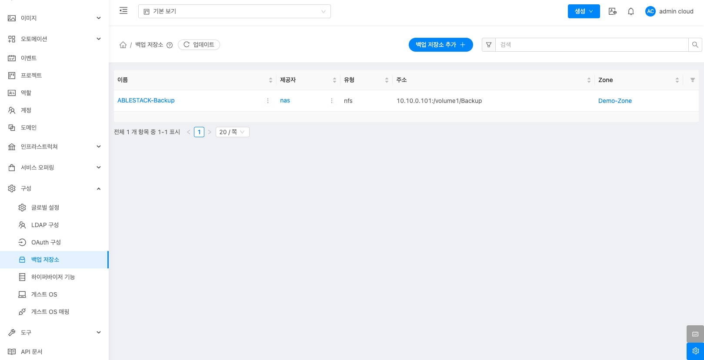
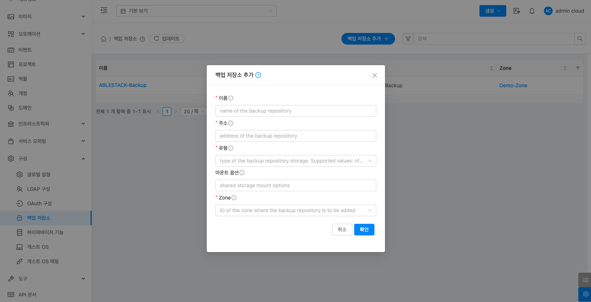
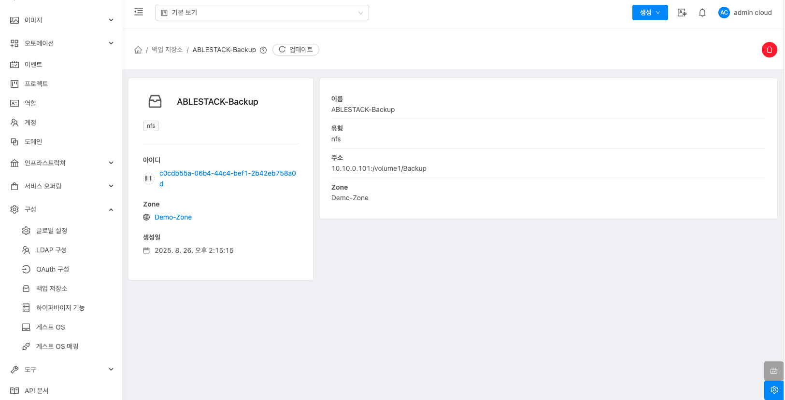
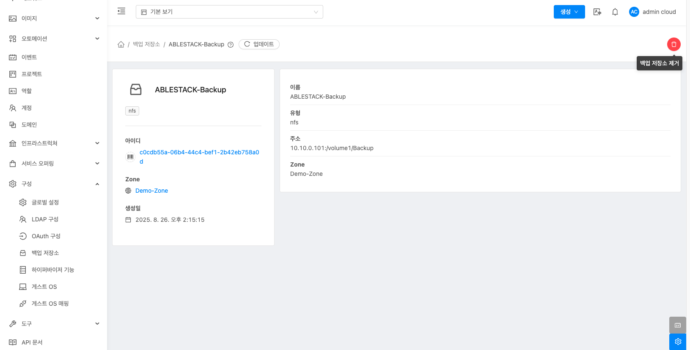
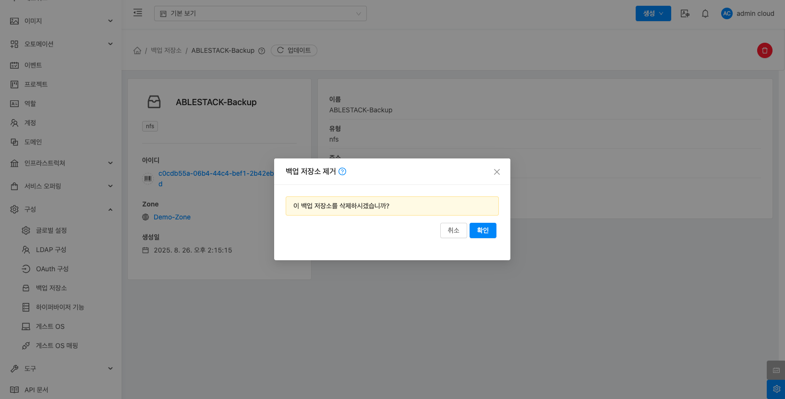

# 백업 저장소

## 개요
Mold의 백업 저장소(NAS)를 추가하여, 이를 통해 공유 스토리지를 KVM 호스트에 임시로 마운트하여 인스턴스 백업 /복원 디스크 작업을 수행합니다.

!!! note
    * 백업 활성화 필수: 백업 프레임워크를 활성화해야 백업 저장소 메뉴가 활성화됩니다. (글로벌 설정에서 backup.framework.enabled 옵션 활성화)

## 목록 조회
백업 저장소 화면에서는 백업 저장소 목록을 확인하고 관리할 수 있습니다.

{ .imgCenter .imgBorder }

## 백업 저장소 추가
백업 저장소 추가 버튼을 클릭하여 새로운 백업 저장소를 추가할 수 있습니다.

{ .imgCenter .imgBorder }

1. 백업 저장소 추가 화면에서 다음 항목을 입력합니다.
    * **이름**: 이름을 입력합니다.
    * **주소**: 백업 저장소의 IP와 경로를 입력합니다.
    * **유형**: 유형을 선택합니다.
    * **마운트 옵션**: 마운트 옵션을 입력합니다.
    * **Zone**: Zone을 선택합니다.

2. 모든 항목을 입력한 후 확인 버튼을 클릭하여 설정을 완료합니다.

## 백업 저장소 상세 화면
추가된 백업 저장소의 상세 정보를 확인하고 관리할 수 있습니다.

{ .imgCenter .imgBorder }

## 백업 저장소 제거 
백업 저장소 제거 버튼을 클릭하여 추가된 백업 저장소를 제거할 수 있습니다.

{ .imgCenter .imgBorder }
{ .imgCenter .imgBorder }
