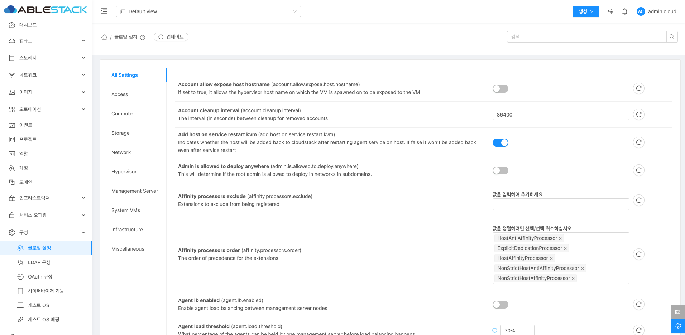

# 글로벌 설정

## 개요
Mold 환경 전체에 적용되는 글로벌 설정 항목을 확인하고 수정할 수 있는 기능을 제공합니다.

{ .imgCenter .imgBorder }

## 글로벌 설정 메뉴 주요 기능
* 환경 설정 확인 및 변경
    * 각 설정 항목은 키(Key), 설명, 현재 값(Value)으로 표시됩니다.
* 설정 초기화
    * 각 설정 항목의 오른쪽에 있는 원형 화살표(⟳) 버튼을 눌러 기본값으로 되돌릴 수 있습니다.

## 설정 카테고리 설명

* All Settings
    * 모든 글로벌 설정 항목을 한 화면에서 볼 수 있습니다.
* Access
    * 사용자 접근 제어 및 계정 관리 관련 설정 항목입니다.
* Compute
    * CPU, 메모리 관리 등 컴퓨팅 자원 관련 설정 항목입니다.
* Storage
    * 스토리지 관리, 볼륨 관리 등 저장소 관련 설정 항목입니다.
* Network
    * 네트워크 관리 및 트래픽 제어 관련 설정 항목입니다.
* Hypervisor
    * 하이퍼바이저 유형별 특성 및 호스트 관리 관련 설정 항목입니다.
* Management Server
    * 관리 서버의 동작 방식과 관련된 설정 항목입니다.
* System VMs
    * 시스템 VM(예: 가상 라우터, 콘솔 프록시 등) 관련 설정 항목입니다.
* Infrastructure
    * 인프라 구성 및 운영 환경 설정 항목입니다.
* Miscellaneous
    * 기타 분류되지 않은 일반적인 설정 항목입니다.
