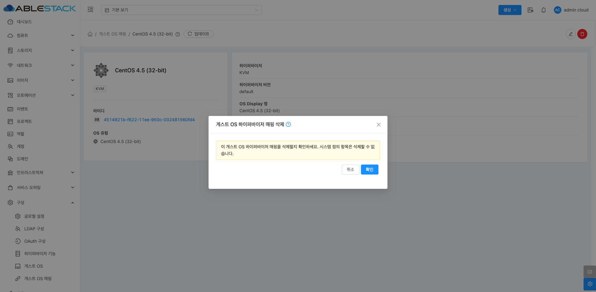

# 게스트 OS 구성

## 개요
Mold에서 다양한 하이퍼바이저 환경에서 게스트 OS와 하이퍼바이저 OS 간의 호환성을 관리하기 위해 게스트 OS 매핑 기능을 제공합니다.
게스트 OS 매핑을 통해 특정 하이퍼바이저와 게스트 OS가 정확하게 연결되도록 설정할 수 있습니다.
이를 통해 가상 머신 생성 및 관리 시 호환성 문제를 줄일 수 있습니다.

## 목록 조회
현재 등록된 모든 게스트 OS 매핑이 표시됩니다. 목록에는 하이퍼바이저, 하이퍼바이저 버전, OS Display 명, 하이퍼바이저 매핑 이름 정보가 포함됩니다.

{ .imgCenter .imgBorder }

## 게스트 OS 하이퍼바이저 매핑 추가
게스트 OS 하이퍼바이저 매핑 추가 버튼을 클릭하여 가상머신에 설치된 운영체제(OS)를 특정 하이퍼바이저와 연결하여 관리할 수 있습니다. 이 설정을 통해 Mold는 하이퍼바이저와 게스트 OS 하이퍼바이저 매핑 간의 호환성을 확인하고 적절히 동작할 수 있도록 지원합니다.

{ .imgCenter .imgBorder }
{ .imgCenter .imgBorder }

* **하이퍼바이저**: Mold에서 지원하는 하이퍼바이저 유형을 선택합니다.
    * 지원 유형: XenServer, KVM, VMware
    * 선택한 하이퍼바이저와 OS 이름이 올바르게 매핑되지 않으면 VM이 정상 작동하지 않을 수 있습니다.

* **하이퍼바이저 버전**: 매핑에 사용할 하이퍼바이저 버전을 입력합니다.
    * 'default'로 입력 시 기본 버전으로 설정됩니다.
    * 기본 버전을 사용할 경우, 실제 운영 환경과 호환성 문제를 일으킬 수 있으므로 적절한 버전을 지정하는 것이 좋습니다.
    * 하이퍼바이저 기능을 참조하여 올바른 버전을 설정해야 합니다.

* **하이퍼바이저 매핑 이름**: 선택한 하이퍼바이저에서 사용하는 OS 이름을 입력합니다.
    * 올바른 OS 이름을 입력하지 않으면 매핑이 실패할 수 있습니다.

* **하이퍼바이저로 OS 이름 확인**:
    * 해당 옵션을 활성화하면 선택한 하이퍼바이저에서 올바른 OS 매핑 이름을 확인합니다.
    * VMware와 XenServer에서만 지원되며, 최소 하나 이상의 호스트가 설정된 버전으로 존재해야 합니다.
    * 기본 버전에서는 동작하지 않으므로 주의가 필요합니다.

* **강제 추가 옵션**: 기존 사용자 정의 매핑이 있어도 강제로 추가하여 덮어씁니다.
    * 동일한 OS 매핑이 이미 존재할 경우, 이 옵션을 사용하면 기존 매핑이 덮어쓰기됩니다.
    * 설정 변경 전 기존 매핑을 확인하는 것이 좋습니다.

## 게스트 OS 하이퍼바이저 매핑 상세 탭
추가된 게스트 OS 하이퍼바이저 매핑의 상세 정보를 확인하고 관리할 수 있습니다. 

{ .imgCenter .imgBorder }

## 게스트 OS 하이퍼바이저 매핑 편집
게스트 OS 하이퍼바이저 매핑 상세 화면 오른쪽 상단의 편집 버튼을 클릭하여 해당 게스트 OS 하이퍼바이저 매핑 정보를 편집할 수 있습니다.

{ .imgCenter .imgBorder }
{ .imgCenter .imgBorder }

* **하이퍼바이저 매핑 이름**: 선택한 하이퍼바이저에서 사용하는 OS 이름을 입력합니다.
    * 올바른 OS 이름을 입력하지 않으면 매핑이 실패할 수 있습니다.
* **하이퍼바이저로 OS 이름 확인**:
    * 해당 옵션을 활성화하면 선택한 하이퍼바이저에서 올바른 OS 매핑 이름을 확인합니다.
    * VMware와 XenServer에서만 지원되며, 최소 하나 이상의 호스트가 설정된 버전으로 존재해야 합니다.
    * 기본 버전에서는 동작하지 않으므로 주의가 필요합니다.

## 게스트 OS 하이퍼바이저 매핑 삭제
게스트 OS 하이퍼바이저 매핑 상세 화면 오른쪽 상단의 삭제 버튼을 클릭하여 추가된 게스트 OS 하이퍼바이저 매핑을 삭제할 수 있습니다. 하지만 시스템에서 기본적으로 제공하는 시스템 정의 항목은 삭제할 수 없습니다.

!!! warning "WARNING"
* 시스템에서 기본적으로 제공하는 시스템 정의 항목은 삭제할 수 없습니다.
* 잘못된 OS를 삭제할 경우 가상머신 운영에 영향을 줄 수 있습니다.

{ .imgCenter .imgBorder }
{ .imgCenter .imgBorder }

