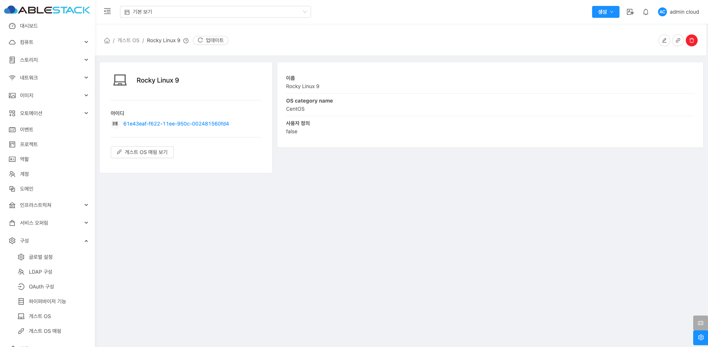

# 게스트 OS 구성

## 개요
Mold에서 게스트 OS란 가상머신(VM) 내부에 설치되는 운영체제를 의미합니다. 예를 들어, Windows, Linux, Ubuntu 등 다양한 운영체제를 가상머신으로 실행할 수 있습니다.
Mold는 이러한 게스트 OS를 인식하고 관리하기 위해 게스트 OS 목록을 등록하여 사용합니다.
게스트 OS를 올바르게 설정하지 않으면 가상머신이 예상대로 동작하지 않을 수 있으므로, 하이퍼바이저와의 매핑이 필수입니다.

## 목록 조회
등록된 게스트 OS 제공자가 목록에 표시됩니다. 목록에는 이름, OS 카테고리 이름, 사용자 정의 여부 정보가 포함됩니다.

{ .imgCenter .imgBorder }

## 게스트 OS 추가
게스트 OS 추가 버튼을 클릭하여 새로운 게스트 OS를 추가할 수 있습니다.

{ .imgCenter .imgBorder }

1. 게스트 OS 추가 화면에서 다음 항목을 입력합니다.
    * **OS Display 명**: Mold에서 표시될 운영체제의 이름을 입력합니다.
    * **OS 기본 설정**: 운영체제 카테고리를 선택합니다.

2. 모든 항목을 입력한 후 확인 버튼을 클릭하여 설정을 완료합니다.

!!! note "NOTE"
    * 하이퍼바이저 매핑 필수: OS를 추가한 후, 해당 OS를 특정 하이퍼바이저와 매핑하여 사용할 수 있도록 설정해야 합니다.
    * 사용자 정의 관리: 사용자가 직접 정의한 OS는 별도로 관리되며, 시스템 업데이트와 충돌하지 않도록 관리해야 합니다.

## 게스트 OS 상세 탭
추가된 게스트 OS의 상세 정보를 확인하고 관리할 수 있습니다. 좌측 화면의 "게스트 OS 매핑 보기" 버튼을 통해 해당 게스트 OS를 사용중인 게스트 OS 매핑들을 확인할 수 있으며 우측 화면에서는 이름, OS category name, 사용자 정의 여부를 확인할 수 있습니다.

{ .imgCenter .imgBorder }

## 게스트 OS 편집
게스트 OS 상세 화면 오른쪽 상단의 편집 버튼을 클릭하여 해당 게스트 OS 정보를 편집할 수 있습니다.

{ .imgCenter .imgBorder }
{ .imgCenter .imgBorder }

## 게스트 OS 하이퍼바이저 매핑 추가
게스트 OS 상세 화면 오른쪽 상단의 하이퍼바이저 매핑 추가 버튼을 클릭하여 가상머신에 설치된 운영체제(OS)를 특정 하이퍼바이저와 연결하여 관리하는 기능입니다. 이 설정을 통해 Mold는 하이퍼바이저와 게스트 OS 간의 호환성을 확인하고 적절히 동작할 수 있도록 지원합니다.

{ .imgCenter .imgBorder }
{ .imgCenter .imgBorder }

* **하이퍼바이저**: Mold에서 지원하는 하이퍼바이저 유형을 선택합니다.
    * 지원 유형: XenServer, KVM, VMware
    * 선택한 하이퍼바이저와 OS 이름이 올바르게 매핑되지 않으면 VM이 정상 작동하지 않을 수 있습니다.

* **하이퍼바이저 버전**: 매핑에 사용할 하이퍼바이저 버전을 입력합니다.
    * 'default'로 입력 시 기본 버전으로 설정됩니다.
    * 기본 버전을 사용할 경우, 실제 운영 환경과 호환성 문제를 일으킬 수 있으므로 적절한 버전을 지정하는 것이 좋습니다.
    * 하이퍼바이저 기능을 참조하여 올바른 버전을 설정해야 합니다.

* **하이퍼바이저 매핑 이름**: 선택한 하이퍼바이저에서 사용하는 OS 이름을 입력합니다.
    * 올바른 OS 이름을 입력하지 않으면 매핑이 실패할 수 있습니다.

* **하이퍼바이저로 OS 이름 확인**:
    * 해당 옵션을 활성화하면 선택한 하이퍼바이저에서 올바른 OS 매핑 이름을 확인합니다.
    * VMware와 XenServer에서만 지원되며, 최소 하나 이상의 호스트가 설정된 버전으로 존재해야 합니다.
    * 기본 버전에서는 동작하지 않으므로 주의가 필요합니다.

* **강제 추가 옵션**: 기존 사용자 정의 매핑이 있어도 강제로 추가하여 덮어씁니다.
    * 동일한 OS 매핑이 이미 존재할 경우, 이 옵션을 사용하면 기존 매핑이 덮어쓰기됩니다.
    * 설정 변경 전 기존 매핑을 확인하는 것이 좋습니다.

## 게스트 OS 삭제 
게스트 OS 상세 화면 오른쪽 상단의 삭제 버튼을 클릭하여 추가된 게스트 OS를 삭제할 수 있습니다. 하지만 시스템에서 기본적으로 제공하는 시스템 정의 항목은 삭제할 수 없습니다.

!!! warning "WARNING"
    * 시스템에서 기본적으로 제공하는 시스템 정의 항목은 삭제할 수 없습니다.
    * 잘못된 OS를 삭제할 경우 가상머신 운영에 영향을 줄 수 있습니다.

{ .imgCenter .imgBorder }
{ .imgCenter .imgBorder }

