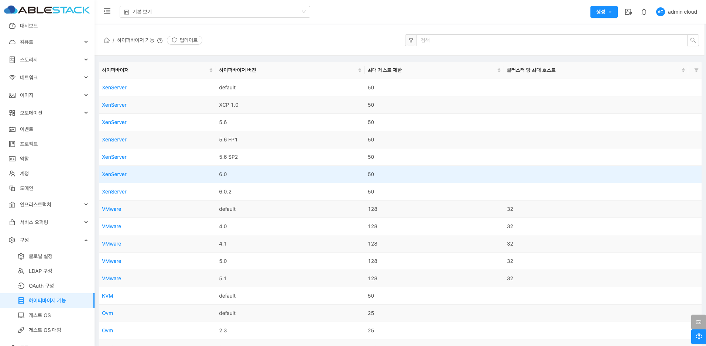

# 하이퍼바이저 기능

## 개요
하이퍼바이저 기능 메뉴에서는 지원되는 하이퍼바이저 유형과 버전별로 최대 게스트 VM 수 및 클러스터당 최대 호스트 수를 확인할 수 있습니다.
이를 통해 각 하이퍼바이저의 성능과 용량을 파악하여 적절한 가상화 환경을 구성할 수 있습니다.

{ .imgCenter .imgBorder }

## 하이퍼바이저 기능 화면 구성 설명

* 하이퍼바이저 유형
Mold에서 지원하는 다양한 하이퍼바이저 유형을 표시합니다.

* 하이퍼바이저 버전
각 하이퍼바이저 유형별로 지원되는 버전이 나열됩니다.

* 최대 게스트 제한
해당 하이퍼바이저 버전에서 하나의 호스트가 수용할 수 있는 최대 가상 머신(VM) 수를 나타냅니다.

* 클러스터당 최대 호스트 수
하나의 클러스터 안에 포함될 수 있는 최대 호스트 수를 나타냅니다.

