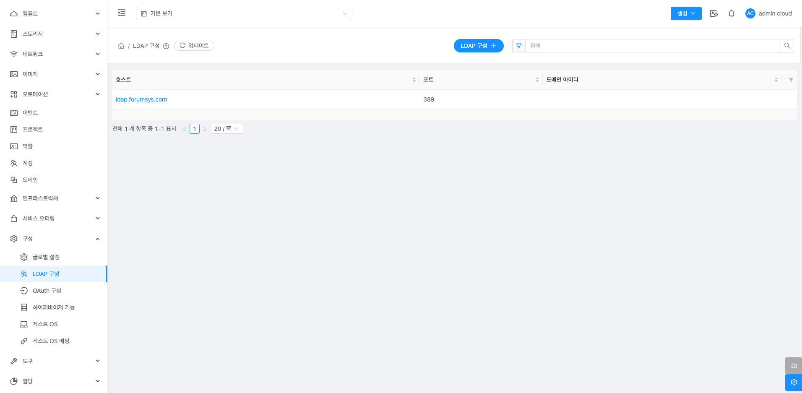

# LDAP 구성

## 개요
LDAP 디렉터리 서비스를 이용하여 Mold에 사용자 인증 및 계정 관리를 통합할 수 있도록 지원합니다. 이를 통해 중앙 집중화된 계정 관리 및 보안 향상을 구현할 수 있습니다.

## 목록 조회
LDAP 구성 화면에서는 LDAP 서버 설정 목록을 확인하고 관리할 수 있습니다.

{ .imgCenter .imgBorder }

## LDAP 추가
LDAP 구성 버튼을 클릭하여 새로운 LDAP 서버를 추가할 수 있습니다.

{ .imgCenter .imgBorder }

1. LDAP 구성 화면에서 다음 항목을 입력합니다.
    * **호스트**: LDAP 서버의 호스트 이름 또는 IP 주소를 입력합니다.
    * **포트**: LDAP 서버가 사용하는 포트를 입력합니다.
        * 기본 LDAP 포트는 389(비보안) 또는 636(SSL)입니다.
    * **도메인 아이디**: LDAP과 연결할 Mold 도메인을 선택합니다.

2. 모든 항목을 입력한 후 확인 버튼을 클릭하여 설정을 완료합니다.

## LDAP 상세 탭
추가된 LDAP 서버의 상세 정보를 확인하고 관리할 수 있습니다.

{ .imgCenter .imgBorder }

## LDAP 삭제 
LDAP 삭제 버튼을 클릭하여 추가된 LDAP 서버를 삭제할 수 있습니다.

{ .imgCenter .imgBorder }
{ .imgCenter .imgBorder }

## 글로벌 설정에서 변경 가능한 LDAP 설정

1. Ldap baseDn (ldap.basedn)
    - LDAP 디렉토리의 기본 경로(Base Distinguished Name)입니다.
    - 예: `dc=example,dc=com`
    - LDAP 계층 구조의 최상위 DN을 지정하여 검색 범위를 설정합니다.

2. Ldap bind password (ldap.bind.password)
    - LDAP 서버와 연결할 때 사용하는 바인드 계정의 비밀번호입니다.
    - 보안상 이 비밀번호는 암호화되어 저장됩니다.

3. Ldap bind principal (ldap.bind.principal)
    - LDAP 서버와 연결할 때 사용할 바인드 계정의 사용자 이름입니다.
    - 형식: `uid=admin,ou=users,dc=example,dc=com`
    - LDAP 인증을 위해 관리 계정으로 설정해야 합니다.

4. Ldap email attribute (ldap.email.attribute)
    - LDAP에서 사용자의 이메일 주소를 나타내는 속성입니다.
    - 기본값: `mail`

5. Ldap firstname attribute (ldap.firstname.attribute)
    - LDAP에서 사용자의 이름을 나타내는 속성입니다.
    - 기본값: `givenname`

6. Ldap group object (ldap.group.object)
    - LDAP 디렉토리에서 그룹을 표현하는 객체 유형입니다.
    - 기본값: `groupOfUniqueNames`

7. Ldap group user uniquemember (ldap.group.user.uniquemember)
    - 그룹 내의 각 사용자 멤버를 고유하게 식별하기 위한 속성입니다.
    - 기본값: `uniquemember`

8. Ldap lastname attribute (ldap.lastname.attribute)
    - LDAP에서 사용자의 성을 나타내는 속성입니다.
    - 기본값: `sn`

9. Ldap nested groups enable (ldap.nested.groups.enable)
    - 중첩 그룹 사용 여부를 설정합니다.
    - 활성화하면 그룹 안에 포함된 하위 그룹도 함께 조회할 수 있습니다.
    - 기본값: 활성화(ON)

10. Ldap provider (ldap.provider)
    - LDAP 공급자 유형을 설정합니다.
    - 예: `openldap`, `microsoftad`

11. Ldap read timeout (ldap.read.timeout)
    - LDAP 서버로부터 응답을 받기까지 대기할 시간(밀리초)입니다.
    - 기본값: `1000` (1초)

12. Ldap request page size (ldap.request.page.size)
    - 사용자 검색 요청 시 한 페이지에 조회할 사용자 수입니다.
    - 기본값: `1000`

13. Ldap search group principle (ldap.search.group.principle)
    - 사용자가 속한 그룹의 기본 원칙을 설정합니다.
    - 주로 그룹 검색에 사용됩니다.

14. Ldap truststore (ldap.truststore)
    - SSL 사용 시 인증서를 저장하는 트러스트스토어 경로입니다.
    - SSL을 통해 LDAP 연결을 보호할 때 사용합니다.

15. Ldap truststore password (ldap.truststore.password)
    - 트러스트스토어 접근을 위한 비밀번호입니다.
    - 보안상 암호화하여 저장됩니다.

16. Ldap user memberof attribute (ldap.user.memberof.attribute)
    - 사용자가 속한 그룹 목록을 조회할 때 사용하는 속성입니다.
    - 기본값: `memberof`

17. Ldap user object (ldap.user.object)
    - LDAP에서 사용자를 나타내는 객체 유형입니다.
    - 기본값: `inetOrgPerson`

18. Ldap username attribute (ldap.username.attribute)
    - LDAP에서 사용자의 계정을 나타내는 속성입니다.
    - 기본값: `uid`

